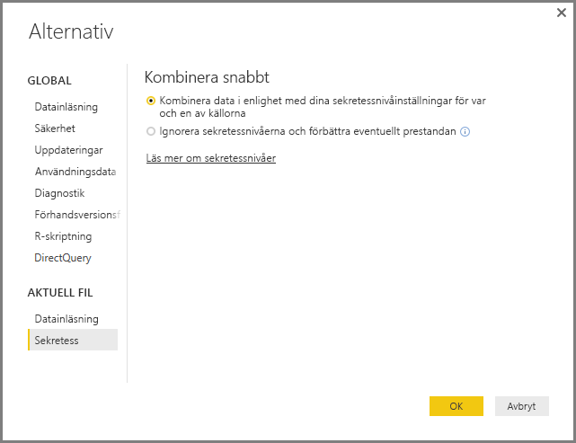

# Sekretessnivåer i Power BI Desktop
I **Power BI Desktop**, anger sekretessnivåer en isoleringsnivå som definierar hur en datakälla isoleras från andra datakällor. Även om en begränsande isoleringsnivå blockerar information från att utbytas mellan datakällor, kan det minska funktionaliteten och påverka prestandan.

I inställningen **Sekretessnivåer** som finns i **Fil > Alternativ och inställningar > Alternativ** och sedan **Aktuell fil > Sekretess** kan du avgöra om Power BI Desktop använder dina inställningar för sekretess när du kombinerar data. Den här dialogrutan inkluderar en länk till Power BI Desktop-dokumentationen om sekretessnivåer och sekretessnivåer (den här artikeln).

## Konfigurera en sekretessnivå
Med inställningar för sekretessnivå kan du ange en isoleringsnivå som definierar hur en datakälla måste isoleras från andra datakällor.

| Inställning | Beskrivning | Exempeldatakällor |
| --- | --- | --- |
| **Privat datakälla** |En **Privat** datakälla innehåller känslig eller konfidentiell information och synligheten för datakällan kan begränsas till behöriga användare. En privat datakälla är helt isolerad från andra datakällor. |Facebook-data, en textfil som innehåller aktieersättning, eller en arbetsbok som innehåller information av granskning av anställda. |
| **Organisationsdatakällor** |En **Organisations**datakälla begränsar synligheten för en datakälla till en betrodd grupp med personer. En **Organisations**datakälla är isolerad från alla **Offentliga** datakällor, men är synlig för andra **Organisations**datakällor. |Ett **Microsoft Word**-dokument på en SharePoint-intranätsida med behörigheter som har aktiverats för en betrodd grupp. |
| **Offentlig datakälla** |En **Offentlig** datakälla ger alla synlighet för de data som finns i datakällan. Endast filer, Internet-datakällor eller arbetsboksdata kan markeras **Offentlig**. |Lediga data från Microsoft Azure Marketplace, data från en Wikipedia-sida eller en lokal fil som innehåller data som kopierats från en offentlig webbplats. |

## Konfigurera sekretessnivåinställningar
Inställningsdialogrutan **Sekretess** för varje datakälla hittas i **Fil > Alternativ och inställningar > Inställningar för datakälla**.

Om du vill konfigurera en sekretessnivå för datakällan, väljer du datakällan och därefter **Redigera**. Dialogrutan **Inställningar för datakälla** visas där du kan välja lämplig sekretessnivå från listrutan längst ned i dialogrutan som det visas i följande bild.

> [!CAUTION]
> Du bör konfigurera en datakälla som innehåller mycket känsliga eller konfidentiella data som **Privat**.
> 

## Konfigurera sekretessnivåer
**Sekretessnivåer** är en inställning som har angetts till att **Kombinera data enligt dina sekretessnivåinställningar för varje källa** som standard, vilket innebär att **Sekretessnivåer** inte har aktiverats.

| Inställning | Beskrivning |
| --- | --- |
| **Kombinera data i enlighet med dina sekretessnivåinställningar för varje källa** (på och standardinställningen) |Sekretessnivåinställningarna används för att fastställa nivån av isolering mellan datakällor när du kombinerar data. |
| **Ignorera sekretessnivåerna och förbättra eventuellt prestandan** (inaktiverat) |Sekretessnivåer beaktas inte när du kombinerar data, men prestandan och funktionaliteten för data kan förbättras. |

> **Säkerhetsmeddelande:** Om du aktiverar **Sekretessnivåer** genom att välja **Ignorera sekretessnivåerna och förbättra eventuellt prestandan** i dialogrutan **Sekretessnivåer** kan det medföra att potentiellt känsliga eller konfidentiella data exponeras för obehöriga. Aktivera inte **Sekretessnivåer** om du inte är säker på att datakällan inte innehåller känsliga eller konfidentiella data.
> 
> 

> [!CAUTION]
> **Ignorera sekretessnivåerna och förbättra eventuellt prestandan** fungerar inte i Power BI-tjänsten. Därmed reflekterar *inte* Power BI Desktop-rapporter med den här inställningen aktiverad, som sedan publiceras till Power BI-tjänsten det här beteendet när de används i tjänsten.
> 

**Konfigurera sekretessnivåer**

I Power BI Desktop eller Frågeredigeraren, väljer du **Fil > Alternativ och inställningar > Alternativ** och därefter **Aktuell fil > Sekretess**.

a. När **Kombinera data enligt dina sekretessnivåinställningar för varje källa** har valts, kommer data att kombineras enligt din sekretessnivåinställning. Om du sammanfogar data över sekretessisoleringszoner resulterar det i viss databuffring.

b. När **Ignorera sekretessnivåerna och förbättra eventuellt prestandan** är markerat, kombineras data och dina sekretessnivåer ignoreras, något som kan visa känslig eller konfidentiell information för obehöriga användare. Inställningen kan förbättra prestanda och funktionalitet.

> **Säkerhetsmeddelande:** Om du väljer **Ignorera sekretessnivåer och förbättra eventuellt prestandan** kan du förbättra prestandan, men Power BI Desktop kan inte garantera säkerheten för de data som är sammanfogade i Power BI Desktop-filen.
> 
> 

