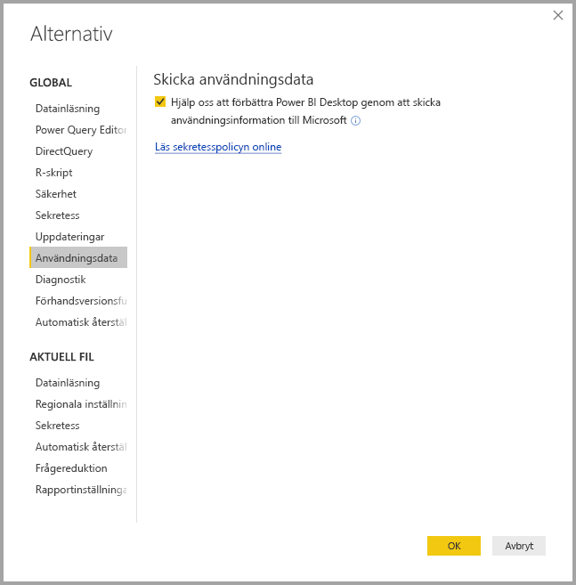
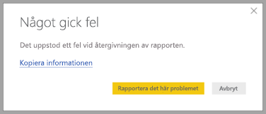

# Sekretess i Power BI Desktop

På Microsoft arbetar vi hårt för att skydda din integritet medan vi utvecklar produkter som ger dig den prestanda, kraft och bekvämlighet du vill ha. Vi samlar in viss information om din användning av Power BI Desktop i syfte att diagnostisera problem och förbättra produkten. Mer information om vår sekretesspraxis finns i vår sekretesspolicy. Den gäller för de data som vi samlar in från din användning av **Power BI Desktop**.
 
Informationen vi samlar in från **Power BI Desktop**-användare kan innefatta data om operativsystemet, Power BI Desktop-information och versioner av Internet Explorer. 
 
Om du vill avanmäla dig från den här datainsamlingen kan du gå till **Arkiv > Alternativ och inställningar > Alternativ** och avmarkera kryssrutan **Skicka användningsdata** på fliken **Användningsdata** enligt bilden nedan.

## Skicka ytterligare information

Om det uppstår kraschar eller andra problem kan du skicka felrapporter och ytterligare information som kan hjälpa oss att åtgärda dessa problem i en senare version. Vi samlar också in information om tillståndet för den **Power BI Desktop**-fil som du arbetar i, till exempel dokumentets nationella inställningar, aktiverade förhandsversionsfunktioner och lagringsläge. Detta kan innefatta skärmbilder, felmeddelanden och formler från modellen. Dessa objekt kan innefatta innehållet i de filer som du använde när felet inträffade. Därför bör du granska dem innan de skickas. Vi påminner dig innan de skickas så att du kan välja vilken information som ska skickas till Microsoft.  
 
Om du inte vill skicka den här informationen kan du klicka på **Stäng** när ett fel inträffar, eller avanmäla dig från att skicka användningsdata på det sätt som beskrivs ovan. 

