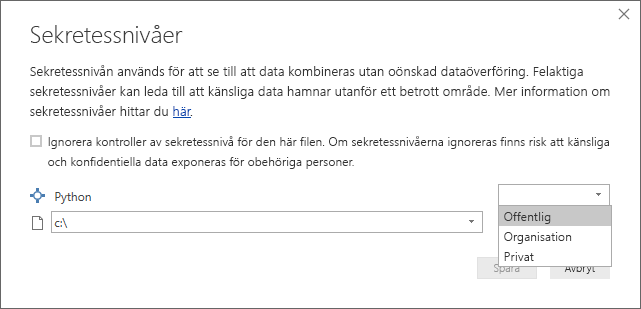
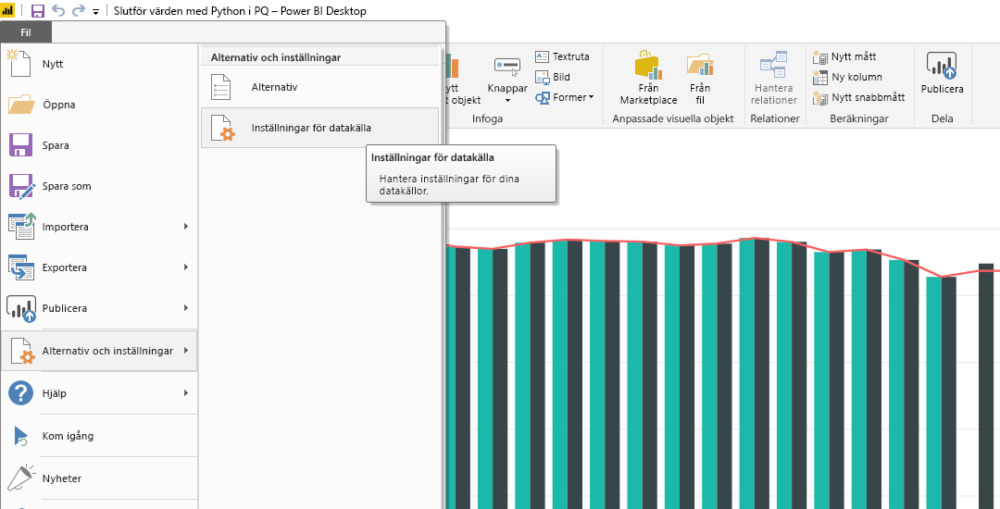

# Använda Python i frågeredigeraren
Du kan använda **Python**, ett programmeringsspråk som ofta används av statistiker, dataforskare och dataanalytiker, i **frågeredigeraren** för Power BI Desktop. Med den här integreringen av Python i **frågeredigeraren** kan du utföra datarensning med Python, avancerade datautformning och analyser i datauppsättningar, inklusive färdigställande av saknade data, förutsägelser och klustring för att bara nämna några få. **Python** är ett kraftfullt språk och kan användas i **frågeredigeraren** till att förbereda din datamodell och skapa rapporter.

## Installera Python
För att kunna använda **Python** i Power BI Desktops **frågeredigerare**, måste du installera **Python** på den lokala datorn. Du kan hämta och installera **Python** kostnadsfritt från flera platser, inklusive den [officiella hämtningssidan för Python](https://www.python.org/) och [Anaconda](https://anaconda.org/anaconda/python/).

## Använda Python i frågeredigeraren
För att visa hur du använder **Python** i **frågeredigeraren** anges det här exemplet på en datauppsättning från aktiemarknaden som baseras på en .CSV-fil, som du kan [ladda ned här](http://download.microsoft.com/download/F/8/A/F8AA9DC9-8545-4AAE-9305-27AD1D01DC03/EuStockMarkets_NA.csv) och följa. Stegen i detta exempel är följande:

1. Först läser du in dina data i **Power BI Desktop**. I det här exemplet läser du in filen *EuStockMarkets_NA.csv* och väljer **Hämta data > CSV** på menyfliken **Start** i **Power BI Desktop**.
   
   
2. Markera filen och välj **Öppna**. CSV:n visas i dialogrutan **CSV-fil**.
   
   
3. När datan har lästs in visas den i fönstret **Fält** i Power BI Desktop.
   
   
4. Öppna **Frågeredigeraren** genom att välja **Redigera frågor** på fliken **Start** i **Power BI Desktop**.
   
   
5. På fliken **Transformera** väljer du **Kör Python-skript**. Redigeringsprogrammet **Kör Python-skript** öppnas (visas i nästa steg). Observera att det saknas data på raderna 15 och 20, vilket det även gör på andra rader som du inte kan se i följande bild. Stegen nedan visar hur Python kan (och kommer) att slutföra dem åt dig.
   
   
6. I det här exemplet anger du följande skriptkod:
   
       import pandas as pd
       completedData = dataset.fillna(method='backfill', inplace=False)
       dataset["completedValues"] =  completedData["SMI missing values"]
   
   > [!NOTE]
   > Du måste ha biblioteket *pandas* installerat i din Python-miljö för att tidigare skriptkod ska fungera korrekt. För att installera pandas, kör du följande kommando i din Python-installation: |      > pip install pandas
   > 
   > 
   
   När koden infogas i dialogrutan **Kör Python-skript** ser den ut ungefär så här:
   
   
7. När du har valt **OK** visar **frågeredigeraren** en varning om datasekretess.
   
   
8. För att Python-skript ska fungera korrekt i Power BI-tjänsten måste alla datakällor anges som *offentliga*. Mer information om sekretessinställningar och deras konsekvenser finns i [Sekretessnivåer](desktop-privacy-levels.md).
   
   
   
   Observera en ny kolumn i fönstret **Fält** med namnet *completedValues*. Observera att det är några dataelement som saknas, t.ex på rad 15 och 18. Ta en titt på hur Python hanterar det i nästa avsnitt.
   

Trots att vi bara har fem rader med Python-skript kan **frågeredigeraren** fylla i saknade värden med en förutsägelsemodell.

## Skapa visuella objekt från Python-skriptdata
Nu kan vi skapa ett visuellt objekt för att se hur Python-skriptkoden använder biblioteket *pandas* till att fylla i saknade värden, enligt följande bild:

När det visuella objektet är klart och även övriga visuella objekt som du vill skapa med **Power BI Desktop**, kan du spara **Power BI Desktop**-filen (som en .pbix-fil) och sedan använda datamodellen, inklusive de Python-skript som ingår i den, i Power BI-tjänsten.

> [!NOTE]
> Vill du se en färdig .pbix-fil där de här stegen har slutförts? I så fall kan du ladda ned den slutförda **Power BI Desktop**-filen som användes i de här exemplen [till höger här](http://download.microsoft.com/download/F/8/A/F8AA9DC9-8545-4AAE-9305-27AD1D01DC03/Complete Values with Python in PQ.pbix).
> 
> 

När du har överfört .pbix-filen till Power BI-tjänsten, krävs det några fler steg för att datauppdatering ska aktiveras (i tjänsten) och för att aktivera att visuella objekt uppdateras i tjänsten (datan behöver åtkomst till Python för att de visuella objekten ska uppdateras). De extra stegen är följande:

* **Aktivera schemalagd uppdatering för datauppsättningen** – För att aktivera schemalagd uppdatering för den arbetsbok som innehåller datauppsättningen med Python-skript, se [Konfigurera schemalagd uppdatering](refresh-scheduled-refresh.md), som även innehåller information om **Personlig gateway**.
* **Installera personlig gateway** – Du behöver en **Personlig gateway** installerad på datorn där filen finns och där Python har installerats. Power BI-tjänsten måste komma åt arbetsboken och kunna återge uppdaterade visuella objekt på nytt. Du kan få mer information om hur du [installerar och konfigurerar en personlig gateway](personal-gateway.md).

## Begränsningar
Det finns vissa begränsningar för frågor med Python-skript som skapats i **frågeredigeraren**:

* Alla Python-inställningar för datakällan måste anges som *offentliga* och alla andra steg i en fråga som skapats i **frågeredigeraren** måste också vara offentliga. Gå till inställningar för datakällan i **Power BI Desktop** genom att välja **Fil > Alternativ och inställningar > Datakällsinställningar**.
  
  
  
  I dialogrutan **Datakällsinställningar** markerar du datakällorna och väljer sedan **Redigera behörigheter...**. Kontrollera att **Sekretessnivå** är inställd som *Offentlig*.
  
      
* Om du vill aktivera schemalagd uppdatering av visuella Python-objekt eller datauppsättningar, måste du aktivera **Schemalagd uppdatering** och installera en **Personlig gateway** på datorn där arbetsboken och Python-installationen finns. Mer information om detta finns i föregående avsnitt i den här artikeln, med länkar till mer information om var och en.
* Kapslade tabeller (tabell över tabeller) stöds inte för tillfället 

Det finns olika saker du kan göra med Python och egna frågor, så utforska och utforma dina data precis som du vill att de ska visas.

