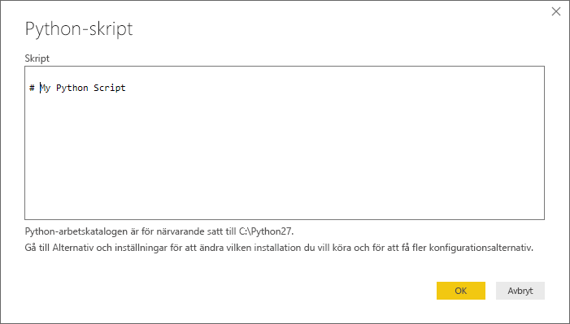
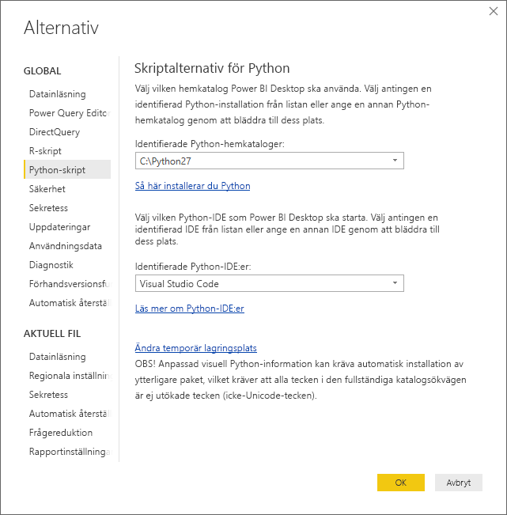

# <a name="run-python-scripts-in-power-bi-desktop"></a>Kör Python-skript i Power BI Desktop
Du kan köra Python-skript direkt i **Power BI Desktop** och importera de resulterande datauppsättningarna i en Power BI Desktop-datamodell.

## <a name="install-python"></a>Installera Python
För att köra Python-skript i Power BI Desktop måste du installera **Python** på den lokala datorn. Du kan hämta och installera **Python** kostnadsfritt från flera platser, inklusive den [officiella hämtningssidan för Python](https://www.python.org/) och [Anaconda](https://anaconda.org/anaconda/python/). Den aktuella versionen av Python-skriptning i Power BI Desktop stöder unicode-tecken samt blanksteg (tomma tecken) i installationssökvägen.

### <a name="install-required-python-packages"></a>Installera nödvändiga Python-paket
Power BI Python-integrationen kräver att två Python-paket är installerade (Pandas och Matplotlib).  Med hjälp av kommandoradsverktyget pip så installerar du följande två paket,

```
pip install pandas
pip install matplotlib
```

## <a name="run-python-scripts"></a>Kör Python-skript
Du kan köra Python-skript och skapa en datamodell där du kan skapa rapporter och dela dem på Power BI-tjänsten med några steg i Power BI Desktop.

### <a name="prepare-a-python-script"></a>Förbered ett Python-skript
Om du vill köra ett Python-skript i Power BI Desktop, skapar du skriptet i din lokala Python-utvecklingsmiljö och kontrollera att det kan köras.

Kontrollera att skriptet har körts i en ny och oförändrad arbetsyta för att köra skriptet i Power BI Desktop. Det innebär att alla paket och beroenden måste läsas in och köras uttryckligen.

När du förbereder och kör ett Python-skript i Power BI Desktop, finns det några begränsningar:

* Endast Pandas-dataramar importeras, så se till att de data som du vill importera i Power BI representeras i en dataram
* Alla Python-skript som körs längre än 30 minuters avbryts
* Interaktiva anrop i Python-skriptet som väntar på indata från användaren avbryter körningen av skriptet
* När du ställer in arbetskatalogen i Python-skriptet *måste* du definiera en fullständig sökväg till arbetskatalogen istället för en relativ sökväg
* Kapslade tabeller (tabell över tabeller) stöds inte för tillfället 

### <a name="run-your-python-script-and-import-data"></a>Kör ditt Python-skript och importera data
1. Anslutningsappen för Python-skript i Power BI Desktop finns i **Hämta data**. Om du vill köra Python-skriptet väljer du **Hämta data &gt; Mer...** och sedan **Övrigt &gt; Python-skript** enligt följande bild:
   
   
2. Om Python har installerats på den lokala datorn, väljs den senast installerade versionen som din Python-motor. Det är bara att kopiera skriptet i skriptfönstret och välja **OK**.
   
   
3. Om Python inte är installerad, inte kan identifieras, eller om det finns flera installationer på din lokala dator, visas en varning.
   
   
   
   Python-installationsinställningar finns centralt i avsnittet Python-skriptning i dialogrutan Alternativ. Välj **Arkiv > Alternativ och inställningar** och sedan **Alternativ > Python-skriptning** för att ange dina installationsinställningar för Python. Om det finns flera installationer av Python så visas en rullgardinsmeny där du kan välja vilken installation du vill använda. Du kan också välja **Andra** och ange en anpassad sökväg.
   
   
4. Välj **OK** att köra Python-skriptet. När skriptet har körts kan du välja vilka resulterande dataramar du vill lägga till i Power BI-modellen.

### <a name="refresh"></a>Uppdatera
Du kan uppdatera ett Python-skript i Power BI Desktop. När du uppdaterar ett Python-skript, kör Power BI Desktop Python-skriptet igen i Power BI Desktop-miljön.

## <a name="next-steps"></a>Nästa steg
Ta en titt på följande extra information om Python i Power BI.

* [Skapa Python-visualiseringar i Power BI Desktop](desktop-python-visuals.md)
* [Använd en extern Python IDE med Power BI](desktop-python-ide.md)
