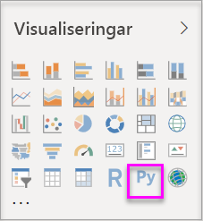
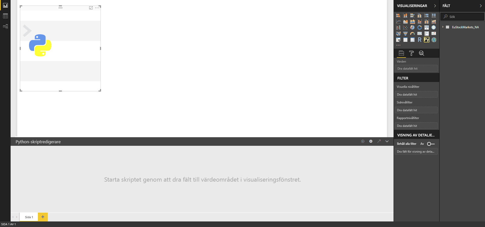
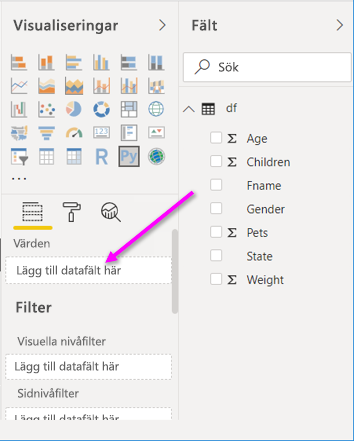
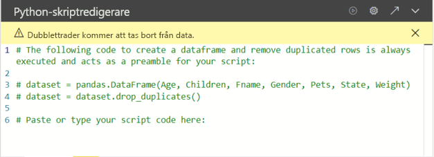

# <a name="create-power-bi-visuals-by-using-python"></a>Skapa visuella Power BI-objekt med hjälp av Python

Med *Power BI Desktop*, kan du använda Python till att visualisera dina data.

## <a name="prerequisites"></a>Förutsättningar

Gå igenom självstudien [Köra Python-skript i Power BI Desktop](desktop-python-scripts.md) med hjälp av följande Python-skript:

```python
import pandas as pd 
df = pd.DataFrame({ 
    'Fname':['Harry','Sally','Paul','Abe','June','Mike','Tom'], 
    'Age':[21,34,42,18,24,80,22], 
    'Weight': [180, 130, 200, 140, 176, 142, 210], 
    'Gender':['M','F','M','M','F','M','M'], 
    'State':['Washington','Oregon','California','Washington','Nevada','Texas','Nevada'],
    'Children':[4,1,2,3,0,2,0],
    'Pets':[3,2,2,5,0,1,5] 
}) 
print (df) 
```

I artikeln [Köra Python-skript i Power BI Desktop](desktop-python-scripts.md) visas det hur du installerar Python på den lokala datorn och aktiverar det för Python-skript i Power BI Desktop. I den här självstudien används data från skriptet ovan för att illustrera skapandet av visuella Python-objekt.

## <a name="create-python-visuals-in-power-bi-desktop"></a>Skapa Python-visualiseringar i Power BI Desktop

1. Välj ikonen för **visuella Python-objekt** i fönstret **Visualiseringar**.

   

1. I dialogrutan för att **aktivera visuella skriptobjekt** som visas väljer du **Aktivera**.

    När du lägger till ett visuellt Python-objekt i en rapport, vidtar Power BI Desktop följande åtgärder:

    - En Python-visuell bildplatshållare visas på rapportens arbetsyta.

    - **Python-skriptredigeraren** visas längst ned i mittenfönstret.

    

1. Dra sedan fälten **Ålder**, **Barn**, **Förnamn**, **Kön**, **Husdjur**, **Tillstånd** och **Vikt** till avsnittet **Värden**, där det står **Lägg till datafält här**.

    

   Python-skriptet kan endast använda fält som lagts till i avsnittet **Värden**. Du kan lägga till eller ta bort fält från avsnittet **Värden** när du arbetar med Python-skriptet. Power BI Desktop identifierar automatiskt ändringar i fält.

   > [!NOTE]
   > Aggregeringens standardtyp för visuella Python-objekt är *Summera inte*.
   > 
   > 

1. Nu kan du använda de data du har valt för att skapa en rityta.

    När du väljer eller tar bort fält skapas eller tas stödjande kod bort automatiskt i Python-skriptredigeraren. 

    Som ett resultat av dina val skapar Python-skriptredigeraren följande bindningskod.

    - Redigeraren skapade dataramen *datamängd* med de fält som du lade till.
    - Standardtypen av sammansättning är: *summera inte*.
    - Ungefär som med visuella tabellobjekt grupperas fält, och duplicerade rader visas bara en gång.

    

     > [!TIP]
     > I vissa fall vill du kanske inte att automatisk gruppering ska ske, eller så vill du att alla rader visas, inklusive dubbletter. I så fall kan du lägga till ett indexfält i datamängden som gör att alla rader anses vara unika, vilket förhindrar gruppering.

   Du kan komma åt kolumner i datamängden med hjälp av deras respektive namn. Till exempel kan du koda `dataset["Age"]` i Python-skriptet för att få åtkomst till åldersfältet.

1. Nu när dataramen automatiskt skapats av de fält du valt, är du redo att skriva ett Python-skript som resulterar i ritning till Python-standardenheten. När skriptet är klart väljer du **Kör** från namnlisten för **Python-skriptredigeraren**.

   Power BI Desktop ritar om det visuella objektet om någon av följande händelser inträffar:

   - När du väljer **Kör** från namnlisten för **Python-skriptredigeraren**
   - När en dataändring inträffar, på grund av datauppdatering, filtrering eller markering

   När du kör ett Python-skript som resulterar i ett fel ritas inte det visuella Python-objektet, och ett felmeddelande för arbetsyta visas. Du hittar information om felet via **Se informationen** från meddelandet.

   För att få en större vy över visualiseringar, kan du minimera **Python-skriptredigeraren**.

Vi tar och skapar några visuella objekt.

## <a name="create-a-scatter-plot"></a>Skapa ett punktdiagram

Vi skapar ett punktdiagram för att se om det finns en korrelation mellan ålder och vikt.

1. Under **Klistra in eller skriv in din skriptkod här** anger du följande kod:

   ```python
   import matplotlib.pyplot as plt 
   dataset.plot(kind='scatter', x='Age', y='Weight', color='red')
   plt.show() 
   ```  

   Python-skriptredigerarens fönster bör nu se ut så här:

   

   Biblioteket **matplotlib** importeras för ritning och skapande av våra visuella objekt.

1. När du väljer skriptknappen **Kör** genereras följande punktdiagram i det visuella Python-objektets platshållarbild.

   

## <a name="create-a-line-plot-with-multiple-columns"></a>Skapa ett linjediagram med flera kolumner

 Nu skapar vi ett linjediagram för varje person som visar hur många barn och husdjur de har. Ta bort eller kommentera bort koden under **Klistra in eller skriv in din skriptkod här** och ange den här Python-koden:

 ```python
 import matplotlib.pyplot as plt 
ax = plt.gca() 
dataset.plot(kind='line',x='Fname',y='Children',ax=ax) 
dataset.plot(kind='line',x='Fname',y='Pets', color='red', ax=ax) 
plt.show() 
```

När du väljer skriptknappen **Kör** genereras följande linjediagram med flera kolumner.


## <a name="create-a-bar-plot"></a>Skapa ett stapeldiagram

Nu skapar vi ett stapeldiagram för varje persons ålder. Ta bort eller kommentera bort koden under **Klistra in eller skriv in din skriptkod här** och ange den här Python-koden:

```python
import matplotlib.pyplot as plt 
dataset.plot(kind='bar',x='Fname',y='Age') 
plt.show() 
```

När du väljer skriptknappen **Kör** genereras följande stapeldiagram:

 

## <a name="security"></a>Säkerhet

> [!IMPORTANT] 
> **Säkerhet för Python-skript:** Python-visualiseringar skapas från Python-skript, vilka kan innehålla kod med säkerhets- eller integritetsrisker. När användare försöker visa eller interagera med en Python-visualisering för första gången, visas en säkerhetsvarning. Aktivera endast visuell Python-information om du litar på skaparen och källan, eller när du granskat och förstått Python-skriptet.
>  

## <a name="more-information-about-plotting-with-matprolib-pandas-and-python"></a>Mer information om hur du ritar med Matprolib, Pandas och Python

Den här självstudien är avsedd att hjälpa dig komma igång med att skapa visuella objekt med Python i Power BI Desktop. Den behandlar bara några av de många alternativ och funktioner för skapande av visuella rapporter med Python, Pandas och Matprolib-biblioteket. Det finns mycket mer information om detta – här är några länkar som du kan använda för att komma igång.

- Dokumentation på webbplatsen för [Matplotlib](https://matplotlib.org/). 
- [Matplotlib Tutorial: A Basic Guide to Use Matplotlib with Python](https://www.datasciencelearner.com/matplotlib-tutorial-complete-guide-to-use-matplotlib-with-python/) (En grundläggande guide om hur du använder Matplotlib med Python) 
- [Matplotlib Tutorial – Python Matplotlib Library with Examples](https://www.edureka.co/blog/python-matplotlib-tutorial/) (Matplotlib-biblioteket för Python med exempel) 
- [Pandas API-referens](https://pandas.pydata.org/pandas-docs/stable/reference/index.html) 
- [Python visualizations in Power BI Service](https://powerbi.microsoft.com/blog/python-visualizations-in-power-bi-service/) (Python-visualiseringar i Power BI-tjänsten) 
- [Using Python Visuals in Power BI](https://www.absentdata.com/how-to-user-python-and-power-bi/) (Använda Python-visualiseringar i Power BI)

## <a name="known-limitations"></a>Kända begränsningar

Visuella Python-objekt i Power BI Desktop har några begränsningar:

- Begränsningar i datastorlek. Data som används vid ritning av visuella Python-objekt är begränsade till 150 000 rader. Om du väljer mer än 150 000 rader, är det enbart de översta 150 000 raderna som används och ett meddelande visas på bilden.
- Upplösning. Alla visuella Python-objekt visas med 72 DPI.
- Tidsbegränsning för beräkning. Om en beräkning för ett visuellt Python-objekt överstiger fem minuter går tidsgränsen ut, vilket resulterar i ett fel.
- Relationer. Om datafält väljs från olika tabeller utan någon definierad relation mellan dem så uppstår ett fel, precis som med andra Power BI Desktop-visualiseringar.
- Visuella Python-objekt uppdateras när data uppdateras, filtreras eller markeras. Själva bilden är dock inte interaktiv och kan inte vara källan till korsfiltrering.
- Visuella Python-objekt svarar på markering av andra visuella objekt, men du kan inte korsfiltrera andra element genom att klicka på element i det visuella Python-objektet.
- Endast områden som ritas till Python-standardenheten för visning visas korrekt på arbetsytan. Undvik att uttryckligen använda en annan Python-visningsenhet.

## <a name="next-steps"></a>Nästa steg

Ta en titt på följande extra information om Python i Power BI.

- [Köra Python-skript i Power BI Desktop](desktop-python-scripts.md)
- [Använd en extern Python IDE med Power BI](desktop-python-ide.md)

