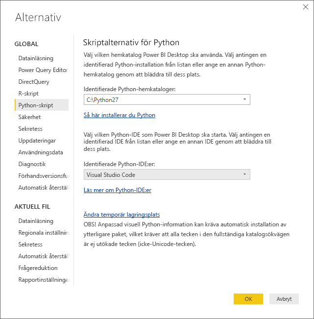
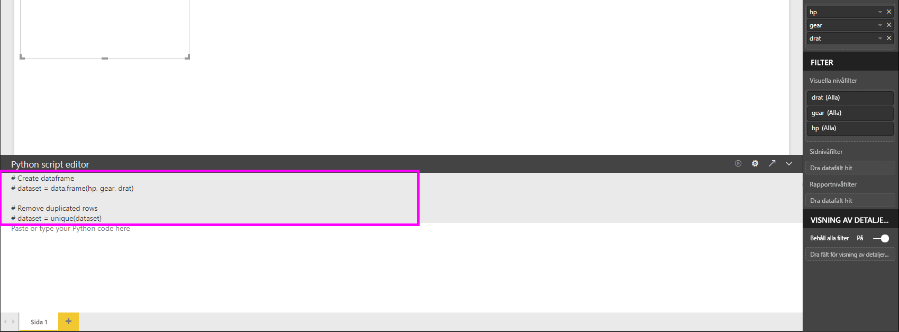
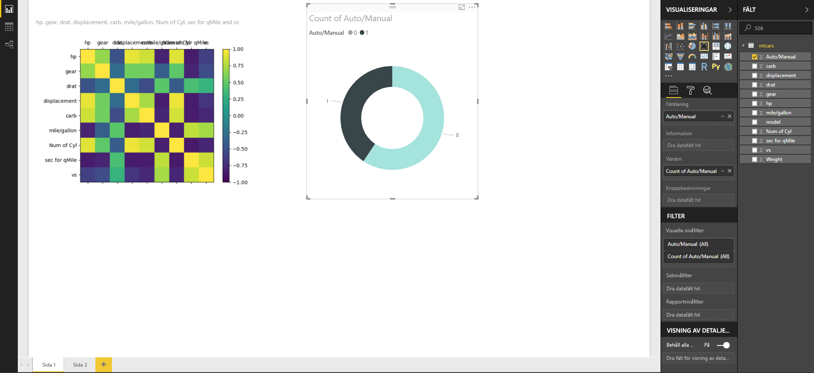
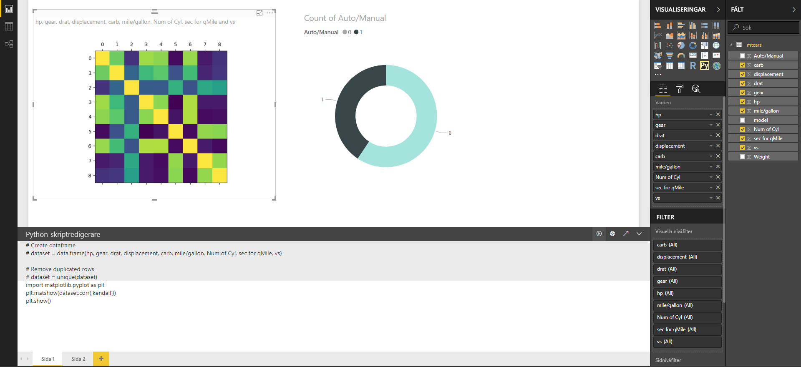

# Skapa visuella Power BI-objekt med Python
Med **Power BI Desktop**, kan du använda **Python** för att visualisera dina data.

## Installera Python
**Power BI Desktop** inkluderar, distribuerar eller installerar inte **Python**-motorn. Om du vill köra Python-skript i **Power BI Desktop**, måste du separat installera **Python** på din lokala dator. Du kan hämta och installera **Python** kostnadsfritt från flera platser, inklusive den [officiella hämtningssidan för Python](https://www.python.org/) och [Anaconda](https://anaconda.org/anaconda/python/). Den aktuella versionen av Python-skriptning i Power BI Desktop stöder unicode-tecken samt blanksteg (tomma tecken) i installationssökvägen.

## Aktivera Python-visualiseringar
Om du vill aktivera Python-visualiseringar, väljer du **Arkiv > Alternativ och inställningar > Alternativ** och på sidan **Alternativ** som visas, kontrollerar du att din lokala Python-installation har angetts i avsnittet **Python-skriptning** i fönstret **Alternativ** som det visas i följande bild. I följande bild, är sökvägen till den lokala installationen av Python **C:\Python27** och den sökvägen anges uttryckligen i textrutan. Kontrollera att sökvägen som visas återspeglar den lokala Python-installation som du vill att **Power BI Desktop** ska använda.
   
   

När du angett din Python-installation, är du redo att börja skapa Python-visualiseringar.

## Skapa Python-visualiseringar i Power BI Desktop
1. Välj ikonen **Python-visualisering** i fönstret **Visualisering** som visas i följande bild, för att lägga till en Python-visualisering.
   
   

   När du lägger till en Python-visualisering till en rapport gör **Power BI Desktop** följande:
   
   - En Python-visuell bildplatshållare visas på rapportens arbetsyta.
   
   - **Python-skriptredigeraren** visas längst ned i mittenfönstret.
   
   

2. Lägg nu till de fält som du vill använda i ditt Python-skript till avsnittet **Värden** under brunnen **Fält**, precis som med andra **Power BI Desktop**-visualiseringar. 
    
    Endast fält som har lagts till i **Fält** är tillgängliga för ditt Python-skript. Du kan lägga till nya fält eller ta bort onödiga fält från **Fält**-brunnen när du arbetar med ditt Python-skript i **Power BI Desktop Python-skriptredigeraren**. **Power BI Desktop** identifierar automatiskt vilka fält som du har lagt till eller tagit bort.
   
   > [!NOTE]
   > Aggregeringens standardtyp för visuella Python-objekt är *Summera inte*.
   > 
   > 
   
3. Nu kan du använda de data du har valt för att skapa en rityta. 

    När du markerar fält, skapar **Python-skriptredigeraren** stödjande Python-skriptsbindningskod baserat på dina val i det grå avsnittet överst i redigerarfönstret. När du väljer eller tar bort ytterligare fält, skapas automatiskt stödjande kod i Python-skriptet eller tas bort.
   
   I exemplet som visas i följande bild, har tre fält valts: hp, gear och drat. På grund av dessa val, skapade Python-skriptredigeraren följande bindningskod:
   
   * En dataram som heter **datauppsättning** skapades
     * Den dataramen består av olika fält som användaren har valt
   * Standardsammansättningstypen är *summera inte*
   * Ungefär som med tabellvisualiseringar, grupperas fält och duplicerade rader visas bara en gång
   
   
   
   > [!TIP]
   > I vissa fall kanske du inte vill att automatisk gruppering ska ske, eller så kanske du vill att alla rader visas, inklusive dubbletter. I så fall kan du lägga till ett indexfält till din datauppsättning som gör att alla rader anses vara unika vilket förhindrar gruppering.
   > 
   > 
   
   Den skapade dataramen heter **datauppsättning** och du kommer åt valda kolumner via deras respektive namn. Du kan t.ex. komma åt kugghjulsfältet genom att skriva *dataset[”gear”]* i ditt Python-skript.

4. Nu när dataramen automatiskt skapats av de fält du valt, är du redo att skriva ett Python-skript som resulterar i ritning till Python-standardenheten. När skriptet har slutförts, väljer du **kör** från namnlisten för **Python-skriptredigeraren** (**Kör** är till höger i namnlisten).
   
    När du väljer **Kör**, identifierar **Power BI Desktop** området och visar det på arbetsytan. Se till att nödvändiga paket installerats eftersom processen körs på din lokala Python-installation.
   
   **Power BI Desktop** ritar om visualiseringen när någon av följande händelser inträffar:
   
   * När du väljer **Kör** från namnlisten för **Python-skriptredigeraren**
   * När en dataändring inträffar, på grund av datauppdatering, filtrering eller markering

    Följande bild visar ett exempel på korrelationsritningskoden och ritar korrelationer mellan attribut för olika typer av bilar.

    

5. För att få en större vy över visualiseringar, kan du minimera **Python-skriptredigeraren**. Precis som i annan visuell information i **Power BI Desktop**, kan du korsfiltrera korrelationsritningen genom att välja endast sportbilar i toroidvisualiseringen (den runda visualiseringen till höger i ovanstående exempelbild).

    

6. Du kan också modifiera Python-skriptet för att anpassa den visuella informationen och utnyttja kraften i Python genom att lägga till parametrar till ritkommandot.

    Det ursprungliga ritkommandot var följande:

    plt.matshow(dataset.corr('pearson'))

    Med några ändringar i Python-skriptet är nu kommandot följande:

    plt.matshow(dataset.corr('kendall'))

    Därför ritar Python-visualiseringen nu upp med Kendall Tau-korrelationskoefficienten, enligt följande bild.

    

    När ett Python-skript körs som resulterar i ett fel, ritas inte det visuella Python-objektet och ett felmeddelande visas på arbetsytan. Om du vill ha information om felet väljer du **Mer information** från Python-visualiseringsfelet på arbetsytan.

    

    > **Säkerhet för Python-skript:** Python-visualiseringar skapas från Python-skript, vilka kan innehålla kod med säkerhets- eller integritetsrisker. När användare försöker visa eller interagera med en Python-visualisering för första gången, visas en säkerhetsvarning. Aktivera endast visuell Python-information om du litar på skaparen och källan, eller när du granskat och förstått Python-skriptet.
    > 
    > 

## Kända begränsningar
Visuell Python-information i **Power BI Desktop** har några begränsningar:

* Storleksbegränsningar för data – data som används för ritning av visuella Python-objekt är begränsat till 150 000 rader. Om du väljer mer än 150 000 rader, är det enbart de översta 150 000 raderna som används och ett meddelande visas på bilden.
* Tidsbegränsning för beräkningar – om en beräkning för ett visuellt Python-objekt överstiger fem minuter så går tidsgränsen ut, vilket resulterar i ett fel.
* Relationer – om datafält väljs från olika tabeller utan någon definierad relation mellan dem så uppstår ett fel, precis som med andra Power BI Desktop-visualiseringar.
* Visuella Python-objekt uppdateras när data uppdateras, filtreras eller markeras. Bilden är dock inte interaktiv och kan inte vara källa för korsfiltrering.
* Visuella Python-objekt svarar på markering av andra visuella objekt, men du kan inte korsfiltrera andra element genom att klicka på element i det visuella Python-objektet.
* Endast områden som ritas till Python-standardenheten för visning visas korrekt på arbetsytan. Undvik att uttryckligen använda en annan Python-visningsenhet.

## Nästa steg
Ta en titt på följande extra information om Python i Power BI.

* [Köra Python-skript i Power BI Desktop](desktop-python-scripts.md)
* [Använd en extern Python IDE med Power BI](desktop-python-ide.md)

