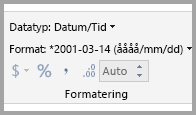
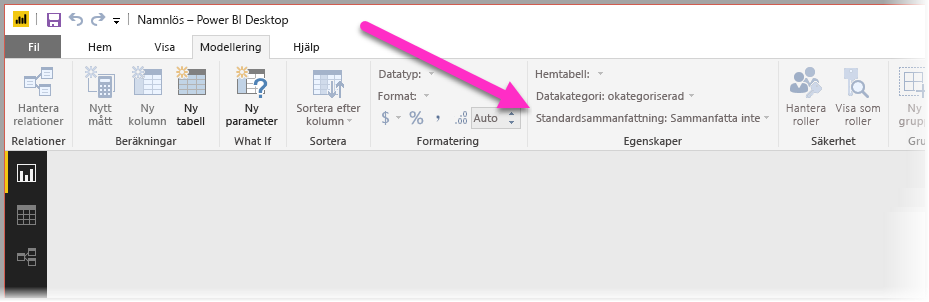
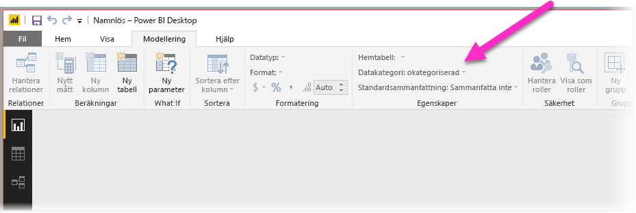
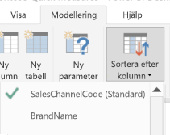
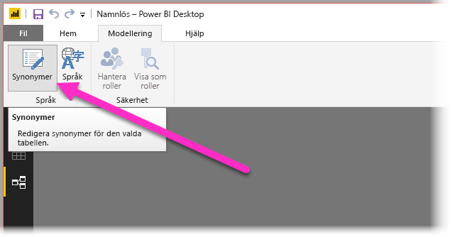
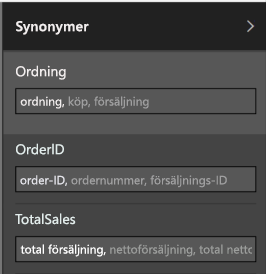

# Använd frågor och svar i Power BI Desktop för frågor med naturligt språk
Användning av vanliga fraser och naturligt språk för att ställa frågor till dina data är kraftfullt. Ännu mer kraftfullt är det när dina data svarar, vilket är vad frågor och svar i **Power BI Desktop** möjliggör.

Om du vill aktivera frågor och svar för att tolka det stora antal frågor som denna funktion kan svara på måste frågor och svar göra antaganden om modellen. Om strukturen för din modell inte uppfyller ett eller flera av dessa antaganden, behöver du justera din modell. Dessa justeringar för frågor och svar har samma metodtips för optimeringarna för alla modeller i Power BI, oavsett om du använder frågor och svar eller inte. 

> [!NOTE]
> Funktionen Frågor och svar är bara tillgänglig om du arbetar med en modell som innehåller **importerade** data. Live-anslutningar till SSAS- och DirectQuery-modeller stöds inte.
>
> Frågor och svar kräver följande C-körtidsuppdatering om du använder en tidigare Windows-version än Windows 10. Du kan försöka installera viktiga uppdateringar från Windows Update eller manuellt installera den nödvändiga komponenten från Microsoft (KB2999226). [https://support.microsoft.com/en-us/help/2999226/update-for-universal-c-runtime-in-windows](https://support.microsoft.com/help/2999226/update-for-universal-c-runtime-in-windows)
>
>

I följande avsnitt beskrivs hur du ändrar modellen så att den fungerar bra med frågor och svar i Power BI.

## Lägg till saknade relationer

Om din modell saknar relationer mellan tabeller, kan varken Power BI-rapporter eller frågor och svar tolka hur du ansluter till dessa tabeller om du ställer frågor om dem. Relationer är hörnstenen i en bra modell. Exempelvis kan du be om ”total försäljning för Seattle-kunder” om relationen mellan tabellen *beställningar* och tabellen *kunder* saknas. Följande bilder visar exempel på en modell som behöver bearbetas och en modell som är redo för frågor och svar.

**Behöver bearbetas**

**Redo för frågor och svar**

## Byt namn på tabeller och kolumner

Valet av tabeller och kolumner är viktigt för frågor och svar. Anta exempelvis att du har en tabell med namnet *Kundsammanfattning* som innehåller en lista över dina kunder. Du skulle behöva ställa frågor som ”Lista kundsammanfattningarna i Chicago” i stället för ”Lista kunderna i Chicago”. 

Även om frågor och svar kan utföra vissa grundläggande radbrytningar och identifiera plural, förutsätter frågor och svar att tabell- och kolumnnamn motsvarar deras innehåll korrekt.

Överväg ett annat exempel. Anta att du har en tabell med namnet *Personalstyrka* som innehåller för- och efternamn och antal anställda. Du har en annan tabell med namnet *Anställda* som innehåller antal anställda, antal arbeten och olika startdatum. Människor som är bekanta med modellen kan förstå strukturen. Någon annan som ställer frågan ”Räkna antal anställda” kommer att få en sammanräkning av raderna i tabellen ”Anställda”. Resultatet är förmodligen inte vad de hade i åtanke, eftersom det är en uppräkning av alla jobb som varje anställd någonsin har haft. Det skulle vara bättre att byta namn på dessa tabeller för att verkligen återspegla vad de innehåller.

**Behöver bearbetas**

**Redo för frågor och svar**

## Åtgärda felaktiga datatyper

Importerade data kan ha felaktiga datatyper. I synnerhet kommer kolumner för *datum* och *antal* som importeras som *strängar* inte att tolkas av frågor och svar som datum och antal. Kontrollera att du väljer rätt datatyp i Power BI-modellen.

## Markera kolumnerna för år och identifierare som Sammanfatta inte

Power BI aggregerar aggressivt numeriska kolumner som standard, så frågor som ”total försäljning per år” kan ibland resultera i en totalsumma för försäljning tillsammans med en totalsumma av år. Om du har specifika kolumner där du inte vill att Power BI ska anta detta beteende, ställer du in egenskapen **Sammanfatta med** för kolumnen till **Sammanfatta inte**. Beakta också kolumnerna **år**, **månad**, **dag**, och **ID** eftersom dessa kolumner är de vanligaste problemen. Andra kolumner som inte är känsliga för summor, som t.ex. *ålder*, kan också med fördel ställas in till **Sammanfatta med** till **Sammanfatta inte** eller till **Medelvärde**. Du hittar den här inställningen under fliken **Modellering**.

## Välj en datakategori för varje kolumn med datum och geografisk plats

**Datakategorin** ger ytterligare semantisk kunskap om innehållet i en kolumn utöver dess datatyp. Till exempel kan en heltalskolumn markeras som ett Postnummer, en strängkolumn kan markeras som en Stad, ett Land, en Region och så vidare. Den här informationen används av frågor och svar på två viktiga sätt: för visualiseringsval och för språkavvikelser.

Först måste frågor och svar använda informationen i **datakategorin** för att fatta beslut om vilken typ av visuell information som ska användas. Exempelvis identifieras att **Datakategorier** med datum och tid vanligtvis är ett bra alternativ för linjediagrammets horisontella axel eller bubbeldiagrammets uppspelningsaxel. Och det förutsätter att resultat som innehåller kolumner med geografiska **Datakategorier** kan se bra ut på en karta.

Härnäst gör frågor och svar vissa kvalificerade gissningar om hur användare kan komma att prata om kolumner för datum och geografisk plats för att få hjälp att förstå vissa typer av frågor. Till exempel kommer ”när” i ”när anställdes John Smith?” nästan helt säkert att kartlägga en datumkolumn, och ”Brown” i ”antal kunder i Brown” är mer troligt en stad än en hårfärg.

## Välj Sortera efter kolumn för relevanta kolumner

Egenskapen **Sortera efter kolumn** gör att sortering i en kolumn automatiskt kan sorteras enligt en annan kolumn istället. När du till exempel begär ”sortera kunder efter skjortstorlek” vill du förmodligen att kolumnerna för skjortstorlek ska sorteras enligt storlek (XS, S, M, L, XL) i stället för i alfabetisk ordning (L, M, S, XL, XS).

## Normalisera din modell

Du behöver inte oroa dig för att vi menar att du ska omforma hela din modell. Dock är vissa strukturer så svåra att frågor och svar inte kan hantera dem bra. Om du utför viss grundläggande normalisering av din modells struktur kommer användbarheten av Power BI-rapporten att öka avsevärt liksom korrektheten på resultaten från frågor och svar.

Följ den här allmänna regeln: Varje unik ”sak” som användaren pratar om ska representeras av exakt ett modellobjekt (tabell eller kolumn). Så om användarna pratar om kunder, bör det finnas ett objekt för *kunder*. Och om användarna pratar om försäljning, bör det finnas ett objekt för *försäljning*. Det låter enkelt, eller hur? Beroende på vilken form av data du startar med kan det vara det. Det finns funktioner för bearbetning av innehållsrika data tillgängliga i **Frågeredigeraren** om du behöver dem, även om många av de enklare omvandlingarna kan göras genom att använda beräkningar i Power BI-modellen.

Följande avsnitt innehåller vissa vanliga transformationer som du kan behöva utföra.

### Skapa nya tabeller för flera kolumentiteter

Om du har flera kolumner som fungerar som en distinkt enhet i en större tabell ska dessa kolumner delas upp i sin egen tabell. Anta som exempel att du har en kolumn för Kontaktnamn, Kontakts titel och Kontakts telefonnummer i en tabell med namnet *Företag*. En bättre utformning skulle vara att ha en separat *Kontakter*-tabell som innehåller Namn, Titel och Telefon och en länk tillbaka till tabellen *Företag*. Det gör det enklare att ställa frågor om kontakter oberoende av frågor om vilka företag de är kontakt för, vilket ger bättre flexibilitet för visning.

**Behöver bearbetas**

**Redo för frågor och svar**

### Pivotera för att eliminera egenskapsuppsättningar

Om du har egenskapsuppsättningar i din modell, bör de omstruktureras så att du har en kolumn per egenskap. Egenskapsuppsättningar har, även om de är praktiska för att hantera stora antal egenskaper, ett stort antal inneboende begränsningarna som varken Power BI-rapporter eller frågor och svar är utformade för att kringgå.

Anta till exempel en tabell för *Kunddemografi* med kolumner KundID och Egenskap och Värde, där varje rad motsvarar en typ av egenskap för kunden (till exempel, ålder, civilstånd, stad och så vidare). Genom att överbelasta betydelsen av kolumnen Värde baserat på innehållet i kolumnen Egenskap, blir det omöjligt för frågor och svar att tolka de flesta frågorna som refererar till den. En enkel fråga som ”Visa ålder på varje kund” kanske kan fungera eftersom den kan tolkas som ”visa kunder och kunddemografi där egenskapen är ålder”. Men strukturen för modellen stöder helt enkelt inte något mer komplexa frågor som ”genomsnittlig ålder på kunder i Chicago”. Användare som skapar Power BI-rapporter direkt kan ibland hitta smarta sätt att hämta data för det de letar efter, medan frågor och svar bara fungerar när varje kolumn endast innehåller en enda betydelse.

**Behöver bearbetas**

**Redo för frågor och svar**

### Förena för att eliminera partitionering

Om du har partitionerat data över flera tabeller, eller har pivoterat värden i flera kolumner, kommer ett antal vanliga åtgärder vara svåra eller omöjliga för användarna att uppnå. Överväg först en typisk tabellpartitionering: en *Försäljning2000–2010*-tabell och en *Försäljning2011–2020*-tabell. Om alla viktig rapporter är begränsade till ett specifikt årtionde kan du förmodligen lämna den så här för Power BI-rapporter. Dock leder flexibiliteten i frågor och svar till att användarna kan förvänta sig svar på frågor som ”total försäljning per år”. För att den här frågan ska fungera behöver du förena dina data till en enda Power BI-modelltabell.

På samma sätt kan du överväga ett vanligt pivoterat värde: en *BookTour*-tabell som innehåller kolumnerna Författare, Bok, Ort1, Stad2 och Stad3. Med en struktur som denna kan inte ens enkla frågor som ”antal böcker per ort” tolkas korrekt. För att den här frågan ska fungera skapar du en separat *BookTourCities*-tabell som förenar stadsvärdena i en enda kolumn.

**Behöver bearbetas**

**Redo för frågor och svar**

### Dela upp formaterade kolumner

Om källan som du importerar data ifrån innehåller formaterade kolumner, når inte Power BI-rapporter (och frågor och svar) in i kolumnen för att tolka innehållet. Om du har en kolumn för **Fullständig adress** som innehåller adress, ort och land bör du också dela upp den i kolumner med Adress, Ort och Land så att användarna kan ställa frågor mot dem individuellt.

**Behöver bearbetas**

**Redo för frågor och svar**

På samma sätt ska du, om du har några kolumner för fullständigt namn för en person, lägga till kolumner för **Förnamn** och **Efternamn**, ifall någon vill ställa frågor med partiella namn. 

### Skapa nya tabeller för flera kolumner med flera värden

En liknande situation är om källan som du importerar data ifrån innehåller kolumner med flera värden, då kommer Power BI-rapporter (och frågor och svar) inte att nå in i kolumnen för att tolka innehållet. Så om du till exempel har en kolumn för Kompositör som innehåller namnen på flera kompositörer för en låt, bör du dela upp den i flera rader i en separat tabell för *Kompositörer*.

**Behöver bearbetas**

**Redo för frågor och svar**

### Avnormalisera för att ta bort inaktiva relationer

Det enda undantaget från regeln ”normalisering är bättre” inträffar när det finns fler än en väg att gå från en tabell till en annan. Om du till exempel har en tabell med namnet *Flyg* och kolumnerna KällStadID och MålStadID som är relaterade till tabellen *Städer*, måste en av dessa relationer markeras som inaktiv. Eftersom frågor och svar endast kan använda aktiva relationer, kan du inte ställa frågor om antingen källan eller målet, beroende på vilket du har valt. Om du i stället avnormaliserar kolumner med stadsnamn i tabellen *Flyg*, kan du ställa frågor som: ”Ange flyg för imorgon med källstad Seattle och målstad San Francisco”.

**Behöver bearbetas**

**Redo för frågor och svar**

### Lägg till synonymer i tabeller och kolumner

Det här steget gäller specifikt för frågor och svar (och inte för Power BI-rapporter i allmänhet). Användare har ofta en mängd olika termer som de använder för att referera till samma sak, till exempel total försäljning, nettoförsäljning, total nettoförsäljning. I Power BI:s modell kan dessa synonymer läggas till i tabeller och kolumner i modellen. 

Det här steget kan vara viktigt. Till och med vid enkla tabell- och kolumnnamn kan användare av frågor och svar ställa frågor på sitt eget sätt utan att behöva välja från en i förväg definierad lista med kolumner. Ju fler känsliga synonymer som du kan lägga till, desto bättre blir användarnas upplevelse av rapporten. För att lägga till synonymer, i vyn **Relationer** väljer du knappen Synonymer i menyfliksområdet, såsom visas på följande bild.

Fältet **Synonymer** visas på höger sida av **Power BI Desktop**, där du kan lägga till dina synonymer såsom visas på följande bild.

 Var försiktig när du lägger till synonymer, eftersom det kan skapa tvetydigheter om du lägger till samma synonym i mer än en kolumn eller tabell. Frågor och svar använder kontexten där det är möjligt att välja mellan tvetydiga synonymer, men alla frågor har inte tillräcklig kontext. När användaren till exempel ställer frågan ”antal kunder” kanske de, om du har tre saker med synonymen ”kund” i din modell, inte får det svar som de letar efter. Kontrollera i dessa fall att den primära synonymen är unik, eftersom den används i omformuleringen. Den kan göra användaren uppmärksam på tvetydigheten (till exempel en omformulering ”visa antalet arkiverade kundposter”), och antyda att hen kanske vill ställa frågan annorlunda.

## Nästa steg
Mer information om funktionerna i Power BI Desktop finns i följande artiklar:

* [Använd detaljinformation i Power BI Desktop](desktop-drillthrough.md)
* [Visa instrumentpanelen eller rapportvisualiseringen i läget Fokus](consumer/end-user-focus.md)

