# Frågeöversikt i Power BI Desktop
Med **Power BI Desktop** kan du ansluta till en värld av data, skapa övertygande och grundläggande rapporter och dela ditt arbete med andra – som sedan kan utgå från ditt arbete och förbättra sina Business Intelligence-uppgifter.

Power BI Desktop har tre vyer:

* **Rapportvy** – Här kan du använda frågor för att skapa tilltalande visualiseringar, ordna dem som du vill att de ska visas, använda flera sidor och dela dem med andra
* **Datavy** – Se data i rapporten i datamodellformat, där du kan lägga till mått, skapa nya kolumner och hantera relationer
* **Relationsvy** – Få en grafisk visning av de relationer som har upprättats i datamodellen och hantera eller ändra dem efter behov.

Vyerna kan nås genom att välja någon av tre ikonerna längs vänster sida av Power BI Desktop. I följande bild är rapportvyn vald, vilket visas med ett gult band bredvid ikonen.  

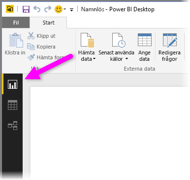

Power BI Desktop levereras också med **frågeredigeraren**, där du kan ansluta till en eller flera datakällor, utforma och transformera data som passar dina behov och sedan läsa in modellen i Power BI Desktop.

Det här dokumentet innehåller en översikt av arbetet med data i **frågeredigeraren**. Det finns självklart mer att lära sig så i slutet av det här dokumentet hittar du länkar till detaljerad information om vilka datatyper som stöds, att ansluta till data, utforma data, skapa relationer och hur du kommer igång.

Men först ska vi bekanta oss med **frågeredigeraren**.

## Frågeredigeraren
Gå till **frågeredigeraren** genom att välja **Redigera frågor** på fliken **Start** i Power BI Desktop.  

Utan några dataanslutningar visas **frågeredigeraren** som ett tomt fönster, redo för data.  

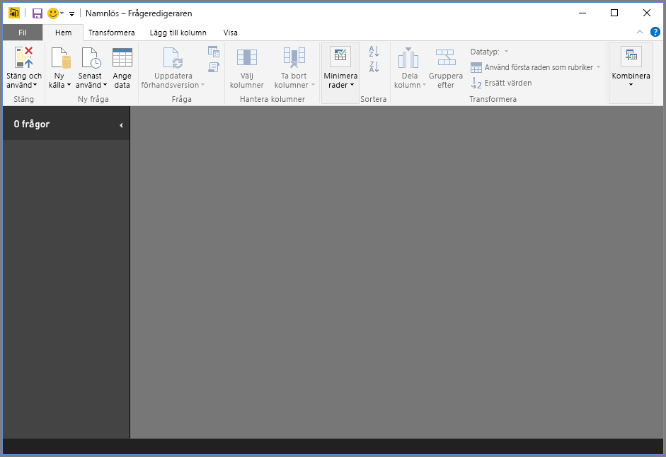

När en fråga har lästs in blir vyn för **frågeredigeraren** mer intressant. Om vi ansluter till följande webbdatakälla läser **frågeredigeraren** in information om datan, som du sedan kan börja utforma.

[*http://www.bankrate.com/finance/retirement/best-places-retire-how-state-ranks.aspx*](http://www.bankrate.com/finance/retirement/best-places-retire-how-state-ranks.aspx)

Så här visas **frågeredigeraren** när en dataanslutning har upprättats:

1. Många knappar i menyfliksområdet är nu aktiverade, så att du kan interagera med frågans data
2. I det vänstra fönstret visas frågorna och där kan du välja, visa och utforma dem
3. I mittenfönstret visas data från den valda frågan och här kan den bearbetas
4. Fönstret **Frågeinställningar** visas med en lista över frågans egenskaper och tillämpade steg  
   
   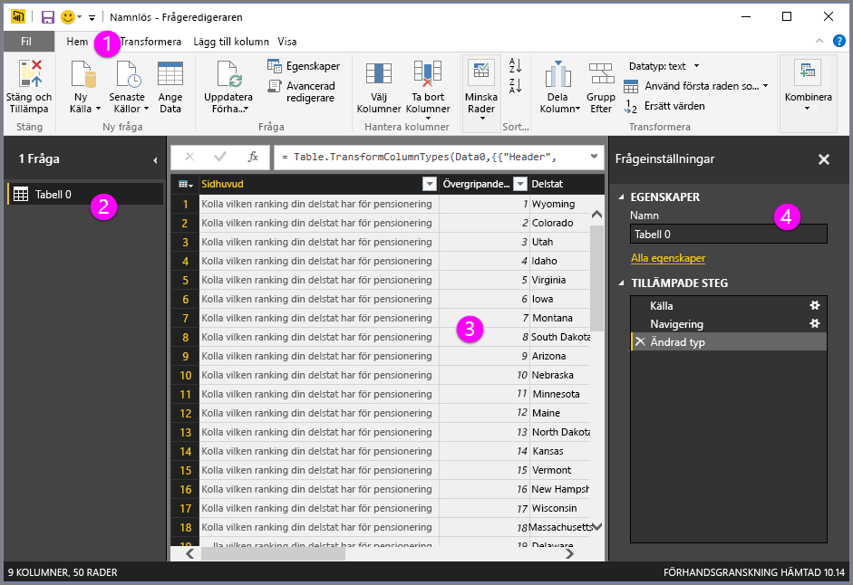

Vi ska titta på vart och ett av dessa fyra områden – menyfliksområdet, frågefönstret, datavyn och fönstret Frågeinställningar – i avsnitten nedan.

## Menyfliksområdet för frågor
Menyfliksområdet i **frågeredigeraren** består av fyra flikar – **Start**, **Transformera**, **Lägg till kolumn** och **Visa**.

På fliken **Start** finns vanliga frågeaktiviteter, inklusive det första steget i alla frågor – **Hämta data.** Följande bild visar menyfliksområdet **Start**.  

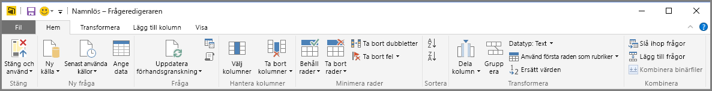

Om du vill ansluta till data och börja skapa frågan väljer du knappen **Hämta data**. En meny visas med de vanligaste datakällorna.  

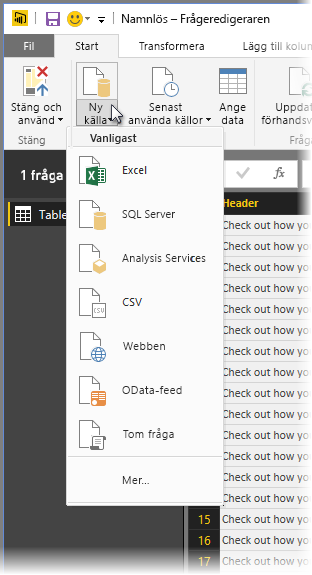

Mer information om tillgängliga datakällor finns i **Datakällor**. Information om hur du ansluter till data, inklusive exempel och anvisningar finns i **Anslut till data**.

Fliken **Transformera** ger åtkomst till vanliga datatransformeringsuppgifter, till exempel att lägga till eller ta bort kolumner, ändra datatyper, dela kolumner och andra datauppgifter. Följande bild visar fliken **Transformera**.  

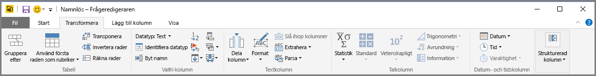

Mer information om att transformera data, inklusive exempel, finns i **Kombinera och utforma data**.

Fliken **Lägg till kolumn** innehåller ytterligare uppgifter som är associerade med att lägga till en kolumn, formatera kolumndata och lägga till anpassade kolumner. Följande bild visar fliken **Lägg till kolumn**.  

Fliken **Visa** i menyfliksområdet används för att växla mellan olika fönster. Den används också för att visa Avancerad redigerare. Följande bild visar fliken **Visa**.  

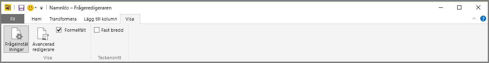

Det kan vara bra att veta att många av uppgifterna som är tillgängliga från menyfliksområdet, också är tillgängliga om du högerklickar på en kolumn eller andra data i det mittersta fönstret.

## Det vänstra fönstret
I det vänstra fönstret visas antalet aktiva frågor samt namnet på frågan. När du väljer en fråga i det vänstra fönstret visas datan i det mittersta fönstret. Där kan du utforma och transformera datan efter dina behov. Följande bild visar det vänstra fönstret med flera frågor.  

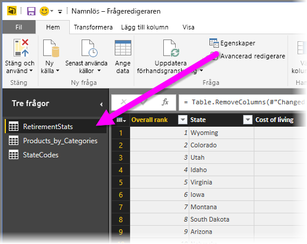

## Fönstret i mitten (data)
Data från den valda frågan visas i mittfönstret, eller datafönstret. Här utförs mycket av arbetet i frågevyn.

I följande bild visas den webbdataanslutning som etablerades tidigare, kolumnen **Övergripande poäng** är markerad och man har högerklickat på rubriken för att visa tillgängliga menyalternativ. Observera att många av de menyobjekt som visas när man högerklickar är samma som knapparna på flikarna i menyfliksområdet.  

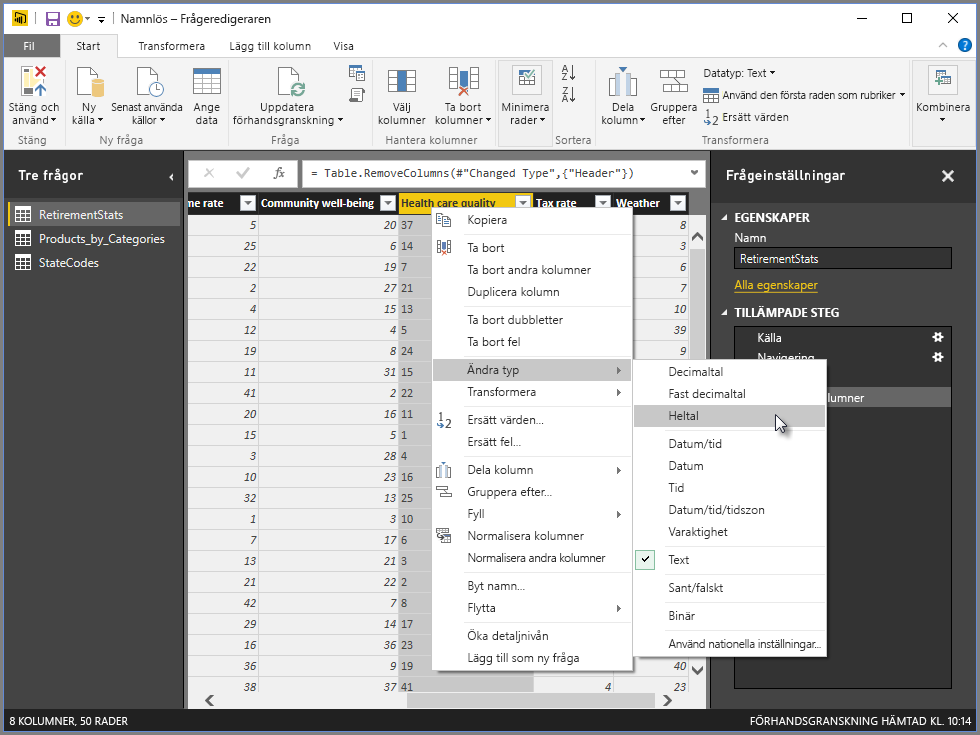

När du väljer ett menyalternativ (eller en knapp i menyfliksområdet), tillämpar frågeredigeraren steget till datan och sparar den som en del av själva frågan. Stegen som utförs registreras i fönstret **Frågeinställningar** i ordningsföljd, vilket beskrivs i nästa avsnitt.  

## Fönstret Frågeinställningar
Fönstret **Frågeinställningar** är den plats där alla steg som är kopplade till en fråga visas. I följande bild återspeglar exempelvis avsnittet **Använda steg** i fönstret **Frågeinställningar** det faktum att vi just ändrade typ för kolumnen **Övergripande poäng**.

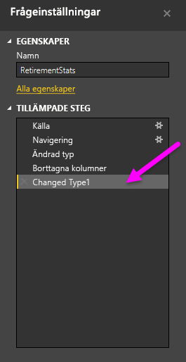

När ytterligare utformningssteg ska tillämpas på frågan hämtas de i avsnittet **Använda steg**.

Det är viktigt att du förstår att underliggande data *inte* ändras. I stället justerar och utformar frågeredigeraren sin visning av datan och all interaktion med underliggande data sker baserat på frågeredigerarens utformade och ändrade datavisning.

I fönstret **Frågeinställningar** kan du byta namn på steg, ta bort steg eller ordna om stegen som du vill. Detta gör du genom att högerklicka på steget i avsnittet **Använda steg** och välja i menyn som visas. Alla åtgärder för frågan utförs i den ordning de visas i fönstret **Använda steg**.

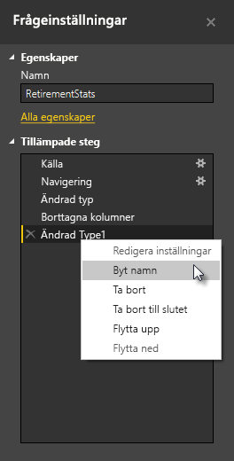

## Avancerad redigerare
Om du vill se den kod som frågeredigeraren skapar för varje steg eller om du vill skapa din egen utformningskod, kan du använda **Avancerad redigerare**. Starta redigeraren genom att välja **Visa** i menyfliksområdet och sedan **Avancerad redigerare**. Ett fönster visas med den befintliga frågekoden.  

Du kan redigera koden direkt i fönstret **Avancerad redigerare**. Stäng fönstret genom att välja **Klar** eller **Avbryt**.  

## Spara ditt arbete
När din fråga är där du vill kan du låta frågeredigeraren tillämpa ändringarna i datamodellen i Power BI Desktop och sedan stänga frågeredigeraren. Gör detta genom att välja **Stäng och använd** i frågeredigerarens **Arkiv**-meny.  
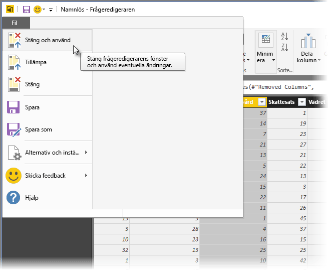

Power BI Desktop visar en dialogruta med sin status.  

När din fråga är där du vill, eller om du vill kontrollera att ditt arbete har sparats, kan Power BI Desktop spara ditt arbete i form av en .pbix-fil.

Spara arbetet genom att välja **Arkiv \> Spara** (eller **Arkiv \> Spara som**), enligt följande bild.  
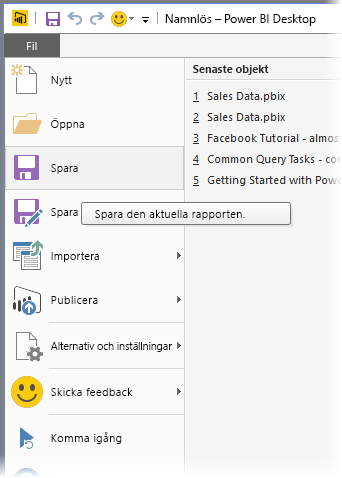

## Nästa steg
Det finns olika typer av saker som du kan göra med Power BI Desktop. Läs följande resurser för mer information om dess möjligheter:

* [Vad är Power BI Desktop?](desktop-what-is-desktop.md)
* [Datakällor i Power BI Desktop](desktop-data-sources.md)
* [Anslut till data i Power BI Desktop](desktop-connect-to-data.md)
* [Forma och kombinera data i Power BI Desktop](desktop-shape-and-combine-data.md)
* [Vanliga frågeuppgifter i Power BI Desktop](desktop-common-query-tasks.md)   

