# Använd snabbmått för att enkelt utföra vanliga och kraftfulla beräkningar (förhandsgranskning)
Från och med April 2017 version av **Power BI Desktop** kan du använda **snabbmått** för att snabbt och enkelt utföra vanliga, kraftfulla beräkningar. Ett **snabbmått** kör en uppsättning DAX-kommandon i bakgrunden (du behöver inte skriva DAX – det är klart) som bygger på indata som du anger i en dialogruta. Sedan presenteras resultatet i rapporten. Du kan bästa är att du kan se de DAX-kommandon som körs av snabb måttet och komma igång med eller utöka din egen DAX kunskap.

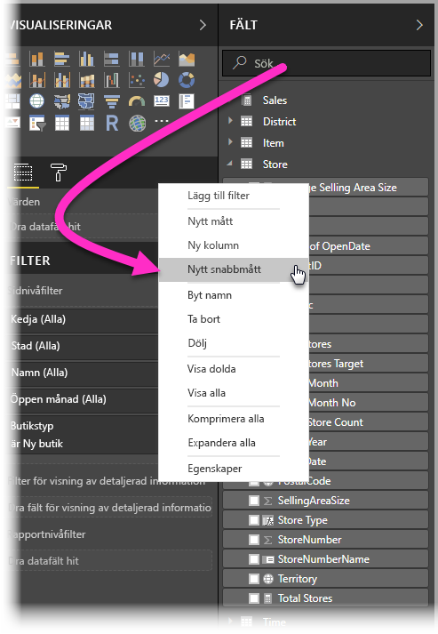

Du skapar **snabbmått** genom att högerklicka på ett fält i **fältbrunnen** sedan välja **snabbmått** från menyn som visas. Du kan också högerklicka på ett värde i fältet **Värden** på ett befintligt visuellt objekt (till exempel fältet *Värden* i ett *stapeldiagram*). Det finns många tillgängliga kategorier för beräkningar och sätt att ändra varje beräkningen så att den passar dina behov.

### Aktivera förhandsgranskningen av snabbmått
Du kan prova den nya funktionen **snabbmått** från och med **april 2017**-versionen av **Power BI Desktop**. Aktivera förhandsversionsfunktionen i **Arkiv > Alternativ och inställningar > Alternativ > Förhandsversionsfunktioner** och markera sedan kryssrutan bredvid **Snabbmått**. Du måste starta om Power BI Desktop när du har gjort valet.

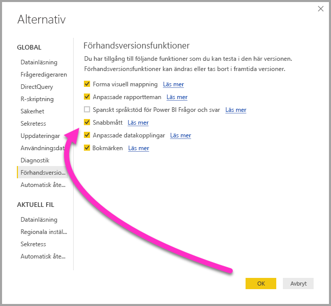

Du måste starta om **Power BI Desktop** när du har gjort valet.

## Använda snabbmått
För att **snabbmått**, högerklicka på ett fält (alla fält) i brunnen **Fält** i **Power BI Desktop** och välj **snabbmått** från menyn som visas.

Modellering måste finnas på den datauppsättning som för närvarande är inlästa för att **snabbåtgärder** ska vara tillgängliga. Därför visas inte live-anslutningar (till exempel en anslutning till en datamängd för Power BI-tjänsten) i menyn **snabbmått** objektet när du högerklickar på listan **Fält**, med undantag för SSAS live-anslutningar. 

När du använder SQL Server Analysis Services (SSAS) live-anslutningar är vissa **snabbmått** tillgängliga. **Power BI Desktop** visar endast mängden av **snabbmått** som stöds för versionen av SSAS som du ansluter till. Om du är ansluten till en SSAS live-datakälla och du inte ser vissa **snabbmått** i listan beror det på att den SSAS-version som du är ansluten till inte stöder det DAX-mått som används för att implementera **snabbmåttet**.

Följande **snabbmått** visas från högerklicksmenyn så att du kan välja önskad beräkning och fälten mot vilka du vill köra beräkningen.

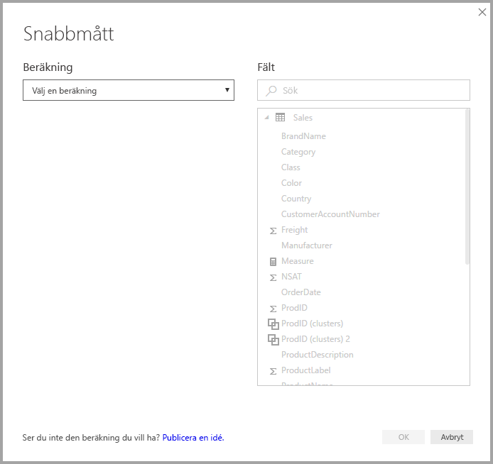

När du väljer listrutan visas med en lång lista över tillgängliga **snabbmått**.

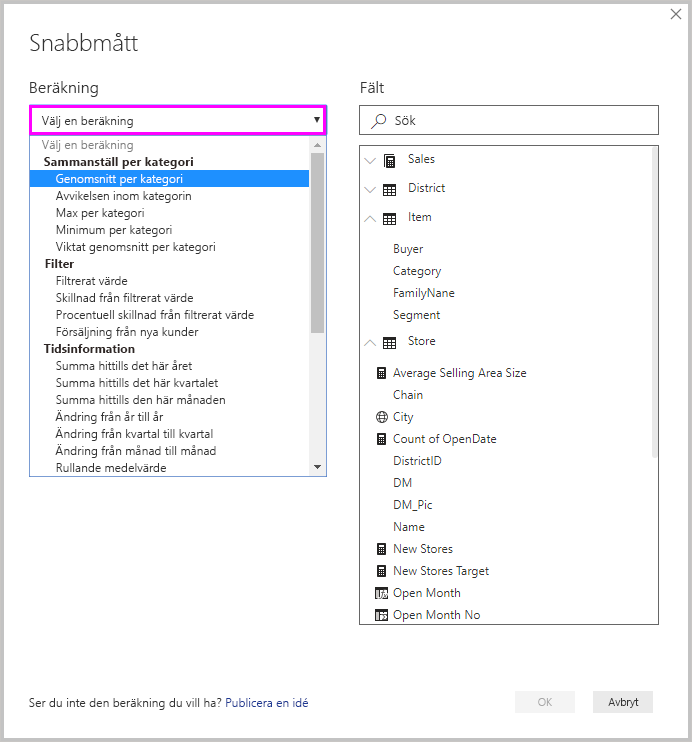

Det finns fem olika grupper av beräkningstyper i snabbmått, var och ett med en samling av beräkningar. Dessa grupper och beräkningar är följande:

* **Aggregera inom en kategori**
  * Genomsnitt inom en kategori
  * Varians inom en kategori
  * Maxvärde inom en kategori
  * Minimivärde inom en kategori
  * Viktat genomsnitt per kategori
* **Filter och baslinjer**
  * Filtrerat mått
  * Skillnad från baslinje
  * Procentuell skillnad från baslinje
  * Summor från nya kategorier
* **Tidsintelligens**
  * Summa hittills det här året
  * Summa hittills det här kvartalet
  * Summa hittills den här månaden
  * Årsvis ändring
  * Kvartalsvis ändring
  * Förändring månad för månad
  * Rullande medelvärde
* **Summor**
  * Löpande summa
  * Summa för kategorin (filter applicerade)
  * Summan för kategorin (filter ej applicerade)
* **Matematiska operationer**
  * Tillägg
  * Subtraktion
  * Multiplikation
  * Division
  * Procentuell skillnad
* **Text**
  * Omdöme i stjärnor
  * Sammanlänkad lista med värden

Vi planerar att lägga till dessa beräkningar och vill veta vilka **snabbmått** du skulle vilja se och om du har idéer (inklusive underliggande DAX-formler) för **snabbmått** som du vill att vi överväger. Mer information om detta finns i slutet på den här artikeln.

## Exempel på snabbmått
Låt oss ta en titt på ett exempel på dessa **snabbmått** i praktiken.

Följande **matris** innehåller en tabell med försäljning för olika elektronikprodukter. Det är en enkel tabell som innehåller det totala antalet för varje kategori.

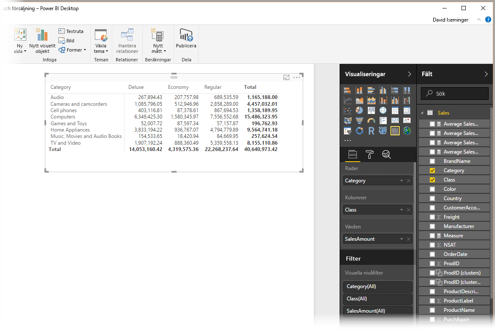

När vi högerklickar du på fältet **Värden** och väljer **Snabbmått** kan vi välja *Genomsnitt inom en kategori* som *beräkning*och välja *Summan av försäljning* som *basvärde*. Ange *SalesAmount* genom att dra fältet från rutan *Fält*  i den högra rutan i avsnittet *Kategori* till vänster.

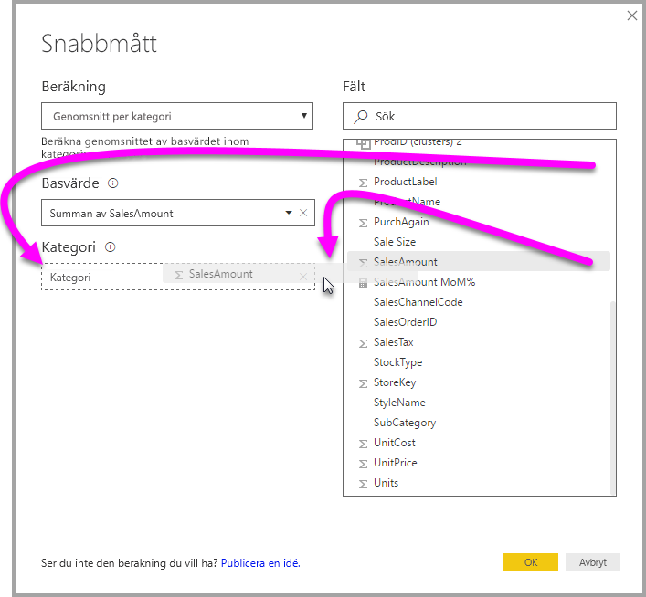

När vi väljer **OK** händer ett par intressanta saker, enligt bilden efter den här listan:

1. Nu har **matrisen** ny kolumn som visar vår beräkning (i det här fallet *Genomsnittlig försäljning inom försäljning*).
2. Ett nytt **mått** har skapats och är tillgängligt i **Fält** och har markerats (Power BI placerar en gul ruta omkring den). Det här måttet är tillgängligt för andra visuella objekt i rapporten, inte bara det visuella objektet som det ursprungligen skapades för.
3. DAX-formeln som har skapats för **snabbmåttet** visas i formelfältet.

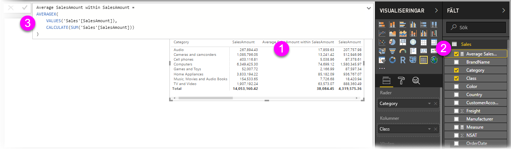

För att börja med det första objektet, lägg märke till att **snabbmåttet** har tillämpats på det visuella objektet. Det finns en ny kolumn och tillhörande värde som baseras på det **snabbmått** som har skapats.

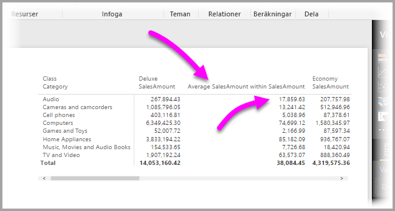

Därefter visas **snabbmåttet** visas i brunnen **fält** i datamodellen och kan användas som ett annat fält i modellen för andra visuella objekt. I följande bild har ett snabbt **stapeldiagram** skapats med hjälp av det nya fältet som skapats av **snabbmåttet**.

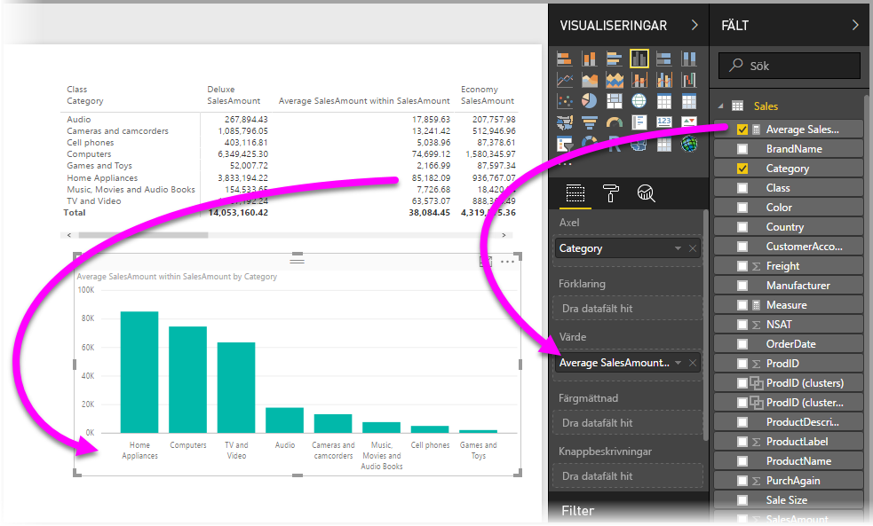

Nu ska vi gå till nästa avsnitt för att diskutera det tredje objektet, DAX-formler.

## Lär dig DAX med snabbmått
En annan stor nytta av funktionen **snabbåtgärder** är att den direkt visar DAX-formeln som skapades för att genomföra åtgärden. I följande bild, har vi valt mått som har skapats av **snabbmått** (nu är det i brunnen **Fält**, så det är bara att klicka på det). När vi gör det visas **Formelfältet**, vilket visar DAX-formeln som Power BI skapade för att verkställa måttet.

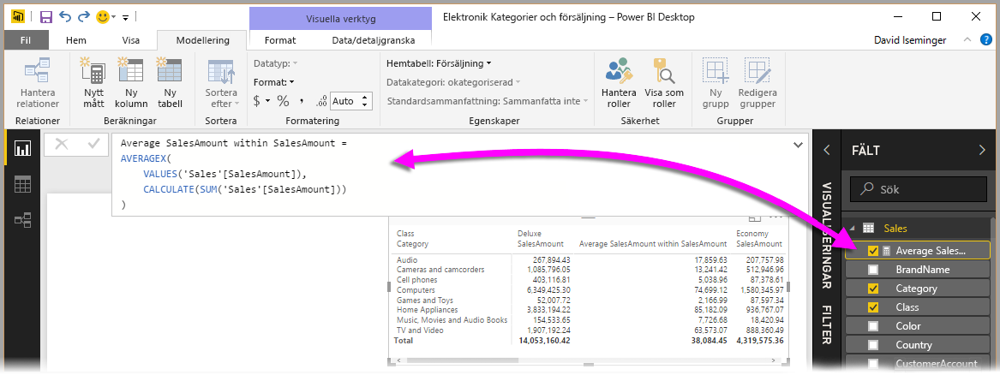

Det är bra, eftersom den visar formeln bakom måttet. Men det gör det möjligt att använda **snabbmått** för att se hur de underliggande DAX-formlerna ska skapas.

Anta att du behöver göra en beräkning som jämför två år, men du vet inte hur du ska strukturera DAX-formeln (eller du vet inte var du ska börja!). Istället för att slå huvudet mot skrivbordet kan du skapa ett **snabbmått** med beräkningen **årsvis förändring** och se vad som händer. Till exempel, skapa ett **snabbmått** och se hur det visas i ditt visuella objekt, se hur DAX-formeln fungerade och utför ändringarna antingen direkt i DAX eller skapa ett annat mått tills beräkningarna uppfyller dina behov eller förväntningar.

Det är som att ha en snabb lärare som svarar omedelbart på hypotetiska frågor med några få klickningar. Du kan alltid ta bort dessa mått från din modell om du inte gillar dem – det är bara att högerklicka på måttet och välja **Ta bort**.

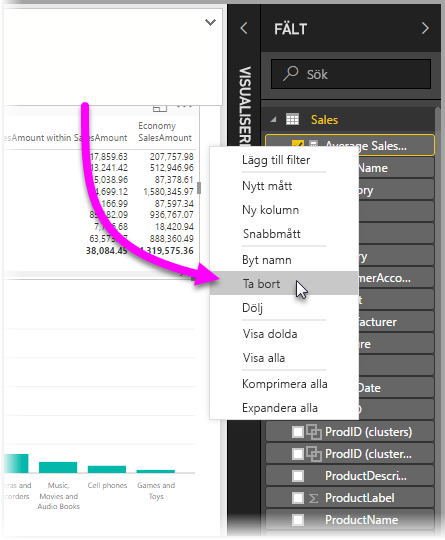

När måttet är perfekt kan du byta namn efter behov med samma högerklicksmeny.

## Begränsningar och överväganden
Det finns några begränsningar och saker du bör tänka på för den här versionen av **snabbmått**.

* **Snabbmått** är endast tillgängliga om du kan ändra modellen, vilket inte är fallet när du arbetar med DirectQuery eller de flesta live-anslutningar (SSAS live-anslutningar stöds, som tidigare förklarats).
* Måttet som har lagts till i brunnen **Fält** kan användas med alla visuella objekt i rapporten.
* Du kan se DAX-uttryck som är associerade med ett **snabbmått** genom att välja det skapade måttet i brunnen **Fält**. Titta sedan på formeln i **formelfältet**.

> [!WARNING]
> Snabbmått skapar för närvarande *endast* DAX-uttryck med kommatecken för argumentavgränsare. Om din version av **Power BI Desktop** är lokaliserat till ett språk som använder kommatecken som decimalavgränsare kommer snabbmått inte att fungera korrekt.
> 
> 

### Tidsinformation och snabbmått
Från och med uppdateringen i oktober 2017 av **Power BI Desktop** kan du använda dina egna anpassade datum-tabeller med tidsinformation-**snabbåtgärder**. Om datamodellen har en anpassad datumtabell kan du använda den primära datumkolumnen i tabellen för snabbmått för tidsinformation. Du *måste* se till att den primära kolumnen i tabellen har markerats som en datumtabell när modellen har skapats, enligt beskrivningen [i den här artikeln](https://docs.microsoft.com/sql/analysis-services/tabular-models/specify-mark-as-date-table-for-use-with-time-intelligence-ssas-tabular).

### Ytterligare information och exempel
Vi förväntar oss att behöva tillhandahålla exempel och vägledning för varje beräkning i **snabbmått** beräkningar, så det är värt att återkomma för uppdateringar om den fokuserade artikeln.

Eftersom det är en **Förhandsversions**funktion är vi särskilt intresserade av din feedback och dina idéer.

Har du en idé för ett **snabbmått** som inte redan finns? Toppen! Ta en titt på [den här sidan](https://go.microsoft.com/fwlink/?linkid=842906) och skicka uppslag (och DAX-formler) för **snabbmått** du skulle vilja se i **Power BI Desktop** så kan vi att överväga att lägga till den i den angivna listan över **snabbmått** i en framtida version.

