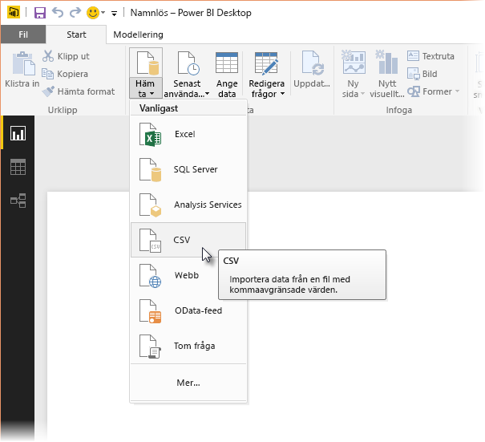
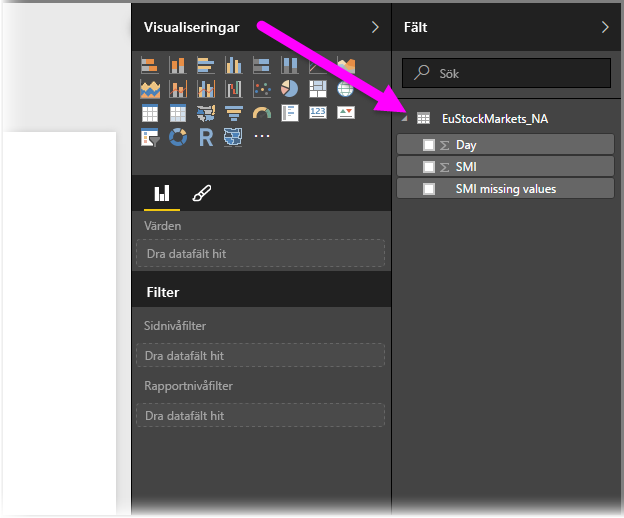
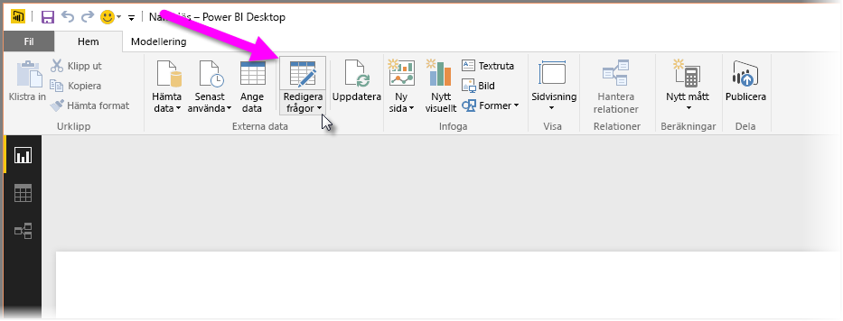
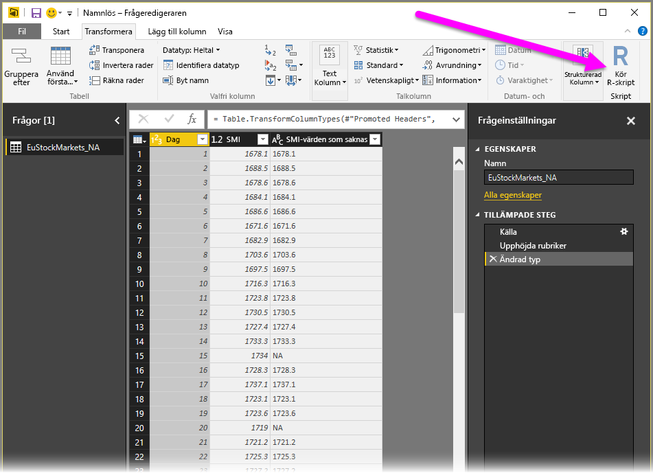
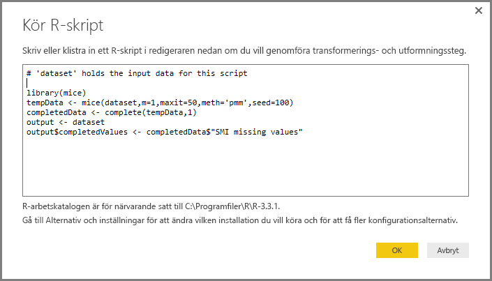
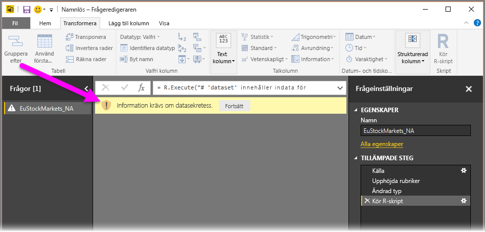
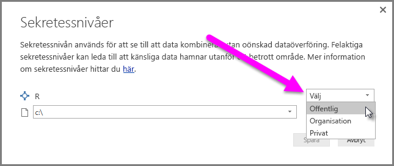
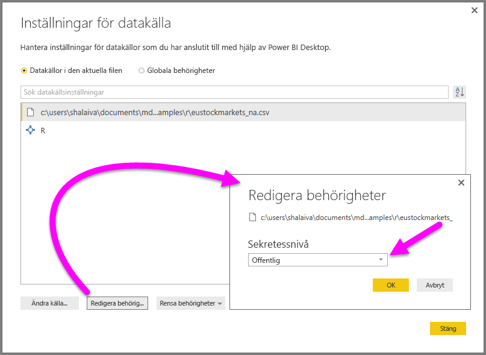

# <a name="using-r-in-query-editor"></a>Använda R i Frågeredigeraren
Du kan använda **R**, ett programmeringsspråk som ofta används av statistiker, dataforskare och dataanalytiker, i **frågeredigeraren** för Power BI Desktop. Med den här integreringen av R i **frågeredigeraren** kan du utföra datarensning med R, avancerade datautformning och analyser i datauppsättningar, inklusive färdigställande av saknade data, förutsägelser och klustring för att bara nämna några få. **R** är ett kraftfullt språk och kan användas i **frågeredigeraren** till att förbereda din datamodell och skapa rapporter.

## <a name="installing-r"></a>Installera R
För att kunna använda **R** i Power BI Desktops **frågeredigerare**, måste du installera **R** på den lokala datorn. Du kan hämta och installera **R** kostnadsfritt från flera platser, inklusive [nedladdningssidan för Revolution Open](https://mran.revolutionanalytics.com/download/) och [CRAN Repository](https://cran.r-project.org/bin/windows/base/).

## <a name="using-r-in-query-editor"></a>Använda R i Frågeredigeraren
För att visa hur du använder **R** i **frågeredigeraren** anges det här exemplet på en datauppsättning från aktiemarknaden som baseras på en .CSV-fil, som du kan [ladda ned här](http://download.microsoft.com/download/F/8/A/F8AA9DC9-8545-4AAE-9305-27AD1D01DC03/EuStockMarkets_NA.csv) och följa. Stegen i detta exempel är följande:

1. Först läser du in dina data i **Power BI Desktop**. I det här exemplet läser du in filen *EuStockMarkets_NA.csv* och väljer **Hämta data > CSV** på menyfliken **Start** i **Power BI Desktop**.

   
2. Markera filen och välj **Öppna**. CSV:n visas i dialogrutan **CSV-fil**.

   
3. När datan har lästs in visas den i fönstret **Fält** i Power BI Desktop.

   
4. Öppna **Frågeredigeraren** genom att välja **Redigera frågor** på fliken **Start** i **Power BI Desktop**.

   
5. På fliken **Transformera** väljer du **Kör R-skript**. Redigeringsprogrammet **Kör R-skript** öppnas (visas i nästa steg). Observera att det saknas data på raderna 15 och 20, vilket det även gör på andra rader som du inte kan se i följande bild. Stegen nedan visar hur R kan (och kommer) slutföra dem åt dig.

   
6. I det här exemplet anger du följande skriptkod:

    ```r
       library(mice)
       tempData <- mice(dataset,m=1,maxit=50,meth='pmm',seed=100)
       completedData <- complete(tempData,1)
       output <- dataset
       output$completedValues <- completedData$"SMI missing values"
    ```

   > [!NOTE]
   > Du måste ha biblioteket *mice* installerat i din R-miljö för att tidigare skriptkod ska fungera korrekt. Om du vill installera mice kör du följande kommando i R-installationen: |      > install.packages('mice')
   > 
   > 

   När koden infogas i dialogrutan **Kör R-skript** ser den ut ungefär så här:

   
7. När du har valt **OK** visar **frågeredigeraren** en varning om datasekretess.

   
8. För att R-skript ska fungera korrekt i Power BI-tjänsten måste alla datakällor anges som *offentliga*. Mer information om sekretessinställningar och deras konsekvenser finns i [Sekretessnivåer](desktop-privacy-levels.md).

   

   Observera en ny kolumn i fönstret **Fält** med namnet *completedValues*. Observera att det är några dataelement som saknas, t.ex på rad 15 och 18. Ta en titt på hur R hanterar det i nästa avsnitt.


Trots att vi bara har fem rader med R-skript kan **frågeredigeraren** fylla i saknade värden med en förutsägelsemodell.

## <a name="creating-visuals-from-r-script-data"></a>Skapa visuella objekt från R-skriptdata
Nu kan vi skapa ett visuellt objekt för att se hur R-skriptkoden använder biblioteket *mice* till att fylla i saknade värden, enligt följande bild:


När det visuella objektet är klart och även övriga visuella objekt som du vill skapa med **Power BI Desktop**, kan du spara **Power BI Desktop**-filen (som en .pbix-fil) och sedan använda datamodellen, inklusive de R-skript som ingår i den, i Power BI-tjänsten.

> [!NOTE]
> Vill du se en färdig .pbix-fil där de här stegen har slutförts? I så fall kan du ladda ned den slutförda **Power BI Desktop**-filen som användes i de här exemplen [till höger här](http://download.microsoft.com/download/F/8/A/F8AA9DC9-8545-4AAE-9305-27AD1D01DC03/Complete%20Values%20with%20R%20in%20PQ.pbix).

När du har överfört .pbix-filen till Power BI-tjänsten, krävs det några fler steg för att datauppdatering ska aktiveras (i tjänsten) och för att aktivera att visuella objekt uppdateras i tjänsten (datan behöver åtkomst till R för att de visuella objekten ska uppdateras). De extra stegen är följande:

* **Aktivera schemalagd uppdatering för datauppsättningen** – För att aktivera schemalagd uppdatering för den arbetsbok som innehåller datauppsättningen med R-skript, se [Konfigurera schemalagd uppdatering](refresh-scheduled-refresh.md), som även innehåller information om **Personlig gateway**.
* **Installera personlig gateway** – Du behöver en **Personlig gateway** installerad på datorn där filen finns och där R har installerats. Power BI-tjänsten måste komma åt arbetsboken och kunna återge uppdaterade visuella objekt på nytt. Du kan få mer information om hur du [installerar och konfigurerar en personlig gateway](service-gateway-personal-mode.md).

## <a name="limitations"></a>Begränsningar
Det finns vissa begränsningar för frågor med R-skript som skapats i **frågeredigeraren**:

* Alla R-inställningar för datakällan måste anges som *offentliga* och alla andra steg i en fråga som skapats i **frågeredigeraren** måste också vara offentliga. Gå till inställningar för datakällan i **Power BI Desktop** genom att välja **Fil > Alternativ och inställningar > Datakällsinställningar**.

  

  I dialogrutan **Datakällsinställningar** markerar du datakällorna och väljer sedan **Redigera behörigheter...**. Kontrollera att **Sekretessnivå** är inställd som *Offentlig*.

      
* Om du vill aktivera schemalagd uppdatering av visuella R-objekt eller datauppsättningar, måste du aktivera **Schemalagd uppdatering** och installera en **Personlig gateway** på datorn där arbetsboken och R-installationen finns. Mer information om detta finns i föregående avsnitt i den här artikeln, med länkar till mer information om var och en.

Det finns olika saker du kan göra med R och egna frågor, så utforska och utforma dina data precis som du vill att de ska visas.

