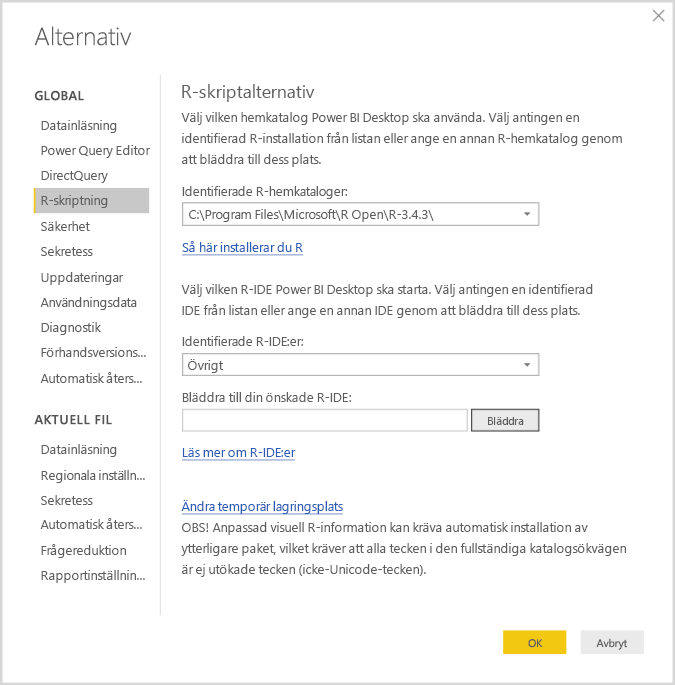
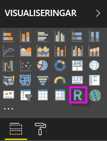
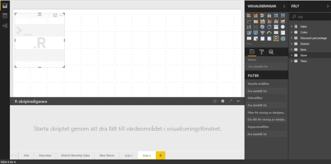
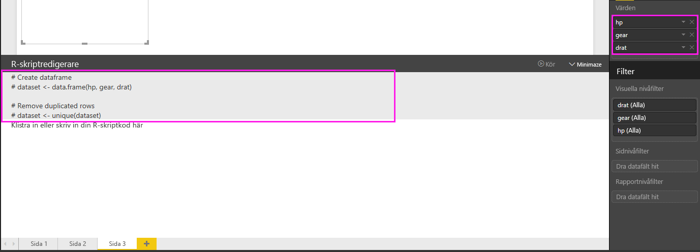
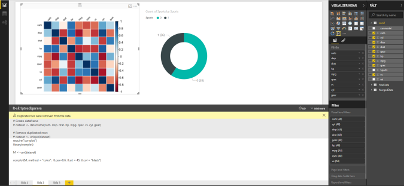
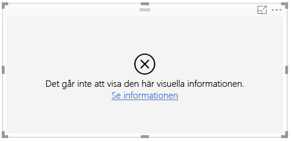

# <a name="create-power-bi-visuals-using-r"></a>Skapa visuella Power BI-objekt med R
Med Power BI Desktop, kan du använda *R* för att visualisera dina data. [R](https://mran.revolutionanalytics.com/documents/what-is-r) är ett språk och en miljö för statistisk databehandling och grafik.

## <a name="install-r"></a>Installera R
Som standard inkluderar, distribuerar eller installerar inte Power BI Desktop R-motorn. Om du vill köra R-skript i Power BI Desktop måste du installera R på din lokala dator separat. Du kan hämta och installera R kostnadsfritt från flera platser, inklusive [nedladdningssidan för Revolution Open](https://mran.revolutionanalytics.com/download/) och [CRAN Repository](https://cran.r-project.org/bin/windows/base/). Den aktuella versionen av R-skript i Power BI Desktop stöder Unicode-tecken som blanksteg (tomma tecken) i installationssökvägen.

## <a name="enable-r-visuals-in-power-bi-desktop"></a>Aktivera R-visualiseringar i Power BI Desktop
När du har installerat R aktiveras Power BI Desktop automatiskt. Följ dessa steg om du vill kontrollera att Power BI Desktop har aktiverat R på rätt plats: 

1. På Power BI Desktop-menyn väljer du **Arkiv** > **Alternativ och inställningar** > **Alternativ**. 

2. Till vänster på sidan **Alternativ**, under **Global**, väljer du **R-skriptning**. 

3. Under **R-skriptalternativ** kontrollerar du att din lokala R-installation finns i **Identifierade R-hemkataloger** och att den motsvarar den lokala R-installation som du vill att Power BI Desktop ska använda. I följande bild är sökvägen till den lokala installationen av R **C:\Program Files\R Open\R-3.5.3\\** .
   
   

När du verifierat din R-installation är du redo att börja skapa R-visualiseringar.

## <a name="create-r-visuals-in-power-bi-desktop"></a>Skapa R-visualiseringar i Power BI Desktop
1. Välj ikonen **R-visualisering** i fönstret **Visualisering** för att lägga till en R-visualisering.
   
   

2. I fönstret för **Aktivera visuell skriptinformation** som visas väljer du **Aktivera**.

   

   När du lägger till en R-visualisering till en rapport gör Power BI Desktop följande ändringar:
   
   - En R-visuell bildplatshållare visas på rapportens arbetsyta.
   
   - **R-skriptredigeraren** visas längst ned i mittenfönstret.
   
   

3. I avsnittet **Värden** i fönstret **Visualisering** drar du fält från fönstret **Fält** som du vill använda i ditt R-skript, precis som med andra Power BI Desktop-visualiseringar. Alternativt kan du också välja fälten direkt i rutan **Fält**.
    
    Endast fält som du har lagt till i **Värden** är tillgängliga för ditt R-skript. Du kan lägga till nya fält eller ta bort onödiga fält från avsnittet **Värden** när du arbetar med ditt R-skript i **R-skriptredigeraren**. Power BI Desktop identifierar automatiskt vilka fält som du har lagt till eller tagit bort.
   
   > [!NOTE]
   > Aggregeringens standardtyp för visuella R-objekt är *Summera inte*.
   > 
   > 
   
4. Nu kan du använda de data du har valt för att skapa en rityta: 

    - När du markerar fält, skapar **R-skriptredigeraren** stödjande R-skriptsbindningskod för de fälten i det grå avsnittet överst i redigerarfönstret.
    - Om du tar bort ett fält tar **R-skriptredigeraren** automatiskt bort den stödjande koden för det fältet.
   
   I exemplet som visas i följande bild, har tre fält valts: hp, gear och drat. På grund av dessa val, skapar R-skriptredigeraren en bindningskod som kan sammanfattas så här:
   
   * Skapa en dataram med namnet **dataset**, som består av olika fält som användaren har valt.
   * Standardtypen av sammansättning är: *summera inte*.
   * Ungefär som med visuella tabellobjekt grupperas fält, och duplicerade rader visas bara en gång.
   
   
   
   > [!TIP]
   > I vissa fall kanske du inte vill att automatisk gruppering ska ske, eller så kanske du vill att alla rader visas, inklusive dubbletter. I så fall kan du lägga till ett indexfält till din datauppsättning som gör att alla rader anses vara unika och förhindrar gruppering.
   > 
   > 
   
   Den skapade dataramen heter **datauppsättning** och du kommer åt valda kolumner via deras respektive namn. Du kan t.ex. komma åt kugghjulsfältet genom att lägga till *dataset$gear* i ditt R-skript. Använd enkla citattecken för fält med blanksteg eller specialtecken.

5. Nu när dataramen automatiskt skapats av de fält du valt, är du redo att skriva ett R-skript som Power BI Desktop visar för R-standardenheten. När du har slutfört skriptet väljer du **Kör skriptet** till höger i namnlisten **R-skriptredigerare**.
   
    När du väljer **Kör skriptet** identifierar Power BI Desktop området och visar det på arbetsytan. Se till att nödvändiga R-paket installerats eftersom processen körs på din lokala R-installation.
   
   Power BI Desktop ritar om visualiseringen när någon av följande händelser inträffar:
   
   * Du väljer **Kör skriptet** från namnlisten för **R-skriptredigeraren**.
   * När en dataändring inträffar, på grund av datauppdatering, filtrering eller markering.

     Följande bild visar ett exempel på korrelationritningskoden och ritar korrelationer mellan attribut för olika typer av bilar.

     

6. För att få en större vy över visualiseringar minimerar du **R-skriptredigeraren**. Precis som i annan visuell information i Power BI Desktop kan du korsfiltrera korrelationsritningen genom att välja ett visst avsnitt (som sportbilar) i toroidvisualiseringen (den runda visualiseringen till höger).

    

7. Modifiera R-skriptet för att anpassa den visuella informationen och utnyttja kraften i R genom att lägga till parametrar till ritkommandot.

    Det ursprungliga ritkommandot är:

    ```
    corrplot(M, method = "color",  tl.cex=0.6, tl.srt = 45, tl.col = "black")
    ```

    Ändra R-skriptet så att ritkommandot ser ut så här:

    ```
    corrplot(M, method = "circle", tl.cex=0.6, tl.srt = 45, tl.col = "black", type= "upper", order="hclust")
    ```

    Därför ritar nu R-visualiseringen cirklar, överväger bara den övre hälften och sorterar om matrisen för att klustra korrelerade attribut.

    

    När du kör ett R-skript som resulterar i ett fel visas ett felmeddelande på arbetsytan i stället för det visuella R-diagrammet. Om du vill ha information om felet väljer du **Mer information** från R-visualiseringsfelet.

    

## <a name="r-scripts-security"></a>R-skriptssäkerhet 
Visuella R-objekt har skapats från R-skript som kan innehålla kod som medför säkerhets- eller integritetsrisker. När användare försöker visa eller interagera med en R-visualisering för första gången, visas en säkerhetsvarning. Aktivera endast visuell R-information om du litar på skaparen och källan, eller när du granskat och förstått R-skriptet.


## <a name="known-limitations"></a>Kända begränsningar
R-visualiseringar i Power BI Desktop har följande begränsningar:

* Datastorlekar: Data som används för ritning av visuella R-objekt är begränsade till 150 000 rader. Om du väljer mer än 150 000 rader, är det enbart de översta 150 000 raderna som används och ett meddelande visas på bilden.

* Upplösning: Alla R-visualiseringar visas med 72 DPI.

* Beräkningstider: Om en visuell R-beräkning överskrider fem minuter orsakar det ett tidsgränsfel.

* Relationer: Om datafält väljs från olika tabeller utan någon definierad relation mellan dem så uppstår ett fel, precis som med andra Power BI Desktop-visualiseringar.

* Uppdaterar: Visuella R-objekt uppdateras när data uppdateras, filtreras eller markeras. Själva bilden är dock inte interaktiv och kan inte vara källan till korsfiltrering.

* Höjdpunkter: R-visualiseringar svarar om du markerar andra visuella objekt, men du kan inte välja element i R-visualiseringen för att korsfiltrera andra element.

* Visa enheter: Endast områden som ritas till R-standardenheten för visning visas korrekt på arbetsytan. Undvik att uttryckligen använda en annan R-visningsenhet.

* RRO-installationer: I den här versionen identifieras inte RRO-installationer automatiskt av 32-bitars versionen av Power BI Desktop så du måste manuellt ange sökvägen till R-installationskatalogen i **Alternativ och inställningar** > **Alternativ** > **R-skriptning**.

## <a name="next-steps"></a>Nästa steg
Mer information om R i Power BI finns i följande artiklar:

* [Köra R-skript i Power BI Desktop](desktop-r-scripts.md)
* [Använd en extern R IDE med Power BI](desktop-r-ide.md)

