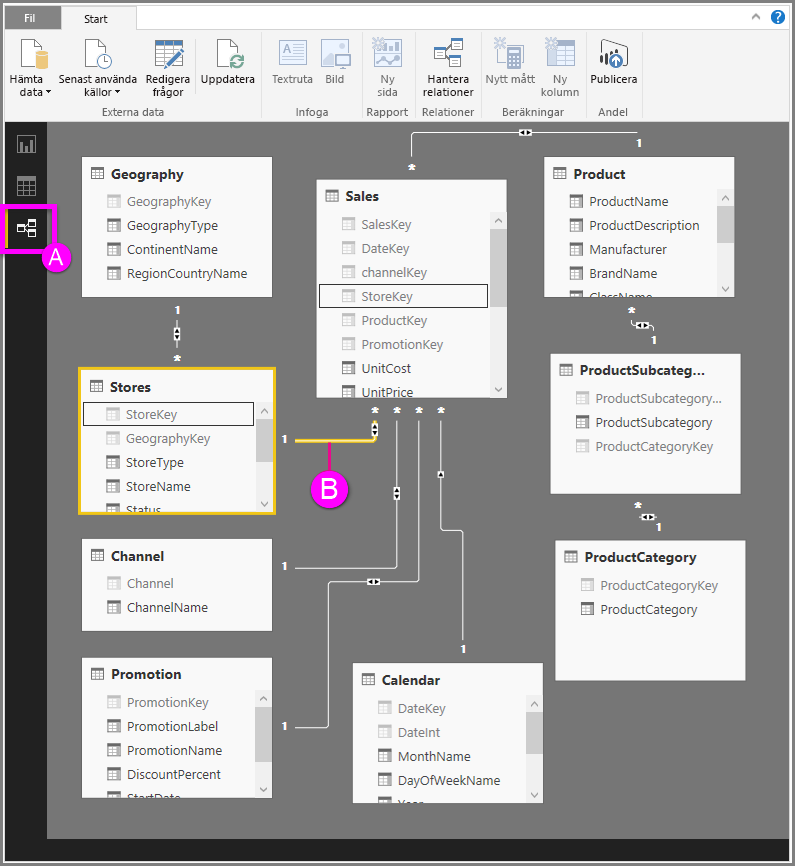

# Arbeta med relationsvyn i Power BI Desktop
**Relationsvyn** visar alla tabeller, kolumner och relationer i din modell. Det kan vara särskilt användbart när modellen har komplexa relationer mellan många tabeller.

Låt oss ta en titt.

**A.**  Ikon för relationen – Klicka här för att visa din modell i relationsvyn

**B.** Relation – Du kan hålla muspekaren över en relation för att visa de använda kolumnerna. Dubbelklicka på en relation för att öppna den i dialogrutan **Redigera relation**. 

I bilden ovan kan du se att tabellen *Stores* har en *StoreKey*-kolumn som är relaterad till tabellen *Sales* som också har en *StoreKey*-kolumn. Det finns en *många-till-en-relation* (\*: 1) och ikonen mitt i raden visar att korsfilterriktningen är inställd på *båda*. Pilen på ikonen visar i vilken riktning kontextfiltret flödar.

Läs mer om relationer i [Skapa och hantera relationer i Power BI Desktop](desktop-create-and-manage-relationships.md).

