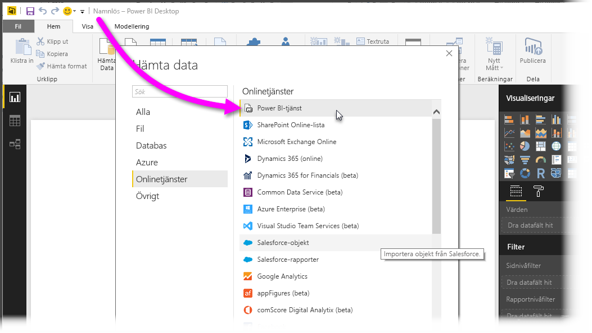
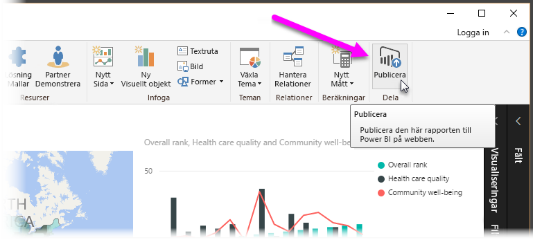
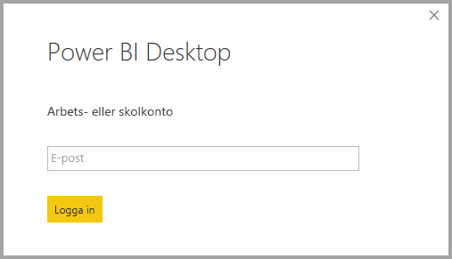
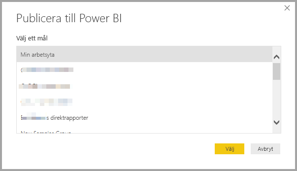
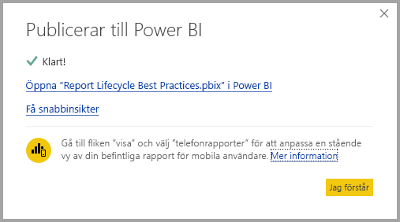
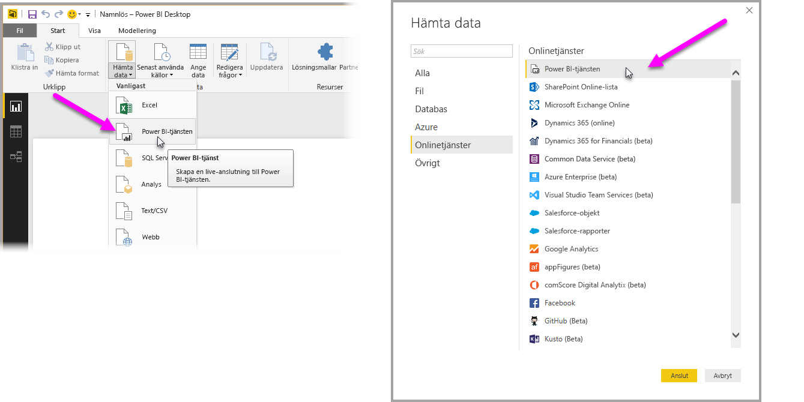
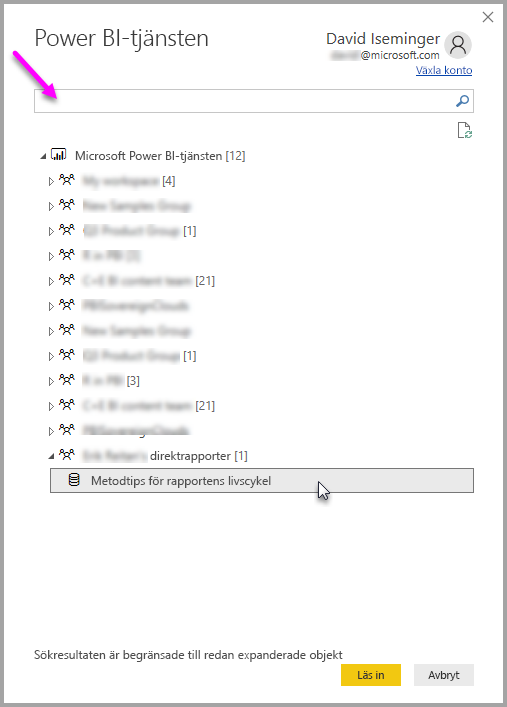
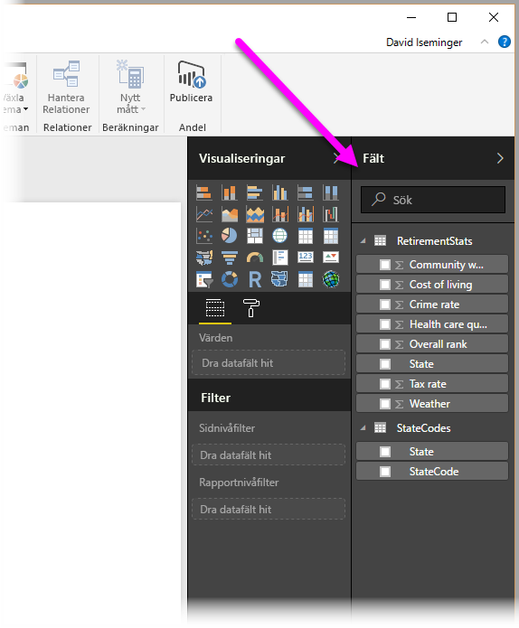

# Ansluta till datauppsättningar i Power BI-tjänsten från Power BI Desktop
Du kan upprätta en live-anslutning till en delad datauppsättning i Power BI-tjänsten och skapa olika rapporter från samma datauppsättning. Det innebär att du kan skapa den perfekta datamodellen i Power BI Desktop, publicera den till Power BI-tjänsten och sedan kan du och andra användare skapa flera olika rapporter (i separata .pbix-filer) från samma gemensamma datamodell. Den här funktionen kallas **Live-anslutning till Power BI-tjänst**.

Det finns olika typer av fördelar med den här funktionen, inklusive metodtips som vi kommer att diskutera i den här artikeln. Det finns också några överväganden och begränsningar, så se till att du har läst igenom dem – de är i slutet av den här artikeln.

## Använda live-anslutning till Power BI-tjänsten för livscykelhantering av rapporter
En utmaning med att Power BI är så populärt är den ökande mängden rapporter, instrumentpaneler och deras underliggande datamodeller. Anledningen är att det är enkelt att skapa intressanta rapporter i **Power BI Desktop**, dela ([publicera](desktop-upload-desktop-files.md)) rapporterna i **Power BI-tjänsten** och att skapa bra instrumentpaneler från dessa datauppsättningar. Eftersom många personer har gjort det, ofta med samma (eller nästan samma) datauppsättningar, blir det svårt att veta vilken rapport som baseras på vilken datauppsättning – och hur ny varje datauppsättning är. Med **Live-anslutning till Power BI-tjänst** löser man utmaningen genom att skapa, dela och expandera gemensamma datauppsättningsrapporter och instrumentpaneler på ett enklare och mer konsekvent sätt.

### Skapa en datauppsättning som alla kan använda och dela den sedan
Anta att Anna (en affärsanalytiker) är med i din grupp och att hon är duktig på att skapa bra datamodeller (s.k. datauppsättningar). Med Annas expertis kan hon skapa en datauppsättning och rapport och sedan dela rapporten i **Power BI-tjänsten**.

Alla gillar hennes rapport och hennes datauppsättning, och det är där det skulle kunna bli problem – alla i teamet försöker skapa *sin egen version* av datauppsättningen och sedan dela sina egna rapporter med gruppen. Plötsligt finns det mängder med rapporter (från olika datauppsättningar) på din grupps arbetsyta i **Power BI-tjänsten**. Vilken är den senaste? Är datauppsättningarna identiska, eller bara nästan? Vilka skillnader är det? Med funktionen **Live-anslutning till Power BI-tjänst** kan allt ändras till det bättre. I nästa avsnitt ser vi hur andra kan använda Annas publicerade datauppsättning till sina egna rapporter samt att alla använder samma granskade och publicerade datauppsättning när de skapar sina egna unika rapporter.

### Ansluta till en Power BI-tjänsts datauppsättning med hjälp av en live-anslutning
När Anna skapar sin rapport (och skapar datauppsättningen som den baseras på) publicerar hon den till **Power BI-tjänsten** och den visas på arbetsytan för hennes grupp i Power BI-tjänsten. Den är nu tillgänglig så att alla i hennes arbetsyta kan se och använda den.

Andra medlemmar i hennes arbetsyta kan nu upprätta en live-anslutning till Annas delade datamodell (med **Live-anslutning till Power BI-tjänst**) och skapa sina egna unika rapporter från *hennes ursprungliga datauppsättning*.

I följande bild kan du se hur Anna skapar en **Power BI Desktop**-rapport och publicerar den (med datamodellen) till **Power BI-tjänsten**. Sedan kan andra i hennes arbetsyta ansluta till hennes datamodell med **Live-anslutning till Power BI-tjänst** och skapa sina egna unika rapporter baserat på hennes datauppsättning.

> [!NOTE]
> Datauppsättningar delas endast i en arbetsyta. För att upprätta en live-anslutning till Power BI-tjänsten, måste datauppsättningen som du vill ansluta till finnas i en delad arbetsyta där du är medlem.
> 
> 

## Stegvisa instruktioner för att använda en live-anslutning till Power BI-tjänsten
Nu när vi vet hur användbar **Live-anslutning till Power BI-tjänst** är och hur du kan använda den för att rapportera livscykelhantering, kan vi gå igenom de steg som tog oss från Annas rapport (och datauppsättning) till en delad datauppsättning som hennes gruppmedlemmar kan använda i sin Power BI-arbetsyta.

### Publicera en Power BI-rapport och datauppsättning
Det första steget i att hantera rapportlivscykeln med **Live-anslutning till Power BI-tjänst** är att ha en rapport (och datauppsättning) som gruppmedlemmarna vill använda. Så Anna måste först **publicera** sin rapport från **Power BI Desktop**. Hon gör detta genom att välja **Publicera** från **Start** i menyfliksområdet i Power BI Desktop.

Om hon inte har loggat in på sitt konto för Power BI-tjänsten, uppmanas hon att göra detta.

Därifrån kan hon välja arbetsytans mål där rapporten och datauppsättningen ska publiceras. Kom ihåg att det bara är medlemmar som har åtkomst till arbetsytan där en rapport har publicerats som kan komma åt dess datauppsättning med hjälp av **Live-anslutning till Power BI-tjänst**.

Publiceringsprocessen påbörjas och **Power BI Desktop** visar förloppet.

När det är klart visar **Power BI Desktop** detta och ger dig några länkar för att komma till själva rapporten i **Power BI-tjänsten**, samt en länk till **Quick Insights** i rapporten.

Nu ska vi se hur andra gruppmedlemmar som har åtkomst till arbetsytan där rapporten (och datauppsättningen) är publicerad kan ansluta till datauppsättningen och skapa egna rapporter.

### Gå till den publicerade datauppsättningen med en live-anslutning till Power BI-tjänsten
För att upprätta en anslutning till den publicerade rapporten och skapa en egen rapport som baseras på den publicerade datauppsättningen, väljer du **Hämta data** från menyfliksområdet **Start** i **Power BI Desktop** och sedan **Power BI-tjänst**. Du kan också välja det från **Hämta data > Onlinetjänster > Power BI-tjänst**.

Om du inte har loggat in på Power BI, uppmanas du att göra detta. När du har loggat in ser du ett fönster med de arbetsytor som du är medlem i. Du kan välja den arbetsyta som innehåller datauppsättningen som du vill upprätta en **Live-anslutning till Power BI-tjänst** till.

Siffrorna i hakparenteserna bredvid arbetsytan visar hur många delade datauppsättningar som är tillgängliga i arbetsgruppen. Om du väljer triangeln till vänster expanderas arbetsytan där du kan välja den delade datauppsättningen.

Det finns några saker att tänka på från föregående live-anslutningsfönster för **Power BI-tjänsten**:

* Du kan söka efter en delad datauppsättning men sökresultaten är begränsade till expanderade objekt och innefattar inte några arbetsytor som du inte har expanderat.
* Du kan expandera mer än en arbetsyta för att utöka sökningen.

När du väljer **Läs in** i fönstret upprättar du en live-anslutning till den valda datauppsättningen vilket innebär att de data som du ser (fält och deras värden) blir inlästa i **Power BI Desktop** i realtid.

Nu kan du (och andra) skapa och dela anpassade rapporter och dela dem från samma datauppsättning. Detta är ett bra sätt att ha en person med kunskap att skapa en genomtänkt datauppsättning (som t.ex. Anna gör) och sedan låta flera medarbetare använda den delade datauppsättningen till att skapa sina egna rapporter.

> [!NOTE]
> När du skapar rapporter som baseras på datauppsättningen med en live-anslutning till **Power BI-tjänsten**, kan du bara publicera rapporten till den arbetsyta som innehåller datauppsättningen som används.
> 
> 

## Begränsningar och överväganden
När du använder **Live-anslutning till Power BI-tjänst** finns det några begränsningar och överväganden som du bör komma ihåg.

* Medlemmar med läsbehörighet i en arbetsyta kan inte ansluta till datauppsättningar från **Poser BI Desktop**.
* Endast användare som ingår i samma arbetsyta i **Power BI-tjänsten** kan ansluta till en publicerad datauppsättning med **Live-anslutning till Power BI-tjänst**. Användarna kan (och gör ofta) tillhöra mer än en arbetsyta.
* Eftersom detta är en live-anslutning är vänsternavigering och modellering inaktiverade, vilket liknar hur det fungerar när du ansluter till **SQL Server Analysis Services**.
* Eftersom det är en live-anslutning tvingas RLS (säkerhet på rad- och rollnivå), OneDrive för företag och andra anslutningar på samma sätt som de gör när man är ansluten till **SQL Server Analysis Services**.
* När du väljer vilken datauppsättning du ska ansluta till i **Power BI-tjänsten**, gäller sökrutan endast arbetsytor som har expanderats.
* Om du ändrar den ursprungliga delade .pbix-filen, kommer datauppsättningen och rapporten som delas i **Power BI-tjänsten** att skrivas över.
* Du kan inte byta ut den ursprungliga delade rapporten. Om du försöker göra detta visas en varning som uppmanar dig att byta namn på filen och publicera.
* Om du tar bort den delade datauppsättningen i **Power BI-tjänsten**, kommer inga andra **Power BI Desktop**-filer (.pbix-filer) fungera eller visa de visuella objekten.
* För innehållspaket måste du först skapa en kopia av ett innehållspaket innan du använder det som en bas för att dela en .pbix-rapport och datauppsättning till **Power BI-tjänsten**.
* När innehållspaket från *Min organisation* har kopierats kan du inte ersätta rapporten som skapades i tjänsten, och/eller en rapport som skapats vid kopiering av ett innehållspaket, med en live-anslutning. Om du försöker göra detta visas en varning som uppmanar dig att byta namn på filen och publicera. I den här situationen kan du bara byta ut de publicerade live-anslutna rapporterna.
* När du skapar en rapport som baseras på datauppsättning med en live-anslutning till **Power BI-tjänsten**, kan du bara publicera rapporten till samma arbetsyta som innehåller den datauppsättning som används.
* Att ta bort en delad datauppsättning i **Power BI-tjänsten** innebär att du inte längre får åtkomst till datauppsättningen från **Power BI Desktop**.

