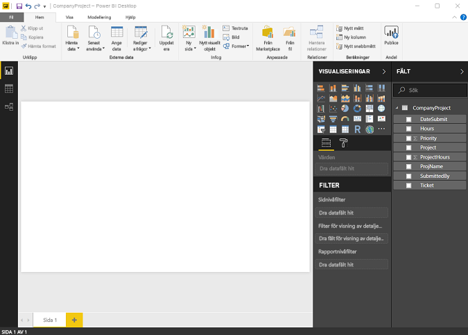
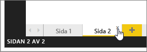
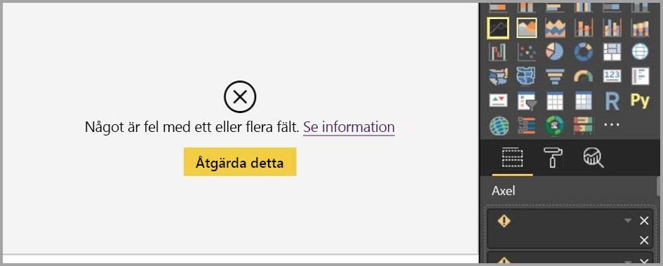
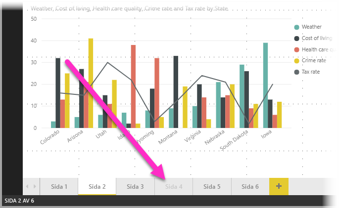

# Rapportvy i Power BI Desktop
Om du har arbetat med Power BI, vet du hur enkelt det är att skapa rapporter som ger dynamisk perspektiv och insikter om dina data. Power BI har också fler avancerade funktioner i Power BI Desktop. Du kan använda Power BI Desktop för att skapa avancerade frågor, blandade data från flera källor, skapa relationer mellan tabeller och mycket mer.

Power BI Desktop innehåller **Rapportvyn** där du kan skapa ett obegränsat antal rapportsidor med visuella objekt. Rapportvyn ger praktiskt taget samma designupplevelse som rapportens redigeringsvy i Power BI-tjänsten. Du kan flytta runt visuella objekt, kopiera och klistra in, sammanfoga och så vidare.

Skillnaden mellan dessa är att när du använder Power BI Desktop kan du arbeta med dina frågor och modellera dina data så att dina data ger de bästa insikterna i dina rapporter. Du kan spara Power BI Desktop-filen var du vill, oavsett om det är en lokal hårddisk eller till molnet.

## Låt oss ta en titt!
När du läser in data i Power BI Desktop, ser du **Rapportvisningen** med en tom arbetsyta.

Du kan växla mellan **Rapportvy**, **Datavy** och **Relationsvy** genom att välja ikonerna i det vänstra navigationsfältet:

När du har lagt till vissa data kan du lägga till fält i ett nytt visuellt objekt i arbetsytan.

Om du vill ändra typen av visualisering, kan du välja detta från gruppen **Visuella objekt** i menyfliksområdet eller högerklicka och välja en annan typ från ikonen **Ändra typen av visualisering**.

> [!TIP]
> Se till att experimentera med olika typer av visuella objekt. Det är viktigt att ditt visuella objekt förmedlar dina data tydligt.

En rapport har minst en tom sida från början. Sidor visas i fönstret navigator till vänster om arbetsytan. Du kan lägga till alla typer av grafik på en sida, men det är viktigt att inte överdriva. För många visuella objekt på en sida gör det svårt att hitta rätt information. Du kan lägga till nya sidor i rapporten. Klicka bara på **Ny sida** i menyfliksområdet.

Om du vill ta bort en sida klickar du på **X** på sidans flik längst ned i rapporten.

> [!NOTE]
> Rapporter och visuella objekt går inte att fästa på en instrumentpanel från Power BI Desktop. För att göra det måste du [Publicera från Power BI Desktop](desktop-upload-desktop-files.md) till Power BI-platsen.

## Kopiera och klistra in mellan rapporter

Du kan enkelt ta ett visuellt objekt från en Power BI Desktop-rapport och klistra in den i en annan rapport. Använd bara tangentbordskommandot **CTRL + C** för att kopiera ditt visuella rapportobjekt och använd **CTRL + V** i den andra Power BI Desktop-rapporten för att klistra in det visuella objektet i den andra rapporten. Du kan välja ett visuellt objekt i taget eller så kan du välja alla visuella objekt på en sida att kopiera och därefter klistra in dem i Power BI Desktop-målrapporten. 

Möjligheten att kopiera och klistra in visuella objekt är användbart för personer som skapar och uppdaterar flera rapporter ofta. När du kopierar mellan filer, så överförs inställningar och formatering som uttryckligen har ställts in i formateringsfönstret, medan visuella element som förlitar sig på ett tema eller standardinställningarna automatiskt uppdateras för att matcha temat för målrapporten. Så när du får ett visuellt objekt formaterat så det ser ut precis som du vill så kan du kopiera och klistra in det visuella objektet i nya rapporter och spara allt ditt formateringsarbete.

Om fälten i din modell är olika, visas ett fel på det visuella objektet och en varning om vilka fält som inte finns. Felet liknar den upplevelse du får när du tar bort ett fält i modellen som det visuella objektet använder. 

Åtgärda felet genom att ersätta det trasiga fältet med de fält som du vill använda från modellen i rapporten där du klistrade in det visuella objektet. Om du använder ett anpassat visuellt objekt så måste du även importera det anpassade visuella objektet till målrapporten.

## Dölja rapportsidor

När du skapar en rapport har du även möjlighet att dölja sidor i den. Detta kan vara användbart om du behöver skapa underliggande data eller visuella objekt i en rapport, men inte vill att dessa sidor ska vara synliga för andra, t.ex. när du skapar tabeller eller stödjande visuella objekt som används på andra rapportsidor. Det finns många andra kreativa orsaker till att du kanske vill skapa en rapportsida och sedan dölja den från en rapport som du vill publicera. 

Det är lätt att dölja en rapportsida. Du högerklickar helt enkelt på rapportsidans flik och väljer **Dölj** på den meny som visas.

Det finns vissa saker du bör tänka på när du döljer en rapportsida:

* Du kan fortfarande se en dold rapportvy i **Power BI Desktop**, även om sidans rubrik är nedtonad. I följande bild döljs sida 4.

    

* Du *kan inte* se en dold rapportsida när du visar rapporten i **Power BI-tjänsten**.

* Att dölja en rapportsida är *inte* en säkerhetsåtgärd. Användare kan fortfarande använda sidan, och dess innehåll är fortfarande tillgängligt när du visar detaljerad information eller använder andra metoder.

* När en sida är dold i visningsläge, så visas inga navigeringspilar.

