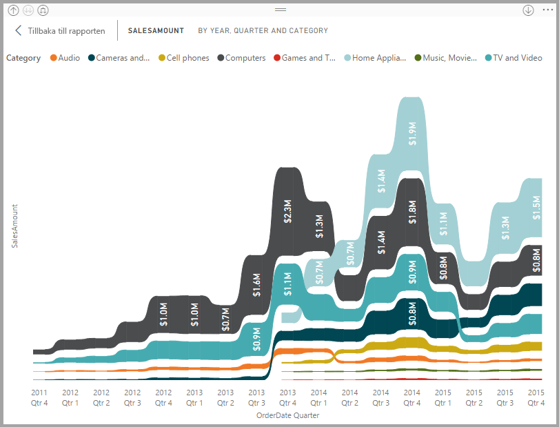
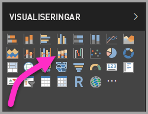
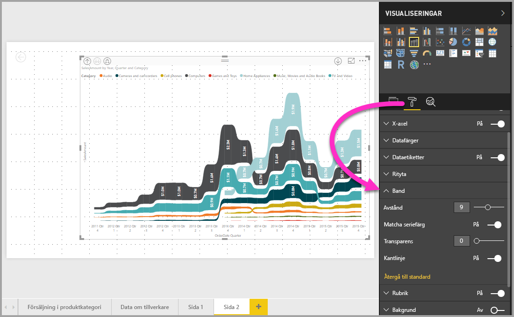

# Använda banddiagram i Power BI
Du kan använda banddiagram i **Power BI** för att visualisera data och snabbt avgöra vilken datakategori som har högst rangordning (störst värde). Banddiagram är effektiva för att visa en rangordningsförändring med den högsta rangordningen (värdet) längst upp för varje tidsperiod. Banddiagram är tillgängliga i **Power BI Desktop** från och med september 2017 och i efterföljande uppdateringar av **Power BI-tjänsten**.

## Skapa ett banddiagram
Skapa ett banddiagram genom att välja **Banddiagram** i fönstret **Visuella objekt**.

Banddiagram jämför en datakategori under en tidsperiod med band, vilket innebär att du kan se vilken rangordning en viss kategori har under loppet av diagrammets x-axel (vanligtvis tidslinjen).

## Formatera ett banddiagram
När du skapar ett diagram i menyfliksområdet har du formateringsalternativ som är tillgängliga i området **Format** i fönstret **Visuella objekt**. Formateringsalternativen för banddiagram liknar dem för ett stående stapeldiagram med extra formateringsalternativ som är specifika för band.

Formateringsalternativen för banddiagram låter göra följande justeringar:

* **Med avstånd** kan du styra hur mycket utrymme som ska visas mellan banden. Numret är i procent av kolumnens maximala höjd.
* **Med matcha seriefärg** kan du matcha färg i menyfliksområdet med seriefärg. Banden är grå när detta är avaktiverat.
* **Genomskinlighet** anger hur genomskinligt menyfliksområdet är. Standardvärdet är 30.
* **Kantlinje** kan du placera en mörk kantlinje högst upp och längst ned på banden. Kantlinjer är inaktiverade som standard.

## Nästa steg
För mer information om **Power BI Desktop**, och hur du kommer igång, ta en titt i följande artiklar.

* [Komma igång med Power BI Desktop](desktop-getting-started.md)
* [Frågeöversikt med Power BI Desktop](desktop-query-overview.md)
* [Datakällor i Power BI Desktop](desktop-data-sources.md)
* [Anslut till data i Power BI Desktop](desktop-connect-to-data.md)
* [Forma och kombinera data i Power BI Desktop](desktop-shape-and-combine-data.md)
* [Vanliga frågeuppgifter i Power BI Desktop](desktop-common-query-tasks.md)   

