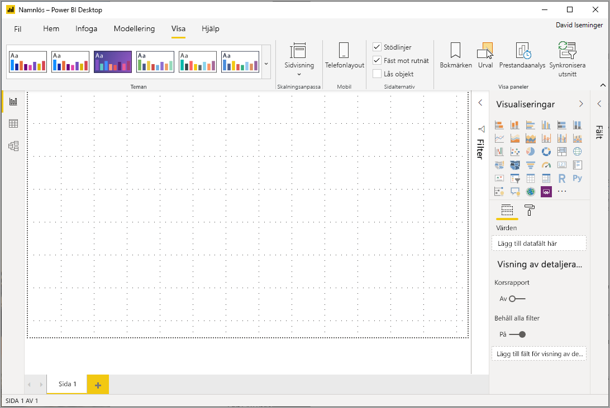
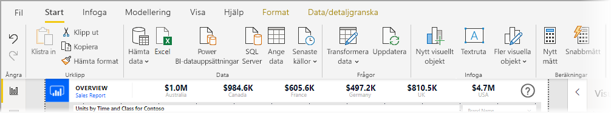
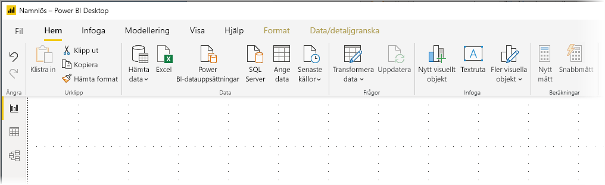
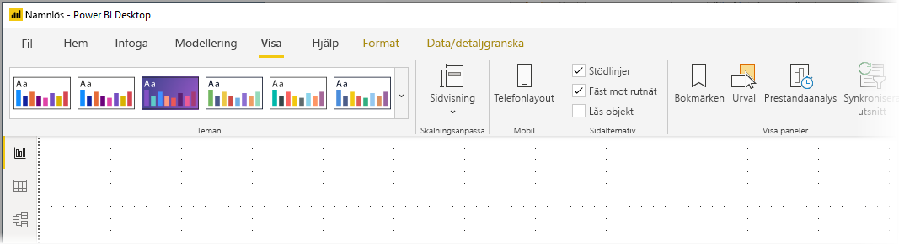
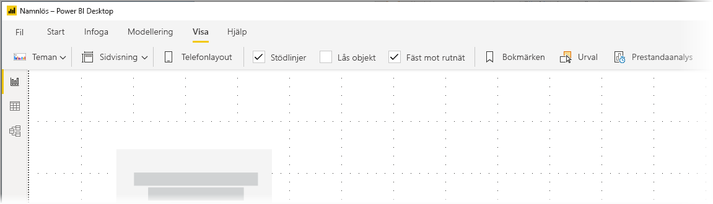

# Använda det uppdaterade menyfliksområdet i Power BI Desktop (förhandsversion)

Från och med uppdateringen i november 2019 ändrar Power BI Desktop sitt menyfliksområde för att anpassa det till andra Microsoft-produkter, till exempel Microsoft Office.

Det uppdaterade menyfliksområdet är i förhandsversion, för att vi ska kunna samla in feedback från användare och kunder och se till att upplevelsen blir enastående bra. Vi förväntar oss några månader för förhandsversion, feedback och förbättringar innan det uppdaterade menyfliksområdet i Power BI Desktop lanseras till alla. 

## Så här aktiverar du det uppdaterade menyfliksområdet

Det uppdaterade menyfliksområdet i Power BI är en förhandsgranskningsfunktion som måste vara aktiverad. Aktivera den genom att välja **Arkiv > Alternativ och inställningar > Alternativ** och sedan **Förhandsgranskningsfunktioner** i den vänstra kolumnen. I den högra rutan finns alternativet **Menyfliksområdet har uppdaterats**. Markera kryssrutan bredvid **Menyfliksområdet har uppdaterats** för att aktivera förhandsgranskningsfunktionen. Du måste starta om Power BI Desktop för att förhandsgranskningsfunktionen ska börja gälla.

## Funktioner i det nya menyfliksområdet

Fördelarna med att uppdatera vårt menyfliksområde är att göra upplevelsen i Power BI Desktop, precis som i andra Microsoft-produkter, enkel och välbekant. 

Dessa fördelar kan grupperas i följande kategorier:

* **Bättre utseende, känsla och organisation** – Ikoner och funktioner i det uppdaterade Power BI Desktop-menyfliksområdet är anpassade till utseendet, känslan och organisationen av menyfliksobjekt i Office-program.

    

* **Ett intuitivt temagalleri** – Temagalleriet som finns i menyfliksområdet **Visa**, har det välbekanta utseendet från temagalleriet i PowerPoint. Det innebär att bilderna i menyfliksområdet visar hur temaändringar kommer att se ut om de tillämpas på rapporten, till exempel färgkombinationer och teckensnitt. 

    

* **Dynamiskt innehåll i menyfliksområdet som baseras på din vy** – I det nuvarande menyfliksområdet i Power BI Desktop var ikoner eller kommandon som inte var tillgängliga helt enkelt nedtonade, vilket inte gav någon optimal upplevelse. I det uppdaterade menyfliksområdet visas och ordnas ikonerna dynamiskt så att du alltid vet vilka alternativ som är tillgängliga för dig.

* **Ett menyfliksområde på en rad tar mindre plats när det är komprimerat** – En annan fördel med det uppdaterade menyfliksområdet är möjligheten att komprimera själva menyfliksområdet till en enda rad, som dynamiskt visar menyobjekt baserat på ditt sammanhang. 

    

Förutom de synliga ändringarna innebär ett uppdaterat menyfliksområde också att vi kan göra uppdateringar framöver av Power BI Desktop och dess menyfliksområde, som till exempel följande:

* Skapa mer flexibla och intuitiva kontroller i menyfliksområdet, till exempel galleriet med visuella objekt
* Lägga till *svarta* och *mörkblå* Office-teman i Power BI Desktop
* Förbättra tillgängligheten

## Nästa steg
Det finns alla möjliga sorters data du kan ansluta till med Power BI Desktop. Kolla in följande resurser för mer information om datakällor:

* [Vad är Power BI Desktop?](desktop-what-is-desktop.md)
* [Datakällor i Power BI Desktop](desktop-data-sources.md)
* [Forma och kombinera data i Power BI Desktop](desktop-shape-and-combine-data.md)
* [Anslut till Excel-arbetsböcker i Power BI Desktop](desktop-connect-excel.md)   
* [Ange data direkt i Power BI Desktop](desktop-enter-data-directly-into-desktop.md)   

