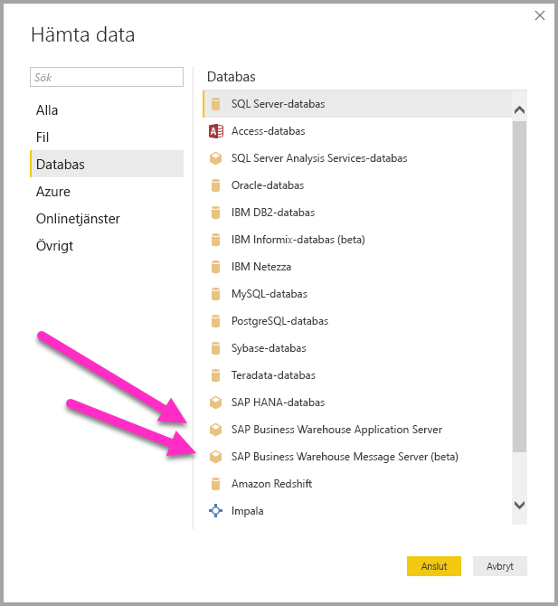

# Använd anslutningstjänsten SAP BW i Power BI Desktop
Med Power BI Desktop kan du komma åt **SAP Business Warehouse (BW)**-data.

Du hittar information om hur SAP-kunder kan dra nytta av att ansluta Power BI till sina befintliga SAP BW-system (SAP Business Warehouse) i [Power BI och SAP BW whitepaper](https://aka.ms/powerbiandsapbw). Mer information om hur du använder DirectQuery med SAP BW finns i artikeln [DirectQuery och SAP Business Warehouse (BW)](desktop-directquery-sap-bw.md).

Från och med **Power BI Desktop**-versionen för juni 2018 (och allmänt tillgänglig från oktober 2018-versionen) kan du använda SAP BW-anslutningsappen med en implementering som innehåller viktiga prestanda- och funktionsförbättringar. Den här uppdaterade versionen av SAP BW-anslutningsappen har utvecklats av Microsoft och heter **Implementation 2.0**. Du kan antingen välja version 1 (v1) av **SAP BW Connector** eller **Implementation 2.0 SAP Connector**. I följande avsnitt beskrivs installationen av respektive version i tur och ordning. Du kan välja den ena eller den andra anslutningen när du ansluter till SAP BW från Power BI Desktop.

Vi rekommenderar att du använder **Implementation 2.0 SAP Connector** när det är möjligt.

## Installera version 1 av SAP BW Connector
Vi rekommenderar att du använder Implementation 2.0 SAP Connector när det är möjligt (se anvisningarna i avsnittet nedan). Det här avsnittet beskriver hur du installerar version 1 av **SAP BW Connector** genom att följa installationsstegen nedan:

1. Installera **SAP NetWeaver**-biblioteket på din lokala dator. Du kan hämta biblioteket **SAP Netweaver** från SAP-administratören eller direkt från [SAP Software Download Center](https://support.sap.com/swdc). Eftersom **SAP Software Download Center** ofta ändrar struktur, finns det inte tydligare riktlinjer för att navigera den webbplatsen. Biblioteket **SAP NetWeaver** ingår vanligtvis också i installationen av klientverktyg för SAP.
   
   Det kan vara möjligt att söka efter *SAP Note #1025361* för att hitta hämtningsplatsen för den senaste versionen. Se till att arkitekturen för **SAP NetWeaver**-biblioteket (32-bitars eller 64-bitars) matchar din installation av **Power BI Desktop** och installera alla filer som ingår i **SAP NetWeaver RFC-SDK**  enligt SAP Note.
2. Dialogrutan **Hämta data** innehåller en post för **SAP Business Warehouse Application Server** och **SAP Business Warehouse Message Server** i kategorin **Databas**.
   
   

## Installation av Implementation 2.0 SAP Connector

**Implementation 2.0** för SAP Connector kräver SAP .NET Connector 3.0. Du kan [ladda ned SAP .NET Connector 3.0](https://support.sap.com/en/product/connectors/msnet.html) från SAP:s webbplats via följande länk:

* [SAP .NET Connector 3.0](https://support.sap.com/en/product/connectors/msnet.html)

Åtkomst till nedladdningen kräver en giltig S-användare. Kunder uppmanas att begära SAP .NET Connector 3.0 från deras SAP Basis-team. 

Anslutningsappen finns som 32- och 64-bitarsversioner och användarna *måste* välja den version som matchar deras Power BI Desktop-installation. När detta skrivs är två versioner tillgängliga på webbplatsen (för .NET 4.0 Framework):

* SAP Connector för Microsoft .NET 3.0.20.0 för Windows 32-bitars (x86) som en ZIP-fil (6 896 kB), 16 januari 2018
* SAP Connector för Microsoft .NET 3.0.20.0 för Windows 64-bitars (x64) som en ZIP-fil (7 180 kB), 16 januari 2018

Välj alternativet *Install assemblies to GAC* (Installera sammansättningar till GAC) i fönstret **Optional setup steps** (Valfria installationssteg) under installationen, som du ser i bilden nedan.

> [!NOTE]
> Version 1 av SAP BW-implementeringen kräver Netweaver DLL:er. Netweaver DLL:erna krävs inte om du använder Implementation 2.0 för SAP Connector i stället för version 1.

## Funktioner för version 1 för SAP BW Connector
Med version 1 för **SAP BW Connector** i Power BI Desktop kan du importera data från dina **SAP Business Warehouse Server**-kuber eller använda DirectQuery. 

Mer information om **SAP BW-anslutningsappen** och hur du använder den med DirectQuery finns i artikeln [DirectQuery och SAP Business Warehouse (BW)](desktop-directquery-sap-bw.md).

När du ansluter måste du ange *Server*, *Systemnummer* och *Klient-ID* för att upprätta anslutningen.

Du kan också ange ytterligare två **avancerade alternativ**: språkkod och ett anpassat MDX-uttryck som ska köras mot den angivna servern.

Om inget MDX-uttryck har angetts visas fönstret **Navigator** med en lista med kuber som är tillgängliga i servern och med ett alternativ för att se mer information och välja objekt från tillgängliga kuber, inklusive dimensioner, samt åtgärder. Power BI exponerar frågor och kuber som exponeras av BAPI:et [BW Open Analysis Interface OLAP](https://help.sap.com/saphelp_nw70/helpdata/en/d9/ed8c3c59021315e10000000a114084/content.htm).

När du markerar en eller flera objekt från servern skapas en förhandsgranskning av utdatatabellen baserat ditt val.

Fönstret **Navigator** innehåller också några **Visningsalternativ** som gör det möjligt att göra följande:

* **Visa *endast valda objekt* jämfört med *alla objekt* (standardvy):** det här alternativet är användbart för att verifiera den slutgiltiga objektuppsättningen. En annan metod för att visa detta är att välja *kolumnnamn* i området *Förhandsvisning*.
* **Aktivera förhandsgranskningar av data (standardinställning):** du kan också styra om förhandsgranskade data ska visas i den här dialogrutan. Om du inaktiverar förhandsgranskningar av data minskar mängden serveranrop eftersom data inte längre begärs för förhandsgranskning.
* **Tekniska namn:** SAP BW stöder begreppet *Tekniska namn* för objekt i en kub. Med tekniska namn kan en kubägare exponera ett *användarvänligt* namn för kubobjekt, till skillnad från endast det *fysiska namnet* för objekten i kuben.

När du har valt alla nödvändiga objekt i **Navigatorn** kan du bestämma vad du ska göra genom att välja någon av följande knappar längst ned på fönstret **Navigator**:

* När du väljer **Hämta** läses hela uppsättningen rader för utdatatabellen i Power BI Desktop-datamodellen in. Du leds sedan till **rapport**vyn där du kan börja visualisera dina data eller göra ytterligare ändringar med hjälp av vyerna **Data** eller **Relationer**.
* Genom att välja **Redigera** öppnas **Frågeredigeraren** där du kan transformera och filtrera dina data ytterligare innan hela uppsättningen rader hämtas till Power BI Desktop-datamodellen.

Förutom att importera data från **SAP BW**-kuber, kom ihåg att du även kan importera data från en mängd andra datakällor i Power BI Desktop och sedan kombinera dem i samma rapport. Detta ger alla möjliga sorters intressanta scenarier för rapportering och analys utöver **SAP BW**-data.

## Använda Implementation 2.0 SAP BW Connector

Du måste skapa en ny anslutning för att använda Implementation 2.0 av SAP BW Connector. Skapa en ny anslutning genom att följa stegen nedan.

1. Välj **SAP Business Warehouse Application Server** eller **SAP Business Warehouse Message Server** i fönstret **Hämta data**.

2. Dialogrutan Ny anslutning visas, där du kan välja implementeringen. Om du väljer **Implementation 2.0**, som du ser i bilden nedan, aktiveras alternativen Körningsläge, Batchstorlek och Aktivera karakteristiska strukturer.

    

3. Välj **OK**. **Navigatormiljön** är samma som den som beskrivs ovan i avsnittet om version 1 för SAP BW Connector. 

### Nya alternativ för Implementation 2.0 

Implementation 2.0 har stöd för följande alternativ:

1. **ExecutionMode** – Anger det MDX-gränssnitt som används för att köra frågor på servern. Följande alternativ är giltiga:

        a. SapBusinessWarehouseExecutionMode.BasXml
        b. SapBusinessWarehouseExecutionMode.BasXmlGzip
        c. SapBusinessWarehouseExecutionMode.DataStream

    Standardvärdet för det här alternativet är SapBusinessWarehouseExecutionMode.BasXmlGzip.

    Alternativet *SapBusinessWarehouseExecutionMode.BasXmlGzip* kan förbättra prestanda i samband med långa svarstider för stora datamängder.

2. **BatchSize** – Anger det största antal rader som ska hämtas åt gången när ett MDX-uttryck körs. Ett litet antal rader innebär fler anrop till servern när en stor datauppsättning hämtas. Ett stort antal rader kan förbättra prestanda, men kan leda till minnesproblem på SAP BW-servern. Standardvärdet är 50 000 rader.

3. **EnableStructures** – Ett logiskt värde som anger om karakteristiska strukturer identifieras eller inte. Standardvärdet för det här alternativet är false. Påverkar listan med objekt som kan väljas. Stöds inte i läget Internfråga.

Alternativet **ScaleMeasures** har tagits bort i den här implementeringen. Beteendet motsvarar inställningen *ScaleMeasures = false*, som alltid visar oskalade värden.

### Ytterligare förbättringar i Implementation 2.0 

I följande punktlista beskrivs ytterligare förbättringar som ingår i den nya implementeringen:

* Förbättrade prestanda
* Möjligheten att hämta flera miljoner rader med data och att finjustera parametern för batchstorlek.
* Möjligheten att växla mellan körningslägen.
* Stöd för komprimerat läge. Särskilt användbart för anslutningar med långa svarstider eller för stora datauppsättningar.
* Förbättrad identifiering av datumvariabler
* [Experiment] Exponera datum- (ABAP-typen DATS) och tidsdimensioner (ABAP-typen TIMS) som datum respektive tider, i stället för som textvärden.
* Bättre undantagshantering. Nu exponeras fel som uppstår i BAPI-anrop.
* Kolumnvikning i BasXml- och BasXmlGzip-lägen. Om den genererade MDX-frågan exempelvis hämtar 40 kolumner, men den aktuella markeringen endast behöver 10, så skickas en begäran till servern för att hämta den mindre datauppsättningen.

### Ändra befintliga rapporter för användning med Implementation 2.0 

Det går bara att ändra befintliga rapporter för användning med **Implementation 2.0** i importläge. Följ de manuella stegen nedan.

1. Öppna en befintlig rapport, välj **Redigera frågor** i menyfliksområdet och välj sedan den SAP Business Warehouse-fråga som du vill uppdatera.

2. Högerklicka på frågan och välj **Avancerad redigerare**.

3. I **Avancerad redigerare** ändrar du SapBusinessWarehouse.Cubes-anropet så här: 

    a. Kontrollera om frågan redan innehåller en alternativpost, till exempel som i följande exempel:

    

    b. I så fall lägger du till alternativet Implementation 2.0 och tar bort alternativet ScaleMeasures, om det visas, som du ser i följande bild:

    

    c. Om frågan inte redan innehåller en alternativpost lägger du bara till den. Om den till exempel innehåller följande:

    

    d. Ändrar du den bara till:

    

4. Vi har i möjligaste mån försökt att göra Implementation 2.0 för SAP BW Connector kompatibel med version 1 för SAP BW Connector. Dock kan det finnas skillnader på grund av de olika SAP BW MDX-körningslägena som används. Prova att växla körningsläge för att lösa eventuell inkompatibilitet.

## Felsökning
Det här avsnittet beskriver felsökningssituationer (och lösningar) som kan uppstå när du använder **SAP BW**-anslutningsappen.

1. Numeriska data från **SAP BW** returnerar punkter i stället för blanksteg som decimaltecken. Till exempel returneras 1 000 000 som 1.000.000.
   
   **SAP BW** returnerar decimaldata med antingen ett *,* (komma) eller en *.* (punkt) som decimaltecken. För att ange vilka av dessa som **SAP BW** ska använda som decimalavgränsare anropar drivrutinen för **Power BI Desktop** *BAPI_USER_GET_DETAIL*. Det här anropet returnerar en struktur som kallas **DEFAULTS**, som har ett fält med namnet *DCPFM* som lagrar *formatet för decimaltecken*. Det antar ett av följande tre värden:
   
       ‘ ‘ (space) = Decimal point is comma: N.NNN,NN
       'X' = Decimal point is period: N,NNN.NN
       'Y' = Decimal point is N NNN NNN,NN
   
   Kunder som har rapporterat problemet upptäcktes att anropet till *BAPI_USER_GET_DETAIL* misslyckas för en viss användare (användaren som visar felaktiga data), med ett felmeddelande som liknar följande:
   
       You are not authorized to display users in group TI:
           <item>
               <TYPE>E</TYPE>
               <ID>01</ID>
               <NUMBER>512</NUMBER>
               <MESSAGE>You are not authorized to display users in group TI</MESSAGE>
               <LOG_NO/>
               <LOG_MSG_NO>000000</LOG_MSG_NO>
               <MESSAGE_V1>TI</MESSAGE_V1>
               <MESSAGE_V2/>
               <MESSAGE_V3/>
               <MESSAGE_V4/>
               <PARAMETER/>
               <ROW>0</ROW>
               <FIELD>BNAME</FIELD>
               <SYSTEM>CLNTPW1400</SYSTEM>
           </item>
   
   Om du vill lösa det här felet måste användarna be sina SAP-administratör att ge SAPBW-användaren som används i Power BI behörighet för att köra *BAPI_USER_GET_DETAIL*. Det är också värt att kontrollera att användaren har det nödvändiga *DCPFM*-värdet, enligt föregående beskrivning i den här felsökningen.
2. **Anslutning för SAP BEx-frågor**
   
   Du kan utföra **BEx**-frågor i Power BI Desktop genom att aktivera en specifik egenskap, enligt följande bild:
   
   

## Nästa steg
Mer information om SAP och DirectQuery finns i följande resurser:

* [DirectQuery och SAP HANA](desktop-directquery-sap-hana.md)
* [DirectQuery och SAP Business Warehouse (BW)](desktop-directquery-sap-bw.md)
* [DirectQuery i Power BI](desktop-directquery-about.md)
* [Datakällor som stöds av DirectQuery](desktop-directquery-data-sources.md)
* [Power BI och SAP BW whitepaper](https://aka.ms/powerbiandsapbw)
