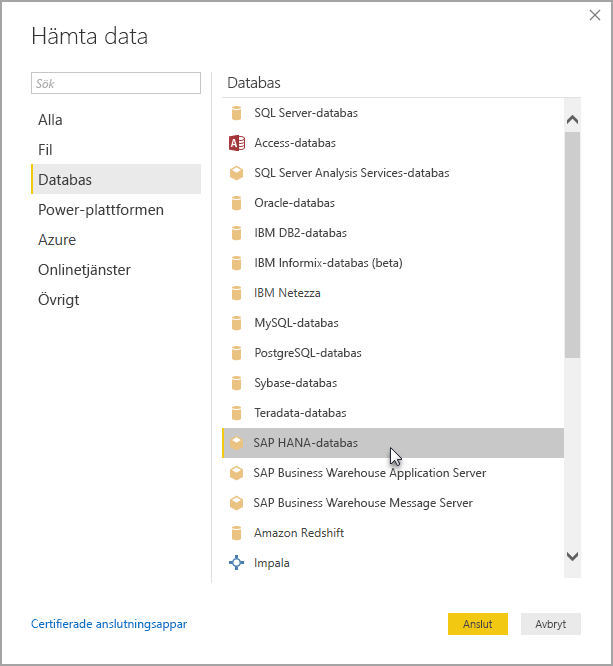

# Använd SAP HANA i Power BI Desktop
Med Power BI Desktop kan du nu komma åt **SAP HANA**-databaser. Om du vill använda **SAP HANA**, måste SAP HANA ODBC-drivrutinen installeras på den lokala klientdatorn för att Power BI Desktop **SAP HANA**-dataanslutningen ska fungera korrekt. Du kan hämta SAP HANA ODBC-drivrutinen från [SAP Software Download Center](https://support.sap.com/swdc). Därifrån söker du efter SAP HANA-klienten för Windows-datorer. Eftersom **SAP Software Download Center** ofta ändrar struktur, finns det inte tydligare riktlinjer för att navigera den webbplatsen.

Om du vill ansluta till en **SAP HANA**-databas, väljer du **Hämta data > Databas > SAP HANA-databas** enligt följande bild:

När du ansluter till en SAP HANA-databas, anger du servernamnet och porten i formatet *server:port*. Följande bild visar ett exempel på en server med namnet *ServerXYZ* och port *30015*.

I den här versionen stöds **SAP HANA** i [DirectQuery](desktop-directquery-sap-hana.md)-läge i Power BI Desktop och Power BI-tjänsten och du kan publicera och ladda upp rapporter som använder sig av **SAP HANA** i DirectQuery-läge till Power BI-tjänsten. Du kan även publicera och ladda upp rapporter till Power BI-tjänsten när du inte använder **SAP HANA** i DirectQuery-läge.

### Funktioner som stöds för SAP HANA
Den här versionen har många funktioner för **SAP HANA**som visas i listan nedan:

* Anslutningsprogrammet för Power BI för **SAP HANA** använder sig av SAP ODBC-drivrutinen för att tillhandahålla den bästa användarupplevelsen
* **SAP HANA** stöder både alternativen DirectQuery och importera
* Powerbi stöder HANA-informationsmodeller (som Analytic- och Calc-vyer) och har optimerad navigering
* Med **SAP HANA** kan du också använda direkt SQL-funktionen för att ansluta till rad- och kolumntabeller
* Inkluderar optimerad navigering för HANA-modeller
* Power BI stöder **SAP HANA**-variabler och indataparametrar

### Installera SAP HANA ODBC-drivrutinen
### Begränsningar för SAP HANA
Det finns några begränsningar med att använda **SAP HANA** som visas nedan:

* NVARCHAR-strängar trunkeras till högst 4 000 Unicode-tecken
* SMALLDECIMAL stöds inte
* VARBINARY stöds inte
* Giltiga datum är mellan 1899-12-30 och 9999-12-31

## Nästa steg
Mer information om DirectQuery finns i följande resurser:

* [DirectQuery och SAP HANA](desktop-directquery-sap-hana.md)
* [DirectQuery i Power BI](desktop-directquery-about.md)
* [Datakällor som stöds av DirectQuery](desktop-directquery-data-sources.md)

