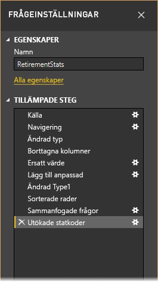
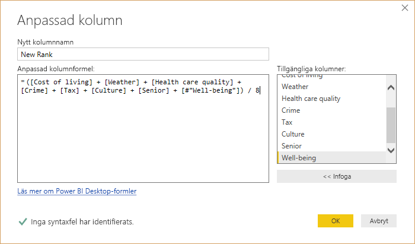
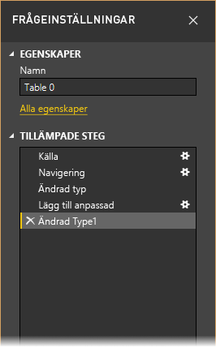
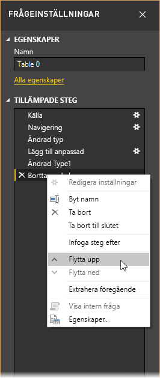
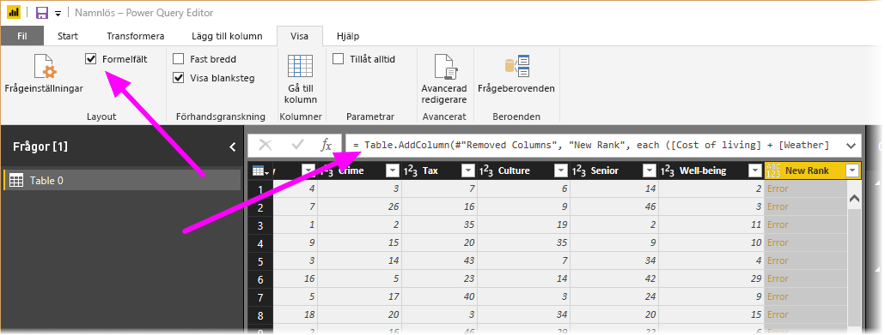
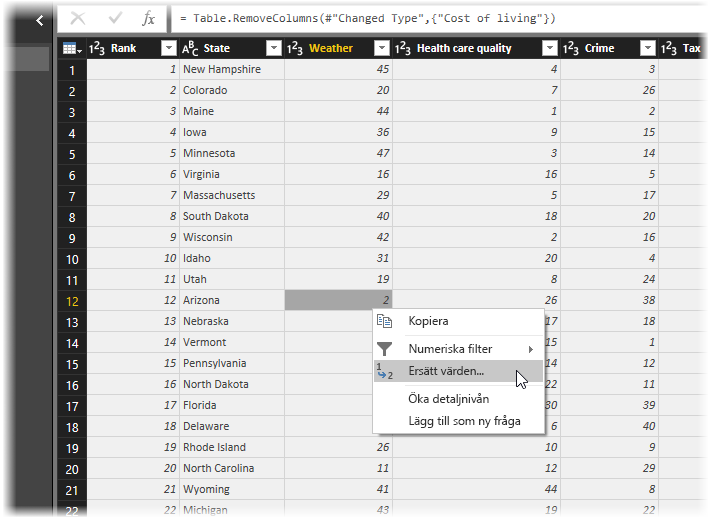
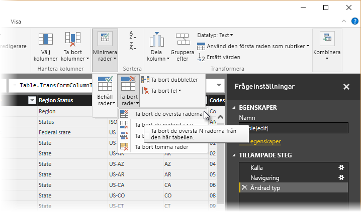
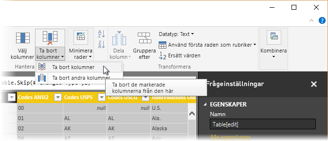
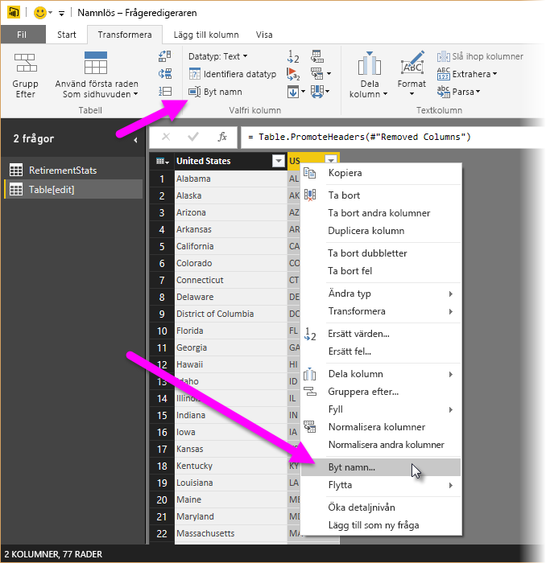
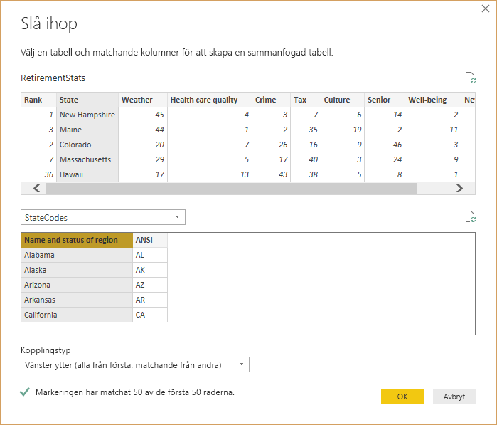

# <a name="tutorial-shape-and-combine-data-in-power-bi-desktop"></a>Självstudie: Forma och kombinera data i Power BI Desktop

Med Power BI Desktop kan du ansluta till flera olika typer av datakällor och sedan forma data så att de uppfyller dina behov, så att du kan skapa visuella rapporter som du kan dela med andra. Att *forma* data innebär att du omvandlar data: du byter namn på kolumner eller tabeller, ändrar text till tal, tar bort rader, anger den första raden som rubrik och så vidare. Att *kombinera* data innebär att du ansluter till två eller flera datakällor, formar dem efter behov och sammanfogar dem i en användbar fråga.

I den här självstudien får du lära dig att:

* Forma data med hjälp av Frågeredigeraren.
* Ansluta till olika datakällor.
* Kombinera dessa datakällor och skapa en datamodell som du kan använda i rapporter.

I den här självstudien går vi igenom hur du utformar en fråga med Power BI Desktop, med fokus på de vanligaste uppgifterna. Frågan som används här beskrivs i detalj, inklusive hur du skapar en fråga från början, i [Komma igång med Power BI Desktop](desktop-getting-started.md).

I Frågeredigeraren i Power BI Desktop används många högerklicksmenyer och menyfliksområdet **Transformera**. Du kommer åt merparten av det du kan välja i menyfliksområdet genom att högerklicka på ett objekt, som en kolumn, och sedan välja från menyn som visas.

## <a name="shape-data"></a>Forma data
När du formar data i Frågeredigeraren ger du stegvisa instruktioner för datajusteringen, som Frågeredigeraren utför när data läses in och presenteras. Den ursprungliga datakällan påverkas inte. Data justeras, eller *formas*, bara i just den här vyn.

De steg du anger (som att byta namn på en tabell, transformera en datatyp eller ta bort en kolumn) registreras av Frågeredigeraren. Varje gång den här frågan ansluter till datakällan utför Frågeredigeraren dessa steg så att data alltid formas på det sätt du anger. Den här processen sker varje gång du Frågeredigeraren och varje gång någon använder dina delade frågor, till exempel i Power BI-tjänsten. De här stegen fångas i ordning i fönstret **Frågeinställningar** under **Tillämpade steg**. Vi går igenom vart och ett av stegen i nästa stycke.



Vi använder pensioneringsdata från [Komma igång med Power BI Desktop](desktop-getting-started.md), som vi hämtade genom att ansluta till en webbdatakälla, och ska forma dem efter våra behov. Vi lägger till en anpassad kolumn för att beräkna rankningen baserat på alla data som har samma faktorer och jämföra detta med den befintliga kolumnen **Rank**.  

1. I menyfliksområdet **Lägg till kolumn** väljer du **Anpassad kolumn**, så att du kan lägga till en anpassad kolumn.

    

1. I fönstret **Anpassad kolumn** går du till **Nytt kolumnnamn** och anger _New Rank_. Ange följande data i **Formel för anpassad kolumn**:

    ```
    ([Cost of living] + [Weather] + [Health care quality] + [Crime] + [Tax] + [Culture] + [Senior] + [#"Well-being"]) / 8
    ```
 
1. Se till att statusmeddelandet visar *Inga syntaxfel har identifierats* och välj **OK**.

    

1. För att kolumndata ska vara konsekventa så omvandlar du de nya kolumnvärdena till heltal. Det gör du genom att högerklicka på kolumnrubriken och välja **Ändra typ \> Heltal**. 

    Om du behöver välja fler än en kolumn ska du först markera en kolumn, hålla ned **Skift**, välja fler intilliggande kolumner och sedan högerklicka på en kolumnrubrik. Använd **CTRL** när du väljer kolumner som inte är intilliggande.

    

1. Om du vill *omvandla* kolumnernas datatyper, och alltså omvandla den aktuella datatypen till en annan, väljer du **Datatyp: Text** i menyfliksområdet **Transformera**. 

   

1. I **Frågeinställningar** ser du de formningssteg som tillämpas på dina data i **Tillämpade steg**. Om du vill ta bort ett steg från formningsprocessen trycker du på **X** till vänster om steget. 

    I den här bilden ser du listan **Tillämpade steg** med de steg som lagts till hittills: 
     - **Källa**: Ansluta till webbplatsen.
     - **Navigering**: Välja tabellen. 
     - **Ändrade typ**: Ändra textbaserade talkolumner från *Text* till *Heltal*. 
     - **Lade till anpassad**: Lägga till en anpassad kolumn.
     - **Ändrade Type1**: Det sista tillämpade steget.

       

## <a name="adjust-data"></a>Justera data

Innan vi kan arbeta med den här frågan måste vi göra några ändringar och justera våra data:

   - Justera rangordningarna genom att ta bort en kolumn.

       Vi har bestämt att **Cost of living** inte är en relevant faktor i resultatet. När du tar bort den här kolumnen ser vi att data förblir oförändrade. 

   - Rätta till några fel.

       Eftersom vi har tagit bort en kolumn måste vi justera våra beräkningar i kolumnen **New Rank**, vi måste bland annat ändra en formel.

   - Sortera data.

       Sortera data baserat på kolumnerna **New Rank** och **Rank**.
 
   - Byt ut data.

       Vi fokuserar på hur du ersätter ett specifikt värde och behovet av att infoga ett **Tillämpat steg**.

   - Ändra tabellnamnet. 

       Eftersom **Table 0** inte är en användbar beskrivning av tabellen ska vi ändra dess namn.

1. Ta bort kolumnen **Cost of living** genom att markera den, välja fliken **Start** från menyfliksområdet och sedan välja **Ta bort kolumner**.

    

   Observera att värdena i **New Rank** inte har ändrats. Det här beror på stegens ordning. Eftersom Frågeredigeraren registrerar stegen i turordning, men oberoende av varandra, kan du flytta varje **tillämpat steg** uppåt eller nedåt i sekvensen. 

1. Högerklicka på ett steg. Det finns en meny i Frågeredigeraren där du kan utföra följande uppgifter: 
   - **Byt namn**: Byt namn på steget.
   - **Ta bort**: Ta bort steget.
   - **Ta bort** **Till slutet**: Ta bort det aktuella steget och alla efterföljande steg.
   - **Flytta upp**: Flytta steget uppåt i listan.
   - **Flytta ned**: Flytta steget nedåt i listan.

1. Flytta upp det sista steget, **Tog bort kolumner**, till precis ovanför steget **Lade till anpassad**.

   

1. Markera steget **Lade till anpassad**. 

   Observera att data nu visar _Fel_. Det här behöver vi åtgärda.

   

   Det finns ett par sätt att få mer information om varje fel. Om du markerar cellen utan att klicka på ordet *Fel* visas information om felet längst ned i Frågeredigeraren.

   

   Om du klickar på ordet *Fel* direkt skapar Frågeredigeraren ett **tillämpat steg** i rutan **Frågeinställningar** med information om felet. 

1. Eftersom vi inte behöver visa information om felen väljer du **Avbryt**.

1. Åtgärda felen genom att markera kolumnen **New Rank** och visa sedan kolumnens dataformel genom att markera kryssrutan **Formelfält** på fliken **Visa**. 

   

1. Ta bort parametern _Cost of living_ och minska nämnaren genom att ändra formeln så här: 
   ```
    Table.AddColumn(#"Removed Columns", "New Rank", each ([Weather] + [Health care quality] + [Crime] + [Tax] + [Culture] + [Senior] + [#"Well-being"]) / 7)
   ```

1. Välj den gröna bockmarkeringen till vänster om formelfältet eller tryck på **Enter**.

  Frågeredigeraren ersätter data med de ändrade värdena och steget **Lade till anpassad** slutförs utan fel.

   > [!NOTE]
   > Du kan också **Ta bort fel** i menyfliksområdet eller på snabbmenyn, och då tar du bort alla rader som innehåller fel. Det vill vi dock inte göra i den här självstudien eftersom vi vill bevara data i tabellen.

1. Sortera data baserat på kolumnen **New Rank**. Välj först det sista tillämpade steget, **Ändrade Type1**, så att du visar den mest aktuella informationen. Välj sedan listrutan bredvid kolumnrubriken **New Rank** och välj sedan **Sortera stigande**.

   

   Data sorteras nu enligt **New Rank**. Men om du tittar i kolumnen **Rank** ser du att data inte sorteras korrekt när värdet är samma som i **New Rank**. Vi rättar till det i nästa steg.

1. Du kan lösa sorteringsproblemet genom att välja kolumnen **New Rank** och ändra formeln i **formelfältet** så här:

   ```
    = Table.Sort(#"Changed Type1",{{"New Rank", Order.Ascending},{"Rank", Order.Ascending}})
   ```

1. Välj den gröna bockmarkeringen till vänster om formelfältet eller tryck på **Enter**. 

   Raderna sorteras nu i enlighet med både **New Rank** och **Rank**. Dessutom kan du välja ett **Tillämpat steg** var som helst i listan och fortsätta forma data från den punkten i sekvensen. Frågeredigeraren infogar automatiskt ett nytt steg direkt efter det markerade **tillämpade steget**. 

1. Välj steget innan den anpassade kolumnen i **Tillämpade steg**, vilket är steget **Tog bort kolumner**. Här byter vi ut rankingvärdet för **Weather** i Arizona. Högerklicka på cellen som innehåller Arizonas rankning i kategorin **Weather** och välj **Ersätt värden**. Observera vilket **tillämpat steg** som är markerat för tillfället.

   

1. Välj **Infoga**.

    Eftersom vi infogar ett steg varnar Frågeredigeraren oss om risken med detta. De efterföljande stegen kan få frågan att sluta fungera. 

    

1. Ändra datavärdet till _51_. 

   Frågeredigeraren ersätter data för Arizona. När du skapar ett nytt **tillämpat steg** namnges det i Frågeredigeraren baserat på åtgärden, i det här fallet **Ersatt värde**. När du har fler än ett steg med samma namn i frågan lägger Frågeredigeraren till en siffra (i ordning) till varje efterföljande **tillämpat steg** så att du kan åtskilja dem.

1. Välj det sista **tillämpade steget**, **Sorterade rader**. 

   Observera att data har ändrats enligt Arizona nya ranking. Ändringen beror på att vi infogade steget **Ersatte värde** på rätt plats, innan steget **Lade till anpassad**.

1. Till sist vill vi ändra namnet på tabellen till en beskrivande text. I fönstret **Frågeinställningar**, under **Egenskaper**, anger du det nya namnet på tabellen och väljer sedan **Enter**. Ge tabellen namnet *RetirementStats*.

   

   När du börjar skapa rapporter är det praktiskt att använda beskrivande namn, särskilt när vi ansluter till flera datakällor. Du ser dem i rutan **Fält** i **Rapportvyn**.

   Nu har vi format våra data tillräckligt. Nu ska vi ansluta till en annan datakälla och kombinera data.

## <a name="combine-data"></a>Kombinera data
Data om olika delstater är intressanta och kommer vara användbara när vi skapar andra analyser och frågor. Men det finns ett problem: de flesta data använder en tvåbokstavsförkortning för delstatskoder, inte det fullständiga namnet på delstaten. Vi behöver kunna associera delstatsnamn med deras förkortningar.

Vi har tur: det finns en annan offentlig datakälla som gör just detta, men den måste formas en hel del innan vi kan ansluta den till vår pensionstabell. Så här formar du data:

1. Gå till menyfliksområdet **Start** i Frågeredigeraren och välj **Ny källa \> Webb**. 

2. Ange adressen till webbplatsen med delstatsförkortningar, *https://en.wikipedia.org/wiki/List_of_U.S._state_abbreviations* , och välj **Anslut**.

   Du ser webbplatsens innehåll i navigatören.

    

1. Välj **Codes and abbreviations**. 

   > [!TIP]
   > Det krävs en hel del formning för att trimma ned tabelldata så att de passar våra behov. Finns det något snabbare eller enklare sätt att utföra stegen nedan? Ja, kan vi skapa en *relation* mellan två tabeller och forma data baserat på relationen. Följande steg är fortfarande bra om du vill bli bättre på att arbeta med tabeller, men med relationer kan du snabbt använda data från flera tabeller.
> 
> 

Så här formar du data:

1. Ta bort den översta raden. Eftersom den är ett resultat av hur webbsidans tabell är skapad så behöver vi den inte. Välj **minska rader \> Ta bort rader \> Ta bort översta rader** från menyfliksområdet **Start**.

    

    Fönstret **Ta bort översta rader**, där du kan ange hur många rader som du vill ta bort.

    > [!NOTE]
    > Om Power BI av misstag importerar tabellrubriker som en rad i datatabellen, kan du välja **Använd första raden som rubriker** från fliken **Start** eller från fliken **Transformera** i menyfliksområdet för att åtgärda tabellen.

1. Ta bort de nedersta 26 raderna. Dessa rader är amerikanska territorier som vi inte behöver ta med. Välj **minska rader \> Ta bort rader \> Ta bort nedersta rader** från menyfliksområdet **Start**.

    

1. Eftersom tabellen RetirementStats inte har någon information för Washington DC måste vi filtrera bort staden från vår lista. Välj listrutan **Region Status** och avmarkera sedan kryssrutan bredvid **Federal district**.

    

1. Ta bort några kolumner som inte behövs. Eftersom vi bara behöver mappningen av delstaten till dess officiella tvåbokstavsförkortning så vi kan ta bort följande kolumner: **Column1**, **Column3**, **Column4** och **Column6** till **Column11**. Markera först **Column1**, håll ned tangenten **Ctrl** och markera kolumnerna som ska tas bort. Gå till fliken **Start** i menyfliksområdet och välj **Ta bort kolumner \> Ta bort kolumner**.

   

   > [!NOTE]
   > Detta är ett bra tillfälle att påpeka att *sekvensen* med tillämpade steg i frågeredigeraren är viktig och kan påverka hur data formas. Det är också viktigt att tänka på hur ett steg kan påverka andra efterföljande steg. Om du tar bort ett steg Tillämpade steg kanske efterföljande steg inte fungerar som avsett på grund av effekten på frågornas ordningsföljd.

   > [!NOTE]
   > När du ändrar storlek på Query Editor-fönstret för att göra bredden mindre förminskas vissa objekt i menyfliksområdet för att maximera användningen av synligt utrymme. Om du ökar bredden på Query Editor-fönstret utökas objektet i menyfliksområdet för att använda utrymmet i menyfliksområdet optimalt.

1. Byt namn på kolumnerna och tabellen. Det finns några olika sätt att byta namn på en kolumn: Markera först kolumnen och välj antingen **Byt namn** från fliken **Transformera** i menyfliksområdet, eller högerklicka och välj **Byt namn**. Följande bild har pilar som pekar på båda alternativen. Du behöver bara välja en.

   

1. Byt namn på kolumnerna till *State Name* och *State Code*. Byt namn på tabellen genom att ange **namnet** i rutan **Frågeinställningar**. Ge tabellen namnet *StateCodes*.

## <a name="combine-queries"></a>Kombinera frågor

Nu när vi har format tabellen StateCodes som vi vill ska vi kombinera de två tabellerna, eller frågorna, till en enda. Eftersom tabellerna vi nu har är ett resultat av frågorna vi körde mot data så kallas de ofta för *frågor*.

Det finns två huvudsakliga sätt att kombinera frågor: *sammanfoga* och *bifoga*.

- När du har en eller flera kolumner som du vill lägga till i en annan fråga kan du *sammanfoga* frågorna. 
- När du har ytterligare rader med data som du vill lägga till en befintlig fråga kan du *bifoga* frågan.

I det här fallet vill vi sammanfoga frågorna. Gör så här:
 
1. Gå till den vänstra rutan i Frågeredigeraren och välj frågan *dit* du vill sammanfoga den andra frågan. I det här fallet är det **RetirementStats**. 

1. Välj **Kombinera \> Slå ihop frågor** från fliken **Start** i menyfliksområdet.

   

   Du kan uppmanas att ange sekretessnivåer för att säkerställa att data kombineras utan att du tar med eller överför data som du inte vill överföra.

   Fönstret **Sammanfoga** öppnas. Här får du välja vilken tabell du vill slå ihop med den valda tabellen, och vilka matchande kolumner som ska användas för sammanfogningen. 

1. Välj **State** från tabellen RetirementStats och sedan frågan **StateCodes**. 

   När du väljer rätt matchande kolumner är knappen **OK** aktiverad.

   

1. Välj **OK**.

   Frågeredigeraren skapar kolumnen **NewColumn** i slutet av frågan, med innehållet i tabellen (frågan) som slogs ihop med den befintliga frågan. Alla kolumner i den sammanfogade frågan komprimeras i kolumnen **NewColumn**, men du kan **expandera** tabellen och inkludera vilka kolumner du vill.

   

1. Om du vill expandera den sammanfogade tabellen och välja vilka kolumner som ska ingå väljer du expanderingsikonen (). 

   Fönstret **Expandera** visas.

   

1. I det här fallet vill vi bara ha kolumnen **State Code**. Markera den kolumnen, avmarkera **Använd det ursprungliga kolumnnamnet som prefix** och välj sedan **OK**.

   Om vi hade låtit kryssrutan för **Använd det ursprungliga kolumnnamnet som prefix** vara markerad skulle den sammanfogade kolumnen få namnet **NewColumn.State Code**.

   > [!NOTE]
   > Vill du utforska hur du tar med tabellen NewColumn? Du kan prova dig fram och om du inte gillar resultatet är det bara att ta bort steget från listan **Tillämpade steg** i fönstret **Frågeinställningar**. Din fråga återgår till tillståndet innan du tillämpade steget **Expandera**. Du kan göra det här hur många gånger som helst tills du är nöjd med expanderingsprocessen.

   Nu har vi en enda fråga (tabellen) där de två datakällor kombineras, och var och en är formad efter våra behov. Den här frågan kan användas som bas för många intressanta dataanslutningar, till exempel statistik över bostadskostnader, demografi eller lediga jobb i olika delstater.

1. Om du vill tillämpa ändringarna och stänga Frågeredigeraren väljer du **Stäng och tillämpa** i menyfliksområdet **Start**. 

   Den omvandlade datauppsättningen visas i Power BI Desktop och är redo för användning när du skapar rapporter.

   

## <a name="next-steps"></a>Nästa steg
Mer information om Power BI Desktop och funktionerna i programmet finns i följande resurser:

* [Vad är Power BI Desktop?](desktop-what-is-desktop.md)
* [Frågeöversikt i Power BI Desktop](desktop-query-overview.md)
* [Datakällor i Power BI Desktop](desktop-data-sources.md)
* [Ansluta till data i Power BI Desktop](desktop-connect-to-data.md)
* [Vanliga frågeuppgifter i Power BI Desktop](desktop-common-query-tasks.md)   

