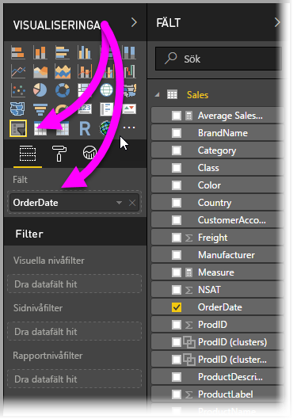
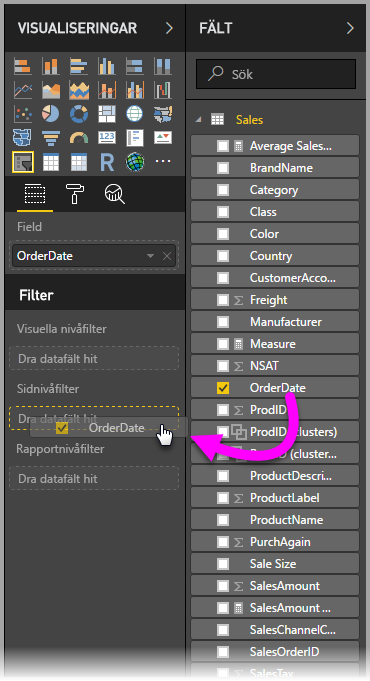

# Använda ett relativt datumutsnitt och filter i Power BI Desktop
Med ett **relativt datumutsnitt** eller **relativt datumfilter** kan du använda tidsbaserade filter på kolumner i datamodellen. Du kan till exempel använda ett **relativt datumutsnitt** för att endast visa försäljningsdata inom de senaste 30 dagarna (eller månad, år och så vidare). När du uppdaterar data tillämpas den relativa tidsperioden automatiskt.

## Använda relativt datumutsnitt
Du kan använda utsnittet relativt datum precis som andra utsnitt. Skapa ett **utsnitt** för rapporten och välj sedan ett datum som värde för värdet **Fält**. I följande bild har *BeställningsDatum* markerats.

Välj cirkumflex i det övre högra hörnet på **utsnittet relativt datum** för att visa en meny.

Välj *Relativt* för det relativa datumutsnittet.

Sedan kan du välja inställningarna. För den första listrutan i det *relativa datumutsnittet* kan du välja mellan följande alternativ:

* Sista
* Nästa
* Detta

Dessa val visas i följande bild.

Med inställningen nästa (i mitten) i det *relativt datumutsnittet* kan du ange ett värde för att definiera det relativa datumintervallet.

Med den tredje inställningen kan du välja datummåttet och välja mellan följande alternativ:

* Dagar
* Veckor
* Veckor (kalender)
* Månader
* Månader (kalender)
* År
* År (kalender)

Dessa val visas i följande bild.

Välj till exempel *månader* från listan och anger 2 i den mellersta inställningen. Följande händer: om dagens datum är 20 juli visas data i det visuella objektet för de föregående två månaderna, från och med 20 maj till och med 20 juli (dagens datum).

Som jämförelse visas data från 1 maj till och med 30 juni (de sista två fullständiga kalendermånaderna) om du väljer *Månader (kalender)*.

## Använda relativt datumfilter
Du kan också skapa ett filter för relativt datumintervall för rapportsidan eller hela rapporten. Om du vill göra detta, drar du ett datumfält till områdena **Sidonivåfiltrer** eller **Rapportnivåfilter** områden i fönstret **Fält** enligt följande bild.

Därefter kan du ändra det relativa datumintervallet på samma sätt som du anpassar ett **relativt datumutsnitt**. Välj **Relativt datumfilter** från listrutan **Filtertyp**.

När du har valt **Relativt datumfilter** visas tre områden för att redigera det, inklusive en numerisk ruta i mitten, precis som för utsnitt.

Så enkelt är det att använda relativa datumbegränsningar i dina rapporter.

## Begränsningar och överväganden
Följande begränsningar och överväganden kan användas för utsnitt och filter **relativt datumintervall**.

* Datamodeller i **Power BI** inkluderar inte tidszonsinformation. Modeller kan lagra tidpunkter, men det finns inget som indikerar vilken tidszonen de befinner sig i.
* Utsnitt och filter baseras alltid på tiden i UTC, så om du konfigurerar ett filter i en rapport och skickar det till en kollega i en annan tidszon visar båda samma data. Men om du inte befinner dig i tidszonen UTC kan du se data för andra tider än du har förväntat dig.
* Data som hämtats i en lokal tidszon kan konverteras till UTC med hjälp av **frågeredigeraren**.

