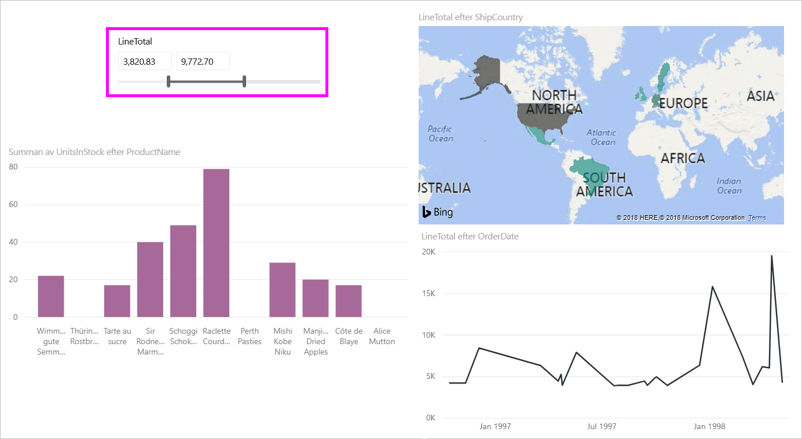
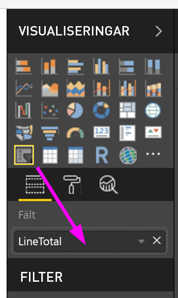
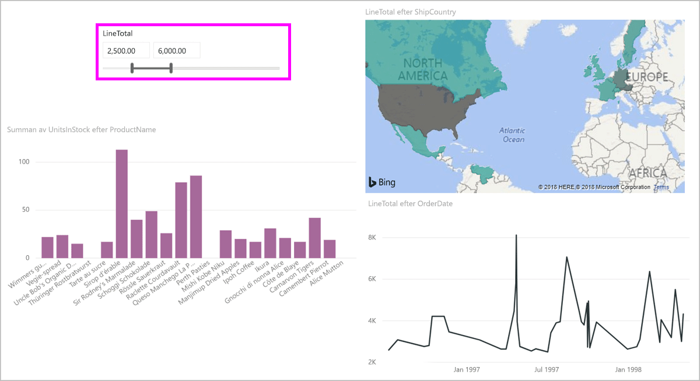
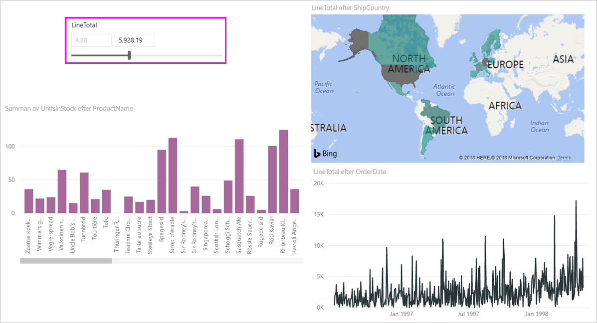
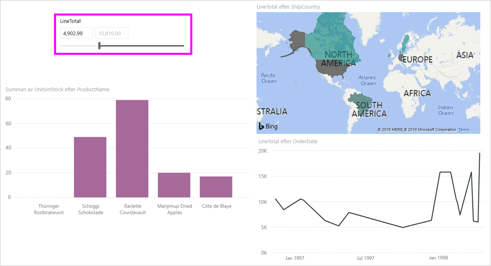

# Använd numeriska intervallutsnitt i Power BI Desktop
Med **numeriska intervallutsnitt** kan du använda alla typer av filter på en numerisk kolumn i datamodellen. Du kan välja att filtrera **mellan** siffror som är **mindre än eller lika** med ett tal eller **större än eller lika** med ett tal. Detta kan låta enkelt men det är ett kraftfullt sätt att filtrera dina data.

## Använda numeriskt intervallutsnitt
Du kan använda det numeriska intervallutsnittet precis som andra utsnitt. Skapa ett **utsnitt** för rapporten och välj sedan ett numeriskt värde för värdet **Fält**. I följande bild har fältet *LineTotal* markerats.

Välj nedåtpilslänken i det övre högra hörnet på det **numeriska intervallutsnittet** för att visa en meny.

För det numeriska intervallet kan du välja följande tre alternativ:

* Mellan
* Mindre än eller lika med
* Större än eller lika med

När du väljer **Mellan** på menyn visas ett skjutreglage för att filtrera numeriska värden som faller mellan dessa siffror. Förutom att använda skjutreglaget kan du klicka på någon ruta och skriva in värdena. Det här är praktiskt när du vill använda specifika tal men skjutreglagets kornighet gör det svårt att identifiera ett exakt värde.

I följande bild filtreras rapportsidan för *LineTotal* i intervallet 2 500,00 till 6 000,00.

När vi väljer **mindre än eller lika med** försvinner den vänstra (lägre värde) referensen för skjutreglaget och vi kan bara justera den övre gränsen för skjutreglaget. I följande bild ställer vi in max för skjutreglaget på 5928,19.

Till sist väljer vi **Större än eller lika med** så att den högra (större) referensen försvinner och vi kan justera det lägre värdet som på följande bild. Nu visas enbart objekt med ett *LineTotal* som är större än eller lika med 4902,99 i den visuella informationen på sidan.

## Fäst till heltal med utsnitt med numeriska intervall

Ett utsnitt för ett numeriskt intervall kopplas till heltal om datatypen för det underliggande fältet är **Heltal**. Detta gör att ditt utsnitt korrekt justeras som heltal. I fälten för **decimaltal** kan du ange eller välja decimaler för ett tal. Formateringen som används i textrutan matchar formateringen som definierats för fältet, men du kan ange eller välja mer exakta siffror.

## Begränsningar och överväganden
Följande begränsningar och överväganden kan användas för utsnittet **numeriskt intervall**:

* Utsnittet **numeriska intervall** filtrerar för närvarande varje underliggande rad i data, inte vilket aggregerat värde som helst. Till exempel, om fältet *Beloppet* används, filtreras varje transaktion som bygger på *Säljbelopp*, och inte summan av *Säljbelopp* för varje datapunkt i det visuella objektet.
* Det fungerar för närvarande inte med mått.
* Du kan ange ett tal i textrutorna i ett numeriskt utsnitt, även om det ligger utanför den underliggande kolumnens värdeintervall. På så sätt kan du ställa in filter om du vet att dina data kan komma att ändras i framtiden.
