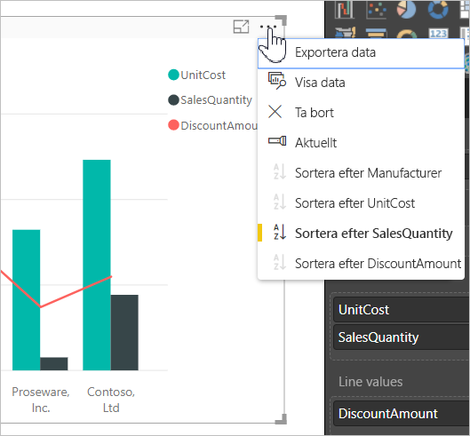
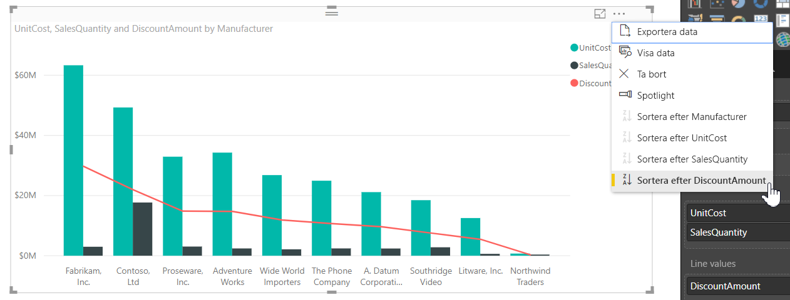
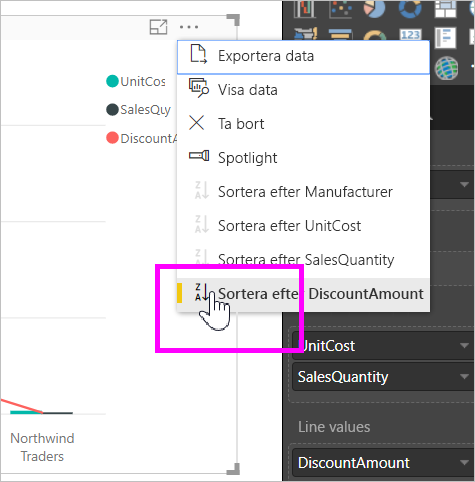
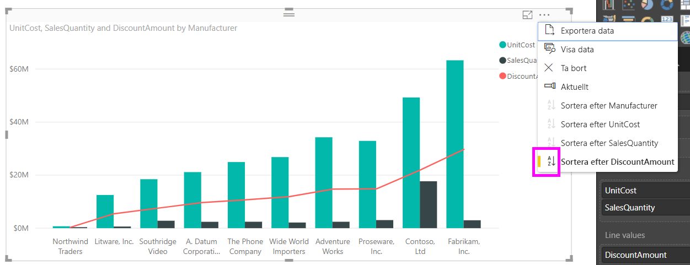
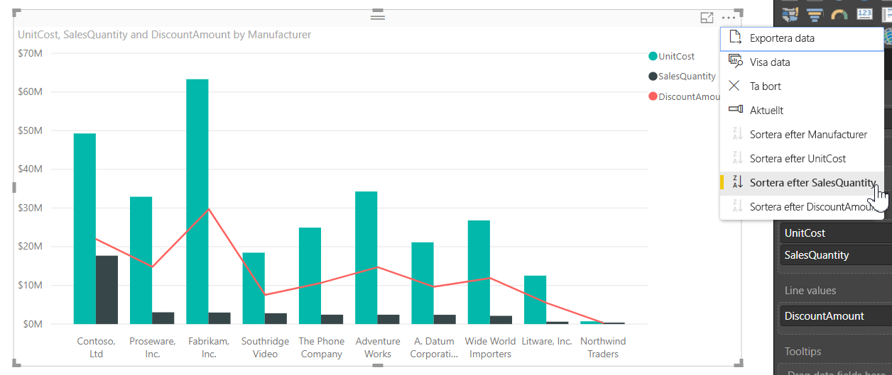
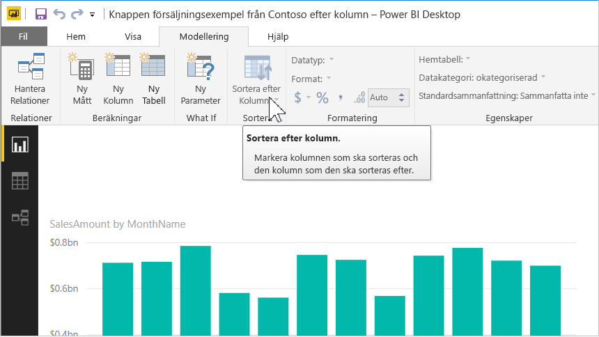
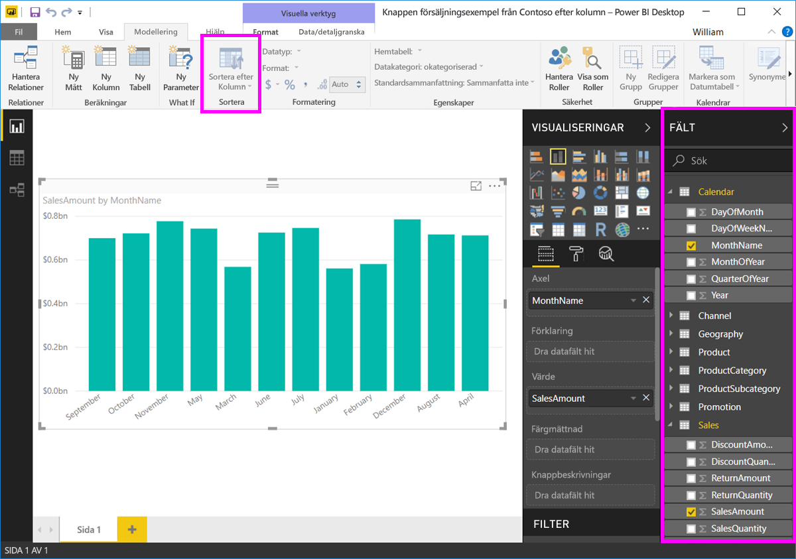
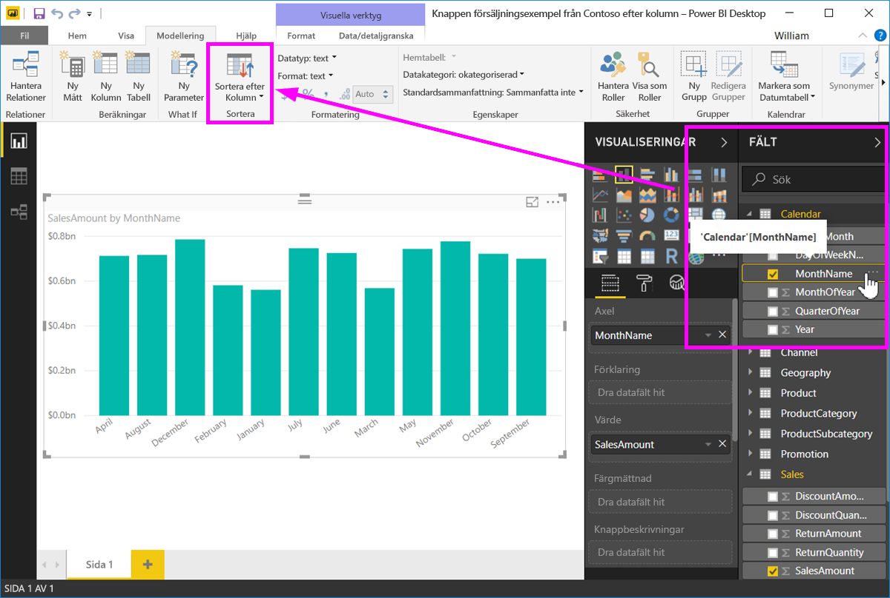
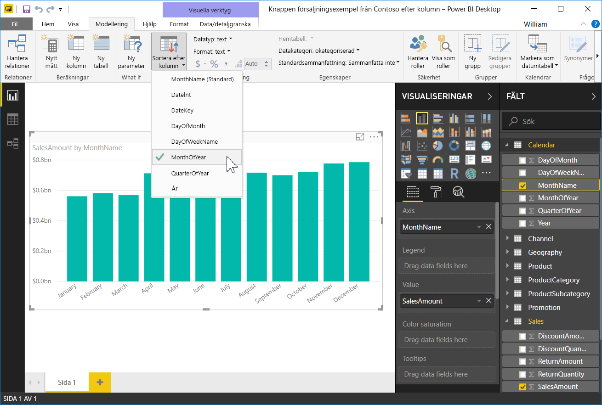
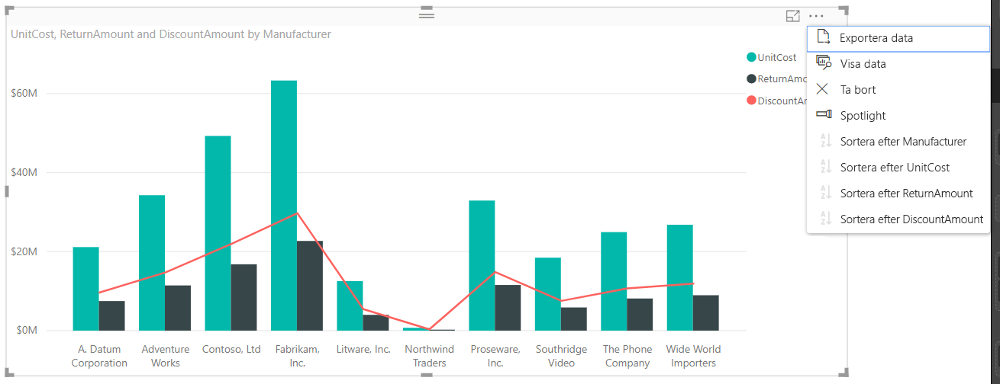

# Sortera efter kolumn i Power BI Desktop
I **Power BI Desktop** och **Power BI-tjänsten** kan du ändra utseendet på ett visuellt objekt genom att sortera det enligt olika datafält. Genom att ändra sorteringen för ett visuellt objekt kan du framhäva den information som du vill förmedla och se till att det visuella objektet speglar trenden på rätt sätt.

Om du använder numeriska data (till exempel försäljningssiffror) eller textdata (till exempel namn på delstater) kan du sortera dina visuella objekt och utforma dem som det passar dig.  **Power BI** ger stor flexibilitet för sortering och snabb menyer som du kan använda. Välj ellipsmenyn (...) på ett visuellt objekt och välj sedan det fält som du vill sortera efter, som du ser i bilden nedan.

## Mer djup och ett exempel
Låt oss ta ett exempel som är djupare och se hur det fungerar i **Power BI Desktop**.

Följande visualisering visar kostnader, antal och belopp efter tillverkare. Så här ser det visuella objektet ut innan vi sorterar ytterligare.

Det visuella objektet sorteras för närvarande efter **SalesQuantity**. Det kan vi se genom att matcha färgen på de stigande staplarna med förklaringen. Men det finns ett enklare sätt att ta reda på den aktuella sorteringskolumnen: ellipsmenyn (...) i det visuella objektets övre högra hörn. Vi ser följande när vi väljer ellipserna:

* Vi vet att det aktuella sorteringsfältet är **SalesQuantity** eftersom **Sortera efter SalesQuantity** visas i fetstil med en gul markering. 

* Den aktuella sorteringsordningen är ”minsta till största”, vilket anges av den lilla ikonen **A/Ö** (A ovanför Ö) och en nedpil.

Vi ska titta på sorteringsfältet och riktningen var för sig i följande två avsnitt.

## Så här väljer du vilken kolumn som ska användas för sortering
Du såg den gula markeringen intill **Sortera efter SalesQuantity** på menyn **Fler alternativ**, som anger att det visuella objektet sorteras baserat på kolumnen **SalesQuantity**. Det är lätt att sortera efter en annan kolumn – klicka bara på ellipserna för att visa ellipsmenyn och välj en annan kolumn.

I följande bild valde vi *DiscountAmount* som den kolumn som vi vill sortera efter. Den här kolumnen råkar vara en av linjerna i det visuella objektet snarare än en stapel. Så här ser det ut när vi har valt **Sortera efter DiscountAmount**.

Observera hur den visuella informationen har ändrats. Nu sorteras värdena från det högsta DiscountAmount-värdet, i detta fall Fabrikam Inc., och nedåt till Northwind Traders, som har det lägsta värdet. 

Men vad händer om vi vill sortera stigande i stället för fallande? I nästa avsnitt visar vi hur enkelt det är.

## Att välja sorteringsordning – minsta till största, största till minsta
När vi tittar närmare på **Alternativ**-menyn från den föregående bilden ser vi att ikonen bredvid **Sortera efter DiscountAmount** visar **Ö/A** (Ö ovanför A). Låt oss ta en titt:

När **Z/A** är visas, betyder det visuella objektet sorteras efter den markerade kolumnen från det största till det minsta värdet. Vill du ändra det? Inga problem – bara tryck eller klicka på **Z/A**-ikonen så ändras sorteringsordningen till **A/Z** och sorterar det visuella objektet (baserat på den markerade kolumnen) från det minsta till största värdet.

Här är samma visuella objekt när vi ändrat sorteringsordningen genom att trycka på ikonen **Ö/A** på menyobjektet **Sortera efter DiscountAmount**. Observera att nu är Northwind Traders den tillverkare som visas först, och Fabrikam, Inc. visas sist, dvs. motsatt sorteringsordning mot förut.

Du kan sortera efter valfri kolumn som ingår i det visuella objektet. Vi kan till exempel enkelt välja SalesQuantity som sorteringskolumn, med **Sortera efter SalesQuantity**, om vi vill visa tillverkare med störst försäljning först, och bevara övriga kolumner i det visuella objektet baserat på deras relation till tillverkaren i fråga. Så här ser det visuella objektet ut med dessa inställningar.

## Sortera med knappen Sortera efter kolumn
Det finns ett annat sätt att sortera data och det är med hjälp av knappen **Sortera efter kolumn** i menyfliksområdet **Modellering**.

Den här sorteringsmetoden kräver att du väljer en kolumn från fönstret **Fält** och sedan väljer knappen **Sortera efter kolumn** för att välja hur (genom vilken kolumn) som du vill sortera ditt visuella objekt. Du måste markera kolumnen (fältet) som du vill sortera från rutan **Fält** för att aktivera knappen **Sortera efter kolumn** – annars är knappen inaktiv.

Nu ska vi titta på ett vanligt exempel: du har data från varje månad på året och vill sortera dem i kronologisk ordning. Följande steg visar hur du gör.

1. Observera att knappen är inaktiv (grå) när det visuella objektet har valts men ingen kolumn har markerats i rutan **Fält** i **Sortera efter kolumn**.
   
   

2. När vi väljer den kolumn som vi vill sortera i rutan **fält** i **Sortera efter kolumn** blir knappen aktiv.
   
   
3. Nu när det visuella objektet är markerat kan vi välja *MonthOfYear*, i stället för standardinställningen (*MonthName*), så sorteras det visuella objektet i den ordning vi valt: efter månaden på året.
   
   

Och sedan är du klar. Kom ihåg att du måste markera en kolumn i rutan **Fält** för knappen **Sortera efter kolumn** ska aktiveras.

## Gå tillbaka till standardkolumnen för sortering
Du kan sortera efter valfri kolumn men det kan finnas tillfällen när du vill att det visuella objektet ska återgå till dess standardsorteringskolumn. Inga problem. För ett visuellt objekt som har en vald sorteringskolumn (som vi såg tidigare vet vi att en vald sorteringskolumn visas med en gul markering på ellipsmenyn) öppnar du bara menyn **Sortera efter** och väljer kolumnen igen, så återställs standardsorteringskolumnen för visualiseringen.

Till exempel, här diagrammet vi visade tidigare:

När vi går tillbaka till menyn och väljer **SalesQuantity** igen, sorteras det visuella objektet i alfabetisk ordning efter **Tillverkare**, som du ser i följande bild.

Med så här många alternativ för att sortera dina visuella objekt är det lätt att bara skapa diagrammet eller bilden.

