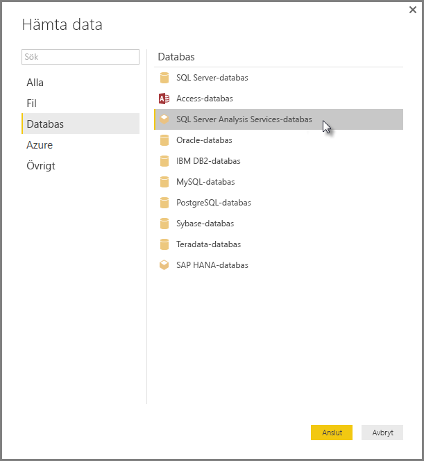

# Ansluta till SSAS flerdimensionella modeller i Power BI Desktop

Med Power BI Desktop kan du komma åt *SSAS flerdimensionella modeller*, vilket vanligtvis kallas *SSAS MD*.

Om du vill ansluta till en SSAS MD-databas väljer du **Hämta data**, **Databas** > **SQL Server Analysis Services-databas** och sedan **Anslut**:

Både Power BI-tjänsten och Power BI Desktop stöder SSAS flerdimensionella modeller i Live-anslutningsläge. Du kan publicera och ladda upp rapporter som använder **SSAS flerdimensionella modeller** i Live-läge till Power BI-tjänsten.

## Funktioner i SSAS MD

I följande avsnitt beskrivs funktionerna i Power BI och SSAS MD-anslutningar.

### Tabellmetadata för flerdimensionella modeller

Följande tabell visar förhållandet mellan flerdimensionella objekt och tabellmetadata som returneras till Power BI Desktop. Power BI frågar modellen om tabellmetadata. Baserat på de metadata som returneras kör Power BI Desktop lämpliga DAX-frågor mot SSAS när du skapar en visualisering (till exempel en tabell, en matris, ett diagram eller ett utsnitt).

| BISM-flerdimentionellt objekt | Tabellmetadata |
| --- | --- |
| Kub |Modell |
| Kubdimension |Tabell |
| Dimensionsattribut (nycklar), namn |Kolumner |
| Måttgrupp |Tabell |
| Mått |Mått |
| Åtgärder utan kopplad måttgrupp |I tabell som kallas *Mått* |
| Måttgrupp -> Relation till kubdimension |Relation |
| Perspektiv |Perspektiv |
| KPI |KPI |
| Hierarkier, användare/överordnad-underordnad |Hierarkier |

### Mått, måttgrupper och KPI:er

Måttgrupper i en flerdimensionell kub visas som tabeller med ett sigma (∑) bredvid dem i fönstret **Fält**. Beräknade mått som inte har en associerad måttgrupp är grupperade under en särskild tabell med namnet *Mått* i tabellmetadatan.

Du kan förenkla komplexa modeller i en flerdimensionell modell genom att definiera en uppsättning åtgärder eller KPI:er i en kub som ska finnas i en *visningsmapp*. Power BI identifierar visningsmappar i tabellmetadata och visar mått och KPI: er i visningsmapparna. KPI:er i flerdimensionella databaser stöder *Värde*, *Mål*, *Statusgrafik* och *Trendgrafik*.

### Typ av dimensionsattribut

Flerdimensionella modeller stöder också associerade dimensionsattribut med specifika typer av dimensionsattribut. Till exempel en **Geografi**-dimension där dimensionsattributen *Stad*, *Region*, *Land* och *Postnummer* har lämpliga geografityper som är associerade med dem som exponeras i tabellmetadata. Till exempel känner Power BI igen metadata och låter dig skapa visuella kartobjekt. Du kan identifiera dessa associationer med hjälp av *kartikonen* bredvid elementet i fönstret **Fält** i Power BI.

Power BI kan också återge bilder när du anger ett fält som innehåller URL:er (Uniform Resource Locators) för avbildningar. Du kan ange dessa fält som *ImageURL*-typer i SQL Server Data Tools (eller i Power BI). Dess typinformation tillhandahålls sedan till Power BI i tabellmetadata. Power BI kan sedan hämta dessa bilder från URL:en och visa dem i visuella objekt.

### Hierarkier, överordnad-underordnad

Flerdimensionella modeller stöder överordnade-underordnade hierarkier som presenteras som en *hierarki* i tabellmetadata. Varje nivå i överordnad-underordnad-hierarkin visas som en dold kolumn i tabellmetadata. Nyckelattributet för den överordnade-underordnade dimensionen exponeras inte i tabellmetadata.

### Dimensionsberäknade medlemmar

Flerdimensionella modeller stöder olika typer av *beräknade medlemmar*. De två vanligaste typerna av beräknade medlemmar är:

* Beräknade medlemmar på attributhierarkier och som inte på samma nivå som *Alla*
* Beräknade medlemmar på användarhierarkier

Flerdimensionella modeller exponerar *beräknade medlemmar på attributhierarkier* som värden för en kolumn. Du får några fler alternativ och begränsningar om du exponerar den här typen av beräknad medlem:

* Ett dimensionsattribut kan ha en valfri *UnknownMember*.

* Ett attribut som innehåller beräknade medlemmar får inte vara nyckelattributet för dimensionen, såvida det inte är det enda attributet för dimensionen.

* Ett attribut som innehåller beräknade medlemmar får inte vara ett överordnat-underordnat attribut.

Beräknade medlemmar i användarhierarkier visas inte i Power BI. I stället kan du ansluta till en kub som innehåller beräknade medlemmar på användarhierarkier. Du kan dock inte se beräknade medlemmar om de inte uppfyller kraven i punktlistan ovan.

### Säkerhet

Flerdimensionella modeller stöder säkerhet på dimensions- och cellnivå med hjälp av *roller*. När du ansluter till en kub med Power BI autentiseras och utvärderas du för lämpliga behörigheter. Om en användare har tillämpat *dimensionsäkerhet* kan användaren inte se respektive dimensionsmedlemmar i Power BI. Men om en användare har definierat behörighet för *cellsäkerhet*, där vissa celler är begränsade, kan användaren inte ansluta till kuben med Power BI.

## Överväganden och begränsningar

Det finns vissa begränsningar med att använda SSAS MD:

* Endast Enterprise- och BI-utgåvor av SQL Server 2014 stöder Live-anslutningar. För standardversionen av SQL Server krävs SQL Server 2016 eller senare för Live-anslutningar.

* *Åtgärder* och *namngivna uppsättningar* exponeras inte för Power BI. Om du vill skapa visuella objekt och rapporter kan du fortfarande ansluta till kuber som också innehåller åtgärder eller namngivna uppsättningar.

* När Power BI visar metadata för en SSAS-modell kan du ibland inte hämta data från modellen. Detta kan inträffa om du har installerat 32-bitarsversionen av MSOLAP-providern, men inte 64-bitarsversionen. Du kan ofta åtgärda problemet genom att installera 64-bitarsversionen.

* Du kan inte skapa mått på *rapportnivå* när du skapar en rapport som är live-ansluten till en flerdimensionell SSAS-modell. De enda mått som är tillgängliga är de mått som definierats i MD-modellen.

## Funktioner som stöds av SSAS MD i Power BI Desktop

Förbrukning av följande element stöds i den här versionen av SSAS MD. Mer information om dessa funktioner finns i [Förstå Power View för flerdimensionella modeller](/sql/analysis-services/multidimensional-models/understanding-power-view-for-multidimensional-models?view=sql-server-2014).

* Standardmedlemmar
* Dimensionsattribut
* Typer av dimensionsattribut
* Dimensionsberäknade medlemmar, som:
  * måste vara en enskild reell medlem när dimensionen har fler än ett attribut,
  * inte kan vara nyckelattributet för dimensionen, såvida det inte är det enda attributet, och
  * inte kan vara ett överordnat-underordnat attribut.
* Dimensionssäkerhet
* Visningsmappar
* Hierarkier
* ImageUrls
* KPI:er
* KPI-trender
* Mått (med eller utan måttgrupper)
* Mått som variant

## Felsökning

I följande lista beskrivs alla kända problem vid anslutning till SQL Server Analysis Services (SSAS).

* **Fel: Det gick inte att läsa in modellschemat** – det här felet inträffar vanligtvis när användaren som ansluter till Analysis Services inte har åtkomst till databasen eller kuben.
