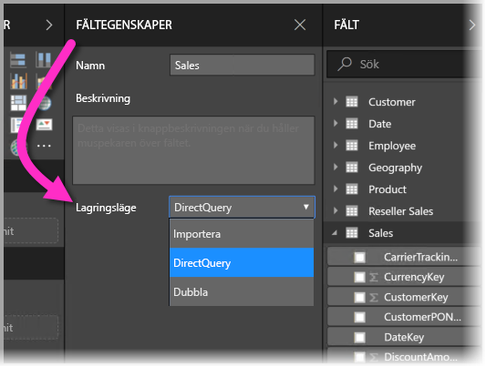
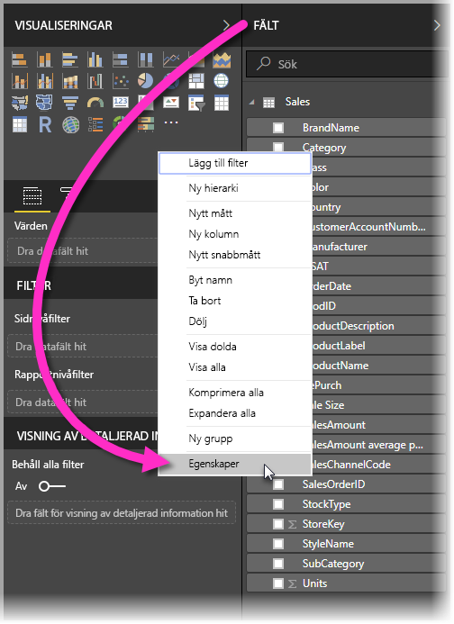
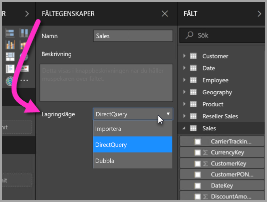
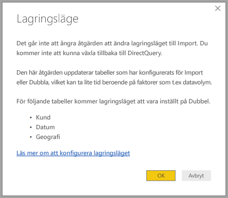

# Lagringsläge i Power BI Desktop (förhandsversion)

I Microsoft Power BI Desktop kan du ange *lagringsläge* för tabeller. *Lagringsläge* låter dig kontrollera om Power BI Desktop cachelagrar tabellen i minnet för rapporter. 

Att konfigurera lagringsläget ger många fördelar. Du kan ange lagringsläget för varje tabell individuellt i din modell. Den här åtgärden aktiverar en enda datauppsättning, vilket ger följande fördelar:

* **Frågeprestanda**: Då användare interagerar med Power BI-rapporter skickas DAX-frågor (Data Analysis Expressions) till datauppsättningen. Om du cachelagrar data i minnet genom att konfigurera lagringsläget kan du öka dina rapporters frågeprestanda och interaktivitet.

* **Stora datamängder**: Tabeller som inte cachelagras inte förbrukar inte minne för cachelagring. Du kan aktivera interaktiv analys för stora datauppsättningar som är för stora eller dyra att cachelagra helt och hållet. Du kan ange vilka tabeller som är värda att cachelagra och vilka som inte är det.

* **Optimering av datauppdatering**: Tabeller som inte cachelagras behöver inte uppdateras. Du kan minska uppdateringstiderna genom att cachelagra endast nödvändiga data så som passar ditt serviceavtal och dina affärsbehov.

* **Tidskrav nära realtid**: Tabeller med krav på nära realtid kan dra fördel av att inte cachelagras, så att datafördröjningen minskas.

* **Tillbakaskrivning**: Med tillbakaskrivning kan affärsanvändare utforska olika tänkbara scenarion genom att ändra cellvärden. Anpassade program kan tillämpa ändringar i datakällan. Tabeller som inte cachelagras kan visar ändringar omedelbart, vilket innebär att effekterna kan analyseras direkt.

Inställningen för lagringsläget i Power BI Desktop är en av tre relaterade funktioner:

* **Sammansatta modeller**: Låter en rapport ha två eller flera dataanslutningar, inklusive DirectQuery-anslutningar eller importera, i valfri kombination. Du hittar mer information i [Använd sammansatta modeller i Power BI Desktop (förhandsversion)](desktop-composite-models.md).

* **Många-till-många-relationer**: Med *sammansatta modeller*, kan du etablera *många-till-många-relationer* mellan tabeller. *Många-till-många-relationer* tar bort krav för unika värden i tabeller. Det tar också bort tidigare lösningar, till exempel introduktion till nya tabeller endast för att skapa relationer. Mer information finns i [Många-till-många-relationer i Power BI Desktop (förhandsversion)](desktop-many-to-many-relationships.md).

* **Lagringsläge**: Nu kan du ange vilka visuella objekt som kräver en fråga till serverdelens datakällor. Visuella objekt som inte kräver en fråga importeras även om de är baserade på DirectQuery. Den här funktionen hjälper till att förbättra prestanda och minskar belastningen på serversidan. Tidigare initierade även enkla visuella objekt som utsnitt frågor som skickades till serverdelskällor. Lagringsläget beskrivs ytterligare i den här artikeln.

## Använd egenskapen för lagringsläge

Lagringsläge är en egenskap som du kan ange i varje tabell i din modell. Ange lagringsläget i fönstret **fält**, högerklicka på den tabell vars egenskaper du vill ställa in och välj sedan **egenskaper**.

Den aktuella egenskapen visas i listrutan **lagringsläge** i tabellens fönster **Fältegenskaper**. Du kan visa aktuellt lagringsläge eller ändra det där.

Det finns tre värden för lagringsläge:

* **Import**: När värdet är inställt till **Import** cachelagras importerade tabeller. Frågor som skickats till Power BI-datauppsättningen som returnerar data från importtabeller kan bara slutföras från cachelagrade data.

* **DirectQuery**: Med den här inställningen cachelagras inte DirectQuery-tabeller. Frågor som du skickar till Power BI-datauppsättningen, t.ex. DAX-frågor, och som returnerar data från DirectQuery-tabeller kan bara uppfyllas om frågor på begäran körs mot datakällan. Frågor som du skickar till datakällan använder datakällans frågespråk (t.ex. SQL).

* **Dubbla**: Dubbla tabeller kan fungera som cachelagrade eller inte cachelagrade, beroende på kontexten för den fråga som skickas till Power BI-datauppsättningen. I vissa fall kan du uppfylla frågor från cachelagrade data. I andra fall måste du uppfylla frågor genom att köra en fråga på begäran till datakällan.

Att ändra en tabell till **Import** är en åtgärd som *inte går att ångra*. Den här egenskapen kan inte ändras till DirectQuery eller Dubbla.

## Begränsningar för DirectQuery-tabeller och dubbla tabeller

Dubbeltabeller har samma funktionsbegränsningar som DirectQuery-tabeller. Dessa restriktioner inkluderar begränsade M-transformeringar och begränsade DAX-funktioner i beräknade kolumner. Mer information finns i [Effekter av att använda DirectQuery](desktop-directquery-about.md#implications-of-using-directquery).

## Spridning av Dubbla
Överväg att använda följande enkla modell, där alla tabeller kommer från en enda källa som stöder Import och DirectQuery.

Låt oss till en början anta att alla tabeller i den här modellen är DirectQuery. Om vi sedan ändrar **lagringsläget** för *SurveyResponse*-tabellen till Import visas följande varningsfönster:

Dimensionstabellerna (*Customer*, *Geography* och *Date*) kan anges till **dubbla** för att minska antalet svaga relationer i datauppsättningen och förbättra prestandan. Svaga relationer innefattar vanligtvis minst en DirectQuery-tabell där kopplingslogik inte kan pushas till källsystemen. Faktumet att **dubbla** tabeller kan fungera antingen som DirectQuery eller Importera hjälper dig att undvika detta.

Spridningslogiken är utformad för att hjälpa till med modeller som innehåller många tabeller. Vi antar att du har en modell med 50 tabeller och att endast vissa faktatabeller (transaktionstabeller) måste cachelagras. Logiken i Power BI Desktop räknar ut den minsta uppsättning av dimensionstabeller som måste konfigureras som **Dubbla**, så att du behöver inte göra detta.

Spridningslogiken passerar enbart för den ena sidan av **1-till-många**-relationer.

## Användningsexempel för lagringsläge
Nu ska vi fortsätta med exemplet från föregående avsnitt och föreställa oss att vi använder följande egenskapsinställningar för lagringsläge:

| Tabell                   | Lagringsläge         |
| ----------------------- |----------------------| 
| *Försäljning*                 | DirectQuery          | 
| *SurveyResponse*        | Importera               | 
| *Datum*                  | Dubbla                 | 
| *Kund*              | Dubbla                 | 
| *Geografi*             | Dubbla                 | 

Om du ställer in dessa egenskaper för lagringsläge blir resultatet följande beteenden, förutsatt att tabellen *Försäljning* har en betydande datavolym.
* Power BI Desktop cachelagrar dimensionstabeller – *Datum*, *Kund* och *Geografi* – Så att inläsningstiden för inledande rapporter ska vara snabbare när de hämtar utsnittsvärden att visa.
* Om du inte cachelagrar tabellen *Försäljning* ger Power BI Desktop följande resultat:
    * Datauppdateringstiderna förbättras och minnesförbrukningen minskas.
    * Rapportfrågor som baseras på tabellen *Försäljning* körs i DirectQuery-läge. Dessa frågor kan ta längre tid men är närmare realtid eftersom ingen svarstid för cachelagring introduceras.

* Rapportfrågor som baseras på tabellen *SurveyResponse* returneras från det minnesinterna cacheminnet, och därför bör de vara relativt snabba.

## Frågor som träffar eller missar i cacheminnet

Genom att ansluta **SQL Profiler** till diagnostikporten för Power BI Desktop kan du se vilka frågor som når eller missar det minnesinterna cacheminnet genom att utföra en spårning som baseras på följande händelser:

* Frågehändelser\Frågan börjar
* Frågebearbetning\Vertipaq SE-frågan börjar
* Frågebearbetning\DirectQuery-frågan börjar

För varje *Frågan börjar*-händelse, så kontrollera andra händelser med samma *ActivityID*. Exempel: om det inte finns några *DirectQuery Begin*-händelser, men det finns en *Vertipaq SE-Frågan börjar*-händelse så besvaras frågan från cacheminnet.

Frågor som refererar till **Dubbla** tabeller returnera data från cacheminnet om så är möjligt. I annat fall återgår de till DirectQuery.

Om vi fortsätter med föregående exempel refererar följande fråga bara till en kolumn från tabellen *Datum*, vilken är i läget **Dubbla**. Därför bör frågan träffa cacheminnet.

Följande fråga refererar bara till en kolumn från tabellen *Försäljning*, vilken är i **DirectQuery**-läge. Därför bör den *inte* träffa cacheminnet.

Följande fråga är intressant eftersom den kombinerar båda kolumnerna. Den här frågan träffar inte cacheminnet. Du förväntar dig kanske först att den ska hämta *CalendarYear*-värden från cacheminnet och *SalesAmount*-värden från källan, och sedan kombinera resultaten. Men den här tillämpningen är mindre effektivt än om du skulle skicka åtgärden SUM/GROUP BY till källsystemet. Om åtgärden flyttas ned till källan blir antalet rader som returneras sannolikt mycket mindre. 

> [!NOTE]
> Det här beteendet skiljer sig från [många-till-många-relationer i Power BI Desktop (förhandsversion)](desktop-many-to-many-relationships.md) när du kombinerar cachelagrade och icke-cachelagrade tabeller.

## Cacheminnen bör hållas synkroniserade

De frågor som visas i föregående avsnitt visar att **dubbla** tabeller ibland träffar och ibland missar cacheminnet. Om cacheminnet är för gammalt kan därför olika värden returneras. Frågekörningen försöker inte maskera dataproblem genom att t.ex. filtrera DirectQuery-resultaten så att matchar cachelagrade värden. Det är ditt ansvar att känna till dina dataflöden, och du bör agera därefter. Det finns etablerade tekniker för att hantera sådana fall vid källan, om så behövs.

Lagringsläget *Dubbla* är en prestandaoptimering. Det bör endast användas på sätt som inte äventyrar möjligheten att uppfylla verksamhetskraven. När det gäller alternativa beteenden så överväg att använda de metoder som beskrivs i artikeln [Många-till-många-relationer i Power BI Desktop (förhandsversion)](desktop-many-to-many-relationships.md).

## Datavy
Om minst en tabell i datauppsättningen har konfigurerat lagringsläget till endera **Import** eller **Dubbla**, så visas fliken **Datavy**.

När du har valt **Dubbla** eller **Import**-tabeller i **Datavy** visas cachelagrade data. Data visas inte i DirectQuery-tabeller och ett meddelande visas som säger att DirectQuery-tabeller inte får visas.

## Begränsningar och överväganden

Det finns en del begränsningar för den här versionen av lagringsläget och dess korrelation med sammansatta modeller.

Följande (flerdimensionella) Live-anslutningskällor kan inte användas med sammansatta modeller:

* SAP HANA
* SAP Business Warehouse
* SQL Server Analysis Services
* Power BI-datauppsättningar
* Azure Analysis Services

När du ansluter till de flerdimensionella källorna med DirectQuery, kan du inte också ansluta till en annan DirectQuery-källa eller kombinera med importerade data.

De befintliga begränsningarna med att använda DirectQuery gäller fortfarande när du använder sammansatta modeller. Många av dessa begränsningarna är nu per tabell, beroende på tabellens lagringsläge. En beräknad kolumn på en importerad tabell kan till exempel referera till andra tabeller, men en beräknad kolumn i en DirectQuery-tabell är fortfarande begränsad till att enbart referera till kolumner i samma tabell. Andra begränsningar gäller för modellen som helhet, om någon av tabellerna inom modellen är DirectQuery. Funktionerna QuickInsights och Frågor och svar är till exempel inte tillgängliga på en modell om någon av tabellerna i den har lagringsläget DirectQuery. 

## Nästa steg

Mer information om sammansatta modeller och DirectQuery finns i följande artiklar:
* [Sammansatta modeller i Power BI Desktop (förhandsversion)](desktop-composite-models.md)
* [Många-till-många-relationer i Power BI Desktop (förhandsversion)](desktop-many-to-many-relationships.md)
* [Använda DirectQuery i Power BI](desktop-directquery-about.md)
* [Datakällor som stöds av DirectQuery i Power BI](desktop-directquery-data-sources.md)
