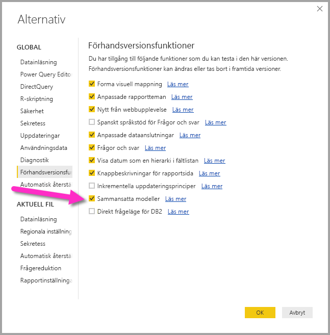

# Lagringsläge i Power BI Desktop (förhandsversion)

I **Power BI Desktop** kan du ange **lagringsläge** för tabeller, vilket ger dig kontroll över om tabelldata cachelagras minnesinternt för rapporter. 

Att konfigurera **lagringsläge** ger många fördelar. Du kan ange **lagringsläge** för varje tabell individuellt i din modell, vilket innebär att en enda datauppsättning kan dra nytta av en eller flera av följande fördelar:

* **Frågeprestanda** – när användare interagerar med Power BI-rapporter skickas DAX-frågor till datauppsättningen. Om du cachelagrar data i minnet genom att konfigurera **lagringsläge** kan du öka dina rapporters frågeprestanda och interaktivitet.
* **Stora datamängder** – tabeller som inte cachelagras inte förbrukar inte minne för cachelagring. Du kan aktivera interaktiv analys för stora datauppsättningar som är för stora eller dyra att cachelagra helt och hållet. Du kan ange vilka tabeller som är värda att cachelagra och vilka som inte är det.
* **Optimering av datauppdatering** – tabeller som inte cachelagras behöver inte uppdateras. Du kan minska uppdateringstiderna genom att cachelagra endast nödvändiga data så som passar ditt serviceavtal och dina affärsbehov.
* **Tidskrav nära realtid** – tabeller med krav på nära realtid kan dra fördel av att inte cachelagras, så att datafördröjningen minskas.
* **Tillbakaskrivning** – med tillbakaskrivning kan affärsanvändare utforska olika tänkbara scenarion genom att ändra cellvärden. Anpassade program kan tillämpa ändringar i datakällan. Tabeller som inte cachelagras kan reflektera ändringar omedelbart, vilket innebär att effekterna kan analyseras direkt.

Inställningen för **lagringsläge** i **Power BI Desktop** är en av tre relaterade funktioner:

* **Sammansatta modeller** – låter en rapport ha flera dataanslutningar, inklusive DirectQuery-anslutningar eller importera, i valfri kombination.
* **Många-till-många-relationer** – med **sammansatta modeller** kan du etablera **många-till-många-relationer** mellan tabeller, vilket tar bort kravet om unika värden i tabeller och tar bort tidigare lösningar som att introducera nya tabeller bara för att etablera relationer. 
* **Lagringsläge** – du kan nu ange vilka visuella objekt som kräver en fråga till datakällor i serverdelen och de som inte kräver det importeras även om de baseras på DirectQuery, vilket förbättrar prestandan och minskar belastningen på serverdelen. Tidigare initierade även enkla visuella objekt som utsnitt frågor som skickades till serverdelskällor. 

Den här samlingen med tre relaterade funktioner för **sammansatta modeller** beskrivs var och en i separata artiklar:

* **Sammansatta modeller** beskrivs i detalj i artikeln [sammansatta modeller i Power BI Desktop (förhandsversion)](desktop-composite-models.md).
* **Många-till-många-relationer** beskrivs i sin egen artikel [många-till-många-relationer i Power BI Desktop (förhandsversion)](desktop-many-to-many-relationships.md).
* **Lagringsläge** beskrivs i detalj i den här artikeln.

## Aktivera förhandsversionsfunktionen för lagringsläge

Funktionen för **lagringsläge** är i förhandsversion och måste aktiveras i **Power BI Desktop**. Om du vill aktivera **lagringsmodeller** väljer du **Arkiv > Alternativ och inställningar > Alternativ > Förhandsfunktioner** och markerar sedan kryssrutan för **sammansatta modeller**. 

Du måste starta om **Power BI Desktop** för att funktionen ska aktiveras.

## Använda egenskapen för lagringsläge

**Lagringsläge** är en egenskap som du kan ange i varje tabell i din modell. Du konfigurerar **lagringsläge** genom att välja tabellen i fönstret **Fält** och sedan ta fram snabbmenyn genom att högerklicka. Välj **Egenskaper** på snabbmenyn.

Valt **lagringsläge** visas i fönstret **Fältegenskaper** för tabellen. Därifrån kan du visa aktuellt **lagringsläge** och ändra det.

Det finns tre värden för **lagringsläge**:

* **Import** – När du väljer **Import** cachelagras importerade tabeller. Frågor som skickats till Power BI-datauppsättningen som returnerar data från importtabeller kan bara slutföras från cachelagrade data.
* **DirectQuery** – Med den här inställningen cachelagras inte DirectQuery-tabeller. Frågor som skickas till Power BI-datauppsättningen (t.ex. DAX-frågor) och som returnerar data från DirectQuery-tabeller kan bara uppfyllas om frågor på begäran körs mot datakällan. Frågor som skickats till datakällan använder datakällans frågespråk (t.ex. SQL).
* **Dubbla** – Dubbla tabeller kan fungera som cachelagrade eller inte cachelagrade, beroende på kontexten för den fråga som skickas till Power BI-datauppsättningen. I vissa fall uppfylls frågor från cachelagrade data, i andra fall uppfylls frågor genom att en fråga körs på begäran mot datakällan.

Att ändra en tabell till Import är en åtgärd som *inte kan ångras*. Den kan inte ändras tillbaka till DirectQuery eller Dubbla.

## Begränsningar för DirectQuery-tabeller och dubbla tabeller

Dubbel tabeller är underställda samma begränsningar som DirectQuery-tabeller. Dessa inkluderar begränsade M-transformeringar och begränsade DAX-funktioner i beräknade kolumner. Mer information finns i [Effekter av att använda DirectQuery](desktop-directquery-about.md#implications-of-using-directquery).

## Relationsregler för tabeller med olika lagringslägen

Relationer måste följa de regler baserat på de relaterade tabellernas **lagringsläge**. Det här avsnittet innehåller exempel på giltiga kombinationer. Mer information finns i [Många-till-många-relationer i Power BI Desktop (förhandsversion)](desktop-many-to-many-relationships.md).

För datauppsättningar med en enskild datakälla är följande **1-till-många**-kombinationer giltiga:

| Tabellen på **många**-sidan | Tabellen på **1**-sidan |
| ------------- |----------------------| 
| Dubbla          | Dubbla                 | 
| Importera        | Import eller Dubbla       | 
| DirectQuery   | DirectQuery eller Dubbla  | 

## Spridning av Dubbla
Låt oss ta en titt på ett exempel. Överväg att använda följande enkla modell, där alla tabeller kommer från en enda källa som stöder Import och DirectQuery.

Låt oss till en början anta att alla tabeller i den här modellen är DirectQuery. Om vi sedan ändrar **lagringsläget** för *SurveyResponse*-tabellen till Import visas följande meddelande:

Dimensionstabellerna (*Kund*, *Datum* och *Geografi*) måste ges värdet **Dubbla** för att uppfylla de tidigare beskrivna relationsreglerna. I stället för att kräva att dessa tabeller anges till **Dubbla** i förväg kan de konfigureras i en enda åtgärd.

Spridningslogiken är utformad för att hjälpa till med modeller som innehåller många tabeller. Vi antar att du har en modell med 50 tabeller och att endast vissa faktatabeller (transaktionstabeller) måste cachelagras. Logiken i **Power BI Desktop** räknar ut den minsta uppsättning av dimensionstabeller som måste konfigureras som **Dubbla**, så du behöver inte göra detta.

Spridningslogiken passerar enbart för den ena sidan av **1-till-många**-relationer.

* Att ändra tabellen *Kund* till **Import** (istället för att ändra *SurveyResponse*) är inte tillåtet pga dess relationer till DirectQuery-tabellerna *Försäljning* och *SurveyResponse*.
* Att ändra tabellen *Kund* till **Dubbla** (istället för att ändra *SurveyResponse*) är tillåtet. Spridningslogiken konfigurerar tabellen *Geografi* tabellen så att den även är **Dubbla**.

## Användningsexempel för lagringsläge
Nu ska vi fortsätta med exemplet från föregående avsnitt och föreställa oss att vi använder följande egenskapsinställningar för **lagringsläge**:

| Tabell                   | Lagringsläge         |
| ----------------------- |----------------------| 
| *Försäljning*                 | DirectQuery          | 
| *SurveyResponse*        | Importera               | 
| *Datum*                  | Dubbla                 | 
| *Kund*              | Dubbla                 | 
| *Geografi*             | Dubbla                 | 

Om du gör dessa egenskapsinställningar för lagringsläge blir resultatet följande beteenden, förutsatt att tabellen *Försäljning* har en betydande datavolym.
* Dimensionstabeller (*Datum*, *Kund* och *Geografi*) cachelagras, så de initiala rapportinläsningstiderna bör vara snabba vid hämtning av utsnittsvärden som ska visas.
* Om du inte cachelagrar tabellen *Försäljning* ger det följande resultat:
    * Datauppdateringstiderna förbättras och minnesförbrukningen minskas
    * Rapportfrågor som baseras på tabellen *Försäljning* körs i DirectQuery-läge, vilket kan ta längre tid, men ligger närmare i realtid eftersom ingen cachelagringslatens förekommer

* Rapportfrågor som baseras på tabellen *SurveyResponse* returneras från det minnesinterna cacheminnet, och därför bör de vara relativt snabba.

## Frågor som träffar eller missar i cacheminnet

Genom att ansluta **SQL Profiler** till diagnostikporten för **Power BI Desktop** kan du se vilka frågor som når eller missar det minnesinterna cacheminnet genom att utföra en spårning som baseras på följande händelser:

* Frågehändelser\Frågan börjar
* Frågebearbetning\Vertipaq SE-frågan börjar
* Frågebearbetning\DirectQuery-frågan börjar

För varje *Frågan börjar*-händelse, så kontrollera andra händelser med samma *ActivityID*. Exempel: om det inte finns några *DirectQuery Begin*-händelser, men det finns en *Vertipaq SE-Frågan börjar*-händelse så besvaras frågan från cacheminnet.

Frågor som refererar till **Dubbla** tabeller returnera data från cacheminnet om så är möjligt. I annat fall återgår de till DirectQuery.

Om vi fortsätter med föregående exempel refererar följande fråga bara till en kolumn från tabellen *Datum*, vilken är i läget **Dubbla**. Därför bör den träffa cacheminnet.

Följande fråga refererar bara till en kolumn från tabellen *Försäljning*, vilken är i **DirectQuery**-läge. Därför bör den *inte* träffa cacheminnet.

Följande fråga är intressant eftersom den kombinerar båda kolumnerna. Den här frågan träffar inte cacheminnet. Du förväntar dig kanske först att den ska hämta *CalendarYear*-värden från cacheminnet och *SalesAmount*-värden från källan, och sedan kombinera resultaten. Men detta är mindre effektivt än om du skulle skicka åtgärden SUM/GROUP BY till källsystemet. Om åtgärden flyttas ned till källan blir antalet rader som returneras sannolikt mycket mindre. 

> [!NOTE]
> Det här beteendet skiljer sig från [många-till-många-relationer i Power BI Desktop (förhandsversion)](desktop-many-to-many-relationships.md) när du kombinerar cachelagrade och icke-cachelagrade tabeller.

## Cacheminnen bör hållas synkroniserade

De frågor som visas i föregående avsnitt visar att **dubbla** tabeller ibland träffar och ibland missar cacheminnet. Om cacheminnet är för gammalt kan därför olika värden returneras. Frågekörningen försöker inte maskera dataproblem genom att t.ex. filtrera DirectQuery-resultaten så att matchar cachelagrade värden. Det är ditt ansvar att känna till dina dataflöden, och du bör agera därefter. Det finns etablerade tekniker för att hantera sådana fall vid källan, om så behövs.

Lagringsläget **Dubbla** är en prestandaoptimering. Det bör endast användas på sätt som inte äventyrar möjligheten att uppfylla verksamhetskraven. När det gäller alternativa beteenden så överväg att använda de metoder som beskrivs i artikeln [Många-till-många-relationer i Power BI Desktop (förhandsversion)](desktop-many-to-many-relationships.md).

## Datavy
Om minst en tabell i datauppsättningen har konfigurerat **lagringsläget** till endera Import eller Dubbla, så visas fliken **Datavy**.

När du har valt **Dubbla** eller **Import**-tabeller i *Datavy** visas cachelagrade data. Data visas inte i DirectQuery-tabeller och ett meddelande visas som säger att DirectQuery-tabeller inte får visas.

## Begränsningar och överväganden

Det finns en del begränsningar för den här versionen av **lagringsläget** och dess korrelation med **sammansatta modeller**.

Följande flerdimensionella källor kan inte användas med **sammansatta modeller**:

* SAP HANA
* SAP Business Warehouse
* SQL Server Analysis Services
* Power BI-datauppsättningar

När du ansluter till de flerdimensionella källorna med DirectQuery, kan du inte också ansluta till en annan DirectQuery-källa eller kombinera med importerade data.

De befintliga begränsningarna med att använda DirectQuery gäller fortfarande när du använder **sammansatta modeller**. Många av dessa begränsningarna är nu per tabell, beroende på tabellens **lagringsläge**. En beräknad kolumn på en importerad tabell kan till exempel referera till andra tabeller, men en beräknad kolumn i en DirectQuery-tabell är fortfarande begränsad till att enbart referera till kolumner i samma tabell. Andra begränsningar gäller för modellen som helhet, om någon av tabellerna inom modellen är DirectQuery. Funktionerna **QuickInsights** och **Q & A** är till exempel inte tillgängliga på en modell om någon av tabellerna i den har **lagringsläget** DirectQuery. 

## Nästa steg

Följande artiklar beskriver mer om sammansatta modeller och beskriver DirectQuery i detalj.

* [Sammansatta modeller i Power BI Desktop (förhandsversion)](desktop-composite-models.md)
* [Många-till-många-relationer i Power BI Desktop (förhandsversion)](desktop-many-to-many-relationships.md)

DirectQuery-artiklar:

* [Använd DirectQuery i Power BI](desktop-directquery-about.md)
* [Datakällor som stöds av DirectQuery i Power BI](desktop-directquery-data-sources.md)

