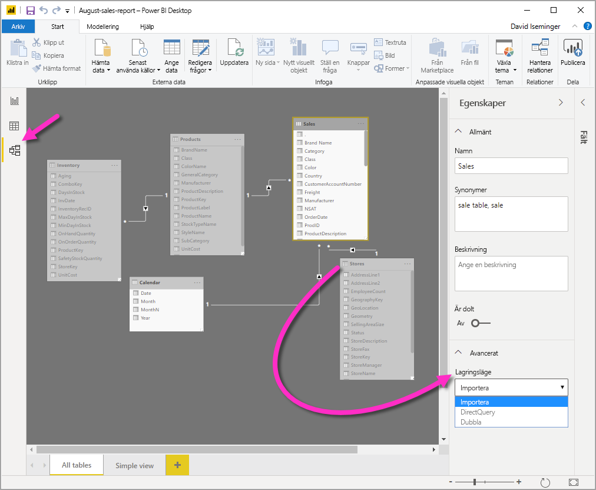
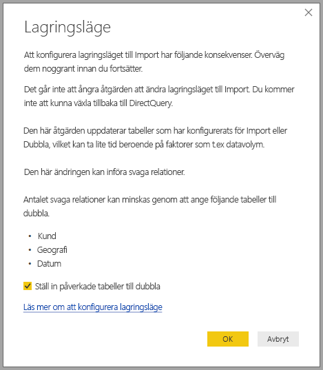

# Hantera lagringsläget i Power BI Desktop

I Microsoft Power BI Desktop kan du ange lagringsläget för tabeller. Lagringsläge gör att du kan kontrollera om Power BI Desktop cachelagrar tabelldata i minnet för rapporter. 

Att konfigurera lagringsläget ger många fördelar. Du kan ange lagringsläget för varje tabell individuellt i din modell. Den här åtgärden aktiverar en enda datauppsättning, vilket ger följande fördelar:

* **Frågeprestanda**: När användare interagerar med Power BI-rapporter så skickas DAX-frågor (Data Analysis Expressions) till datauppsättningen. Om du cachelagrar data i minnet genom att konfigurera lagringsläget kan du öka dina rapporters frågeprestanda och interaktivitet.

* **Stora datauppsättningar**: Tabeller som inte cachelagras förbrukar inte minne för cachelagring. Du kan aktivera interaktiv analys för stora datamängder som är för stora eller dyra att cachelagra i minnet. Du kan ange vilka tabeller som är värda att cachelagra och vilka som inte är det.

* **Optimering av datauppdatering**: Du behöver inte uppdatera tabeller som inte cachelagras. Du kan minska uppdateringstiderna genom att cachelagra endast nödvändiga data så som passar ditt serviceavtal och dina affärsbehov.

* **Tidskrav nära realtid**: Tabeller med krav på nära realtid kan dra fördel av att inte cachelagras för att minska datafördröjningen.

* **Tillbakaskrivning**: Tillbakaskrivning låter affärsanvändare utforska olika tänkbara scenarion genom att ändra cellvärden. Anpassade program kan tillämpa ändringar i datakällan. Tabeller som inte cachelagras kan visar ändringar omedelbart, vilket innebär att effekterna kan analyseras direkt.

Inställningen för lagringsläget i Power BI Desktop är en av tre relaterade funktioner:

* **Sammansatta modeller**: Låter en rapport ha två eller flera dataanslutningar, inklusive DirectQuery-anslutningar eller importera, i valfri kombination. Mer information finns i [Använda sammansatta modeller i Power BI Desktop](desktop-composite-models.md).

* **Många-till-många-relationer**: Med sammansatta modeller så kan du etablera *många-till-många-relationer* mellan tabeller. I många-till-många-relationer finns inga krav på unika värden i tabeller. Det tar också bort tidigare lösningar, till exempel introduktion till nya tabeller endast för att skapa relationer. Mer information finns i [Många-till-många-relationer i Power BI Desktop](desktop-many-to-many-relationships.md).

* **Lagringsläge**: Nu kan du ange vilka visuella objekt som kräver en fråga till serverdelens datakällor. Visuella objekt som inte kräver en fråga importeras även om de är baserade på DirectQuery. Den här funktionen hjälper till att förbättra prestanda och minskar belastningen på serversidan. Tidigare initierade även enkla visuella objekt som utsnitt frågor som skickades till serverdelskällor. 

## Använd egenskapen Lagringsläge

Egenskapen **Lagringsläge** är en egenskap som du kan ställa in för varje tabell i din modell och styr hur Power BI cachelagrar tabelldata.

Så här ställer du in eller visar egenskapen **Lagringsläge**: 

1. I **modellvyn** väljer du den tabell vars egenskaper du vill visa eller ställa in. 
2. I fönstret **Egenskaper** expanderar du avsnittet **Avancerat** och expanderar listrutan **Lagringsläge**.

   

Ställ in egenskapen **Lagringsläge** på något av följande tre värden:

* **Import**: Importerade tabeller med den här inställningen cachelagras. Frågor som skickats till Power BI-datauppsättningen som returnerar data från importtabeller kan bara slutföras från cachelagrade data.

* **DirectQuery**: Tabeller med den här inställningen cachelagras inte. Frågor som du skickar till Power BI-datauppsättningen &mdash; exempelvis DAX-frågor &mdash; och som returnerar data från DirectQuery-tabeller kan bara uppfyllas om frågor körs på begäran mot datakällan. Frågor som du skickar till datakällan använder datakällans frågespråk, till exempel SQL.

* **Dubbla**: Tabeller med den här inställningen kan fungera antingen som cachelagrade eller inte cachelagrade, beroende på kontexten för den fråga som skickas till Power BI-datamängden. I vissa fall kan du uppfylla frågor från cachelagrade data. I andra fall måste du uppfylla frågor genom att köra en fråga på begäran till datakällan.

Om du ändrar **Lagringsläge** för en tabell till **Import** kan du *inte* ångra dig. När du har gjort en här inställningen kan du inte ändra den till **DirectQuery** eller **Dubbla** senare.

> [!NOTE]
> Du kan använda lagringsläget **Dubbla** i både Power BI Desktop och i Power BI-tjänsten.

## Begränsningar för DirectQuery-tabeller och dubbla tabeller

Dubbeltabeller har samma funktionsbegränsningar som DirectQuery-tabeller. Dessa restriktioner inkluderar begränsade M-transformeringar och begränsade DAX-funktioner i beräknade kolumner. Mer information finns i [Effekter av att använda DirectQuery](desktop-directquery-about.md#implications-of-using-directquery).

## Spridning av den inställningen Dubbla
Överväg att använda följande enkla modell, där alla tabeller kommer från en enda källa som stöder Import och DirectQuery.

Anta att alla tabeller i den här modellen har inställningen **DirectQuery** från början. Om du ändrar inställningen **Lagringsläge** för tabellen **SurveyResponse** till **Import** visas följande varningsfönster:

Du kan ställa in dimensionstabellerna (**Customer**, **Geography** och **Date**) på **Dubbla** för att minska antalet svaga relationer i datamängden och förbättra prestandan. Svaga relationer innefattar vanligtvis minst en DirectQuery-tabell där kopplingslogiken inte kan push-överföras till källsystemen. Eftersom tabeller med inställningen Dubbla kan fungera som antingen DirectQuery- eller importtabeller undviker du den här situationen.

Spridningslogiken är utformad för att hjälpa till med modeller som innehåller många tabeller. Anta att du har en modell med 50 tabeller och att bara vissa faktatabeller (transaktionstabeller) måste cachelagras. Logiken i Power BI Desktop räknar ut den minsta uppsättning av dimensionstabeller som måste konfigureras som **Dubbla**, så att du behöver inte göra detta.

Spridningslogiken traverserar bara till den ena sidan av 1-till-många-relationer.

## Användningsexempel för lagringsläge
Nu ska vi fortsätta med exemplet från föregående avsnitt och föreställa oss att vi använder följande egenskapsinställningar för lagringsläge:

| Tabell                   | Lagringsläge         |
| ----------------------- |----------------------| 
| Försäljning                 | DirectQuery          | 
| SurveyResponse        | Importera               | 
| Datum                  | Dubbla                 | 
| Kund              | Dubbla                 | 
| Geografi             | Dubbla                 | 

Om du ställer in de här egenskaperna för lagringsläget får du följande beteende, förutsatt att tabellen **Försäljning** har en betydande datavolym:
* Power BI Desktop cachelagrar dimensionstabellerna, **Datum**, **Kund** och **Geografi**, så att inläsningstiden för inledande rapporter blir snabbare när de hämtar utsnittsvärden att visa.
* Power BI Desktop cachelagrar inte tabellen **Försäljning**. Eftersom den här tabellen inte cachelagras får du följande resultat i Power BI Desktop:
    * Datauppdateringstiderna förbättras och minnesförbrukningen minskas.
    * Rapportfrågor som baseras på tabellen **Försäljning** körs i **DirectQuery**-läge. De här frågorna kan ta längre tid, men är närmare realtid eftersom ingen svarstid för cachelagringen introduceras.

* Rapportfrågor som baseras på tabellen **SurveyResponse** returneras från det cacheminnet och bör därför vara relativt snabba.

## Frågor som träffar eller missar i cacheminnet

Om du ansluter SQL Profiler till diagnostikporten för Power BI Desktop kan du se vilka frågor som når eller missar cacheminnet genom att utföra en spårning som baseras på följande händelser:

* Frågehändelser\Frågan börjar
* Frågebearbetning\Vertipaq SE-frågan börjar
* Frågebearbetning\DirectQuery-frågan börjar

För varje *Frågan börjar*-händelse, så kontrollera andra händelser med samma *ActivityID*. Om det till exempel inte finns någon *DirectQuery Begin*-händelse, men en *Vertipaq SE Query Begin*-händelse, så besvaras frågan från cacheminnet.

Frågor som refererar till tabeller med inställningen Dubbla returnerar data från cacheminnet om det går. Annars återgår de till DirectQuery.

Om vi fortsätter med föregående exempel refererar följande fråga bara till en kolumn från tabellen **Datum**, vilken är i läget **Dubbla**. Därför bör frågan träffa cacheminnet:

Följande fråga refererar bara till en kolumn från tabellen **Försäljning**, vilken är i **DirectQuery**-läge. Därför bör den *inte* träffa cacheminnet:

Följande fråga är intressant eftersom den kombinerar båda kolumnerna. Den här frågan träffar inte cacheminnet. Du förväntar dig kanske först att den ska hämta **CalendarYear**-värden från cacheminnet och **SalesAmount**-värden från källan, och sedan kombinera resultaten. Men den här tillämpningen är mindre effektivt än om du skulle skicka åtgärden SUM/GROUP BY till källsystemet. Om åtgärden push-överförs ned till källan blir antalet rader som returneras sannolikt mycket mindre: 

> [!NOTE]
> Det här beteendet är annorlunda än för [många-till-många-relationer](desktop-many-to-many-relationships.md) i Power BI Desktop när du kombinerar cachelagrade och icke-cachelagrade tabeller.

## Cacheminnen bör hållas synkroniserade

De frågor som visas i föregående avsnitt visar att tabeller med inställningen Dubbla ibland träffar och ibland missar cacheminnet. Om cacheminnet är för gammalt kan därför olika värden returneras. Frågekörningen försöker inte maskera dataproblem genom att t.ex. filtrera DirectQuery-resultat för att matcha cachelagrade värden. Det är ditt ansvar att känna till dina dataflöden, och du bör designa därefter. Det finns etablerade tekniker för att hantera sådana fall vid källan, om så behövs.

Lagringsläget **Dubbla** är en prestandaoptimering. Det bör endast användas på sätt som inte äventyrar möjligheten att uppfylla verksamhetskraven. När det gäller alternativa beteenden så kan du överväga att använda de metoder som beskrivs i [Många-till-många-relationer i Power BI Desktop](desktop-many-to-many-relationships.md).

## Datavy
Om minst en tabell i datamängden har lagringsläget inställt på antingen **Import** eller **Dubbla** så visas fliken **Datavy**.

När du väljer tabeller med inställningen Dubbla eller Import i **datavyn** visas cachelagrade data. Data i DirectQuery-tabeller visas inte, och du ser ett meddelande om att DirectQuery-tabeller inte kan visas.

## Begränsningar och överväganden

Det finns en del begränsningar för den här versionen av lagringsläget och dess korrelation med sammansatta modeller.

Följande liveanslutningskällor (flerdimensionella) kan inte användas i sammansatta modeller:

* SAP HANA
* SAP Business Warehouse
* SQL Server Analysis Services
* Power BI-datauppsättningar
* Azure Analysis Services

När du ansluter till dessa flerdimensionella källor med DirectQuery kan du inte ansluta till en annan DirectQuery-källa eller kombinera den med importerade data.

De befintliga begränsningarna med att använda DirectQuery gäller fortfarande när du använder sammansatta modeller. Många av dessa begränsningarna är nu per tabell, beroende på tabellens lagringsläge. En beräknad kolumn på en importerad tabell kan till exempel referera till andra tabeller, men en beräknad kolumn i en DirectQuery-tabell är fortfarande begränsad till att enbart referera till kolumner i samma tabell. Andra begränsningar gäller för modellen som helhet, om någon av tabellerna inom modellen är DirectQuery. Funktionerna QuickInsights och Frågor och svar är till exempel inte tillgängliga i en modell om någon av tabellerna i den har lagringsläget DirectQuery. 

## Nästa steg

Mer information om sammansatta modeller och DirectQuery finns i följande artiklar:
* [Sammansatta modeller i Power BI Desktop](desktop-composite-models.md)
* [Många-till-många-relationer i Power BI Desktop](desktop-many-to-many-relationships.md)
* [Använda DirectQuery i Power BI](desktop-directquery-about.md)
* [Datakällor som stöds av DirectQuery i Power BI](desktop-directquery-data-sources.md)
