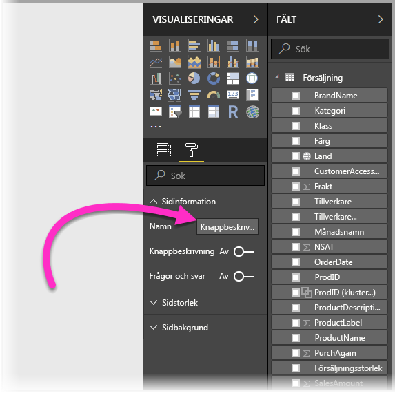
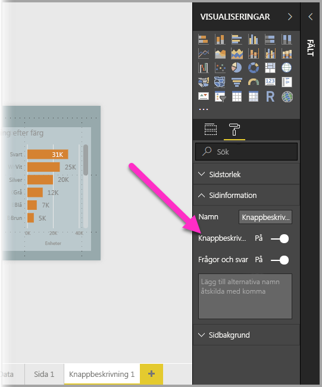

# Skapa knappbeskrivningar baserat på rapportsidor i Power BI Desktop
Du kan skapa visuellt avancerade **rapportknappbeskrivningar** som visas när du hovrar över visuella objekt, baserat på rapportsidor som du skapar i **Power BI Desktop**. Genom att skapa en rapportsida som fungerar som en knappbeskrivning kan dina anpassade knappbeskrivningar innehålla visuella objekt, bilder och andra samlingar av objekt som du skapar på rapportsidan. 

Du kan skapa hur många knappbeskrivningssidor du vill. Varje knappbeskrivningssida kan associeras med ett eller flera fält i en rapport, så att knappbeskrivningen som du har skapat på knappbeskrivningssidan visas när du hovrar över det visuella objektet som innehåller det markerade fältet, filtrerat med datapunkten som musen hovrar över. 

Det finns alla möjliga intressanta saker du kan göra med rapportknappbeskrivningar. Vi tar en titt på hur du skapar knappbeskrivningar och vad du måste göra för att konfigurera dem.

## Skapa en rapportknappbeskrivningssida
Kom igång genom att skapa en ny rapportsida genom att klicka på knappen **+** längst ned på arbetsytan i **Power BI Desktop**, i området med sidflikar. Knappen finns bredvid den sista sidan i rapporten. 

Knappbeskrivningen kan ha valfri storlek men tänk på att knappbeskrivningar hovrar över rapportarbetsytan, så det är bra om de är ganska små. I fönstret **Format** på kortet **Sidstorlek** visas en ny sidstorleksmall med namnet *Knappbeskrivning*. Det ger en storlek för rapportsidans arbetsyta som är klar för knappbeskrivningen.

Som standard anpassas rapportarbetsytan efter det tillgängliga utrymmet på sidan i **Power BI Desktop**. Det är ofta bra, men inte när det gäller knappbeskrivningar. För att få en bättre uppfattning om hur knappbeskrivningen kommer att se ut när du är klar kan du ändra **sidvisningen** till den faktiska storleken. 

Det gör du genom att välja fliken **Visa** i menyfliksområdet. Där väljer du **Sidvisning > Faktisk storlek**, enligt följande bild.

Du kan också ge rapportsidan ett namn så att dess syfte blir tydligt. Välj kortet **Sidinformation** i fönstret **Format** och skriv namnet i fältet **Namn**. På följande bild har knappbeskrivningsrapporten namnet *Knappbeskrivning 1*, men du kan ge din ett mer beskrivande namn.

Där kan du skapa de visuella objekt som ska visas i knappbeskrivningen. På följande bild finns det två kort och ett grupperat liggande stapeldiagram på knappbeskrivningssidan, samt en bakgrundsfärg för själva sidan och bakgrunder för de olika visuella objekten, för att ge den önskat utseende.

Det finns fler steg att slutföra innan knappbeskrivningsrapportsidan kan fungera som en knappbeskrivning. Du måste konfigurera knappbeskrivningssidan på några sätt, enligt beskrivningen i nästa avsnitt. 

## Konfigurera knappbeskrivningsrapportsidan

När du har skapat knappbeskrivningsrapportsidan måste du konfigurera sidan för att **Power BI Desktop** ska registrera den som en knappbeskrivning och för att se till att den visas över rätt visuella objekt.

Först måste du ändra skjutreglaget vid **Knappbeskrivning** till **På** i kortet **Sidinformation** för att göra sidan till en knappbeskrivning. 

När skjutreglaget är aktiverat anger du vilka fält du vill att rapportknappbeskrivningen ska visas för. För visuella objekt i rapporten som innehåller det fält du anger kommer knappbeskrivningen att visas. Du anger vilket eller vilka fält som ska användas genom att dra dem till **bucketen **Knappbeskrivningsfält** i avsnittet **Fält** i fönstret Visualiseringar**. På följande bild har fältet *SalesAmount* dragits till bucketen **Knappbeskrivningsfält**.

 
Du kan ange både kategoriska och numeriska fält i bucketen **Knappbeskrivningsfält**, inklusive mått.

När den är klar kommer knappbeskrivningsrapportsidan som du har skapat att användas som en knappbeskrivning i visuella objekt i rapporten som använder fält som du har placerat i bucketen **Knappbeskrivningsfält**, och ersätter standardknappbeskrivningen i Power BI.

## Ange en rapportknappbeskrivning manuellt

Förutom att skapa en knappbeskrivning som visas automatiskt när du hovrar över ett visuellt objekt som innehåller det angivna fältet kan du ange en knappbeskrivning manuellt. 

Visuella objekt som stöder rapportknappbeskrivningar har nu kortet **Knappbeskrivning** i fönstret **Formatering**. 

Om du vill ange en knappbeskrivning manuellt markerar du det visuella objektet som du vill ange den manuella knappbeskrivningen för, går till fönstret **Visualiseringar**, väljer avsnittet **Format** och expanderar kortet **Knappbeskrivning**.

I listrutan **Sida** väljer du sedan knappbeskrivningssidan som du vill använda för det markerade visuella objektet. Observera att endast rapportsidor som har angetts som **knappbeskrivning**ssidor visas i dialogrutan.

Det finns många användningsområden för att ange en knappbeskrivning manuellt. Du kan ange en tom sida för en knappbeskrivning och därmed åsidosätta standardvalet av knappbeskrivning i Power BI. Ett annat användningsområde är när du inte vill att knappbeskrivningen som väljs automatiskt av Power BI ska vara knappbeskrivning. Om du till exempel har ett visuellt objekt som innehåller två fält, och båda fälten har en associerad knappbeskrivning, väljs bara en som visas av Power BI. Du kanske inte vill det, så du kan manuellt välja vilken knappbeskrivning som ska visas.

## Återgå till standardknappbeskrivningar

Om du skapar en manuell knappbeskrivning för ett visuellt objekt men kommer fram till att du vill ha standardknappbeskrivningen i stället kan du alltid återgå till standardknappbeskrivningen i Power BI. Gör så här: När ett visuellt objekt är markerat och kortet **Knappbeskrivning** är expanderat väljer du *Automatisk* i listrutan **Sida** för att gå tillbaka till standardinställningen.

## Anpassade rapportknappbeskrivningar och linjediagram

Det finns några saker att tänka på när rapportknappbeskrivningar interagerar med visuella objekt med linjediagram, och med visuella objekt vid korsmarkering.

### Rapportknappbeskrivningar och linjediagram

När en rapportknappbeskrivning visas för ett linjediagram, visas bara en knappbeskrivning för alla linjer i diagrammet. Det liknar standardbeteendet för knappbeskrivningar för linjediagram, som också innebär att bara en knappbeskrivning visas. 

Det beror på att fältet i förklaringen inte skickas som ett filter för knappbeskrivningen. På följande bild innehåller knappbeskrivningen som visas alla enheter som sålts den dagen för alla tre klasser som visas i rapportknappbeskrivningen (i det här exemplet Deluxe, Economy och Regular). 

### Rapportknappbeskrivningar och korsmarkering

När ett visuellt objekt korsmarkeras i en rapport visas alltid korsmarkerade data i rapportknappbeskrivningar, även om du hovrar över den nedtonade delen av datapunkten. På följande bild hovrar musen över den nedtonade delen av stapeldiagrammet (delen som inte är markerad), men data för den markerade delen av datapunkten (markerade data) visas fortfarande i rapportknappbeskrivningen.

## Begränsningar och överväganden
Det finns några begränsningar och saker för **knappbeskrivningar** som du bör tänka på.

* Från och med **Power BI Desktop**-versionen för december 2018 har visuella knappobjekt också stöd för knappbeskrivningar.
* Rapportknappbeskrivningar stöds inte vid visning av rapporter i mobilappar. 
* Rapportknappbeskrivningar stöds inte för anpassade visuella objekt. 
* Kluster stöds för närvarande inte som fält som kan visas i rapportknappbeskrivningar. 
* När du väljer ett fält som ska visas för rapportknappbeskrivningar, när du använder ett fält jämfört med en kategori, visas endast den angivna knappbeskrivningen när sammanfattning med det valda fältet matchar i visuella objekt som innehåller det fältet. 

## Nästa steg
Mer information om liknande funktioner eller funktioner som interagerar med rapportknappbeskrivningar finns i följande artiklar:

* [Använd detaljinformation i Power BI Desktop](desktop-drillthrough.md)
* [Visa instrumentpanelen eller rapportvisualiseringen i läget Fokus](consumer/end-user-focus.md)

