# Självstudie: Skapa beräknade kolumner i Power BI Desktop

Ibland innehåller de data som du analyserar inte det fält som du behöver för att kunna hämta ett visst resultat. Det är därför vi använder *beräknade kolumner*. Beräknade kolumner använder DAX-formler (Data Analysis Expressions) för att definiera en kolumns värden, allt från att sätta ihop textvärden från ett antal olika kolumner till att beräkna ett numeriskt värde från andra värden. Anta till exempel att dina data har **Stad** och **Delstat**, men du vill ha ett enda fält för **Plats** som har båda värdena, som ”Miami, FL”. Detta är exakt vad beräknade kolumner är till för.

Beräknade kolumner liknar [mått](desktop-tutorial-create-measures.md) i och med att båda är baserade på DAX-formler, men de skiljer sig åt i hur de används. Du använder ofta åtgärder i en visualiserings område för **Värden** för att beräkna resultat baserat på andra fält. Du använder beräknade kolumner som nya **Fält** i visualiseringarnas rader, axlar, förklaringar och gruppområden.

I den här självstudien får du hjälp att förstå och skapa några beräknade kolumner och använda dem i rapportvisualiseringar i Power BI Desktop. 

### Förutsättningar
- Den här självstudien är avsedd för Power BI-användare som redan är bekanta med Power BI Desktop och som vill skapa mer avancerade modeller. Du bör redan känna till hur man använder **Hämta data** och **Power Query-redigeraren** för att importera data, arbeta med flera relaterade tabeller och lägga till fält på rapportarbetsytan. Om du är nybörjare i Power BI Desktop bör du läsa [Komma igång med Power BI Desktop](desktop-getting-started.md).
  
- I självstudiekursen används [Contoso-försäljningsexemplet för Power BI Desktop](http://download.microsoft.com/download/4/6/A/46AB5E74-50F6-4761-8EDB-5AE077FD603C/Contoso%20Sales%20Sample%20for%20Power%20BI%20Desktop.zip), samma exempel som används för självstudien [Skapa dina egna mått i Power BI Desktop](desktop-tutorial-create-measures.md). Dessa försäljningsdata från det fiktiva företaget Contoso, Inc. har importerats från en databas, så du kan inte ansluta till datakällan eller visa den i Power Query-redigeraren. Hämta och packa upp filen på din dator och öppna den sedan i Power BI Desktop.

## Skapa en beräknad kolumn med värden från relaterade tabeller

I din försäljningsrapport vill du visa produktkategorier och underkategorier som ett enskilt värde, som t.ex. ”Mobiltelefoner – tillbehör”, ”Mobiltelefoner – smartphones och surfplattor” etc. Det finns inget fält listan **Fält** som ger dessa data, men det finns ett **ProductCategory**-fält och ett **ProductSubcategory**-fält, vart och ett i sin egen tabell. Du kan skapa en beräknad kolumn som kombinerar värden från de här två kolumnerna. DAX-formulär kan utnyttja alla fördelar med den modell som du redan har, inklusive relationerna mellan olika tabeller som redan finns. 

 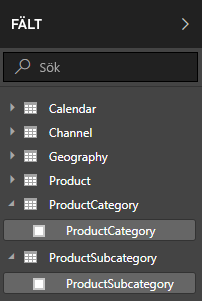

1.  Välj elipsen (...) **Fler alternativ** eller högerklicka på tabellen **ProductSubcategory** i fältlistan och välj sedan **Ny kolumn**. Detta skapar en ny kolumn i tabellen ProductSubcategory.
    
    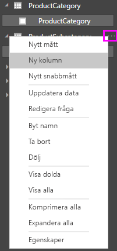
    
    Formelfältet visas överst i rapportarbetsytan, där du kan namnge din kolumn och ange en DAX-formel.
    
    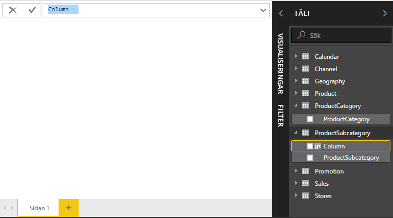
    
2.  Som standard får en ny beräknad kolumn helt enkelt namnet Kolumn. Om du inte byter namn kommer ytterligare nya kolumner döpas till kolumn 2, kolumn 3 och så vidare. Du vill att kolumnen ska vara mer identifierbar, så eftersom namnet **Kolumn** redan är markerat i formelfältet, byter du namn på den genom att skriva **ProductFullCategory**, och sedan ett likhetstecken ( **=** ).
    
3.  Du vill att värdena i din nya kolumn ska börja med namnet ProductCategory. Eftersom den här kolumnen finns i annan (men relaterad) tabell, kan du använda funktionen [RELATED](https://msdn.microsoft.com/library/ee634202.aspx) för att hämta den.
    
    Efter likhetstecknet skriver du **r**. En listruta med förslag visar alla DAX-funktioner som börjar med bokstaven R. Genom att välja varje funktion visas en beskrivning av dess effekt. Medan du skriver skalas alternativlistan närmre den funktion som du behöver. Välj **RELATED**, och tryck sedan på **Retur**.
    
    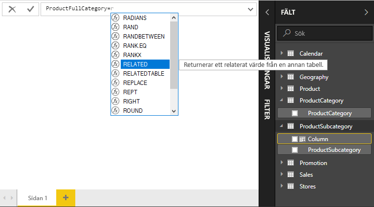
    
    En vänsterparentes visas tillsammans med en annan förslagslista över de relaterade kolumner som du kan överföra till funktionen RELATED med beskrivningar och information om förväntade parametrar. 
    
    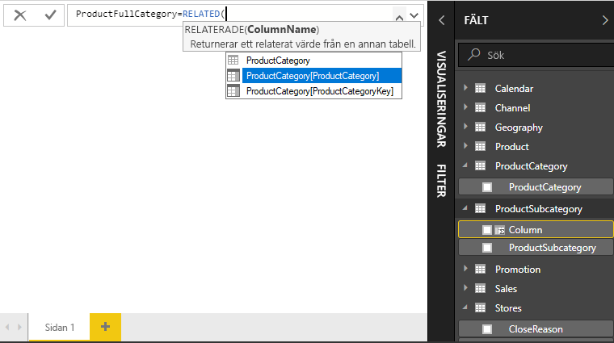
    
4.  Du vill använda kolumnen **ProductCategory** från tabellen **ProductCategory**. Välj **ProductCategory[ProductCategory]** och tryck på **Retur**, skriv sedan en högerparentes.
    
    > [!TIP]
    > Syntaxfel orsakas oftast av saknade eller felplacerade parentestecken, även om Power BI Desktop ibland lägger till dem åt dig.
    
4. Du vill använda bindestreck och blanksteg för att avgränsa ProductCategories och ProductSubcategories i de nya värdena, så skriv efter högerparentesen i det första uttrycket, ett blanksteg, ett et-tecken ( **&** ), ett dubbelt citattecken ( **"** ), ett blanksteg, ett bindestreck ( **-** ), ett till blanksteg, ett till dubbelt citattecken och ett till et-tecken. Formeln bör nu se ut så här:
    
    `ProductFullCategory = RELATED(ProductCategory[ProductCategory]) & " - " &`
    
    > [!TIP]
    > Om du behöver mer plats, välj fortsättningstecknet till höger i formelfältet för att expandera formelredigeraren. I redigeraren, tryck på **Alt + Retur** för att gå en rad nedåt och **Tab** för att gå vidare.
    
5.  Ange ännu en inledande hakparentes ( **[** ) och välj kolumnen **[ProductSubcategory]** för att avsluta formeln. 
    
    
    
    Du behöver inte använda en annan RELATED-funktion för att anropa ProductSubcategory-tabellen i det andra uttrycket eftersom du skapar den beräknade kolumnen i den här tabellen. Vi kan ange [ProductSubcategory] med tabellnamnets prefix (fullständigt) eller utan (inte fullständigt).
    
6.  Slutför formeln genom att trycka på **Retur** eller välja bockmarkeringen i formelfältet. Formeln valideras och kolumnen **ProductFullCategory** visas i tabellen **ProductSubcategory** i fältlistan. 
    
    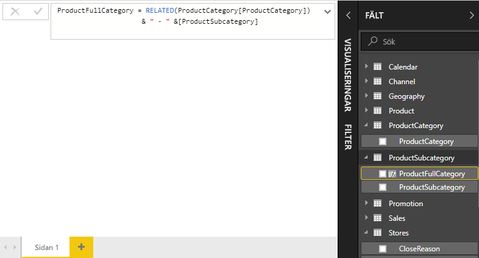
    
    >[!NOTE]
    >I Power BI Desktop får beräknade kolumner en särskild ikon i fältlistan som visar att de innehåller formler. I Power BI-tjänsten (din Power BI-webbplats) går det inte att ändra formler, så beräknade kolumner har inte ikoner.
    
## Använda din nya kolumn i en rapport

Nu kan du använda din nya ProductFullCategory-kolumn för att titta på SalesAmount enligt ProductFullCategory.

1. Välj eller dra kolumnen **ProductFullCategory** från tabellen **ProductSubcategory** på rapportarbetsytan för att skapa en tabell som visar alla ProductFullCategory-namn.
   
   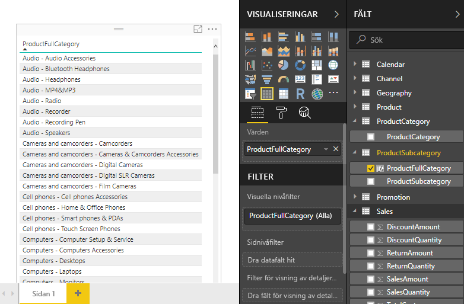
    
2. Välj eller dra fältet **SalesAmount** från tabellen **Sales** om du vill visa försäljningsbeloppet för varje fullständig produktkategori.
   
   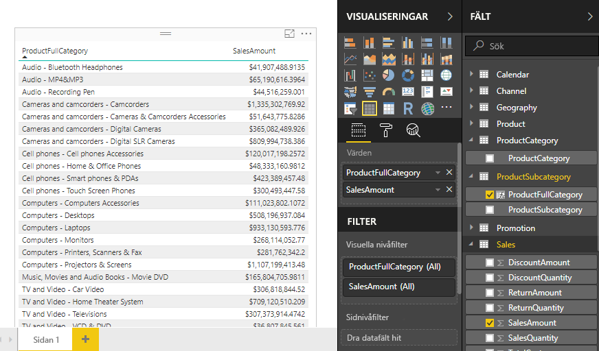
    
## Skapa en beräknad kolumn som använder en IF-funktion

Contoso-försäljningsexemplet innehåller försäljningsdata för både aktiva och inaktiva butiker. Du vill säkerställa att försäljning i aktiva butiker klart avgränsas från försäljning i inaktiva butiker i rapporten genom att skapa ett fält med Active StoreName. I den nya beräknade kolumnen Active StoreName visas alla aktiva butiker med butikens fullständiga namn, medan inaktiva butiker grupperas samman under ”Inaktiv”. 

Lyckligtvis har tabellen Stores en kolumn med namnet **Status**, med värden för ”On” för aktiva butiker och ”Off” för inaktiva butiker som vi använder för att skapa värden för vår nya Active StoreName-kolumn. DAX-formeln använder den logiska funktionen [IF](https://msdn.microsoft.com/library/ee634824.aspx) för att testa varje butiks status och returnerar ett visst värde beroende på resultatet. Om butikens status är ”On” returnerar formeln butikens namn. Om den är ”Off” tilldelar formeln ett Active StoreName som ”inaktivt”. 

1.  Skapa en ny beräknad kolumn i tabellen **Stores** och ge den namnet **Active StoreName** i formelfältet.
    
2.  Efter **=** -tecknet, börja skriva **IF**. Förslagslistan visar vad du kan lägga till. Välj **IF**.
    
    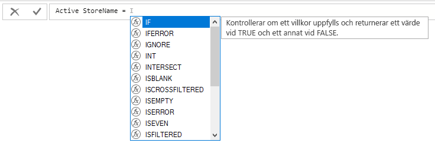
    
3.  Det första argumentet för IF är ett logiskt test av om en butiks status är ”On”. Skriv en inledande hakparentes **[** , som visar kolumner från tabellen Stores och välj **[Status]** .
    
    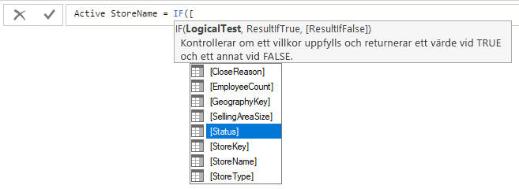
    
4.  Direkt efter **[Status]** , skriv **= ”On”** , och skriv ett komma ( **,** ) för att avsluta argumentet. Knappbeskrivningen föreslår att du nu behöver lägga till ett värde som returneras när resultatet är TRUE.
    
    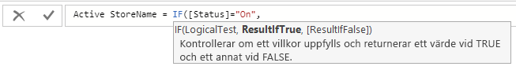
    
5.  Om butikens status är ”On” vill du visa butikens namn. Skriv en inledande hakparentes **[** och välj sedan kolumnen **[StoreName]** och skriv ett kommatecken till. Knappbeskrivningen anger att du nu behöver lägga till ett värde som returneras när resultatet är FALSE. 
    
    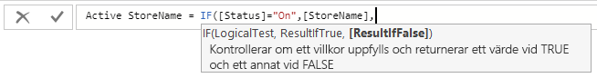
    
6.  Du vill att värdet ska vara *Inactive*, så skriv **”Inactive”** , och slutför sedan formeln genom att trycka på **Retur** eller välja kryssmarkeringen i formelfältet. Formeln valideras och den nya kolumnens namn visas i tabellen **Stores** i fältlistan.
    
    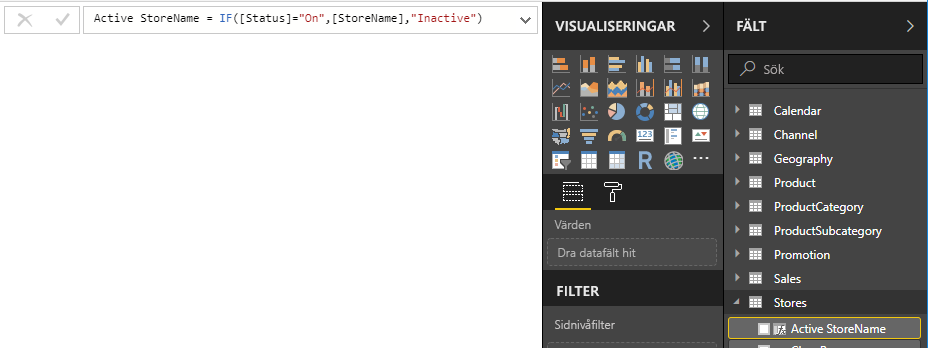
    
8.  Du kan nu använda din nya kolumn Active StoreName i visualiseringar precis som alla andra fält. Om du vill visa SalesAmounts efter Active StoreName, väljer du fältet **Active StoreName** eller drar det till arbetsytan och väljer sedan fältet **SalesAmount** eller drar det till tabellen. I den här tabellen visas aktiva butiker individuellt efter namn, men inaktiva butiker grupperas samman i slutet som *Inactive*. 
    
    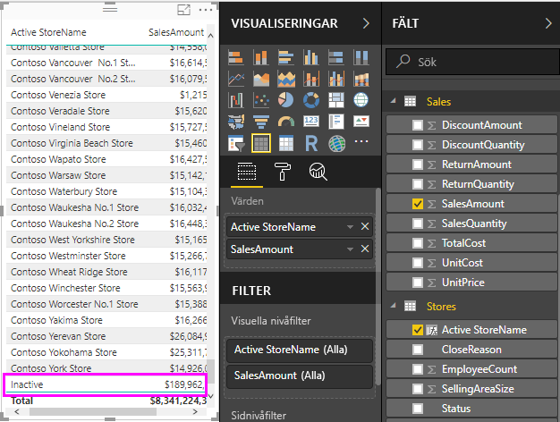
    
## Vad du har lärt dig
Beräknade kolumner kan utöka dina data och ge enklare analyser. Du har lärt dig hur du skapar beräknade kolumner i fältlistan och formelfältet, använder förslagslistor och knappbeskrivningar för att konstruera formler, anropar DAX-funktioner som RELATED och IF med rätt argument och använder de beräknade kolumnerna i rapportvisualiseringarna.

## Nästa steg
Om du vill ha en grundligare genomgång av DAX-formler och skapa beräknade kolumner med mer avancerade formler, kan du läsa mer i [DAX-grunder i Power BI Desktop](desktop-quickstart-learn-dax-basics.md). Den här artikeln handlar om grundläggande begrepp i DAX, till exempel syntax, funktioner och en mer omfattande beskrivning av kontext.

Det kan vara bra att lägga till [Referens för dataanalysuttryck (DAX)](https://msdn.microsoft.com/library/gg413422.aspx) i dina Favoriter. Det är där du hittar detaljerad information om DAX-syntax, operatorer och drygt 200 DAX-funktioner.

