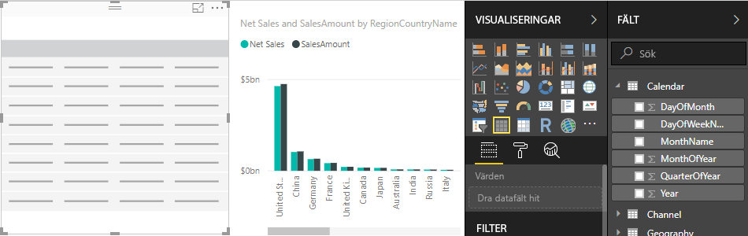
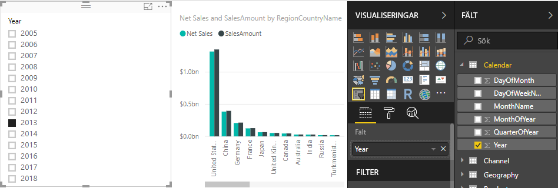
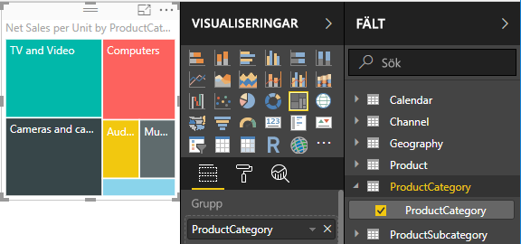

# Självstudie: Skapa dina egna mått i Power BI Desktop
Du kan skapa några av de mest kraftfulla lösningarna för analys i Power BI Desktop med hjälp av mått. Mått hjälper dig genom att utföra beräkningar på dina data medan du interagerar med dina rapporter. I den här självstudien får du hjälp att förstå mått och skapa dina egna grundmått i Power BI Desktop.

### Förutsättningar
- Den här självstudien är avsedd för Power BI-användare som redan är bekanta med Power BI Desktop och som vill skapa mer avancerade modeller. Du bör redan känna till hur man använder Hämta data och Frågeredigeraren för att importera data, att arbeta med flera relaterade tabeller och att lägga till fält på rapportarbetsytan. Om du är nybörjare i Power BI Desktop bör du läsa [Komma igång med Power BI Desktop](desktop-getting-started.md).
  
- Hämta filen [Contoso försäljningsexempel för Power BI Desktop](https://download.microsoft.com/download/4/6/A/46AB5E74-50F6-4761-8EDB-5AE077FD603C/Contoso%20Sales%20Sample%20for%20Power%20BI%20Desktop.zip) som innehåller onlineförsäljningsdata från det fiktiva företaget Contoso, Inc. Dessa data importerades från en databas så du kommer inte kunna ansluta till datakällan eller visa den i frågeredigeraren. Packa upp filen på din dator och öppna den sedan i Power BI Desktop.

## Förstå mått

Mått skapas i de flesta fall automatiskt. I försäljningsexempelfilen för Contoso markerar du kryssrutan bredvid **SalesAmount** i tabellen **Sales** i fältkällan, eller drar **SalesAmount** till rapportarbetsytan. En ny visualisering av ett kolumndiagram visas med summan av alla värden i kolumnen SalesAmount i tabellen Sales.

Alla fält som visas i fältkällan med en sigmaikon  är numerisk, och dess värden kan aggregeras. I stället för att visa en tabell med alla två miljoner rader i SalesAmount-värden, upptäckte Power BI Desktop en numerisk datatyp och skapade och beräknade automatiskt ett mått för att aggregera data. Summan är standardaggregering för en numerisk datatyp, men du lätt kan använda olika aggregeringar som medelvärde eller antal. Att förstå sig på aggregeringar är av avgörande betydelse om man vill förstå mått, eftersom varje mått utför någon typ av aggregering. 

Ändra aggregeringsdiagrammet till ett medelvärde, i området **Value** i visualiseringsfönstret, klicka på nedpilen bredvid **SalesAmount** och välj **Average**. Visualiseringen ändras till ett medelvärde för alla försäljningsvärden i fältet SalesAmount.

Du kan ändra aggregeringstypen beroende på vilket resultat du vill ha, men alla aggregeringstyper kan inte tillämpas på vilken numerisk datatyp som helst. För SalesAmount-fältet så är t.ex. Sum och Average helt meningslösa. Minimum och Maximum har också sin plats. Men Count passar verkligen inte ihop med SalesAmount-fältet eftersom värdena, även om de är numeriska, i själva verket är valutavärden.

Värden som beräknats från mått ändras som svar på dina interaktioner med rapporten. Om du t.ex. drar fältet **RegionCountryName** från tabellen **Geography** till ditt diagram så beräknas och visas genomsnittlig försäljning för varje land.

När resultatet av måttet ändras på grund av en interaktion med din rapport, så påverkas måttets *kontext*. Varje gång du interagerar med rapportvisualiseringar, ändrar du faktiskt den kontext i vilken ett mått beräknar och visar sina resultat.

## Skapa och använda egna mått

I de flesta fall beräknar och returnerar Power BI automatiskt värdet enligt vilka typer av fält och aggregeringar som du väljer, men i vissa fall kanske du vill skapa egna mått för att utföra mer komplexa, unika beräkningar. Med Power BI Desktop kan du skapa egna åtgärder med dataanalysuttryck (DAX). 

DAX använder ofta samma funktioner, operatorer och syntax som används i Excel-formler. Dock är DAX-funktionerna utformade för att fungera med relationella data och utföra mer dynamiskt beräkningar när vi interagerar med dina rapporter. Det finns över 200 DAX-funktioner som gör allt från enkla aggregeringar som Sum och Average till mer avancerade funktioner för statistik och filtrering. Det finns många resurser som hjälper dig att lära dig mer om DAX. När du har slutfört den här kursen bör du läsa [DAX-grunder i Power BI Desktop](desktop-quickstart-learn-dax-basics.md).

När du skapar egna mått, läggs de till i fältlistan för tabellen du väljer och kallas för ett *modell*mått. Några av fördelarna med modellmått är att du kan kalla dem vad du vill, vilket gör dem mer identifierbara. Du kan använda dem som argument i andra DAX-uttryck och du kan få dem att snabbt utföra komplexa beräkningar.

>[!TIP]
>Från och med Power BI Desktop-utgåvan från februari 2018, finns många vanliga beräkningar tillgängliga som **snabbmått**, vilka skriver DAX-formler automatiskt baserat på dina indata till en dialogruta. Dessa snabba och kraftfulla beräkningar är också bra för att lära sig DAX eller för att ange egna anpassade mått. För att skapa eller utforska snabbmått, välj **Nytt snabbmått** i en tabells lista **Fler alternativ** eller under **Beräkningar** i fliken Start i menyfliksområdet. I [Använda snabbmått](desktop-quick-measures.md) hittar du mer information om hur du skapar och använder snabbmått.

### Skapa ett mått

Du vill analysera nettoförsäljningen genom att subtrahera rabatter och avkastningar från de totala försäljningsbeloppen. För oavsett vilken kontext som finns i din visualisering, behöver du ett mått som subtraherar summan av DiscountAmount och ReturnAmount från summan av SalesAmount. Det finns inget fält för NetSales i fältlistan, men du har byggblock för att skapa egna mått för att beräkna nettoförsäljning. 

1.  Högerklicka på tabellen **Sales** i fältkällan eller hovra över tabellen och välj **Fler alternativ** (...). Välj sedan **Nytt mått**. Detta sparar ditt nya mått i försäljningstabellen, där det är lättare att hitta.
    
    
    
    Du kan också skapa ett nytt mått genom att välja **Nytt mått** i gruppen Beräkningar på fliken Start i menyfliksområdet i Power BI Desktop.
    
    
    
    >[!TIP]
    >När du skapar ett mått från menyfliksområdet kan det skapas i vilken som helst av tabellerna, men det är lättare att hitta om du har skapat det där du planerar att använda det. I det här fallet välj först tabellen Sales för att aktivera den och välj sedan **Nytt mått**. 
    
    Formelfältet visas överst i rapportarbetsytan, där du kan byta namn på ditt mått och ange en DAX-formel.
    
    
    
2.  Som standard döps ett nytt mått helt enkelt till Mått. Om du inte byter namn kommer ytterligare mått att döpas till Mått 2, Mått 3 och så vidare. Du vill att dina mått ska vara mer identifierbara, så markera **Mått** i formelfältet och skriv sedan **NetSales**.
    
3.  Nu kan du börja ange din formel. Efter likhetstecknet, börja skriva **Sum**. När du skriver visas en listruta med förslag på alla DAX-funktionerna som börjar på de bokstäver som du anger. Bläddra ner vid behov för att välja **SUM** i listan och tryck på RETUR.
    
    
    
    En vänsterparentes visas tillsammans med en annan nedrullningsbara förslagslista över alla tillgängliga kolumner som du kan överföra till SUM-funktionen.
    
    
    
    Uttryck visas alltid mellan en vänster- och högerparentes. Uttrycket innehåller ett argument ska skickas till funktionen SUM: kolumnen SalesAmount. Börja skriva ”SalesAmount” tills endast ett värde är kvar i listan: Sales(SalesAmount). Kolumnnamnet som föregås av tabellnamnet kallas *fullständigt kvalificerat namn* för kolumnen. Fullständigt kvalificerat kolumnnamn gör det lättare att läsa formler. 
    
    
    
4. Välj **Sales[SalesAmount]** och skriv sedan en avslutande parentes.
    
    > [!TIP]
    > Syntaxfel orsakas oftast av att en avslutande parentes saknas eller är felplacerad.
    
    
    
5.  För att subtrahera de två kolumnerna:
    1. Efter den avslutande parentesen för det första uttrycket, skriv ett mellanslag, en minusoperatör ( **-** ) och ett till blanksteg. 
    2. Ange en annan SUM-funktion och börja skriva ”DiscountAmount” tills du kan välja kolumnen **Sales [DiscountAmount]** som argument. Lägg till en avslutande parentes. 
    3. Skriv ett mellanslag, en till minusoperatör, blanksteg, en till SUM-funktion med **Sales [ReturnAmount]** som argument och en avslutande parentes.
    
    
    
6.  Slutför genom att trycka på RETUR eller klicka på bockmarkeringen i formelfältet och validera formeln. Det validerade måttet är nu klart att användas i fältlistan för Sales-tabellen. 
    
    
    
Om du har slut på utrymme för att ange en formel eller om den ska vara på separata rader, väljer du nedåtsparren till höger i formelfältet för att öppna mer utrymme.

Du kan avgränsa delar av din formel på olika rader genom att trycka på **Alt-Retur**, eller flytta objekt med **Tab**.

### Använd ditt mått i rapporten
Du kan nu lägga till ditt NetSales-mått i rapportarbetsytan och beräkna nettoförsäljning för de fält som du lägger till i rapporten. För att visa nettoförsäljning per land:

1. Välj måttet **Net Sales** från tabellen **Sales** och dra det till rapportarbetsytan.
    
2. Välj fältet **RegionCountryName** från tabellen **Geography** eller dra det till diagrammet.
    
    
    
Om du vill se skillnaden mellan netto- och total försäljning efter land, välj fältet **SalesAmount** eller dra det till diagrammet. 

Diagrammet använder nu två mått: SalesAmount, som summerades automatiskt, och Net Sales-måttet som du skapade. Varje mått beräknas i samband med ett annat fält, RegionCountryName.
    
### Använd måttet med ett utsnitt

Du kan lägga till ett utsnitt för att filtrera ytterligare nettoförsäljning och försäljningsbelopp per kalenderår.
    
1.  Klicka först på ett tomt område välj sedan i **Visualiseringar** visualiseringen **Tabell**. Detta skapar en tom tabellvisualisering på rapportarbetsytan.
    
    
    
2.  Dra fältet **År** från tabellen **Kalender** till en ny tom tabellvisualisering. Eftersom året är ett numeriskt fält, summerar Power BI Desktop dess värden, men det säger inte så mycket som en aggregering. 
    
    
    
3.  I visualiseringsfönstret **Värden** välj nedpilen bredvid **År**, och välj sedan **Sammanfatta inte**. Tabellen innehåller nu individuella år.
    
    
    
4.  Konvertera tabellen till ett utsnitt genom att välja ikonen **Utsnitt** i fönstret Visualiseringar.

    
    
5.  Välj ett värde i utsnittet **År** för att filtrera diagrammet **Net Sales och Sales Amount by Country** i enlighet med detta. NetSales- och SalesAmount-måtten beräknas om och visar resultaten i kontexten för det markerade År-fältet. 
    
    

### Använd ditt mått i ett annat mått

Vill du ta reda på vilka produkter som har högsta nettoförsäljning per såld enheten, så behöver du ett mått som dividerar nettoförsäljning med antalet enheter som säljs. Du kan skapa ett nytt mått som delar resultatet av dina NetSales-mått med summan av Sales[SalesQuantity].

1.  Skapa ett nytt mått med namnet **Net Sales per Unit** i Sales-tabellen.
    
2.  Börja skriva **NetSales** i formelfältet. Förslagslistan visar vad du kan lägga till. Välj **[Net Sales]** .
    
    
    
    Du kan också referera till ett mått genom att helt enkelt skriva en inledande hakparentes ( **[** ). Listan över förslag visar endast mått att lägga till i formeln.
    
    
    
3.  Ange ett blanksteg, en divisionsoperatör ( **/** ), en till blanksteg, SUM-funktionen och skriv sedan **Quantity**. Listan över förslag visar alla kolumner med Quantity i namnet. Välj **Sales [SalesQuantity]** , ange den avslutande parentesen och tryck på RETUR eller välj bockmarkeringen för att verifiera formeln. Formeln bör nu se ut så här:
    
    `Net Sales per Unit = [Net Sales] / SUM(Sales[SalesQuantity])`
    
4. Välj måttet **Net Sales per Unit** från tabellen Sales, eller dra det till ett tomt område i rapportarbetsytan. Diagrammet visar nettoförsäljning per enhet över alla produkter som säljs, vilket inte är så informativt. 
    
    
    
5. För ett annat utseende, ändra diagramvisualiseringens typ till **Trädkarta**.
    
    
    
6. Välj fältet **Product Category** eller dra det till trädkartan eller till gruppfältet i visualiseringsfönstret. Nu har du lite bra information!
    
    
    
7. Försök att ta bort fältet **ProductCategory** och dra fältet **ProductName** till diagrammet i stället. 
    
    
    
Ok, nu leker vi bara lite men medge att det är rätt häftigt! Experimentera med andra sätt att filtrera och formatera visualiseringen.

## Vad du har lärt dig
Mått ger dig stor förmåga att skaffa dig de insikter som du vill från dina data. Du har lärt dig hur du skapar mått med hjälp av formelfältet, döper dem till lämpligt namn, och hittar och väljer rätt formelelement med hjälp av DAX-förslagslistor. Du har också insett betydelsen av den kontext i vilken resultaten av måttberäkningarna kan ändras beroende på andra fält eller uttryck i din formel.

## Nästa steg
- Läs mer om snabbmått i Power BI Desktop, som ger många vanliga måttberäkningar i [Använda snabbmått för att enkelt utföra vanliga och kraftfulla beräkningar](desktop-quick-measures.md).
  
- Om du vill ha en grundligare genomgång av DAX-formler och skapa mer avancerade mått, kan du läsa mer i [DAX-grunder i Power BI Desktop](desktop-quickstart-learn-dax-basics.md). Den här artikeln handlar om grundläggande begrepp i DAX, till exempel syntax, funktioner och en mer omfattande beskrivning av kontext.
  
- Det kan vara bra att lägga till [Referens för dataanalysuttryck (DAX)](https://msdn.microsoft.com/library/gg413422.aspx) i dina Favoriter. Det är där du hittar detaljerad information om DAX-syntax, operatorer och drygt 200 DAX-funktioner.

