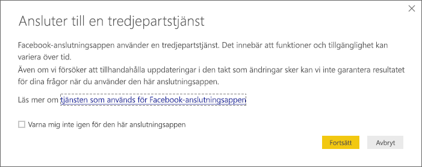
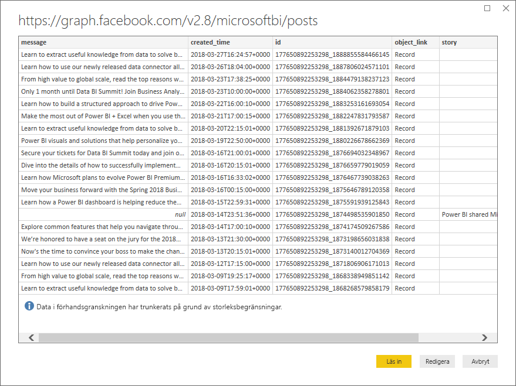
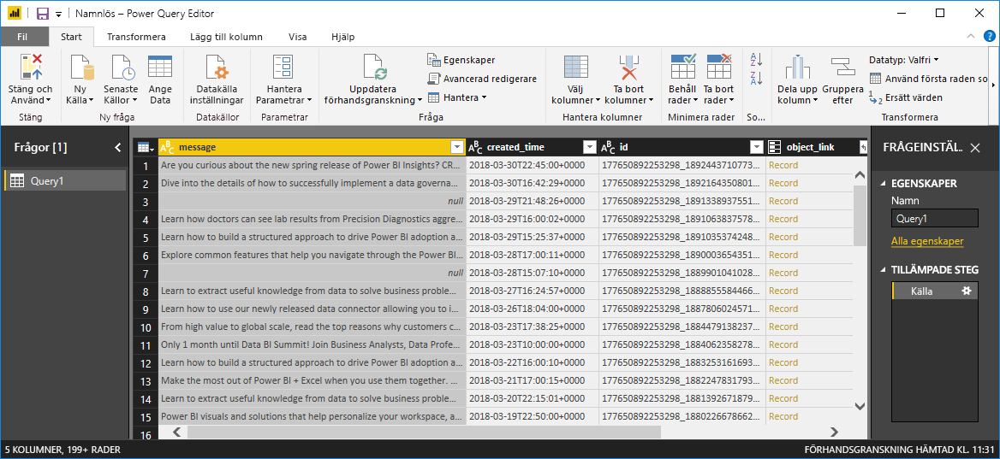
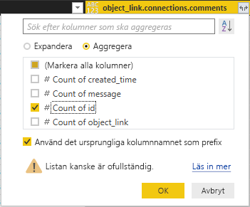
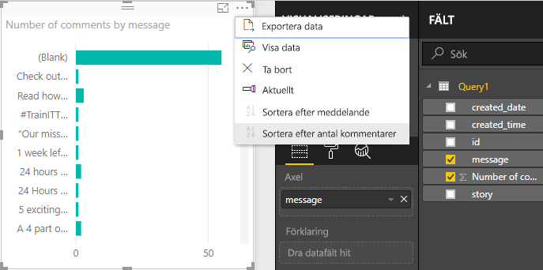
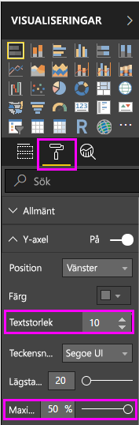
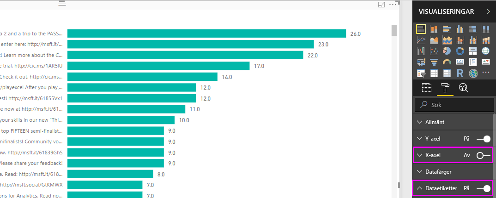
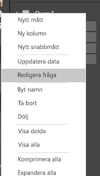
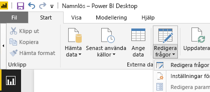
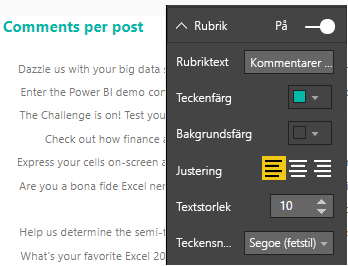

# Självstudier: Facebook-analyser med hjälp av Power BI Desktop

I den här kursen får du lära dig hur du importerar data från Facebook och använder dem i Power BI Desktop. Du kommer att ansluta och importera data från Power BI:s Facebook-sida, använda omformningar på importerade data och använda data i rapportvisualiseringar.

## Ansluta till en Facebook-sida

Den här kursen använder data från [Microsoft Power BI:s Facebook-sida](https://www.facebook.com/microsoftbi) (*https://www.facebook.com/microsoftbi*). Du behöver inte några särskilda autentiseringsuppgifter för att ansluta och importera data från den här sidan utom ett personligt Facebook-konto.

1. Öppna Power BI Desktop och välj **Hämta data** i dialogrutan **Komma igång** eller i menyfliksområdet **Start**, välj **Hämta data** och välj sedan **Mer ...** .
   
2. I dialogrutan **Hämta data** väljer du **Facebook** från gruppen **Onlinetjänster** och väljer sedan **Anslut**.
   
   
   
   En dialogruta visas för att varna dig om riskerna med att använda en tjänst från tredje part.
   
   
   
3. Välj **Fortsätt**. Dialogrutan **Facebook** visas.
   
4. Skriv eller klistra in sidnamn **microsoftbi** till textrutan **Användarnamn**, välj **Inlägg** från listrutan **Anslutning** och välj sedan **OK**.
   
   
   
5. När du tillfrågas om autentiseringsuppgifter, logga in till Facebook-kontot och ge Power BI åtkomst till ditt konto.
   
   

   När du ansluter till Power BI:s Facebook-sida kan du visa en förhandsgranskning av sidans **Inlägg**. 
   
   
   
## Forma och transformera importerade data

Du vill se och visa vilka inlägg som har mest kommentarer över tid, men du upptäcker i förhandsgranskningen **Inlägg** att data för **created_time** är svåra att läsa och förstå och det finns inga kommentarer alls. Du behöver utföra viss omformning och rensning av data för att få ut mesta möjliga information. Du kan använda Power BI Desktop **Power Query Editor** för att redigera data, före eller efter du importerar den till Power BI Desktop. 

### Dela kolumnen datum/tid

Avgränsa först värdena för datum och tid i kolumnen **created_time** så att de är lättare att läsa. 

1. I Facebook:s förhandsgranskning väljer du **Redigera**. 
   
   
   
   Power BI Desktop **Power Query Editor** öppnas i ett nytt fönster och visar förhandsgranskning från Power BI:s Facebook-sida. 
   
   
   
2. Välj kolumnen **created_time**. Observera att den för närvarande är av datatypen Text med en **ABC**-ikon som visas i kolumnrubriken. Högerklicka på kolumnrubriken och välj **Dela upp kolumn > efter avgränsare** i listrutan eller välj **Dela upp kolumn > efter avgränsare** under fliken **Transformera** i menyfliksområdet Start.  
   
   
   
3. I dialogrutan **Dela upp kolumn efter avgränsare** markerar du **Anpassad** i listrutan, anger **T** (tecknet som startar tidsdelen av created_time-värden) i indatafältet och väljer **OK**. 
   
   
   
   Kolumnen delas upp i två kolumner som innehåller strängarna före och efter avgränsaren **T** vilka har döpts till **created_time.1** och **created_time.2** respektive. Observera att Power BI automatiskt har identifierat och ändrat datatyperna till **datum** för den första kolumnen och **tid** för den andra kolumnen och formaterat värdena för datum och tid till att vara mer lättlästa.
   
4. Byt namn på kolumnerna genom att dubbelklicka på varje kolumnrubrik eller välja varje kolumn och sedan välja **Byt namn** i gruppen **Valfri kolumn** för fliken **transformera** i menyfliksområdet och skriva de nya kolumnrubrikerna **created_date** och **created_time** respektive.
   
   
   
### Expandera den kapslade kolumnen

Nu när data för datum och tid är på det sätt som du vill ha dem, ska du visa kommentarsdata genom att expandera en kapslad kolumn. 

1. Välj kolumnen **object_link** och välj sedan ikonen  för att öppna dialogrutan **Expandera/aggregera**. Välj **anslutningar**, och välj sedan **OK**. 
   
   
   
   Kolumnrubriken ändras till **object_link.connections**.
2. Välj ikonen  igen längst upp i kolumnen **object_link.connections**, välj **kommentarer**, och välj sedan **OK**. Kolumnrubriken ändras till **object_link.connections. comments**.
   
3. Välj ikonen  längst upp i kolumnen **object_link.connections.comments** och välj den här gången **Aggregera** i stället för att expandera i dialogrutan. Välj **# Antal ID**, och välj sedan **OK**. 
   
   
   
   Kolumnen visar nu antalet kommentarer för varje meddelande. 
   
4. Byt namn på kolumnen **Antal object_link.connections.comments.id** till **Antal kommentarer**.
   
5. Välj nedpilen bredvid rubriken **Antal kommentarer** och välj **Sortera fallande** för att se inläggen sorteras från de med flest antal kommentarer till de med minst. 
   
   
   
### Granska frågesteg

När du formade och omvandlade data i **Power Query Editor**, registrerades varje steg i området **Tillämpade steg** i rutan **Frågeinställningar** på höger sida av Power Query Editor-fönstret. Du kan gå tillbaka genom Tillämpade steg för att se exakt vilka ändringar du gjort, och redigera, ta bort eller ordna om dem om det behövs (även om det kan vara riskabelt, eftersom en ändring av ovanstående steg kan skada senare steg). 

Efter att dataomvandlingarna applicerats bör dina Tillämpade steg se ut som följande:
   
   
   
   >[!TIP]
   >Under Tillämpade steg finns formler som skrivits i **Power Query-språk**, även kallat **M**-språk. Om du vill se och redigera formlerna, välj **Avancerad redigerare** i gruppen **Fråga** på fliken Start i menyfliksområdet. 

### Importera omvandlade data

När du är nöjd med dessa data, välj **Stäng och tillämpa** > **Stäng och tillämpa** i fliken Start i menyfliksområdet för att importera till Power BI Desktop. 
   
   
   
   En dialogruta visar förloppet för att läsa in data i Power BI Desktop-datamodellen. 
   
   
   
   När data läses in visas de i rapporten som en ny fråga i fältlistan.
   
   
   
## Använd informationen i rapportvisualiseringarna 

Nu när du har importerat data från Facebook-sidan kan du snabbt och få enkelt insikter om dina data med visualiseringar. Det är enkelt att skapa en visualisering. Markera bara ett fält eller dra det från listan **Fält** till rapportarbetsytan.

### Skapa ett stapeldiagram

1. I Power BI Desktop-rapportvyn, välj **meddelande** från fältlistan eller dra det till arbetsytan. En tabell som visar alla meddelanden visas på arbetsytan. 
   
   
   
2. Med tabellen markerad väljer du också **Antal kommentarer** från fältlistan eller dra den till tabellen. 
   
3. Välj ikonen **Liggande stapeldiagram** i visualiseringsfönstret. Tabellen ändras till ett stapeldiagram som visar antal kommentarer per post. 
   
   
   
4. Välj ellipsen (...) överst till höger i visualiseringen och välj sedan **Sortera efter antal kommentarer** för att sortera tabellen efter fallande antal kommentarer. 
   
   
   
5. Observera att de flesta kommentarer har associerats med **tomma** meddelanden (dessa poster kan ha varit artiklar, länkar, videoklipp eller annat textinnehåll). Om du vill filtrera bort tomma rader, välj **meddelande (alla)** under **Filter** längst ned i visualiseringsfönstret, välj **Markera alla**, och välj sedan **Tom** för att avmarkera den. Posten Filter ändras till **meddelandet är inte (tomt)**, och den tomma raden försvinner från diagramvisualiseringen. 
   
   
   
### Formatera diagrammet

Visualiseringen blir intressantare, men du kan inte se mycket av inläggstexten i diagrammet. För att visa mer av inläggstexten:

1. Använd handtag på diagramvisualiseringen för att ändra storlek på diagrammet till att vara så stort som möjligt. 
   
2. När diagrammet är markerat, välj **Formatikonen** (färgrullen) i visualiseringsfönstret.
   
3. Välj nedpilen bredvid **y-axeln**, och dra skjutreglaget bredvid **maximal storlek** ända till höger (50 %). 
4. Minska också **textstorleken** till **10** för att få plats med mer text.
   
   
   
   Diagrammet visar nu mer av inläggsinnehållet. 
   
   
   
X-axeln (antal kommentarer) i diagrammet visar inte exakta värden och ser bortkommen ut längst ner i diagrammet. Du bestämmer dig för att använda dataetiketter i stället. 

1. Välj ikonen Format och välj sedan skjutreglaget bredvid **x-axeln** för att stänga **av** dem. 
   
2. Välj skjutreglaget bredvid **dataetiketter** för att sätta **på** dem. Diagrammet visar nu det exakta antalet kommentarer för varje inlägg.
   
   
   
### Redigera datatyp

Det var bättre, men alla dataetiketterna har en **.0**-decimal, vilket är störande och vilseledande eftersom **Antal inlägg** måste vara ett heltal. Du behöver ändra datatypen för kolumnen **Antal inlägg** till heltal.

1. Om du vill redigera datatypen högerklickar du på **Fråga1** i fältlistan eller hovrar över den och väljer ellipsen (...) **Fler alternativ** och väljer sedan **Redigera fråga**. Du kan också välja **Redigera frågor** från området **Externa data** i fliken Start i menyfliksområdet och sedan välja **Redigera frågor** i listrutan. Power BI Desktop **Power Query Editor** öppnas i ett separat fönster.
   
        
   
2. I Power Query Editor, välj kolumnen **Antal kommentarer** och ändra datatypen till **Heltal** genom att antingen: 
   - Välja ikonen **1.2** bredvid kolumnrubriken **Antal kommentarer** och välja **Heltal** i listrutan, eller
   - Högerklicka på kolumnrubriken och välja **Ändra typ > Heltal**, eller
   - Välja **Datatyp: decimaltal** i gruppen **Transformera** i fliken Start eller gruppen **Valfri kolumn** i fliken **Transformera** och välja **Heltal**.
   
   Ikonen i kolumnrubriken ändras till **123**, som anger en datatyp för heltal.
   
   
   
3. Välj **Stäng och tillämpa**, eller bara **Tillämpa** för att tillämpa ändringarna samtidigt som Power Query Editor-fönstret är öppet. När ändringarna laddas in blir dataetiketterna i diagrammet heltal. 
   
   
   
### Skapa ett datumutsnitt

Du vill visualisera antal kommentarer i inlägg över tid. Du kan skapa en utsnittsvisualisering för att filtrera diagramdata till olika tidsramar. 

1. Klicka på ett tomt område i arbetsytan och välj sedan **Ikonen utsnitt** i visualiseringsfönstret. En tom utsnittsvisualisering visas. 
   
   
   
2. Välj fältet **created_date** från fältlistan eller dra det till det nya utsnittet. Utsnittet ändras till ett skjutreglage för datumintervall baserat på fältets datatyp.
   
   
   
3. Flytta skjutreglagets handtag för att välja olika datumintervall och observera hur diagramdata filtreras därefter. Du kan också välja datumfälten i utsnittet och skriva in specifika datum eller välja dem från en kalendermeny.
    
   
   
### Formatera visualiseringar

Du bestämmer dig för att ge diagrammet en snygg och mer beskrivande rubrik. 

1. När diagrammet är markerat, väljer du ikonen **Format** och väljer den nedrullningsbara pilen för att expandera **Rubrik**.
2. Ändra **Rubriktexten** till **Kommentarer per post**. 
3. Välj den nedrullningsbara pilen bredvid **Teckenfärg**, och välj en grön färg som matchar de gröna staplarna i visualiseringen.
4. Öka **Textstorlek** till **10**, och ändra **Teckensnittsfamilj** till **Segoe (Bold)**.

Experimentera med andra formateringsalternativ och inställningar för att ändra utseendet på dina visualiseringar. 

## Skapa fler visualiseringar

Som du kan se är det enkelt att anpassa visualiseringar i rapporten för att visa data så som du vill. Försök till exempel att använda importerade Facebook-data för att skapa det här diagrammet till att visa antal kommentarer över tid.

I Power BI Desktop är det enkelt att hämta data från en stor mängd datakällor och utforma dem efter dina analysbehov för att visualisera datan på interaktiva sätt. När rapporten är klar kan du [ladda upp den på Power BI-tjänsten](desktop-upload-desktop-files.md) och skapa instrumentpanelen som baseras på den, och sedan dela den med andra Power BI-användare.

## Nästa steg
* [Läs andra Power BI Desktop-självstudier](http://go.microsoft.com/fwlink/?LinkID=521937)
* [Se Power BI Desktop-videor](http://go.microsoft.com/fwlink/?LinkID=519322)
* [Besök Power BI-forumet](http://go.microsoft.com/fwlink/?LinkID=519326)
* [Läs Power BI-bloggen](http://go.microsoft.com/fwlink/?LinkID=519327)

