# Självstudie: Analysera webbsidedata med Power BI Desktop

Som den stora fotbollsfantast du är vill du rapportera om vinnarna i fotbolls-EM (UEFA) under årens lopp. Med Power BI Desktop kan du importera data från en webbplats till en rapport och skapa grafik som visar data. I självstudien får du lära dig hur du använder Power BI Desktop för att:

- Ansluta till en webbdatakälla och navigera mellan dess tillgängliga tabeller,
- Forma och ändra data i **Power Query Editor**,
- Namnge en fråga och importera den till en Power BI Desktop-rapport och 
- Skapa och anpassa en visualisering för en karta och ett cirkeldiagram.

## Anslut till en webbdatakälla

Du kan hämta data om EM-vinnarna från resultattabellen på Wikipedias sidan om Europamästerskapet i fotboll på http://en.wikipedia.org/wiki/UEFA_European_Football_Championship. 

Observera att webbanslutningar upprättas med grundläggande autentisering. Webbplatser som kräver autentisering kanske inte fungerar korrekt med webbanslutningsappen.

Importera data:

1. I Power BI Desktop-menyfliken **Start** rulla ner pilen bredvid **Hämta data**, och välj sedan **Webb**.
   
   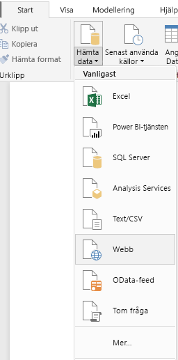 
   
   >[!NOTE]
   >Du kan också välja själva objektet **Hämta data** eller välja **Hämta data** från Power BI-dialogrutan **Kom igång**, välj sedan **Webb** från avsnittet **Alla** eller **Andra** i dialogrutan **Hämta data** och välj sedan **Anslut**.
   
2. I dialogrutan **Från webb** klistra in webbadressen `http://en.wikipedia.org/wiki/UEFA_European_Football_Championship` i **URL**-textrutan och välj sedan **OK**.
   
    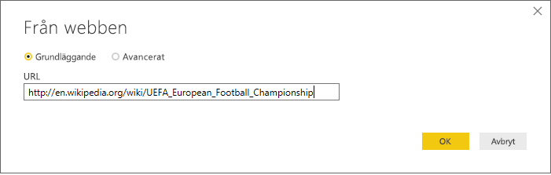
   
   När du har anslutit till Wikipedia-webbsidan visar Power BI-dialogrutan **Navigator** en lista över tillgängliga tabeller på sidan. Du kan välja något tabellnamn för att förhandsgranska dess data. Tabellen **Resultat [redigera]** har de data som du behöver, även om de inte är i exakt den form som du önskar. Du vill omforma och rensa data innan du läser in dem i rapporten. 
   
   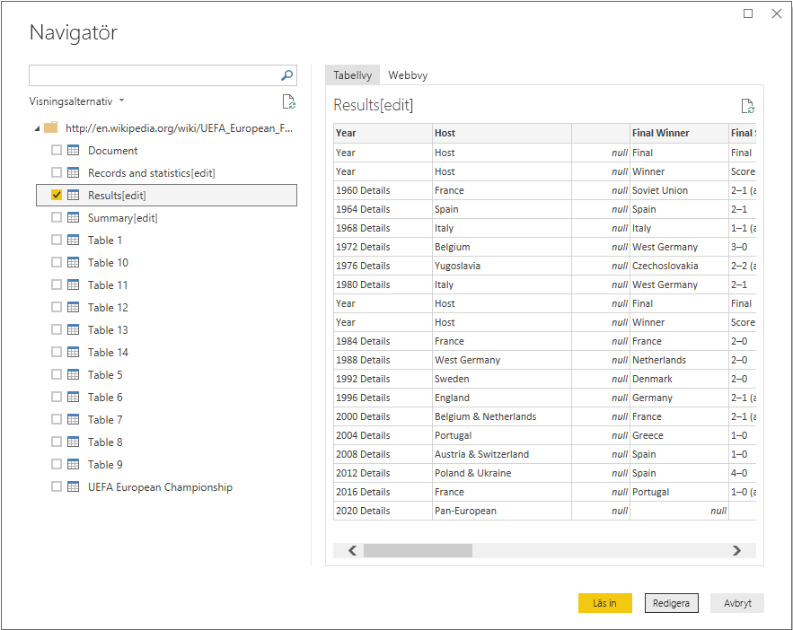
   
   >[!NOTE]
   >Fönstret **Förhandsgranska** visar den senast valda tabellen, men alla markerade tabeller kommer att läsas in i **Power Query Editor** när du väljer **Redigera** eller **Läs in**. 
   
3. Välj tabellen **Resultat [redigera]** i listan **Navigator** och välj sedan **Redigera**. 
   
   En förhandsgranskning av tabellen öppnas i **Power Query Editor**, där du kan använda omvandlingar för att rensa data. 
   
   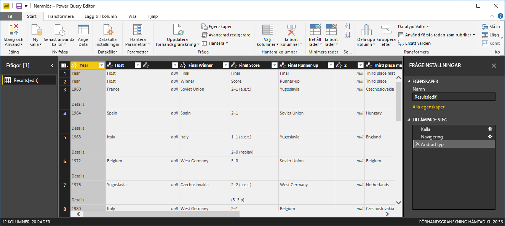
   
## Forma data i Power Query Editor

Du vill göra informationen lättare att söka igenom genom att visa endast år och de länder som vann. Du kan använda **Power Query Editor** för att utföra dessa dataomformningar och rensa.

I det här steget tar du bort alla kolumner utom **År** och **Finalvinnare** från tabellen.

1. I rutnätet **Power Query Editor**, välj kolumnerna **År** och **Finalvinnare** (håll ner **Ctrl** för att markera flera objekt).
   
2. Högerklicka och välj **Ta bort andra kolumner** från listrutan eller välj **Ta bort kolumner** > **Ta bort andra kolumner** från gruppen **Hantera kolumner** i menyflikområdet **Start** för att ta bort alla kolumner från tabellen. 
   
   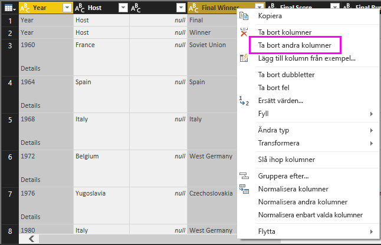 eller 

Ta sedan bort extraordet **Information** från kolumncellerna **År**.

1. Välj kolumnen **År**.
   
2. Högerklicka och välj **Ersätt värden** från listrutan eller välj **Ersätt värden** från gruppen **Transformera** i fliken **Start** i menyfliksområdet (finns även i gruppen **Valfri kolumn** i fliken **Transformera**). 
   
   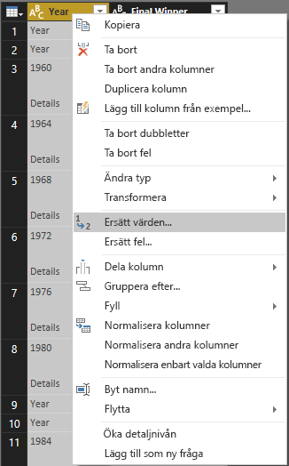 eller 
   
3. I dialogrutan **Ersätt värden** skriver du **Information** i textrutan **Värde att söka efter**, lämnar testrutan **Ersätt med** tom och väljer sedan **OK** för att ta bort ordet ”information” från posterna med **År**.
   
   

Vissa **År**-celler innehåller endast ordet ”år” i stället för årsvärden. Du kan filtrera kolumnen **År** till att endast visa rader som inte innehåller ordet ”År”. 

1. Välj filtrets listrutepil i kolumnen **År**.
   
2. Bläddra nedåt i listan, och avmarkera kryssrutan bredvid alternativet **År** och välj sedan **OK**, för att ta bort de rader som endast innehåller ordet ”år” i kolumnen **År**. 

   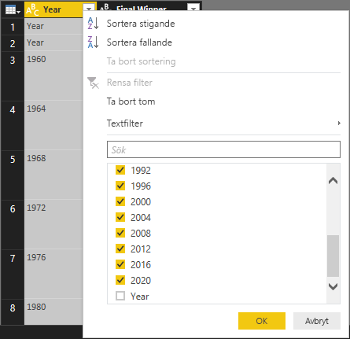

Nu när du har rensat data i kolumnen **År** kan du arbeta med kolumnen **Finalvinnare**. Eftersom du endast ser listan med data över finalvinnare nu kan du byta namn på kolumnen till **Land**. Byt namn på kolumnen:

1. Dubbelklicka på eller tryck och håll ned kolumnrubriken **Finalvinnare** eller 
   - Högerklicka på kolumnrubriken **Finalvinnare** och välj **Byt namn** i listrutan eller 
   - Välj kolumnen **Finalvinnare** och välj **Byt namn** från gruppen **Valfri kolumn** i fliken **Transformera** i menyfliksområdet. 
   
   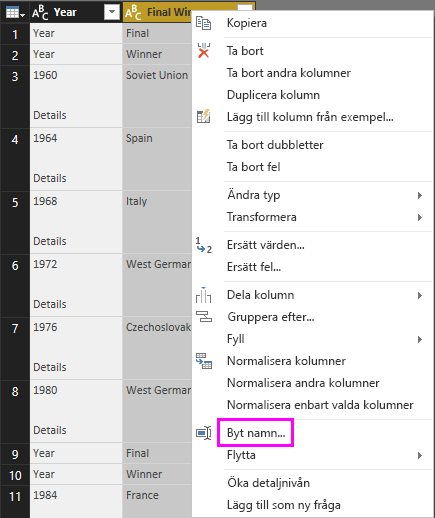 eller 
   
2. Skriv in **Land** i sidhuvudet och tryck på **Retur** för att byta namn på kolumnen.

Du vill också filtrera bort rader som ”2020” som har null-värden i kolumnen **Land**. Du kan använda filtermenyn som du gjorde med värdena **År** eller så kan du:

1. Högerklicka på cellen **Land** i raden **2020** som har värdet *null*. 
2. Välj **Textfilter** > **Är inte lika med** på snabbmenyn för att ta bort alla rader som innehåller denna cells värde.
   
   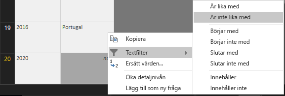
   
## Importera frågan i rapportvyn

Nu när du har format data som du vill, är du redo att namnge din fråga ”EM-vinnare” och importera den till rapporten.

1. I fönstret **Frågeinställningar** i textrutan **Namn** skriver du **EM-vinnare** och trycker sedan på **Retur**.
   
   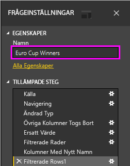

2. Välj **Stäng och tillämpa** > **Stäng och tillämpa** från fliken **Start** i menyfliksområdet.
   
   
   
Frågan läses in i Power BI Desktop **rapportvyn** där du kan se den i fönstret **Fält**. 
   
   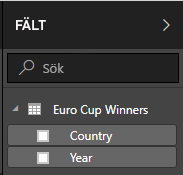
>[!TIP]
>Du kan alltid komma tillbaka till **Power Query Editor** för att redigera och förfina frågan genom att:
>- Välja ellipsen ( **...** ) **Fler alternativ** bredvid **EM- vinnare** i rutan **Fält** och välja **Redigera fråga** i listrutan, eller
>- Välja **Redigera frågor** > **Redigera frågor** i gruppen **Externa data** för menyfliken **Start** i rapportvyn. 

## Skapa en visualisering

Skapa en visualisering baserat på dina data: 

1. Välj fältet **Land** i rutan **Fält** eller dra det till rapportarbetsytan. Power BI Desktop identifierar data som landsnamn och skapar automatiskt en **kart**-visualisering. 
   
   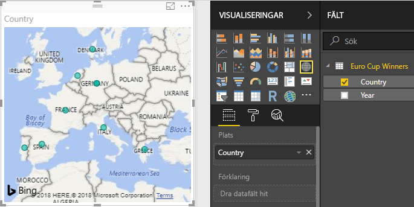
   
2. Förstora kartan genom att dra i handtagen i hörnen så visas alla vinnande landsnamn.  

   
   
3. Kartan visar identiska datapunkter för varje land som vann en EM-turnering. Om du vill att storleken på varje datapunkt återspeglar hur ofta landet har vunnit, dra fältet **År** till **Dra datafält hit** under **Storlek** i den nedre delen av fönstret **Visualiseringar**. Fältet ändras automatiskt till måttet **Antal år** och kartvisualiseringen visar nu större datapunkter för land som har vunnit fler turneringar. 
   
   
   

## Anpassa visualiseringen

Som du kan se är det mycket enkelt att skapa visualiseringar baserade på dina data. Det är också enkelt att anpassa dina visualiseringarna för att bättre presentera data på de sätt som du önskar. 

### Formatera kartan
Du kan ändra utseendet på en visualisering genom att markera den och sedan välja ikonen **Format** (roller) i fönstret **Visualiseringar**. Till exempel kan datapunken(erna) ”Tyskland” i din visualiseringen vara vilseledande eftersom Västtyskland vann två turneringar och Tyskland vann en och kartan skriver över de två punkterna i stället för att avgränsa eller lägga ihop dem. Du kan färglägga dessa två punkter på olika sätt för att markera det här. Du kan också ge kartan en mer beskrivande och attraktiv rubrik. 

1. Med visualiseringen vald, väljer du ikonen **Formatera** och sedan **Datafärger** för att expandera datafärgsalternativen. 
   
   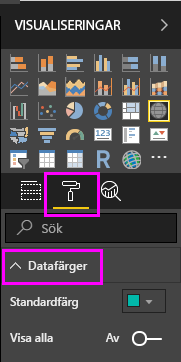
   
2. Sätt **Visa alla** till **På**, och välj sedan listrutan bredvid **Västtyskland** och välj en gul färg. 
   
   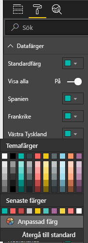
   
3. Välj **Rubrik** för att expandera rubrikalternativ, och i fältet **Rubrik** anger du **EM-vinnare** i stället för den aktuella titeln. 
4. Ändra **Teckenfärg** till röd, **Textstorlek** till **12**, och **Teckensnittsfamilj** till **Segoe (Bold)** . 
   
   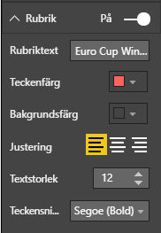
   

Din kartvisualisering ser nu ut så här:

   
### Ändra visualiseringstyp
Du kan ändra typ för en visualisering genom att markera den och sedan välja en annan ikon överst i fönstret **Visualisering**. Till exempel saknar kartvisualiseringen data för Sovjetunionen och Tjeckoslovakien, eftersom dessa länder inte längre finns på världskartan. En annan typ av visualisering t.ex. ett treemap- eller cirkeldiagram kan vara mer exakt, eftersom de visar alla värden. 

Ändra kartan till ett cirkeldiagram, välj sedan ikonen **Cirkeldiagram** i fönstret **Visualisering**. 
   
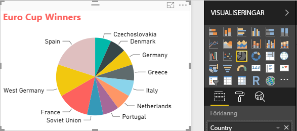

>[!TIP]
>- Du kan använda formateringsalternativen **Datafärger** för att göra ”Tyskland” och ”Västtyskland” till samma färg. 
>- För att gruppera samman länder med flest vinster på cirkeldiagrammet, välj elipsen ( **...** ) längst upp till höger om visualiseringen och välj sedan **Sortera efter antal år** i listrutan. 

I Power BI Desktop är det enkelt att hämta data från en stor mängd datakällor och utforma dem efter dina analysbehov för att visualisera datan på interaktiva sätt. När rapporten är klar kan du [ladda upp den på Power BI](desktop-upload-desktop-files.md) och skapa instrumentpanelen som baseras på den, och sedan dela den med andra Power BI-användare.

## Se också
* [Läs andra Power BI Desktop-självstudier](http://go.microsoft.com/fwlink/?LinkID=521937)
* [Se Power BI Desktop-videor](http://go.microsoft.com/fwlink/?LinkID=519322)
* [Besök Power BI-forumet](http://go.microsoft.com/fwlink/?LinkID=519326)
* [Läs Power BI-bloggen](http://go.microsoft.com/fwlink/?LinkID=519327)

