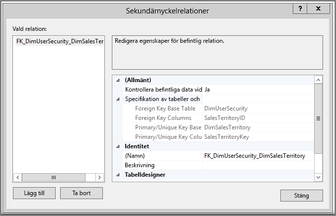
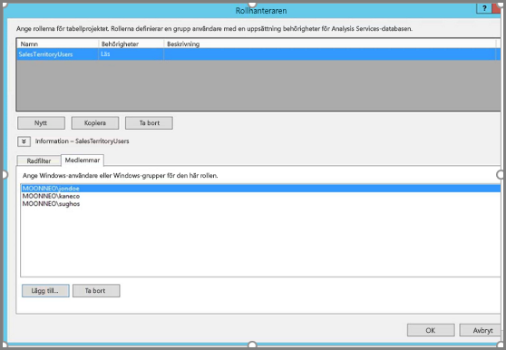
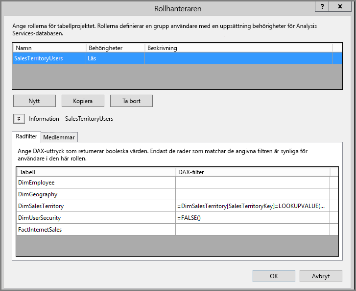
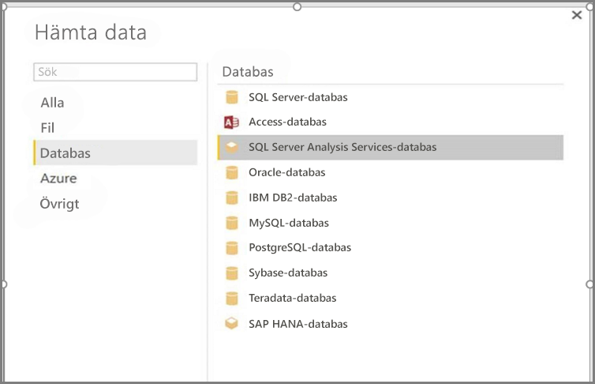
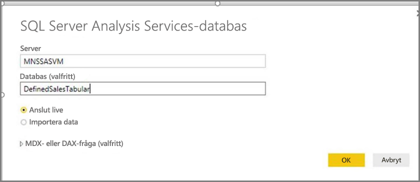
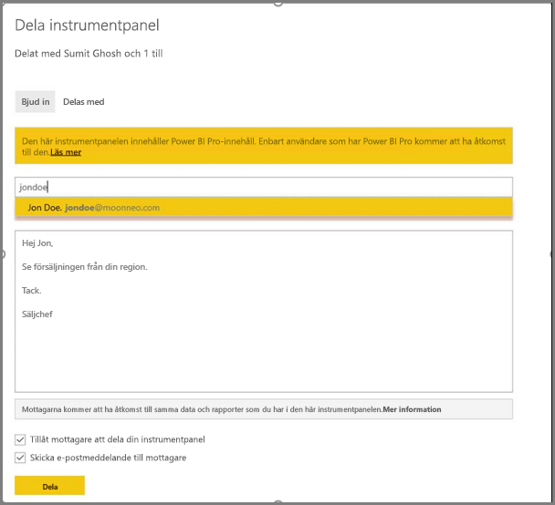
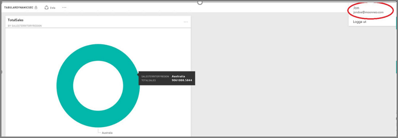

# <a name="dynamic-row-level-security-with-analysis-services-tabular-model"></a>Dynamisk säkerhet på radnivå med Analysis Services-tabellmodell

När du använder en exempeldatamängd och går igenom stegen nedan får du i den här självstudien lära dig att implementera [**säkerhet på radnivå**](service-admin-rls.md) för en **tabellmodell i Analysis Services** och använda den i en Power BI-rapport. 

* Skapa en ny säkerhetstabell i databasen [**AdventureworksDW2012**](https://github.com/Microsoft/sql-server-samples/releases/tag/adventureworks)
* Skapa tabellmodellen med nödvändiga fakta- och dimensionstabeller
* Definiera användarroller och behörigheter
* Distribuera modellen till en **Analysis Services-tabell**instans
* Skapa en Power BI Desktop-rapport som visar data anpassade till användaren som öppnar rapporten
* Distribuera rapporten till **Power BI-tjänsten**
* Skapa en ny instrumentpanel som baseras på rapporten
* Dela instrumentpanelen med dina medarbetare 

För den här självstudien behöver du databasen [**AdventureworksDW2012**](https://github.com/Microsoft/sql-server-samples/releases/tag/adventureworks).

## <a name="task-1-create-the-user-security-table-and-define-data-relationship"></a>Uppgift 1: Skapa användarens säkerhetstabell och definiera datarelationen

Det finns många artiklar som beskriver hur du definierar dynamisk säkerhet på radnivå med **tabellmodellen i SQL Server Analysis Services (SSAS)** . I vårt exempel använder vi [Implement Dynamic Security by Using Row Filters](https://docs.microsoft.com/analysis-services/tutorial-tabular-1200/supplemental-lesson-implement-dynamic-security-by-using-row-filters) (Implementera dynamisk säkerhet med hjälp av radfilter). 

För stegen här måste du använda relationsdatabasen **AdventureworksDW2012**.

1. Öppna **AdventureworksDW2012** och skapa tabellen **DimUserSecurity** enligt nedan. Du kan använda [SQL Server Management Studio (SSMS)](https://docs.microsoft.com/sql/ssms/download-sql-server-management-studio-ssms) till att skapa tabellen.
   
   

2. När du har skapat och sparat tabellen måste du upprätta en relation mellan **DimUserSecurity**-tabellens **SalesTerritoryID**-kolumn och **DimSalesTerritory**-tabellens **SalesTerritoryKey**-kolumn, se nedan. 

   I **SSMS** högerklickar du på tabellen **DimUserSecurity** och väljer **Design**. Välj sedan **Tabelldesigner -> Relationer...** . Spara tabellen när du är färdig.
   
   

3. Lägga till användare i tabellen: högerklicka på tabellen **DimUserSecurity** och välj **Redigera de översta 200 raderna**. När du har lagt till användare ska tabellen **DimUserSecurity** se ut ungefär så här, men med dina egna användare:
   
   
   
   Du kommer att se de här användarna i senare uppgifter.

4. Nu ska du göra en *inre koppling* med tabellen **DimSalesTerritory**, som visar regionsinformation för användarna. Den här SQL-koden skapar den *inre kopplingen*, i bilden ser du hur tabellen visas efteråt.
   
       select b.SalesTerritoryCountry, b.SalesTerritoryRegion, a.EmployeeID, a.FirstName, a.LastName, a.UserName from [dbo].[DimUserSecurity] as a join  [dbo].[DimSalesTerritory] as b on a.[SalesTerritoryID] = b.[SalesTerritoryKey]
   
   

   Bilden visar vem som ansvarar för varje försäljningsregion, tack vare relationen du skapade i **steg 2**. Du kan till exempel se att **Jon Doe** ansvarar för **Australia**. 

## <a name="task-2-create-the-tabular-model-with-facts-and-dimension-tables"></a>Uppgift 2: Skapa tabellmodellen med fakta- och dimensionstabeller

1. När ditt relationsinformationslager finns på plats ska du definiera tabellmodellen. Du kan skapa modellen med hjälp av [**SQL Server Data Tools (SSDT)** ](https://docs.microsoft.com/sql/ssdt/sql-server-data-tools). Mer information finns i [Skapa ett nytt tabellmodellprojekt](https://msdn.microsoft.com/library/hh231689.aspx).

2. Importera alla nödvändiga tabeller till modellen enligt vad som visas nedan.
   
    

3. När du har importerat tabellerna som krävs, måste du definiera en roll med namnet **SalesTerritoryUsers** med **Läs** behörighet. Välj menyn **Modell** i SQL Server Data Tools och välj sedan **Roller**. I dialogrutan **Rollhanteraren** väljer du **Ny**.

4. På fliken **Medlemmar** i **Rollhanteraren** lägger du till de användare som du definierade i tabellen **DimUserSecurity** i **Uppgift 1 – steg 3**.
   
    

5. Lägg till rätt funktioner för både **DimSalesTerritory**- och **DimUserSecurity**-tabellerna enligt vad som visas nedan på fliken **Radfilter**.
   
    

6. I det här steget ska du använda funktionen **LOOKUPVALUE** till att returnera värden för en kolumn där Windows-användarnamnet matchar namnet som returneras av funktionen **USERNAME**. Du kan sedan begränsa frågor till platsen där värden som returneras av **LOOKUPVALUE** matchar värdena i samma eller en relaterad tabell. I kolumnen **DAX-filter** skriver du följande formel:
   
       =DimSalesTerritory[SalesTerritoryKey]=LOOKUPVALUE(DimUserSecurity[SalesTerritoryID], DimUserSecurity[UserName], USERNAME(), DimUserSecurity[SalesTerritoryID], DimSalesTerritory[SalesTerritoryKey])

    I den här formeln returnerar funktionen **LOOKUPVALUE** alla värden för kolumnen **DimUserSecurity[SalesTerritoryID]** när **DimUserSecurity[UserName]** är samma som det aktuella inloggade Windows-användarnamnet och **DimUserSecurity[SalesTerritoryID]** är samma som **DimSalesTerritory[SalesTerritoryKey]** .
   
    > [!IMPORTANT]
    > När du använder säkerhet på radnivå saknas stöd för DAX-funktionen [USERELATIONSHIP](https://msdn.microsoft.com/query-bi/dax/userelationship-function-dax).

   Uppsättningen för SalesTerritoryKey som returnerades av **LOOKUPVALUE** används sedan för att begränsa de rader som visas i **DimSalesTerritory**. Endast rader där **SalesTerritoryKey**-värdet finns med bland de ID:n som returnerades av funktionen **LOOKUPVALUE** visas.

7. Lägg till följande formel för tabellen **DimUserSecurity** i kolumnen **DAX Filter**:
   
       =FALSE()

    Den här formeln anger att alla kolumner får värdet `false`, vilket innebär du inte kan köra frågor mot kolumner i tabellen **DimUserSecurity**.

8. Nu ska du bearbeta och distribuera modellen. Mer information finns i [artikeln om distribution](https://msdn.microsoft.com/library/hh231693.aspx).

## <a name="task-3-add-data-sources-within-your-on-premises-data-gateway"></a>Uppgift 3: Lägga till datakällor inom din lokala datagateway

När din tabellmodell är distribuerad och är redo för användning, måste du lägga till en datakällsanslutning till din lokala Analysis Services-tabellserver.

1. För att kunna ge **Power BI-tjänsten** åtkomst till din lokala analystjänst behöver du en **[lokal datagateway](service-gateway-onprem.md)** installerad och konfigurerad i miljön.

2. När gatewayen är korrekt konfigurerad måste du skapa en datakällsanslutning för din **Analysis Services**-tabellinstans. Mer information finns i [Hantera din datakälla – Analysis Services](service-gateway-enterprise-manage-ssas.md).
   
   

  När det föregående steget är klart är gatewayen konfigurerad och redo att interagera med din lokala **Analysis Services**-datakälla.

## <a name="task-4-create-report-based-on-analysis-services-tabular-model-using-power-bi-desktop"></a>Uppgift 4: Skapa en rapport baserad på Analysis Services-tabellmodellen med Power BI Desktop

1. Vi börjar i **Power BI Desktop** och väljer **Hämta data > Databas**.

2. I listan med datakällor väljer du **SQL Server Analysis Services-databas** och sedan **Anslut**.
   
   

3. Fyll i informationen för **Analysis Services**-tabellinstansen och välj **Anslut live**. Välj sedan **OK**. I **Power BI** fungerar dynamisk säkerhet enbart med en **live-anslutning**.
   
   

4. Du ser att den distribuerade modellen finns i **Analysis Services**-instansen. Välj respektive modell och sedan **OK**.
   
   

   **Power BI Desktop** visar nu alla tillgängliga fält till höger om arbetsytan i fönstret **Fält**.

5. I fönstret **Fält** till höger väljer du **SalesAmount**-måttet från **FactInternetSales**-tabellen och **SalesTerritoryRegion**-dimensionen från **SalesTerritory**-tabellen.

6. Vi vill hålla rapporten enkel och lägger därför inte till fler kolumner just nu. Data återges mer meningsfullt om du ändrar visualiseringen till ett **ringdiagram**.
   
   

7. När rapporten är klar kan du publicera den direkt till Power BI-portalen. Välj **Publicera** i menyfliksområdet **Start** i **Power BI Desktop**.

## <a name="task-5-create-and-share-a-dashboard"></a>Uppgift 5: Skapa och dela en instrumentpanel

1. Du har skapat rapporten och publicerat den till **Power BI**-tjänsten. Nu kan du använda exemplet som skapades i föregående steg till att demonstrera modellsäkerhetsscenariot.
   
   I rollen som **Sales Manager** så kan Sumit se data från alla olika försäljningsregioner. Sumit skapar den här rapporten (rapporten du skapade i föregående uppgift) och publicerar den till Power BI-tjänsten.
   
   När Sumit publicerar rapporten blir nästa steg att skapa en instrumentpanel i Power BI-tjänsten med namnet **TabularDynamicSec** som baseras på rapporten. I följande bild ser du att Sumit kan visa data för alla försäljningsregioner.
   
   

2. Nu delar Sumit instrumentpanelen med sin kollega Jon Doe, som ansvarar för försäljningen i regionen Australia.
   
   
   
   

3. När Jon Doe loggar in på **Power BI**-tjänsten och visar den delade instrumentpanel som Sumit skapade ska **endast** försäljningen från deras region visas. 
   
   

    Grattis! **Power BI-tjänsten** visar den dynamiska säkerhet på radnivå som definierats i den lokala **Analysis Services**-tabellmodellen. Power BI använder egenskapen **EffectiveUserName** till att skicka den aktuella Power BI-användarens autentiseringsuppgifter till den lokala datakällan för att köra frågorna.

## <a name="task-6-understand-what-happens-behind-the-scenes"></a>Uppgift 6: Förstå vad som händer i bakgrunden

I den här uppgiften förutsätts att du känner till [SQL Profiler](https://docs.microsoft.com/sql/tools/sql-server-profiler/sql-server-profiler), eftersom du behöver samla in en SQL Server-profilspårning från din lokala SSAS-tabellinstans.

1. Sessionen initieras när användaren (Jon Doe) öppnar instrumentpanelen i Power BI-tjänsten. Kan du se att rollen **salesterritoryusers** börjar gälla omedelbart med det gällande användarnamnet **<EffectiveUserName>jondoe@moonneo.com</EffectiveUserName>**
   
       <PropertyList><Catalog>DefinedSalesTabular</Catalog><Timeout>600</Timeout><Content>SchemaData</Content><Format>Tabular</Format><AxisFormat>TupleFormat</AxisFormat><BeginRange>-1</BeginRange><EndRange>-1</EndRange><ShowHiddenCubes>false</ShowHiddenCubes><VisualMode>0</VisualMode><DbpropMsmdFlattened2>true</DbpropMsmdFlattened2><SspropInitAppName>PowerBI</SspropInitAppName><SecuredCellValue>0</SecuredCellValue><ImpactAnalysis>false</ImpactAnalysis><SQLQueryMode>Calculated</SQLQueryMode><ClientProcessID>6408</ClientProcessID><Cube>Model</Cube><ReturnCellProperties>true</ReturnCellProperties><CommitTimeout>0</CommitTimeout><ForceCommitTimeout>0</ForceCommitTimeout><ExecutionMode>Execute</ExecutionMode><RealTimeOlap>false</RealTimeOlap><MdxMissingMemberMode>Default</MdxMissingMemberMode><DisablePrefetchFacts>false</DisablePrefetchFacts><UpdateIsolationLevel>2</UpdateIsolationLevel><DbpropMsmdOptimizeResponse>0</DbpropMsmdOptimizeResponse><ResponseEncoding>Default</ResponseEncoding><DirectQueryMode>Default</DirectQueryMode><DbpropMsmdActivityID>4ea2a372-dd2f-4edd-a8ca-1b909b4165b5</DbpropMsmdActivityID><DbpropMsmdRequestID>2313cf77-b881-015d-e6da-eda9846d42db</DbpropMsmdRequestID><LocaleIdentifier>1033</LocaleIdentifier><EffectiveUserName>jondoe@moonneo.com</EffectiveUserName></PropertyList>

2. Baserat på förfrågningen från det aktuella användarnamnet konverterar Analysis Services förfrågan till autentiseringsuppgifterna moonneo/jondoe efter att ha skickat en fråga till den lokala Active Directory. När **Analysis Services** får autentiseringsuppgifterna returnerar **Analysis Services** de data som användaren har behörighet att visa och komma åt.

3. Om det uppstår mer aktivitet i instrumentpanelen, till exempel om Jon Doe går från instrumentpanelen till den underliggande rapporten, kan med SQL Profiler en specifik fråga komma tillbaka till Analysis Services-tabellmodellen som en DAX-fråga.
   
   

4. Nedan kan du även se den DAX-fråga som körs för att fylla i rapportdata.
   
   ```
   EVALUATE
     ROW(
       "SumEmployeeKey", CALCULATE(SUM(Employee[EmployeeKey]))
     )
   
   <PropertyList xmlns="urn:schemas-microsoft-com:xml-analysis">``
             <Catalog>DefinedSalesTabular</Catalog>
             <Cube>Model</Cube>
             <SspropInitAppName>PowerBI</SspropInitAppName>
             <EffectiveUserName>jondoe@moonneo.com</EffectiveUserName>
             <LocaleIdentifier>1033</LocaleIdentifier>
             <ClientProcessID>6408</ClientProcessID>
             <Format>Tabular</Format>
             <Content>SchemaData</Content>
             <Timeout>600</Timeout>
             <DbpropMsmdRequestID>8510d758-f07b-a025-8fb3-a0540189ff79</DbpropMsmdRequestID>
             <DbPropMsmdActivityID>f2dbe8a3-ef51-4d70-a879-5f02a502b2c3</DbPropMsmdActivityID>
             <ReturnCellProperties>true</ReturnCellProperties>
             <DbpropMsmdFlattened2>true</DbpropMsmdFlattened2>
             <DbpropMsmdActivityID>f2dbe8a3-ef51-4d70-a879-5f02a502b2c3</DbpropMsmdActivityID>
           </PropertyList>
   ```

## <a name="considerations"></a>Att tänka på

* Lokal säkerhet på radnivå med Power BI är bara tillgänglig med en live-anslutning.

* Om data ändras efter att modellen har bearbetats visas de omedelbart för användare som har åtkomst till rapporten via en **liveanslutning** från Power BI-tjänsten.

