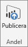
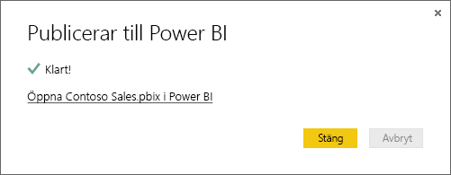

# Publicera från Power BI Desktop
När du publicerar en **Power BI Desktop**-fil till **Power BI-tjänsten** publiceras data i modellen och de rapporter som du skapade i **Rapportvyn** till Power BI-arbetsytan. En ny datamängd med samma namn och eventuella rapporter visas i navigatorfältet för arbetsytan.

Publicering från **Power BI Desktop** har samma effekt som att använda **Hämta Data** i Power BI för att ansluta till och ladda upp en **Power BI Desktop**-fil.

> [!NOTE]
> De ändringar du gör i rapporten i Power BI, till exempel om du lägger till, tar bort eller ändrar visualiseringar i rapporten, sparas inte i den ursprungliga **Power BI Desktop**-filen.
> 
> 

## Så här publicerar du en Power BI Desktop-datauppsättning och rapporter
1. I Power BI Desktop väljer du **Arkiv** \> **Publicera** \> **Publicera till Power BI**, eller klickar på **Publicera** menyfliksområdet.  

   

2. Logga in i Power BI.
3. Välj målet.

   

När du är klar visas en länk till rapporten. Öppna rapporten på din Power BI-plats genom att klicka på länken.

## Publicera eller ersätta en datamängd som har publicerats från Power BI Desktop
När du publicerar en **Power BI Desktop**-fil överförs datauppsättningen och alla rapporter som du skapade i **Power BI Desktop** till Power BI-platsen. När du publicerar **Power BI Desktop**-filen ersätts datamängden i Power BI-platsen med den uppdaterade datauppsättningen från **Power BI Desktop**-filen.

Processen är tydlig, men det finns ett par saker som du bör känna till:

* Om du redan har två eller fler datauppsättningar i Power BI med samma namn som **Power BI Desktop**-filen kan publiceringen misslyckas. Kontrollera att du bara har en datauppsättning i Power BI med samma namn. Du kan också byta namn på filen och publicera den, vilket skapar en ny datauppsättning med samma namn som filen.
* Om du byter namn på eller ta bort en kolumn eller ett mått kan alla visualiseringar som du redan har i Power BI med fältet skadas. 
* Power BI ignorerar vissa formatändringar av befintliga kolumner. Till exempel om du ändrar formatet för en kolumn från 0,25 till 25 %.
* Om du har ett uppdateringsschema som har konfigurerats för en befintlig datauppsättning i Power BI och du lägger till nya datakällor i filen och sedan publicerar, måste du logga in till dem i *Hantera datakällor* före nästa schemalagda uppdatering.
* När du återpublicerar en datauppsättning som har publicerats från **Power BI Desktop** och har ett definierat uppdateringsschema, initieras en uppdatering av datauppsättningen så snart du publicerar igen. 

