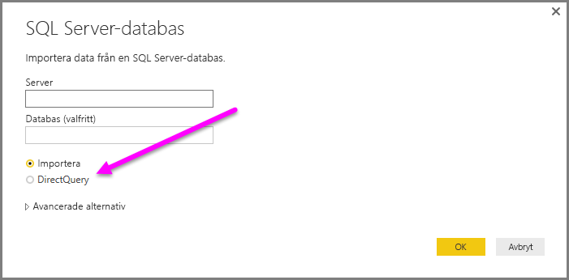
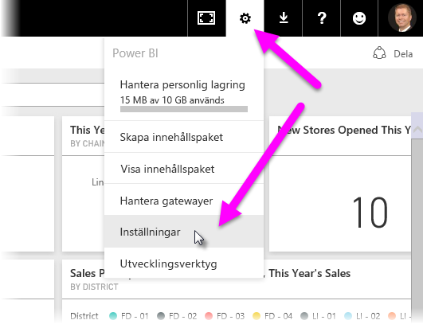
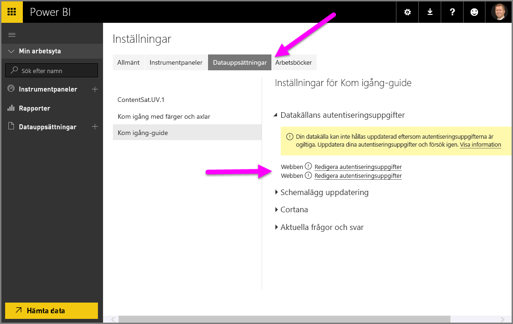

# Använda DirectQuery i Power BI Desktop
Med **Power BI Desktop** när du ansluter till datakällan, är det alltid möjligt att importera en kopia av data till **Power BI Desktop**. En annan metod är tillgänglig för vissa datakällor: ansluta direkt till datakällan med **DirectQuery**.

## Datakällor som stöds
För en fullständig lista över datakällor som stöder **DirectQuery**, se [Datakällor som stöds av DirectQuery](desktop-directquery-data-sources.md).

## Ansluta med DirectQuery
När du använder **Hämta data** för att ansluta till en datakälla som stöds av **DirectQuery** kan du välja anslutningsmetod i anslutningsfönstret.  

Skillnader mellan att välja **Importera** och **DirectQuery** är följande:

**Importera** – valda tabeller och kolumner importeras till **Power BI Desktop**. När du skapar eller interagera med en visualisering använder **Power BI Desktop** den importerade informationen. Du måste uppdatera data, vilket importerar hela datauppsättningen på nytt, för att visa ändringar i underliggande data sedan den första importeringen eller den senaste uppdateringen.

**DirectQuery** – inga data importeras eller kopieras till **Power BI Desktop**. För relationella källor visas valda tabeller och kolumner i listan **Fält**. Flerdimensionella källor som SAP Business Warehouse dimensioner och mått i den markerade kuben visas i listan **Fält**. När du skapar eller interagerar med en visualisering frågar **Power BI Desktop** den underliggande datakällan, vilket innebär att du alltid visar aktuella data.

Många datamodelleringar och datatransformationer är tillgängliga när du använder **DirectQuery**, men med vissa begränsningar. När du skapar eller interagerar med en visualisering måste den underliggande källan efterfrågas och tiden som behövs för att uppdatera visualiseringen är beroende av prestandan hos den underliggande datakällan. När nödvändiga data för att hantera begäran nyligen har begärts använder Power BI Desktop senaste data för att minska tiden som krävs för att visa det visuella objektet. Genom att välja **Uppdatera** från menyfliksområdet **Start** kommer alla visualiseringar uppdateras med aktuella data.

Artikeln [Power BI och DirectQuery](desktop-directquery-about.md) beskriver **DirectQuery** i detalj. Se även följande avsnitt för mer information om fördelar och begränsningar samt viktiga överväganden när du använder **DirectQuery**.

## Fördelar med att använda DirectQuery
Det finns några fördelar med att använda **DirectQuery**:

* Med **DirectQuery** kan du skapa visualiseringar över mycket stora datamängder där det annars skulle vara ohållbart att först importera alla data med förhandsaggregering
* Ändringar i underliggande data kan kräva att data uppdateras och för vissa rapporter kan behovet av att visa aktuella data kräva stora dataöverföringar, vilket gör det ohållbart att importera data på nytt. Däremot använder **DirectQuery**-rapporter alltid aktuella data
* 1 GB datamängdsbegränsning gäller *inte* för **DirectQuery**

## Begränsningar hos DirectQuery
Det finns några begränsningar med att använda **DirectQuery**:

* Alla tabeller måste komma från en enda databas, om du inte använder [sammansatta modeller](desktop-composite-models.md)

* Om frågan till **frågeredigeraren** är alltför komplex uppstår ett fel. För att åtgärda felet måste du antingen ta bort det problematiska steget i **frågeredigeraren** eller *importera* data istället för att använda **DirectQuery**. För flerdimensionella källor som SAP Business Warehouse finns ingen **frågeredigerare**

* Tidsinformationsfunktioner är inte tillgängliga i **DirectQuery**. Till exempel stöds särskild behandling för datumkolumnerna (år, kvartal, månad, dag, osv) inte i **DirectQuery**-läget.

* Det finns begränsningar för DAX-uttryck som tillåts i mått så att frågor som skickas till den underliggande datakällan har acceptabel prestanda.

* Det finns en begränsning på en miljon rader för att returnera data när du använder **DirectQuery**. Denna begränsning påverkar inte aggregeringar eller beräkningar som används för att skapa datauppsättningen som returneras med **DirectQuery**, utan endast rader som returneras. Du kan till exempel sammanställa 10 miljoner rader med din fråga som körs på datakällan och korrekt returnerar resultat som aggregeringar till Power BI med hjälp av **DirectQuery** så länge data som returneras till Power BI är mindre än 1 miljon rader. Om mer än 1 miljoner rader ska returneras från **DirectQuery** returnerar Power BI ett fel.

## Att tänka på när du använder DirectQuery
Följande tre punkter ska beaktas när du använder **DirectQuery**:

* **Prestanda och belastning** – alla **DirectQuery**-begäranden skickas till källdatabasen så att den tid som krävs för att uppdatera ett visuellt objekt är beroende av hur lång tid tar att svara med resultatet från frågan (eller frågorna). Den rekommenderade svarstiden (där begärda data returneras) för att använda **DirectQuery** för visuella objekt är fem sekunder eller mindre, med en maximal rekommenderad resultatsvarstid på 30 sekunder. Om det tar längre blir upplevelsen för användaren oacceptabel. När en rapport har publicerats till Power BI-tjänsten kan dessutom alla frågor som tar längre tid än några minuter avbrytas och användaren får ett felmeddelande.
  
  Belastningen på källdatabasen bör också övervägas, baserat på antalet Power BI-användare som kommer att använda den publicerade rapporten. Användning av *säkerhet på radnivå* (RLS) kan ha en betydande inverkan; en icke-RLS-instrumentpanel delas av flera användare resultat i en enskild fråga till databasen, men med RLS på en instrumentpanel innebär att en uppdatering av en panel kräver en fråga *per användare*, vilket ökar belastningen på källdatabasen avsevärt och potentiellt påverkar prestandan.
  
  Power BI skapar så effektiva frågor som möjligt. Under vissa omständigheter kan frågan som skapas vara otillräckligt effektiv för att garantera ett uppdateringar lyckas. Ett exempel på detta är när en genererad fråga returnerar ett mycket stort antal rader från serverdelskällan, i vilket fall följande fel inträffar:
  
      The resultset of a query to external data source has exceeded
  
  Den här situationen kan uppstå med ett enkelt diagram som innehåller en mycket hög kardinalitet-kolumn med aggregeringsalternativet inställt på *Sammanfatta inte*. Visuella objekt behöver endast ha kolumner med en kardinalitet under 1 miljon och behöver tillämpa lämpliga filter.
* **Säkerhet** – Som standard kan alla användare som använder en publicerad rapport ansluta till serverdelens datakälla med autentiseringsuppgifter som anges efter publiceringen till Power BI-tjänsten. Samma gäller för data som importeras: alla användare ser samma data, oavsett eventuella säkerhetsregler som definierats i serverdelskällan. Kunder som vill att säkerhet per användare ska implementeras med DirectQuery-källor, bör antingen använda RLS eller konfigurera Kerberos-begränsad autentisering mot källan. Kerberos är inte tillgängligt för alla källor. [Läs mer om RLS](service-admin-rls.md). [Läs mer om Kerberos i DirectQuery](https://docs.microsoft.com/power-bi/service-gateway-sso-kerberos). 
* **Funktioner som stöds** -det är inte alla funktioner i **Power BI Desktop** som stöds i **DirectQuery**-läge eller har vissa begränsningar. Dessutom finns vissa funktioner i Power BI-tjänsten (t.ex. *snabba insikter*) som inte är tillgängliga för användning med datauppsättningar i **DirectQuery**. Således ska begränsningen av dessa funktioner när du använder **DirectQuery** beaktas när du bestämmer om du vill använda **DirectQuery**.   

## Registrera dig på Power BI-tjänsten
Rapporter som skapas med **DirectQuery** kan senare publiceras i Power BI-tjänsten.

Om den använda datakällan inte behöver en **lokal datagateway** (**Azure SQL Database**, **Azure SQL Data Warehouse** eller **Redshift**) måste autentiseringsuppgifter anges innan den publicerade rapporten kan visas i Power BI-tjänsten.

Du kan ange autentiseringsuppgifter genom att välja kugghjulsikonen för **inställningar** i Power BI och sedan välja **Inställningar**.

Power BI visar fönstret **Inställningar**. Därifrån väljer du fliken **Datauppsättningar** och väljer den datauppsättning som använder **DirectQuery**. Välj **Redigera autentiseringsuppgifter**.

Tills autentiseringsuppgifter tillhandahålls uppstår ett fel om du öppnar en publicerad rapport eller utforskar en datauppsättning som har skapats med en **DirectQuery**-anslutning till sådana datakällor.

För andra datakällor än **Azure SQL Database**, **Azure SQL Data Warehouse** och **Redshift** som använder DirectQuery, måste en **lokal datagateway** vara installerad och datakällan måste vara registrerad för att upprätta en dataanslutning. Läs mer om [lokal datagateway](https://go.microsoft.com/fwlink/p/?LinkID=627094).

## Nästa steg
Mer information om **DirectQuery** finns i följande resurser:

* [DirectQuery i Power BI](desktop-directquery-about.md)
* [Datakällor som stöds av DirectQuery](desktop-directquery-data-sources.md)
* [DirectQuery och SAP BW](desktop-directquery-sap-bw.md)
* [DirectQuery och SAP HANA](desktop-directquery-sap-hana.md)
* [On-premises data gateway (Lokal datagateway)](service-gateway-onprem.md)

