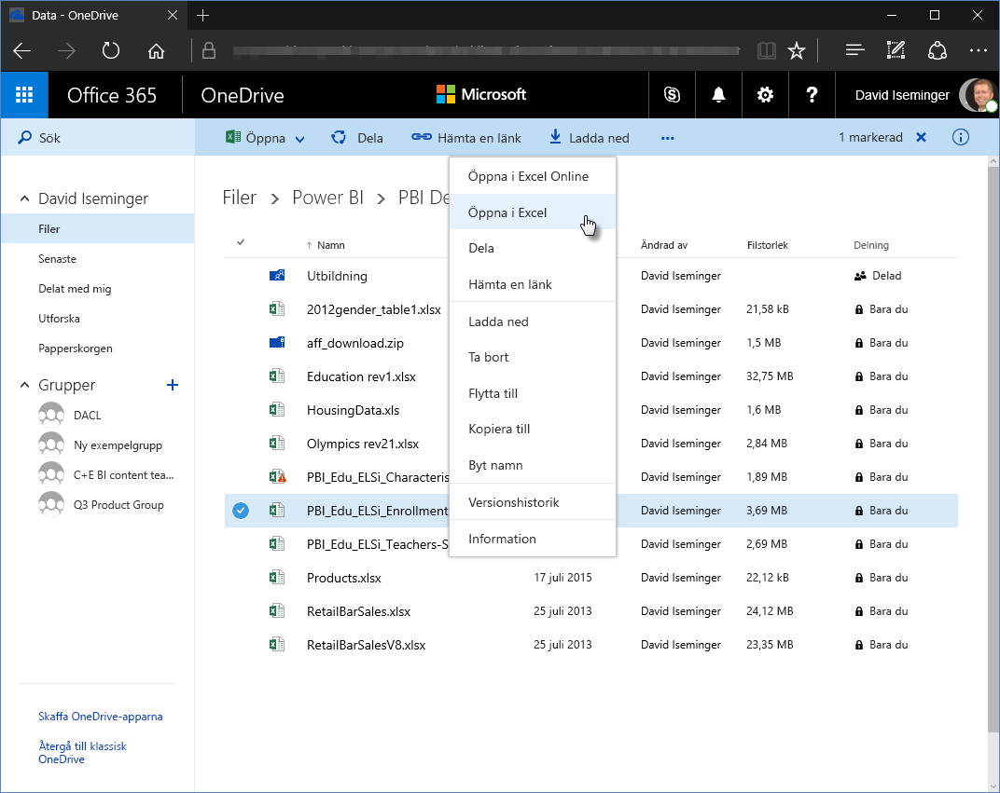

# Använd OneDrive för företag-länkar i Power BI Desktop
Många har Excel-arbetsböcker lagrade på OneDrive för företag som skulle vara perfekta att använda med Power BI Desktop. Med Power BI Desktop kan du använda onlinelänkar för Excel-filer som lagras i OneDrive för företag till att skapa rapporter och visuella objekt. Du kan använda ett OneDrive för företag-gruppkonto eller ditt personliga OneDrive för företag-konto.

Att hämta en onlinelänk från OneDrive för företag kräver dock några specifika steg. I följande avsnitt beskriver vi dessa steg som låter dig dela fillänken med grupper, på olika datorer och med dina medarbetare.

## Hämta en länk från Excel
1. Gå till platsen för OneDrive för företag med webbläsaren. Högerklicka på filen du vill använda och välj **Öppna i Excel**.
   
   > [!NOTE]
   > Webbläsarens gränssnitt kanske inte ser exakt likadant ut som på följande bild. Det finns flera olika sätt att välja **Öppna i Excel** för filer i webbläsargränssnittet för OneDrive för företag. Du kan använda valfritt alternativ som låter dig öppna filen i Excel.
   > 
   > 
   
   
2. I Excel väljer du **Arkiv** > **Info** och därefter **Kopiera sökväg** ovanför **Skydda arbetsbok**.
   
   

## Använda länken i Power BI Desktop
I Power BI Desktop kan du använda länken som du nyss kopierade till Urklipp. Gör följande:

1. I Power BI Desktop väljer du **Hämta data** > **Webb**.
   
   
2. När du har valt alternativet **Basic** (Grundläggande) klistrar du in länken i dialogrutan **Från webben**.
3. Ta bort strängen *?web=1* i slutet av länken så Power BI Desktop kan navigera till din fil ordentligt, och välj sedan **OK**.
   
     
4. Om Power BI Desktop ber dig om autentiseringsuppgifter väljer du antingen **Windows** (för lokala SharePoint-webbplatser) eller **Organisationskonto** (för Office 365 eller OneDrive för företag-webbplatser).
   
   

   En **Navigatörsdialogruta** öppnas där du kan välja i listan med tabeller, blad och intervall som finns i Excel-arbetsboken. Därifrån kan du använda OneDrive för företag-filen precis som vilken Excel-fil som helst. Du kan skapa rapporter och använda dem i datamängder på samma sätt som med andra datakällor.

> [!NOTE]
> Om du vill använda en OneDrive för företag-fil som datakälla i Power BI-tjänsten med **Uppdatera tjänst** aktiverat för filen måste du välja **OAuth2** som **Autentiseringsmetod** när du konfigurerar uppdateringsinställningarna. Annars kan ett fel uppstå (t.ex. *Det gick inte att uppdatera datakällans autentiseringsuppgifter*) när du försöker ansluta eller uppdatera. Om du väljer **OAuth2** som autentiseringsmetod åtgärdas detta problem.
> 
> 

