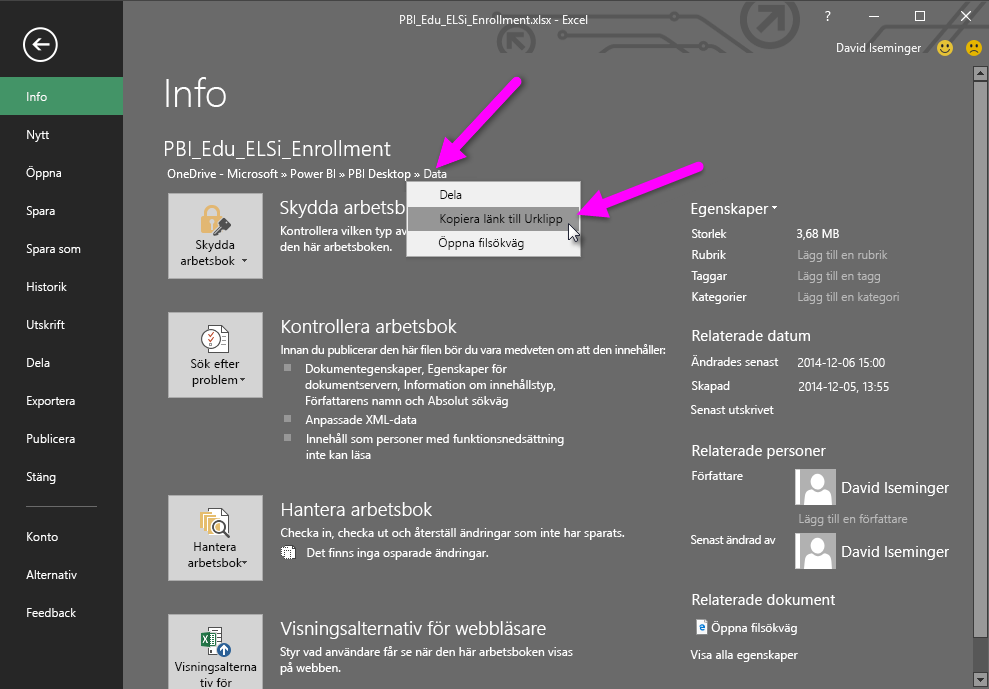
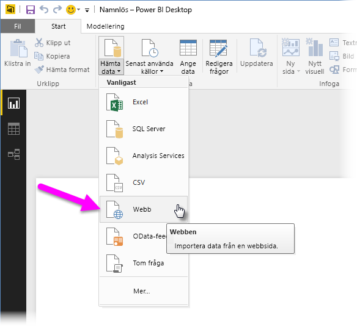
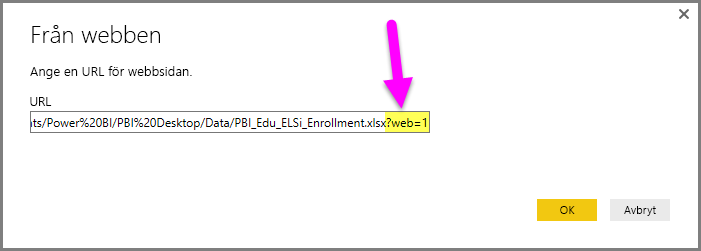

# Använd OneDrive för företag-länkar i Power BI Desktop
Många har Excel-arbetsböcker lagrade på sin OneDrive för företag som skulle vara perfekta att använda med Power BI Desktop. Med **Power BI Desktop** kan du använda onlinelänkar för **Excel**-filer som lagras i **OneDrive för företag** till att skapa rapporter och visuella objekt. Du kan använda ett **OneDrive för företag**-gruppkonto eller ditt personliga **OneDrive för företag**-konto.

Att hämta en onlinelänk från **OneDrive för företag** kräver dock några specifika steg. I följande avsnitt beskriver vi dessa steg som låter dig dela fillänken med grupper, på olika datorer och med dina medarbetare.

## Hämta en länk från Excel genom att öppna webbläsaren
1. Gå till platsen för OneDrive för företag med webbläsaren. Högerklicka på filen du vill använda och välj **Öppna i Excel**.
   
   > [!NOTE]
> Webbläsarens gränssnitt kanske inte ser exakt likadant ut som på följande bild. Det finns flera olika sätt att välja **Öppna i Excel** för filer i webbläsargränssnittet för **OneDrive för företag**. Du kan använda valfritt alternativ som låter dig öppna filen i Excel.
   > 
   > 
   
   
2. I **Excel** väljer du först **Arkiv > Information** och sedan länken ovanför knappen **Skydda arbetsbok**. Välj **Kopiera länken till Urklipp** (i din version kan det stå **Kopiera sökvägen till Urklipp**).
   
   

## Använda länken i Power BI Desktop
I Power BI Desktop kan du använda länken som du nyss kopierade till Urklipp. Gör följande:

1. I Power BI Desktop väljer du **Hämta data > Webb**.
   
   
2. Klistra in länken i dialogrutan **Från webben** (välj **inte** OK än).
   
    
3. Observera strängen *?web=1* i slutet av länken – du måste *ta bort den delen från webb-URL:ens sträng* **innan** du väljer **OK** för att **Power BI Desktop** ska kunna navigera till filen.
4. Om **Power BI Desktop** ber dig om autentiseringsuppgifter väljer du antingen **Windows** (för lokala SharePoint-webbplatser) eller **Organisationskonto** (för Office 365 eller OneDrive för företag-webbplatser).
   
   

**Navigatören** öppnas där du kan välja i listan med tabeller, blad och intervall som finns i Excel-arbetsboken. Därifrån kan du använda OneDrive för företag-filen på samma sätt som med andra Excel-filer, skapa rapporter och använda dem i datauppsättningar på samma sätt som med andra datakällor.

> [!NOTE]
> Om du vill använda **OneDrive för företag**-filen som datakälla i Power BI-tjänsten med **Uppdatera tjänst** aktiverat för filen, måste du välja **OAuth2** som **Autentiseringsmetod** när du konfigurerar uppdateringsinställningarna. Annars kan ett fel uppstå (t.ex. *Det gick inte att uppdatera datakällans autentiseringsuppgifter*) när du försöker ansluta eller uppdatera. Om du väljer **OAuth2** som autentiseringsmetod åtgärdas detta problem.
> 
> 

