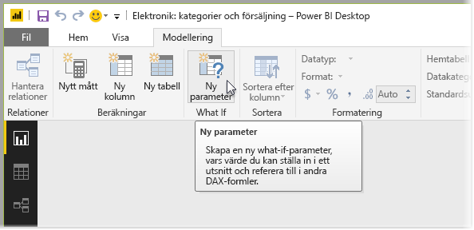
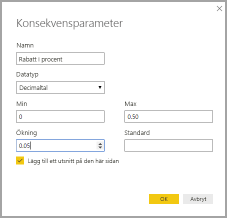
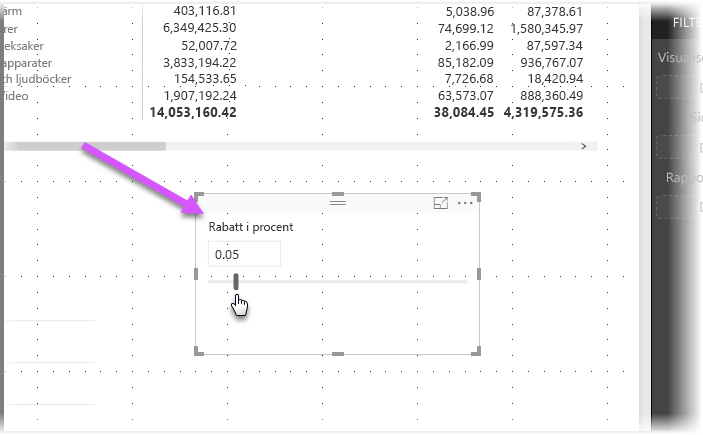
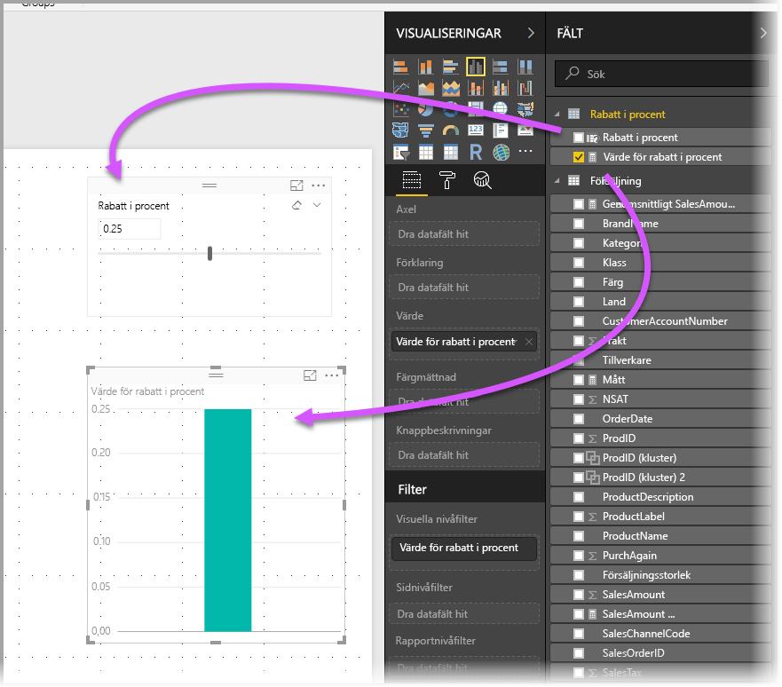
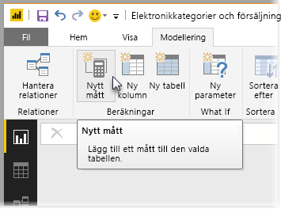
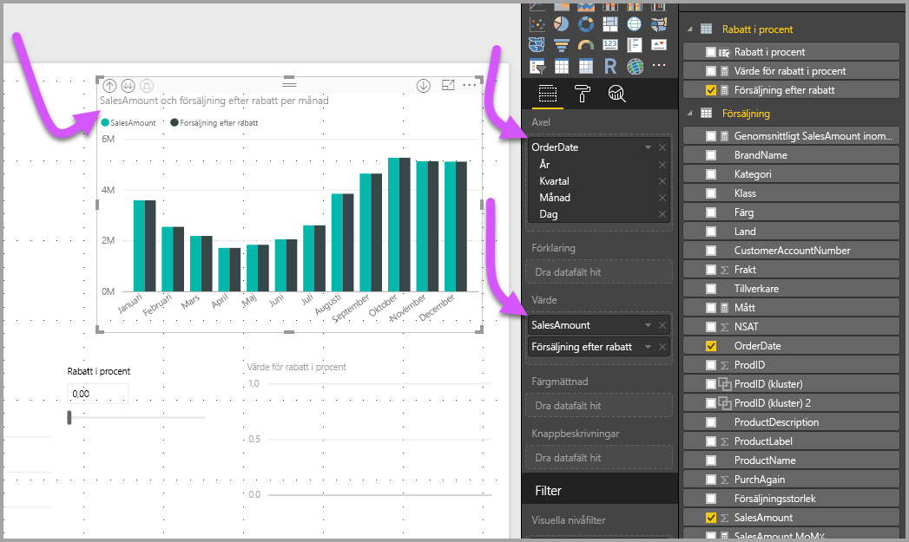
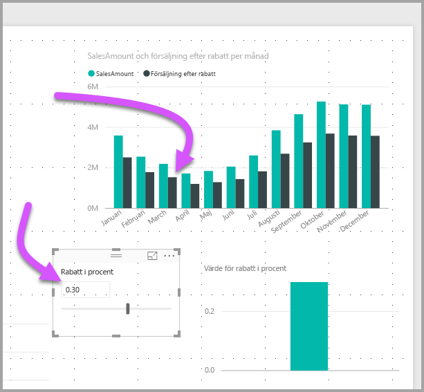

# Skapa och använd en Vad om-parameter för att visualisera variabler i Power BI Desktop
Från och med augusti 2017-utgåvan av **Power BI Desktop**, kan du skapa **Vad om**-variabler för dina rapporter, interagera med variablerna som ett utsnitt och därmed visualisera och kvantifiera olika nyckelvärden i dina rapporter.

**Vad om**-parametern finns i fliken **Modellering** i **Power BI Desktop**. När du väljer den, visas en dialogruta där du kan konfigurera parametern.

## Skapa en Vad om-parameter
Du skapar en **Vad om**-parameter genom att välja knappen **Vad om** från fliken **Modellering** i **Power BI Desktop**. I följande bild har vi skapat en parameter som heter *rabattprocent* och ställt in dess datatyp till *Decimaltal.* *Minimi*värdet är noll, *Max* är 0,50 (50 procent). Vi har också ställt in *inkrementet* till 0,05 eller fem procent. Det är så mycket parametern justeras när du har interagerat med den i rapporten.

> [!NOTE]
> Kontrollera för decimaltal att du skriver noll innan, som i 0,50 istället för bara ,50. Annars kommer numret inte att valideras och **OK**-knappen kan inte väljas.
> 
> 

För din bekvämlighet sätter kryssrutan **Lägg till ett utsnitt till den här sidan** automatiskt ett utsnitt med din **Vad om**-parameter på den aktuella rapportsidan.

Förutom att skapa parametern, skapar en **Vad om**-parameter också ett mått som du kan använda för att visualisera det aktuella värdet för **Vad om**-parametern.

Det är viktigt och användbart att vara medveten om att när du skapar en **Vad om**-parameter så blir både parametern och måttet en del av din modell. De finns därmed tillgängliga i hela rapporten och kan användas på andra rapportsidor. Och eftersom de är en del av modellen, kan du ta bort utsnittet från rapportsidan eller om du vill ha det tillbaka, behöver du bara hämta **Vad om**-parametern från **Fält**-listan och dra den till arbetsytan (ändra därefter visualiseringen till ett utsnitt) för att enkelt hämta tillbaka parametern till rapporten.

## Använd en Vad om-parameter
Nu ska vi skapa ett enkelt exempel på hur du använder en **Vad om**-parameter. Vi har skapat **Vad om**-parametern i det föregående avsnittet, nu ska vi använda det genom att skapa ett nytt mått vars värde justeras med skjutreglaget. För att åstadkomma detta skapar vi ett nytt mått.

Det nya måttet ska bara vara de totala försäljningssiffrorna med den diskonteringsränta som tillämpas. Du kan givetvis skapa komplexa och intressanta mått, som låter dina rapporters användare visualisera variabeln för din **Vad om**-parameter. Du kan till exempel skapa en rapport som gör att säljare ser sin kompensation om de uppfyller vissa säljmål eller procentsatser, eller ser relationen mellan ökad försäljning och mer rabatter.

När vi anger måttformeln i formelfältet och ger den namnet **försäljning efter rabatt**, ser vi dess resultat:

Sedan skapar vi en kolumnvisualisering med *OrderDate* på axeln och både *SalesAmount* och det just skapade måttet *Försäljning efter rabatt* som värden.

Sedan, när vi flytta skjutreglaget, ser vi att kolumnen *försäljning efter rabatt* återspeglar det reducerade försäljningsbeloppet.

Det är allt. Du kan använda **Vad om**-parametrar i alla typer av situationer, för att låta rapportanvändare interagera med olika scenarier som du skapar i dina rapporter.

