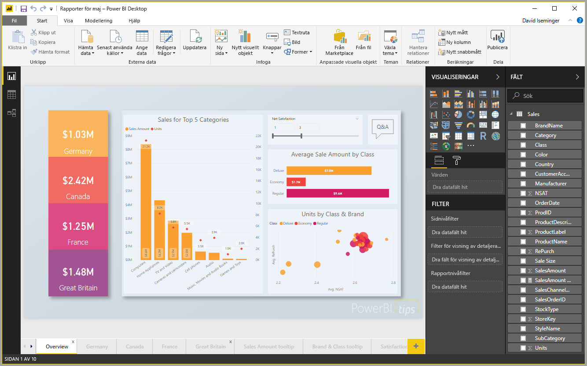
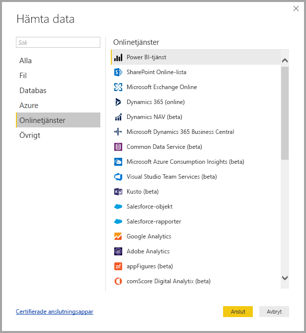
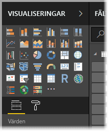
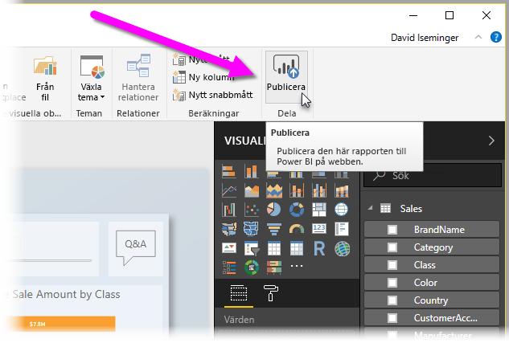

# Vad är Power BI Desktop?

*Power BI Desktop* är ett kostnadsfritt program som du installerar lokalt i datorn och som gör att du kan ansluta till, transformera och visualisera dina data. Med Power BI Desktop kan du ansluta till många olika datakällor och kombinera dem i en datamodell (detta kallas ofta *modellering*). Med den här datamodellen kan du skapa visuella objekt och samlingar av visuella objekt som du kan dela som rapporter med andra personer i din organisation. De flesta användare som arbetar i Business Intelligence-projekt använder Power BI Desktop till att skapa rapporter och sedan *Power BI-tjänsten* till att dela sina rapporter med andra.

Här är de vanligaste användningsområdena för Power BI Desktop:

* Ansluta till data
* Transformera och rensa dessa data för att skapa en datamodell
* Skapa visuell information, till exempel diagram som ger visuella representationer av data
* Skapa rapporter som är samlingar av visuell information på en eller flera rapportsidor
* Dela rapporter med andra via Power BI-tjänsten

De personer som ansvarar för sådana uppgifter kallas ofta för *dataanalytiker* (ibland bara *analytiker*) eller BI-tekniker (kallas ofta för *rapportskapare*). Men många som inte anser sig vara analytiker eller rapportskapare använder sig också av Power BI Desktop för att skapa övertygande rapporter eller för att hämta data från olika källor och skapa datamodeller som de kan dela med sina medarbetare och organisationer.

Det finns tre vyer i Power BI Desktop som du väljer längs med arbetsytans vänstra sida. Här är vyerna, i den ordning de presenteras:
* **Rapport**: I den här vyn skapar du rapporter och visuella objekt, det är här du tillbringar mest tid när du skapar.
* **Data**: I den här vyn ser du tabeller, mått och andra data som används i datamodellen som rapporten är associerad med, och du kan transformera data så att de passar rapportens modell.
* **Modell**: I den här vyn kan du se och hantera relationerna mellan tabellerna i din datamodell.

I den här bilden ser du de tre vyerna, såsom de visas längs med arbetsytans vänstra sida:

 

## Ansluta till data
När du ska komma igång med Power BI Desktop börjar du med att ansluta till data. Du kan ansluta till många typer av datakällor från Power BI Desktop. 

Ansluta till data:

1. Gå till menyfliksområdet **Start** och välj **Hämta data** > **Mer**. 

   Du ser fönstret **Hämta data** med alla de kategorier som Power BI Desktop kan ansluta till.

   

2. När du väljer en datatyp, uppmanas du att ange information, till exempel URL och autentiseringsuppgifter som krävs för att Power BI Desktop ska kunna ansluta till datakällan för din räkning.

   

3. När du har anslutit till en eller flera datakällor kanske du vill transformera dina data så att de blir mer användbara.

## Transformera och rensa data, skapa en modell

Du kan rensa och transformera data i Power BI Desktop med hjälp av den inbyggda [Power Query-redigeraren](https://docs.microsoft.com/power-bi/desktop-query-overview). I Power Query-redigeraren kan du göra ändringar i dina data, som att ändra datatyp, ta bort kolumner eller kombinera data från flera källor. Det är lite som att skulptera. Du börjar med en stor klump lera (eller data) och täljer sedan bort olika bitar och lägger till andra tills dina data har den form du är ute efter. 

Så här startar du Power Query-redigeraren:

- Välj **Redigera frågor** > **Redigera frågor** från menyfliksområdet **Start**.

   Fönstret **Power Query-redigeraren** visas.

   

Varje transformeringssteg du tar (som att byta namn på en tabell, omvandla en datatyp eller ta bort en kolumn) registreras av Power Query-redigeraren. Varje gång frågan ansluter till datakällan utförs de här stegen så att data alltid formas på det sätt du anger.

I den här bilden ser du fönstret **Power Query-redigeraren** för en fråga som har formats och omvandlats till en modell.

 

När dina data är som du vill ha dem så kan du skapa visuell information. 

## Skapa visuella objekt 

När du har en datamodell kan du dra *fält* till rapportarbetsytan och skapa *visuella objekt*. Ett visuellt objekt är en grafisk representation av data i din modell. Det finns många olika typer av visuell information att välja mellan i Power BI Desktop. Följande visuella information visar ett enkelt stapeldiagram. 

Skapa eller ändra ett visuellt objekt: 

- Välj ikonen för visuella objekt i fönstret **Visualiseringar**. 

   

   Om du redan har valt ett visuellt objekt på rapportarbetsytan så ändras det till den typ du har valt. 

   Om inget visuellt objekt är markerat på arbetsytan skapas ett nytt baserat på ditt val.

## Skapa rapporter

Vanligare är att du vill skapa en samling visuella objekt som visar olika aspekter av de data du har använt till att skapa din modell i Power BI Desktop. En samling med visuell information i en Power BI Desktop-fil kallas en *rapport*. En rapport kan innehålla en eller flera sidor, precis som en Excel-fil kan ha ett eller flera kalkylblad. 

Med Power BI Desktop kan du skapa komplexa och visuellt omfattande rapporter med hjälp av data från flera källor i en enda rapport som du sedan delar med andra i din organisation.

I den här bilden ser du första sidan i en Power BI Desktop-rapport med namnet **Overview**, du ser namnet på fliken i bildens nederkant. 

## Dela rapporter

När en rapport är redo att delas med andra kan du *publicera* den till Power BI-tjänsten och göra den tillgänglig för alla i din organisation som har en Power BI-licens. 

Så här publicerar du en Power BI Desktop-rapport: 

1. Välj **Publicera** i menyfliksområdet **Start**.

   

   Power BI Desktop ansluter till Power BI-tjänsten med ditt Power BI-konto. 

2. Du får välja var i Power BI-tjänsten du vill dela rapporten, till exempel din arbetsyta, en teamarbetsyta eller någon annan plats i Power BI-tjänsten. 

   Du måste ha en Power BI-licens för att dela rapporter till Power BI-tjänsten.

## Nästa steg

När du ska komma igång med Power BI Desktop är det första du behöver göra att ladda ned och installera programmet. Det finns två sätt att hämta Power BI Desktop:

* [Hämta Power BI Desktop från Windows Store](https://aka.ms/pbidesktopstore)
* [Hämta Power BI Desktop från webben](https://docs.microsoft.com/power-bi/desktop-get-the-desktop#download-power-bi-desktop-directly)

