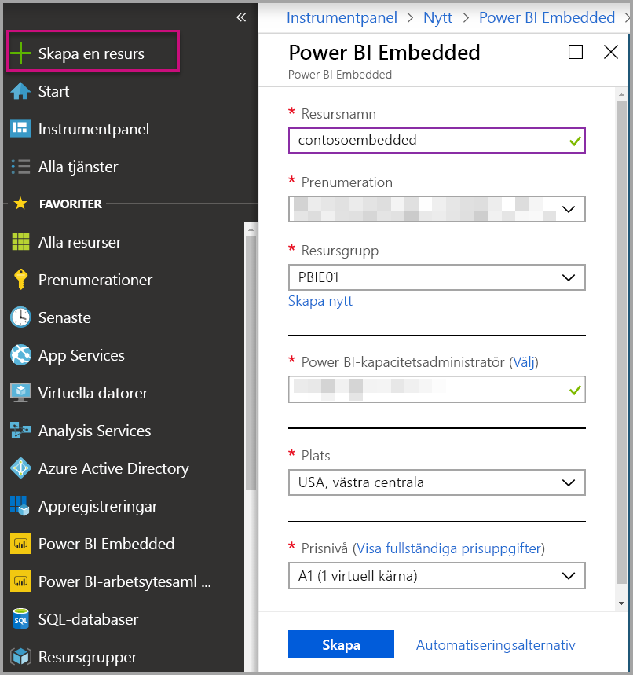
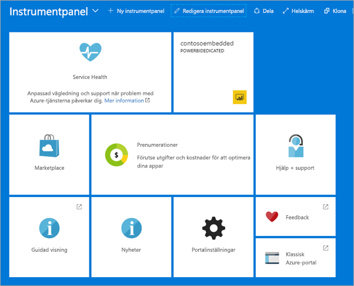

# Skapa Power BI Embedded-kapacitet på Azure Portal

Den här artikeln beskriver hur du skapar en Power BI Embedded-kapacitet i Microsoft Azure. Power BI Embedded förenklar användningen av funktionerna i Power BI genom att lägga till fantastiska visuella objekt, rapporter och instrumentpaneler i dina appar.

Om du inte har någon Azure-prenumeration kan du [skapa ett kostnadsfritt konto](https://azure.microsoft.com/free/) innan du börjar.

> [!VIDEO https://www.youtube.com/embed/aXrvFfg_iSk]

## Innan du börjar

För att slutföra den här snabbstarten behöver du:

* **Azure-prenumeration:** Gå till [Kostnadsfri utvärderingsversion av Azure](https://azure.microsoft.com/free/) för att skapa ett konto.
* **Azure Active Directory:** Din prenumeration måste vara associerad med en Azure Active Directory-klient (AAD). Dessutom ***måste du vara registrerad i Azure med ett konto i den klientorganisationen***. Microsoft-konton stöds inte. Mer information finns i [Autentisering och användarbehörigheter](https://docs.microsoft.com/azure/analysis-services/analysis-services-manage-users).
* **Power BI-klient:** Minst ett konto i din AAD-klient måste vara registrerat för Power BI.
* **Resursgrupp:** Använd en resursgrupp som du redan har eller [skapa en ny](https://docs.microsoft.com/azure/azure-resource-manager/resource-group-overview).

## Skapa en kapacitet

1. Logga in på [Azure Portal](https://portal.azure.com/).

2. Välj **Skapa en resurs** > **Data och analys**.

3. Sök efter *Power BI Embedded* i sökrutan.

4. Välj **Skapa** i Power BI Embedded.

5. Fyll i nödvändig information och välj **Skapa**.

    

    |Inställning |Beskrivning |
    |---------|---------|
    |**Resursnamn**|Ett namn som identifierar kapaciteten. Resursnamnet visas på Power BI-administratörsportalen och på Azure Portal.|
    |**Prenumeration**|Den prenumeration som du vill skapa kapaciteten för.|
    |**Resursgrupp**|Den resursgrupp som innehåller den nya kapaciteten. Välj en befintlig resursgrupp eller skapa en ny. Mer information finns i [Översikt över Azure Resource Manager](https://docs.microsoft.com/azure/azure-resource-manager/resource-group-overview).|
    |**Power BI-kapacitetsadministratör**|Kapacitetsadministratörer för Power BI kan visa kapaciteten på Power BI-administrationsportalen och bevilja tilldelningsbehörighet till andra användare. Som standard är kapacitetsadministratören ditt konto. Kapacitetsadministratören måste finnas inom din Power BI-klientorganisation.|
    |**Plats**|Den plats där Power BI finns för din klientorganisation. Standardplatsen är din hemregion, men du kan ändra plats med hjälp av [Multi-Geo-alternativ](embedded-multi-geo.md).
    |**Prisnivå**|Välj den SKU (antal virtuella kärnor och minnesstorlek) som passar dina behov.  Mer information finns i [Priser för Power BI Embedded](https://azure.microsoft.com/pricing/details/power-bi-embedded/)|

6. Välj **Skapa**.

Genereringen tar oftast mindre än minut; oftast bara några få sekunder. Om du väljer **Fäst på instrumentpanelen** kan du gå till instrumentpanelen för att se din nya kapacitet. Du kan också gå till **Alla tjänster** > **Power BI Embedded** och se om din kapacitet är klar.

## Nästa steg

Om du vill använda din nya Power BI Embedded-kapacitet går du till Power BI-administratörsportalen och tilldelar arbetsytor. Mer information finns i [Hantera kapacitet i Power BI Premium och Power BI Embedded](https://powerbi.microsoft.com/documentation/powerbi-admin-premium-manage/).

Om du inte behöver använda den här kapaciteten kan du pausa den för att stoppa debiteringen. Mer information finns i [Pausa och starta din Power BI Embedded-kapacitet på Azure Portal](azure-pbie-pause-start.md).

Om du vill börja bädda in Power BI-innehåll i ditt program läser du [Bädda in Power BI-instrumentpaneler, -rapporter och -paneler](https://powerbi.microsoft.com/documentation/powerbi-developer-embedding-content/).

Har du fler frågor? [Fråga Power BI Community](http://community.powerbi.com/)