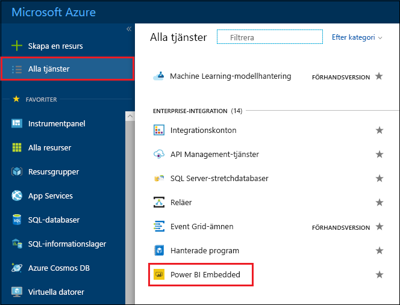
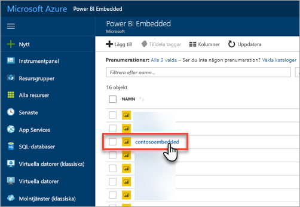
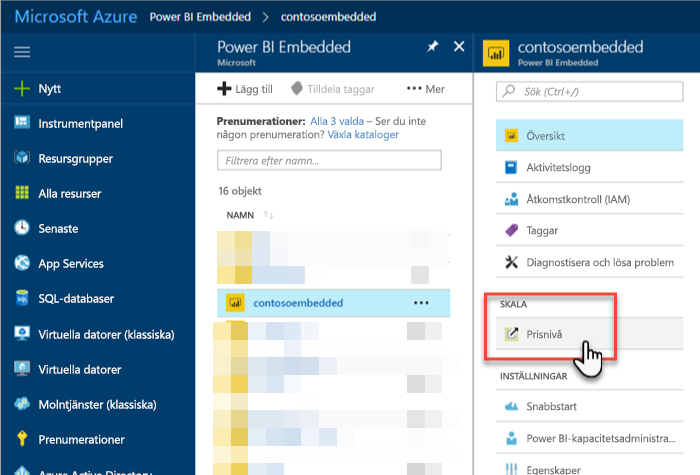
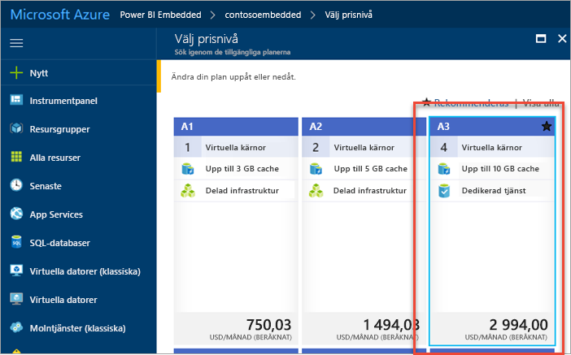
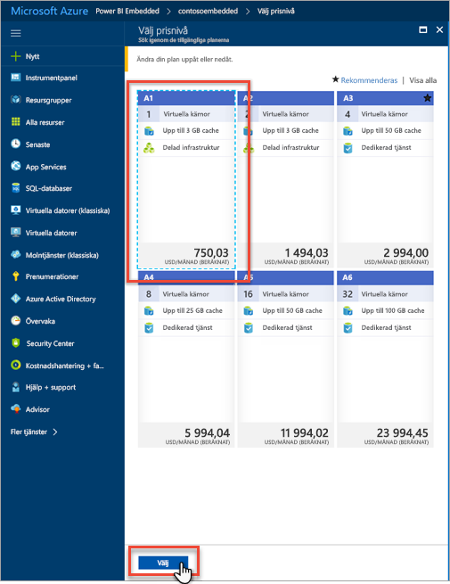
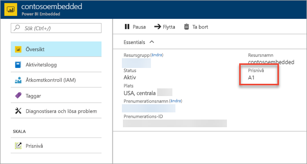

# Skala din Power BI Embedded-kapacitet på Azure Portal

Den här artikeln beskriver hur du skalar din Power BI Embedded-kapacitet i Microsoft Azure. Genom att skala kan du öka eller minska storleken på din kapacitet.

Detta förutsätter att du har skapat en Power BI Embedded-kapacitet. Om du inte har gjort det läser du [Skapa Power BI Embedded-kapacitet på Azure Portal](azure-pbie-create-capacity.md) för att komma igång.

> [!NOTE]
> En skalningsåtgärd tar ungefär en minut. Kapaciteten är inte tillgänglig under denna tid. Inbäddat innehåll kanske inte kan läsas in.

## Skala en kapacitet

1. Logga in på [Azure Portal](https://portal.azure.com/).

2. Visa dina kapaciteter genom att välja **Alla tjänster** > **Power BI Embedded**.

    

3. Välj den kapacitet som du vill skala.

    

4. Välj **Prisnivå** under **Skala** i din kapacitet.

    

    Din aktuella prisnivå är markerat med blått.

    

5. Om du vill skala upp eller ned väljer du den nya nivån som du vill byta till. När du väljer en ny nivå visas en streckad blå linje runt ditt val. Välj **Välj** för att skala till den nya nivån.

    

    Skalningen tar en eller ett par minuter.

6. Bekräfta din nivå genom att gå till fliken Översikt. Den aktuella prisnivån visas.

    

## Nästa steg

Om du vill pausa eller starta din kapacitet läser du [Pausa och starta din Power BI Embedded-kapacitet på Azure Portal](azure-pbie-pause-start.md).

Om du vill börja bädda in Power BI-innehåll i ditt program läser du [Bädda in Power BI-instrumentpaneler, -rapporter och -paneler](https://powerbi.microsoft.com/documentation/powerbi-developer-embedding-content/).

Har du fler frågor? [Fråga Power BI Community](http://community.powerbi.com/)
