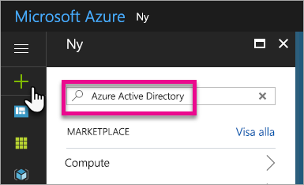
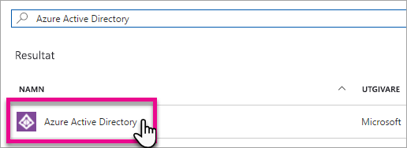
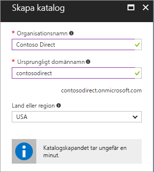
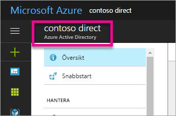
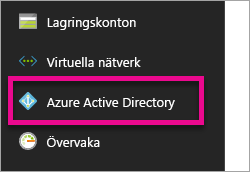
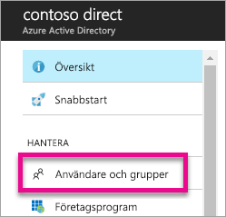
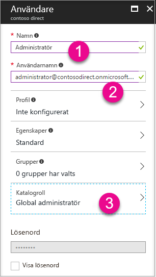
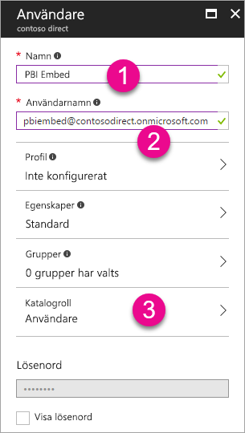
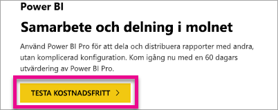

# Skapa en Azure Active Directory-klient som ska användas med Power BI
Lär dig hur du skapar en ny Azure AD-klient som ska användas med ditt anpassade program med Power BI REST API:er.

En klient motsvarar en organisation i Azure Active Directory. Det är en dedikerad instans i Azure AD-tjänsten som en organisation tar emot och äger när den registrerar sig för en Microsoft-molntjänst som t.ex. Azure, Microsoft Intune eller Office 365. Varje Azure AD-klient är unik och avgränsad från andra Azure AD-klienter.

När du har en Azure AD-klient kan du definiera ett program och tilldela behörigheter så att programmet kan använda Power BI REST API:er.

Organisationen kanske redan har en Azure AD-klient som du kan använda för programmet. Du kan använda den klienten för dina programbehov eller skapa en ny klient som är specifik för programmet. Artikeln visar hur du skapar en ny klient.

## Skapa en Azure Active Directory-klient
För att kunna integrera Power BI i ditt anpassade program måste du definiera ett program i Azure AD. Därför måste du ha en katalog i Azure AD. Detta är din klient. Om din organisation inte har någon klientorganisation än, eftersom de inte använder Power BI eller Office 365 [så måste du skapa en](https://docs.microsoft.com/azure/active-directory/develop/active-directory-howto-tenant). Du kan också behöva skapa en om du inte vill att programmet ska blandas ihop med organisationens klient. Detta innebär att du kan hålla saker isolerade.

Eller kanske du bara vill skapa en klient i testsyfte.

Gör följande om du vill skapa en ny Azure AD-klient.

1. Bläddra till [Azure-portalen](https://portal.azure.com) och logga in med ett konto som har en Azure-prenumeration.
2. Välj **plus-ikonen (+)** och sök efter *Azure Active Directory*.
   
    
3. Välj **Azure Active Directory** i sökresultatet.
   
    
4. Välj **Skapa**.
5. Ange ett **namn på organisationen**  tillsammans med **det ursprungliga domännamnet**. Välj sedan **Skapa**. Detta skapar din katalog.
   
    
   
   > [!NOTE]
   > Din ursprungliga domän kommer att vara en del av onmicrosoft.com. Du kan lägga till andra domännamn senare. Kataloger i klienter kan ha flera olika tilldelade domäner.
   > 
   > 
6. När du är klar med att skapa katalogen, väljer du informationsrutan för att hantera den nya katalogen.

Katalogen skapas. Därefter vill vi lägga till en användare i klienten.

## Skapa några användare i Azure Active Directory-klienten
Nu när vi har en katalog ska vi skapa minst två användare. En måste vara global administratör för klienten och den andra ska vara huvudanvändare för inbäddningen. Tänk på det som ett tjänstkonto.

1. I Azure-portalen måste vi befinna oss i Azure Active Directory.
   
    
   
    Om du inte gör det väljer du ikonen Azure Active Directory i det vänstra tjänstfältet.
   
    
2. Under **Hantera** väljer du **Användare och grupper**.
   
    
3. Välj **Alla användare** och sedan **+ Ny användare**.
4. Ange namn och användarnamn för användaren. Detta blir din globala administratör för klienten. Du kan också ändra **Katalogroll** till *Global administratör*. Du kan dessutom visa det tillfälliga lösenordet. När du är klar väljer du **Skapa**.
   
    
5. Du kan göra samma sak igen för en vanlig användare i klienten. Detta kan också användas till ditt huvudkonto för inbäddningen. I **Katalogroll** lämnar vi den här gången det som *Användare*. Anteckna lösenordet. Välj sedan **Skapa**.
   
    
6. Registrera dig för Power BI med det användarkonto som du skapade i steg 5. Du kan göra detta genom att gå till [powerbi.com](https://powerbi.microsoft.com/get-started/) och välja**Testa kostnadsfritt** under *Power BI – Molnsamarbete och delning*.
   
    
   
    När du registrerar dig får du en fråga om du vill prova Power BI Pro kostnadsfritt under 60 dagar. Du kan välja detta om du vill bli Pro-användare. Nu kan du börja utveckla en inbäddad lösning, om det är detta du vill.
   
   > [!NOTE]
   > Se till att du registrerar dig med den e-postadress som du använde för användarkontot.
   > 
   > 

## Nästa steg
Nu när du har en Azure AD-klient kan du använda klienten för att testa objekt inom Power BI och/eller gå vidare och bädda in Power BI-instrumentpaneler och rapporter i programmet. Mer information om hur du bäddar in objekt finns i [Bädda in dina Power BI-instrumentpaneler, rapporter och paneler](embedding-content.md).

[Vad är en Azure AD-katalog?](https://docs.microsoft.com/azure/active-directory/active-directory-whatis)  
[Hämta en Azure Active Directory-klient](https://docs.microsoft.com/azure/active-directory/develop/active-directory-howto-tenant)  

Har du fler frågor? [Fråga Power BI Community](http://community.powerbi.com/)

