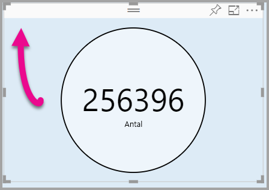

# <a name="tutorial-adding-formatting-options-to-a-power-bi-custom-visual"></a>Självstudie: Lägga till formateringsalternativ till ett anpassat visuellt Power BI-objekt

I den här självstudien går vi igenom hur man lägger till gemensamma egenskaper till det visuella objektet.

I de här självstudierna får du lära dig att
> [!div class="checklist"]
> * Lägga till visuella egenskaper.
> * Paketera det visuella objektet.
> * Importera det anpassade visuella objektet till en Power BI Desktop-rapport.

## <a name="adding-formatting-options"></a>Lägga till formateringsalternativ

1. Välj sidan **Format** i **Power BI**.

    Du bör se ett meddelande som lyder så här: *Formateringsalternativ är inte tillgängliga för det här visuella objektet.*

    

2. Öppna filen *capabilities.json* i **Visual Studio Code**.

3. Lägg till **objekt** (efter rad 8) före **dataViewMappings**.

    ```json
    "objects": {},
    ```
    

4. Spara filen **capabilities.json**.

5. Granska formateringsmöjligheterna igen i **Power BI**.

    > [!Note]
    > Om du inte ser formateringsalternativen så ändra **Läs in anpassat visuellt objekt igen**.

    

6. Ställ in alternativet **Rubrik** på *Av*. Observera att det visuella objektet inte längre visar måttets namn i det övre vänstra hörnet.

    

    

### <a name="adding-custom-formatting-options"></a>Lägga till anpassade formateringsalternativ

Du kan lägga till anpassade egenskaper om du vill aktivera möjligheten att konfigurera cirkelns färg och kantlinjebredden.

1. Stoppa det anpassade visuella objektet i PowerShell.

2. Infoga följande JSON-fragment i objektet med etiketten **objekt** i filen **capabilities.json** i Visual Studio Code.

    ```json
    "circle": {
     "displayName": "Circle",
     "properties": {
         "circleColor": {
             "displayName": "Color",
             "description": "The fill color of the circle.",
             "type": {
                 "fill": {
                     "solid": {
                         "color": true
                     }
                 }
             }
         },
         "circleThickness": {
             "displayName": "Thickness",
             "description": "The circle thickness.",
             "type": {
                 "numeric": true
                 }
             }
         }
     },
    ```

    JSON-fragmentet beskriver en grupp med namnet cirkel, som består av två alternativ som heter circleColor och circleThickness.

   

3. Spara filen **capabilities.json**.

4. Välj **settings.ts** i mappen **src** i fönstret **Explorer**. *Den här filen representerar inställningarna för det visuella startobjektet*.

5. Ersätt de två klasserna med följande kod i filen **settings.ts**.

    ```typescript
    export class CircleSettings {
     public circleColor: string = "white";
     public circleThickness: number = 2;
    }
    export class VisualSettings extends DataViewObjectsParser {
     public circle: CircleSettings = new CircleSettings();
    }
    ```

    

    Den här modulen definierar de båda klasserna. Klassen **CircleSettings** definierar två egenskaper med namn som matchar de objekt som definierats i filen **capabilities.json** (**circleColor** och  **circleThickness**) och anger även standardvärden. Klassen **VisualSettings** ärver klassen **DataViewObjectParser** och lägger till en egenskap med namnet **cirkel** som matchar det objekt som definieras i filen  *Capabilities.JSON* och returnerar en instans av **CircleSettings**.

6. Spara filen **settings.ts**.

7. Öppna filen **visual.ts**.

8. Lägg till följande egenskap i klassen **Visual**.

    ```typescript
    private visualSettings: VisualSettings;
    ```
    Denna egenskap sparar en referens till objektet **VisualSettings**, som beskriver de visuella inställningarna.

    

9. Lägg till följande metod framför metoden **Update** i klassen **Visual**. Den här metoden används för att fylla i formateringsalternativen.

    ```typescript
    public enumerateObjectInstances(options: EnumerateVisualObjectInstancesOptions): VisualObjectInstanceEnumeration {
     const settings: VisualSettings = this.visualSettings ||
    VisualSettings.getDefault() as VisualSettings;
     return VisualSettings.enumerateObjectInstances(settings, options);
    }
    ```
    Den här metoden används för att fylla i formateringsalternativen.

    

10. Lägg till följande kod efter deklaration av variabeln **radius** i metoden **update**.

    ```typescript
    this.visualSettings = VisualSettings.parse<VisualSettings>(dataView);

    this.visualSettings.circle.circleThickness = Math.max(0, this.visualSettings.circle.circleThickness);

    this.visualSettings.circle.circleThickness = Math.min(10, this.visualSettings.circle.circleThickness);
    ```
    Den här koden hämtar formateringsalternativen. Den justerar alla värden som skickas till egenskapen **circleThickness**, konverterar den till 0 om talet är negativt eller 10 om det är ett värde som är större än 10.

    

11. Ändra det värde som skickas till **fyllningsformat** till följande uttryck för **cirkelelementet**.

    ```typescript
    this.visualSettings.circle.circleColor
    ```

    

12. Ändra det värde som skickas till formatet för **bredd på penseldrag** till följande uttryck för **cirkelelementet**.

    ```typescript
    this.visualSettings.circle.circleThickness
    ```

    

13. Spara filen visual.ts.

14. Starta det visuella objektet i PowerShell.

    ```powershell
    pbiviz start
    ```

15. Välj **Växla automatisk återinläsning** i verktygsfältet ovanför det visuella objektet i **Power BI**.

16. Expandera **Cirkel** i alternativen för **visuellt format**.

    

    Ändra alternativen för **färg** och **tjocklek**.

    Ändra alternativet **tjocklek** till ett värde mindre än noll och ett högre värde än 10. Observera sedan hur det visuella objektet uppdaterar värdet till ett tillåtet minimum eller maximum.

## <a name="packaging-the-custom-visual"></a>Paketera det anpassade visuella objektet

Ange egenskapsvärden för det anpassade visualiseringsprojektet, uppdatera ikonfilen och paketera sedan det anpassade visuella objektet.

1. Stoppa det anpassade visuella objektet i **PowerShell**.

2. Öppna filen **pbiviz.json** i **Visual Studio Code**.

3. Ändra egenskapen **displayName** till *Cirkelkort* i objektet **visual**.

    Om du hovrar över ikonen i fönstret **Visualiseringar** visas visningsnamnet.

    

4. Ange följande text för egenskapen **beskrivning**.

    *Visar ett formaterad måttvärde inuti en cirkel*

5. Om du vill kan du ange dina uppgifter i objektet **författare**.

6. Spara filen **pbiviz.json**.

7. Observera i objektet **tillgångar** att dokumentet definierar en sökväg till en ikon. Ikonen är den bild som visas i fönstret **_Visualiseringar_** . Det måste vara en **PNG**-fil, *20 x 20 pixlar*.

8. Kopiera filen icon.png i Utforskaren och ersätt sedan standardfilen i tillgångsmappen genom att klistra in den.

9. Expandera mappen med tillgångar i Utforskaren i Visual Studio Code och välj sedan filen icon.png.

10. Granska ikonen.

    

11. Se till att alla filer sparas i Visual Studio Code.

12. Paketera det anpassade visuella objektet i PowerShell genom att ange följande kommando.

    ```powershell
    pbiviz package
    ```

    

Nu skickas paketet till mappen **dist** i projektet. Paketet innehåller allt som krävs för att importera det anpassade visuella objektet till Power BI-tjänsten eller en Power BI Desktop-rapport. Du har nu paketerat det anpassade visuella objektet, och det är nu klart att användas.

## <a name="importing-the-custom-visual"></a>Importera det anpassade visuella objektet

Nu kan du öppna Power BI Desktop-rapporten och importera det visuella Circle Card-objektet.

1. Öppna **Power BI Desktop**, skapa en ny rapport med en valfri *exempeldatamängd*

2. I den **_visualiseringar_** väljer den **ellipsen**, och välj sedan **Import** från filen.

    

3. Välj **Importera** i fönstret **Importera**.

4. Gå till mappen **dist** i projektet i fönstret Öppna.

5. Markera filen **circleCard.pbiviz** och välj sedan **Öppna**.

6. När det visuella objektet har importerats väljer du **OK**.

7. Kontrollera att det visuella objektet har lagts till i fönstret **_Visualiseringar_** .

    

8. Hovra över **Circle Card**-ikonen och se den knappbeskrivning som visas.

## <a name="debugging"></a>Felsökning

Tips om hur du felsöker ditt anpassade visuella objekt finns i [felsökningsguiden](https://microsoft.github.io/PowerBI-visuals/docs/how-to-guide/how-to-debug/).

## <a name="next-steps"></a>Nästa steg

Du kan lista ditt nyligen utvecklade visuella objekt som andra ska kunna använda genom att skicka det till **AppSource**. Mer information om den här processen finns i [Publicera anpassad visuell information till AppSource](office-store.md).