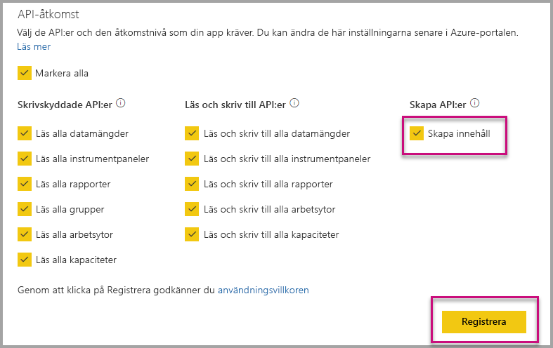

# Installera automatiskt Power BI-appar vid inbäddning för din organisation

Om du vill bädda in innehåll från en app, användare som inbäddning måste ha [åtkomst till appen](../service-create-distribute-apps.md). Om appen är installerad för användaren fungerar sedan inbäddning smidigt. Mer information finns i [bädda in rapporter eller instrumentpaneler från appen](embed-from-apps.md). Det är möjligt att definiera i PowerBI.com som alla appar kan vara [installeras automatiskt](https://powerbi.microsoft.com/blog/automatically-install-apps/). Den här åtgärden är klar på klientnivån och gäller för alla appar.

## Installera app bäddar in automatiskt

Om en användare har åtkomst till en app, men appen inte är installerat kan bädda in misslyckas. För att undvika dessa fel när du bäddar in från en app, kan du tillåta automatisk installation av app vid inbäddning. Den här åtgärden innebär att om användaren försöker bädda in appen inte är installerad, installeras det automatiskt åt dig. Så hämtar du inbäddad direkt, vilket resulterar i en smidig upplevelse för användaren.

## Bädda in för Power BI-användare (användare äger data)

Om du vill tillåta automatisk installation av appar för dina användare, måste du ge ditt program behörigheten ”Content Create” när [registrera ditt program](register-app.md#register-with-the-power-bi-application-registration-tool), eller lägga till den om du redan har registrerat din app.

Därefter måste du ange app-ID i URL: en för inbäddade. För att ge det app-ID, appskaparen måste först installera appen och sedan använda en av de stöds [Power BI Rest API](https://docs.microsoft.com/rest/api/power-bi/) anrop - [hämta rapporter](https://docs.microsoft.com/rest/api/power-bi/reports/getreports) eller [hämta instrumentpaneler](https://docs.microsoft.com/rest/api/power-bi/dashboards/getdashboards). Appskaparen måste sedan vidta bädda in URL: en från REST API-svaret. App-ID visas i URL: en om innehållet kommer från en app.  När du har inbäddade-URL kan använda du den att bädda in regelbundet.

## Skydda bädda in

För att använda automatisk installation av appar, måste appskaparen först installera appen och gå sedan till appen på PowerBI.com, går du till rapporten och hämta en länk i ett vanligt sätt. Alla andra användare med åtkomst till den app som kan använda länken kan bädda in rapporten.

## Överväganden och begränsningar

* Du kan bara bädda in rapporter och instrumentpaneler för det här scenariot.

* Den här funktionen stöds för närvarande inte för appen äger data och SharePoint att bädda in scenarier.