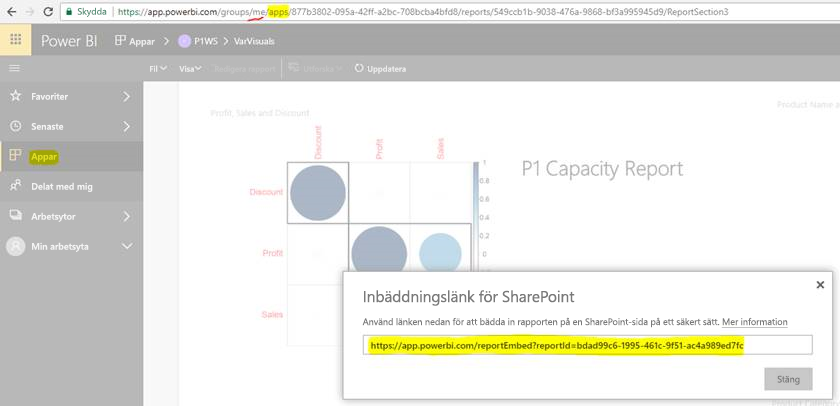

# Bädda in rapporter eller instrumentpaneler från appar

I **Power BI** kan du skapa appar för att samordna relaterade **instrumentpaneler** och **rapporter** på en enda plats och sedan publicera dem för stora grupper i organisationen. Användningen av dessa appar är relevant när alla dina användare är Power BI-användare så att du kan dela innehåll med dem med hjälp av Power BI-appar. Vi skulle vilja dela några enkla steg för att utföra inbäddning av innehåll från en publicerad Power BI-App till ett program från tredje part.

## Så här hämtar du webbadressen för att bädda in rapporter

1. Skapa en instans av programmet i en arbetsyta för användare (”Min arbetsyta”) genom att dela med dig själv eller vägled en annan användare att gå igenom det här flödet.

2. Öppna rapporten i Power BI-tjänsten.

3. Gå till Arkiv -> Bädda in i SharePoint Online och hämta webbadressen för inbäddning av rapport där (kan ses i ögonblicksbilden nedan) eller anropa GetReports/GetReport REST API och extrahera motsvarande fält för webbadress för inbäddning från svaret (observera att REST-anropet inte bör ha en identifierare för arbetsytan som en del av webbadressen eftersom appen har instansierats i användarens arbetsyta).

4. Använd webbadressen för inbäddning som du hämtade i steg tre och använd med JS SDK.

    

## Så här hämtar du webbadressen för att bädda in instrumentpaneler

1. Skapa en instans av programmet i en arbetsyta för användare (”Min arbetsyta”) genom att dela med dig själv eller vägled en annan användare att gå igenom det här flödet.

2. Anropa GetDashboards REST API och extrahera motsvarande fält för webbadress för inbäddning från svaret (observera att REST-anropet inte bör ha en identifierare för arbetsytan som en del av webbadressen eftersom appen har instansierats i användarens arbetsyta).

3. Använd webbadressen för inbäddning som du hämtade i steg fyra och använd med vår JS SDK.

## Nästa steg

Läs också om hur du bäddar in från apparbetsytor för kunder från tredje part och din organisation.

> [!div class="nextstepaction"]
>[Bädda in för kunder från tredje part](embed-sample-for-customers.md)

> [!div class="nextstepaction"]
>[Bädda in för din organisation](embed-sample-for-your-organization.md)