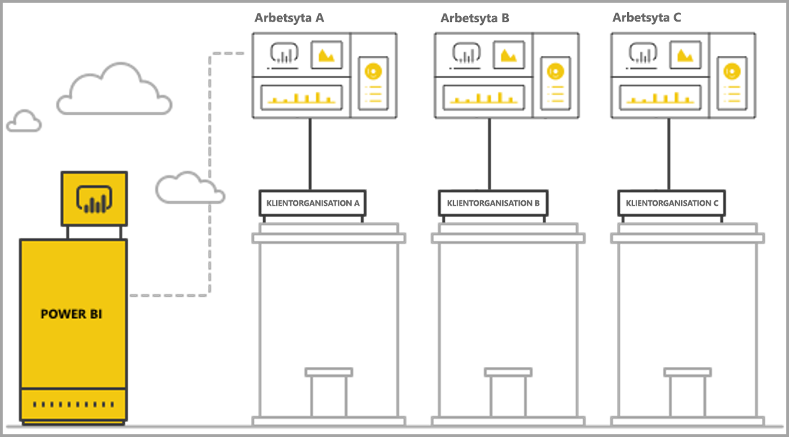
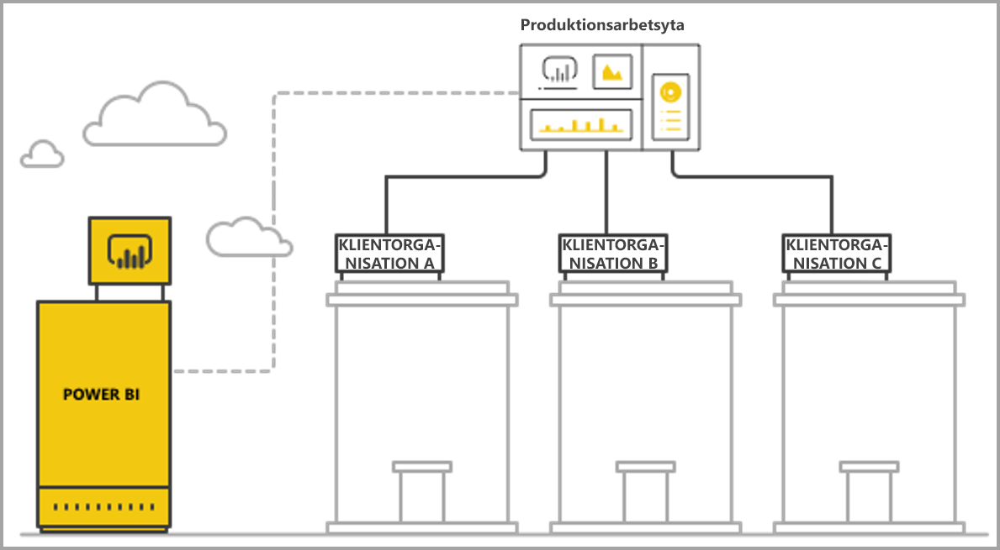

# Hantera flera innehavare med Power BI Embedded-analys

När du utformar ett SaaS-program med flera innehavare måste du noggrant välja den innehavarmodell som passar ditt SaaS-program bäst. Den här processen gäller även för Power BI som en del av inbäddad analys i ditt SaaS-program. En innehavarmodell avgör hur varje innehavares data mappas och hanteras i Power BI och i lagringskontot. Din innehavarmodell påverkar programdesign och hantering. Att växla till en annan modell senare kan bli kostsamt och störande.

I Power BI Embedded finns det två viktiga grundläggande sätt att upprätthålla uppdelningen mellan klienter.

   1. **Arbetsytebaserad isolering** – skapa en separat Power BI-arbetsyta per innehavare.
   2. **Säkerhetsbaserad isolering på radnivå** – där underliggande data används för att styra och hantera åtkomst till data per användare eller grupp.

Den här artikeln beskriver de olika metoderna och analyserar dem utifrån flera utvärderingskriterier.

## Begrepp och terminologi

**[AAD](https://docs.microsoft.com/en-us/azure/active-directory/fundamentals/active-directory-whatis)** – Azure Active Directory.

**AAD-program** – En programidentitet i AAD. Ett AAD-program krävs för autentisering.

**SaaS-program (program som en tjänst)** – Ett system som implementeras av ett företag eller en ISV som vanligtvis är en onlinetjänst. Det har även relaterade programsystem som betjänar flera kunder (organisationer). I den här artikeln **använder SaaS-programmet Power BI Embedded för att hantera analyser i dess olika klientorganisationer**. Power BI Embedded kan även användas för alla typer av program när de har en online-anslutning.

**Klient** – En enskild kund (organisation) som använder SaaS-programmet och eventuella resurser eller data som kunden förser SaaS-programmet med.

**[Power BI](../power-bi-overview.md)** – Power BI-molntjänst som fungerar som en plattform för Power BI Embedded.

**Power BI-klient** – En uppsättning Power BI-resurser som är associerade med en enda AAD-klient.

**[Power BI-arbetsyta](../service-create-workspaces.md)** – En container för innehåll i Power BI.

**Power BI-artefakter** – Det finns flera Power BI-artefakter i Power BI-arbetsytor, t.ex. instrumentpaneler, rapporter, datauppsättningar och dataflöden.

**[Power BI Embedded](azure-pbie-what-is-power-bi-embedded.md)** – En uppsättning offentliga API:er som gör det möjligt för utvecklare att bygga program som hanterar Power BI-innehåll och bäddar in Power BI-element.

**[Säkerhet på radnivå (RLS)](embedded-row-level-security.md)** – Ger möjlighet att styra användarnas åtkomst till data för enskilda rader i en tabell. Du kan implementera säkerhet på radnivå på datakällsnivå eller i Power BI-semantikmodellen.

**Överordnad användare** – Den identitet som representerar SaaS-programmet i Power BI och som används i SaaS-programmet när du anropar Power BI-API:er. Måste vara en AAD-användare med en Power BI Pro-licens.

**AAD-programanvändare (tjänstens huvudnamn) ** – Den identitet som representerar SaaS-programmet i Power BI och som används i SaaS-programmet när du anropar Power BI-API:er. Måste vara ett AAD-webbprogram. Kan användas istället för en *huvudanvändare* vid autentisering med Power BI.

**Kapacitet** – En uppsättning resurser som är dedikerade till att köra Power BI-tjänsten. [Power BI Premium-kapaciteter](../service-premium.md) Avsett för företag som använder Power BI internt, medan [Power BI Embedded-kapaciteter](azure-pbie-create-capacity.md) är avsett för programutvecklare som utvecklar SaaS-program för tredje part.

**[Power BI Pro-licens](../service-admin-purchasing-power-bi-pro.md)** – En användarbaserad licens, som beviljar rättigheter att publicera innehåll till apparbetsytor, använda appar utan Premium-kapacitet, dela instrumentpaneler och prenumerera på instrumentpaneler och rapporter.

**[Dataanslutningslägen](../desktop-directquery-about.md)** – Det går att ansluta datakällor till Power BI på olika sätt:

   * Import – Det vanligaste sättet att hämta data på.
   * DirectQuery – Anslut direkt till data i dess källdatabas.
   * Live-anslutning – Ett annat läge som ansluter direkt till Analysis Services-data (både Azure-data och lokala data).

## Utvärderingskriterier

Det optimala valet för innehavarmodell för SaaS-program varierar beroende på specifika affärskrav och tekniska krav, dataarkitektur och annat. Om du har en djup förståelse för de här kraven och av alternativen för tillgängliga innehavarmodeller och kompromisser kan du enklare definiera en robust, högpresterande, kostnadseffektiv och skalbar arkitektur för ditt SaaS-program.

Du kan överväga följande uppsättningar med områden när du väljer mellan olika innehavarmodeller.

### Dataarkitektur

Utvecklare som skapar program med Power BI Embedded har normalt redan en databas med en eller flera innehavare. Det är enklare att använda en innehavarmodell för Power BI Embedded som liknar databasens innehavarmodell. Om databasens innehavarmodell ännu inte har definierats kan du överväga andra aspekter innan du bestämmer dig för en dataarkitektur.

### Dataisolering

Hur känsliga är de data som lagras? Vilken isoleringsnivå behöver du för att skilja olika kundinnehavare åt? Svaret kan variera mellan olika branscher eller pga olika kunders specifika krav.

### Skalbarhet

Hitta den bästa lösningen genom att definiera den skala du ska nå inom en snar framtid. Tänk på att en lösning som verkar passa nu kanske inte räcker när användning och data ökar i skala. När du analyserar skalbarhet så ta en titt på följande lista:

   * Antal klienter (kunder).
   * Antal rapporter, instrumentpaneler och datauppsättningar för varje klient.
   * Datastorleken för varje datauppsättning och uppdateringsfrekvensen.
   * Antal användare.
   * Antal samtidiga användare under tider med hög belastning.

Vissa SaaS-program kan ha ett lågt antal kunder och låg användning, men stora mängder data. Andra kan ha många kunder och hög användning, men små mängder data och rapporter per kund. Stora antal i någon av dessa situationer kan påverka de framtida kostnaderna och komplexiteten i driften.

### Automatisering och driftkomplexitet

Identifiera ofta förekommande processer som behöver automatiseras.

   * Med vilken frekvens registreras nya klienter? Vilka åtgärder krävs för att helt integrera var och en?
   * Vilken är frisläppningstakten för nytt eller uppdaterat Power BI-innehåll som måste distribueras?
   * Hur många säkerhetsroller på radnivå har definierats för respektive klient?  

Genom att identifiera dessa processer och se hur du hanterar dem kan du få en bättre förståelse av den operativa komplexiteten i att underhålla varje enskild modell.

### Dataplaceringskrav och behovet av att stödja flera geografiska områden

Power BI Embedded stöder Multi-Geo-distribution (förhandsgranskningsfunktion). Tack vare [Multi-Geo](embedded-multi-geo.md) kan Power BI Embedded-resurser distribueras i olika regioner med specifikt innehåll som ska finns i specifika regioner. Den här funktionen kan användas för alla modeller, men kan påverka innehållsmängd och kostnad. För närvarande har Multi-Geo utformats för att uppfylla dataplaceringskrav och förbättrar inte prestanda genom att flytta data närmare konsumenterna.

### Kostnad

[Power BI Embedded](https://azure.microsoft.com/en-us/services/power-bi-embedded/) har en resursbaserad inköpsmodell i likhet med **Power BI Premium**. Du köper en eller flera kapaciteter med fast datorkraft och minne. Den här kapaciteten är det viktigaste kostnadsobjektet när du arbetar med **Power BI Embedded**. Det finns ingen gräns för hur många användare som kan utnyttja kapaciteten. Den ena begränsningen är kapacitetens prestanda. En [Power BI Pro-licens](../service-admin-licensing-organization.md) krävs för varje *huvudanvändare*, eller specifika användare som behöver ha åtkomst till Power BI-portalen.

Vi rekommenderar att du testar och mäter den förväntade belastningen på kapaciteten genom att simulera en live-miljö och användning och belastningstesta kapaciteten. Du kan mäta belastning och prestanda med olika mått som är tillgängliga i Azure-kapaciteten eller [appen för Premium-kapacitetsmätning](../service-admin-premium-monitor-capacity.md).

### Anpassa och skapa innehåll

Det finns två metoder för SaaS-program som ger användare möjlighet att redigera och skapa rapporter eller överföra data till tjänsten som en del av flödet:

   * [Redigera/skapa-läget i en inbäddad iFrame](https://github.com/Microsoft/PowerBI-JavaScript/wiki/Create-Report-in-Embed-View) – Användaren får en vy av rapporten eller en ny tom arbetsyta i SaaS-programmet. På så sätt kan användaren utnyttja Power BI-verktygsfältet till att skapa innehåll baserat på en datauppsättning på arbetsytan. Vi rekommenderar det här alternativet eftersom det finns i användarens kontext i en välbekant miljö. Det blir lättare att komma igång med att arbeta och redigera, och användaren skapar en rapport som är kopplad till en befintlig datamängd.

   * Skapa innehåll med Power BI Desktop och överför det via SaaS-programmets användargränssnitt till arbetsytan. Tack vare den här metoden har användarna fler verktyg att arbeta med Power BI Desktop. Vi rekommenderar dock inte den här metoden eftersom användarna måste känna till ett ytterligare verktyg utanför SaaS-programmets kontext. Om en användare laddar upp en PBIX-fil innebär att hen lägger till ytterligare en datauppsättning som kan vara en dubblett av datauppsättningar som redan på arbetsytan.

## Power BI-arbetsytebaserad isolering

Med Power BI-arbetsytebaserad isolering stöder SaaS-programmet flera klienter från en enda Power BI-klient. Arbetsytebaserad isolering innehåller allt det Power BI-innehåll som används av olika klienter. Uppdelningen av klienter görs på Power BI-arbetsytenivån genom att flera arbetsytor skapas. Varje arbetsyta innehåller relevanta datauppsättningar, rapporter och instrumentpaneler för en enskild klient. Varje arbetsyta är dessutom enbart ansluten till den klientens data. Om du behöver ytterligare isolering kan du skapa en *huvudanvändare* eller ett tjänstens huvudnamn för varje enskild arbetsyta och dess innehåll.

### Dataarkitektur

Det finns två huvudsakliga sätt att hantera en klients data.

* En separat databas per klient
* En databas för flera klienter

Om SaaS-programlagringen är att ha en separat databas per klient, så är det naturliga valet att använda enskilda klientdatauppsättningar i Power BI där anslutningssträngen för respektive datauppsättning pekar på den matchande databasen.

Om SaaS-programlagringen använder en databas för flera innehavarare för alla klienter, är det lätt att skilja klienterna åt efter arbetsyta. Du kan konfigurera databasanslutningen för Power BI-datauppsättningen med en parametriserad databasfråga som hämtar endast den relevanta klientens data. Du kan uppdatera anslutningen med [Power BI Desktop](../desktop-query-overview.md) eller genom att använda [API:et](https://docs.microsoft.com/rest/api/power-bi/datasets/updatedatasourcesingroup) med [parametrar](https://docs.microsoft.com/en-us/rest/api/power-bi/datasets/updateparametersingroup) för frågan.

### Dataisolering

Data i den här innehavarmodellen skiljs åt på arbetsytenivå. En enkel mappning mellan en arbetsyta och en klient förhindrar att användare från en klient ser innehållet från en annan klient. Om du använder en *huvudanvändare* krävs det att du har åtkomst till samtliga arbetsytor. Konfigurationen av vilka data som ska visas för en användare definieras när [inbäddningstoken genereras](https://docs.microsoft.com/en-us/rest/api/power-bi/embedtoken), en serverdelsprocess som slutanvändarna varken kan se eller ändra.

Om du vill lägga till ytterligare isolering kan en programutvecklare definiera en *huvudanvändare* eller ett program per arbetsyta snarare än en enskild *huvudanvändare* eller ett program med åtkomst till flera arbetsytor. På så sätt kan du se till att alla mänskliga fel eller autentiseringsuppgifter läcka inte orsakar flera kunders data exponeras.

### Skalbarhet

En fördel med den här modellen är att separationen av data i flera datauppsättningar för varje klient övervinner [storleksbegränsningarna för en enskild datauppsättning](https://docs.microsoft.com/en-us/power-bi/service-premium-large-datasets) (för närvarande 10 GB i en kapacitet). When the capacity is overloaded, [it can evict unused datasets](../service-premium-understand-how-it-works.md) to free memory for active datasets. Den här uppgiften är inte möjlig med en enskild stor datauppsättning. Med flera datauppsättningar går det även att dela upp klienter i flera Power BI-kapaciteter om så behövs. [Lär dig mer om hur kapacitet fungerar](../service-admin-premium-manage.md).

Trots dessa fördelar måste man ta i beaktande den skala som SaaS-programmet kan uppnå i framtiden. Man kan t.ex. stöta på begränsningar när det gäller antalet artefakter man kan hantera. Mer information om [distributionsbegränsningar](#summary-comparison-of-the-different-approaches) finns längre fram i den här artikeln. Den kapacitets-SKU som används introducerar en gräns för hur stort minne som datauppsättningarna måste passa in, [hur många uppdateringar som kan köras samtidigt](../service-premium-understand-how-it-works.md) och den maximala frekvensen för datauppdateringar. Vi rekommenderar att du testar när du hanterar hundratals eller tusentals datauppsättningar. Vi rekommenderar också att du bedömer den genomsnittliga och den högsta användningsvolymen, såväl som eventuella specifika klienter med stora datauppsättningar eller avvikande användningsmönster, som hanteras annorlunda än andra klienter.

### Automatisering och driftkomplexitet

Med Power BI-arbetsytrbaserad isolering kan en programutvecklare behöva hantera hundratals eller tusentals artefakter. Det är viktigt att du definierar de processer som ofta förekommer i programlivscykelhanteringen och ser till att du har rätt uppsättning verktyg för att genomföra dessa åtgärder i stor skala i den här innehavarmodellen. Några exempel på åtgärder är:

   * Lägga till en ny klient (kund)
   * Uppdatera en rapport eller instrumentpanel för vissa eller alla klienter
   * Uppdatera datauppsättningsschemat för vissa eller alla klienter
   * Oplanerade anpassningar för specifika klienter
   * Frekvensen för datauppsättningsuppdateringar

Att skapa en arbetsyta för en ny klient är t.ex. en gemensam uppgift som behöver automatiseras. Med [Power BI REST API:et](https://docs.microsoft.com/rest/api/power-bi/) kan du uppnå [fullständig automation när du skapar arbetsytor](https://powerbi.microsoft.com/blog/duplicate-workspaces-using-the-power-bi-rest-apis-a-step-by-step-tutorial/).

### Multi-Geo-behov

Multi-Geo inbegriper inköp av kapacitet i den önskade regionen och tilldelning av en arbetsyta till den kapaciteten. Om du behöver stödja olika klienter i olika regioner måste du tilldela klientens arbetsyta till en kapacitet i den önskade regionen. Det här är en enkel åtgärd och en där kostnaden inte överskrider kostnaden för att ha alla arbetsytor i samma kapacitet. Om du däremot har klienter som behöver data i flera regioner, så måste alla artefakter på arbetsytan dupliceras i varje regional kapacitet, vilket ökar både kostnaden och hanteringens komplexitet.

### Kostnad

Programutvecklare som använder Power BI Embedded måste [köpa Power BI Embedded-kapacitet för att gå vidare till produktion](embed-sample-for-customers.md#move-to-production).  Det är viktigt att man förstår effekten av arbetsytebaserade modeller och deras inverkan på kapaciteter.

Den arbetsytebaserade isoleringsmodellen passar bra med kapaciteter av följande skäl:

   * Det minsta fristående objekt som du kan tilldela en kapacitet är en arbetsyta. Du kan t.ex. inte tilldela en rapport. Så genom att skilja klienter åt efter arbetsytor får du fullständig flexibilitet när det gäller att hantera respektive klient och dess prestandabehov och att optimera kapacitetsanvändningen genom upp- och nedskalning. Stora och viktiga klienter med hög volym och volatilitet kan t.ex. hanteras i en separat kapacitet, så att en konsekvent servicenivå kan säkerställas, samtidigt som mindre klienter grupperas i en annan kapacitet, varigenom kostnaderna kan optimeras.

   * När du separerar arbetsytor innebär det också att du separerar datauppsättningar mellan klienter så att datamodellerna kan delas upp i mindre segment i stället för att samlas i en enda stor datauppsättning. Med den här uppgiften kan kapaciteten hantera minnesanvändning bättre och ta bort små oanvända datauppsättningar när de inte behövs, och samtidigt upprätthålla en tillfredsställande prestanda.

Programutvecklare måste ta hänsyn till begränsningen av antalet parallella uppdateringar med tanke på att uppdateringsprocesserna kan behöva extra kapacitet när du använder flera datauppsättningar.

### Anpassa och skapa innehåll

När det gäller den primära användningen av innehållsskapande måste programutvecklarna noga överväga vilka klienter som kan ha redigeringsfunktioner och hur många användare som kan redigera i varje klient. Om du tillåter flera användare att redigera i varje klient kan det resultera i att så mycket innehåll skapas att datamängdsbegränsningarna vad gäller t.ex. antalet rapporter per datauppsättning eller antalet datauppsättningar per arbetsyta uppnås. Om du förser användarna med den här funktionen rekommenderar vi att du övervakar innehållsskapandet noga och skalar upp efter behov. Av samma skäl rekommenderar vi inte att du använder den här funktionen för innehållsanpassning där varje användare kan göra mindre ändringar i rapporter och spara dem för egen del. Om SaaS-programmet tillåter innehållsanpassning bör du överväga att införa principer för bevarande av arbetsyta för användarspecifikt innehåll, så att flödet för innehållsborttagning underlättas när slutanvändarna flyttar till en ny plats, lämnar företaget eller inte använder plattformen längre.

## Säkerhetsbaserad isolering på radnivå

När det gäller säkerhetsbaserad isolering på radnivå använder SaaS-programmet en enda arbetsyta som värd för flera klienter. Det innebär att varje rapport för Power BI-artefakt, instrumentpanel och datauppsättning skapas när alla klienter använda den. Dataavgränsning mellan klienter åstadkoms med hjälp av [säkerhet på radnivå](embedded-row-level-security.md) på datauppsättningen för flera innehavare. När en slutanvändare loggar in i SaaS-programmet och öppnar innehåll genereras en inbäddningstoken för användarens session, med de roller och filter som ser till att användaren endast kan se de data som hen har behörighet att se. Om användare från samma klient inte har behörighet att visa samma data måste programutvecklaren implementera hierarkiska roller både mellan klienter och inom samma klient.

### Dataarkitektur

Att implementera säkerhetsbaserad isolering på radnivå passar bäst när alla klienters data lagras i ett gemensamt datalager. I det här fallet kan programutvecklaren kan skicka enbart relevanta data från datalagret till Power BI-datauppsättningen, via Direct Query eller genom att importera data. Om data i databasen avgränsas efter klient måste det kombineras till en datauppsättning, vilket resulterar i en lägre separationsgrad mellan klienterna i databasen.

### Dataisolering

Med säkerhetsbaserad isolering på radnivå uppnås dataavgränsningen med hjälp av [säkerhetsdefinitioner på radnivå](embedded-row-level-security.md) för datauppsättningen, vilket innebär att alla data samexisterar. Den här typen av dataavgränsning är mer utsatt för dataläckage som orsakas av utvecklarfel. Även om säkerhet på radnivå sker i serverdelen och skyddas från slutanvändarna, så kan det vara bättre att använda arbetsytebaserad isolering när data är mycket känsliga eller om kunderna efterfrågar dataavgränsning.

### Skalbarhet

Med säkerhetsbaserad isolering på radnivå måste data rymmas inom storleksgränsen för datauppsättningar, som för närvarande är 10 GB. Med introduktionen av [inkrementell uppdatering](../service-premium-incremental-refresh.md) och den kommande versionen av en XMLA-slutpunkt för Power BI-datauppsättningar förväntas storleksgränsen för datauppsättningar öka avsevärt. Data måste dock fortfarande få plats i kapacitetens minne, med tillräckligt mycket återstående minne så att datauppdateringarna kan köras. Storskaliga distributioner måste en stor kapacitet så att användarna slipper problem orsakade av att minnet överskrider gränserna för den aktuella kapaciteten. Olika sätt att hantera skala kan vara att använda **[aggregeringar](../desktop-aggregations.md)** eller att ansluta till datakällan direkt med hjälp av DirectQuery eller en Live-anslutning i stället för att cachelagra av alla data i Power BI-kapaciteten.

### Automatisering och driftkomplexitet

Att hantera artefakter är mycket enklare med säkerhetsbaserad isolering på radnivå än med arbetsytebaserad isolering, eftersom det bara finnsen version av en artefakt för varje miljö (utveckling/test/produktion) istället för en version per klient. Att hantera artefakter i stor skala handlar om att hantera och uppdatera tiotals artefakter eller tusen- eller tiotusentals.

Power BI har ännu inte något API för att ändra eller skapa RLS-roller och regler. Du kan bara lägga till eller ändra roller manuellt i Power BI Desktop. Om du måste tillämpa en RLS-hierarki så tänk på att det kan vara komplicerad och felbenägen hantering om du inte planerar den noggrant.

Om programutvecklaren måste hantera flera roller och rolldefinitioner som måste skapas eller uppdateras ofta, så är inte säkerhetsbaserad isolering på radnivå skalbar ur ett hanterbarhetsperspektiv.

En annan komplexitet i driften är behovet av att noga övervaka minnesanvändningen och skapa en stabil metod för aviseringar och skalning så att användarna garanteras en smidig användningsupplevelse.  

### Multi-Geo-behov

Eftersom alla data lagras i en enda datauppsättning är det svårt att uppfylla datahemvistkraven på att vissa data ska bindas till specifika platser. Det kan också avsevärt öka kostnaden för att använda flera regioner eftersom alla data replikeras och lagras i varje region. Om endast ett begränsat antal klienter behöver olika geografiska områden kan du behålla enbart dessa klienters data i en annan region med hjälp av modellen för arbetsytebaserad isolering som beskrivs ovan.

### Kostnad

Den huvudsakliga kostnadsdrivande faktorn när det gäller säkerhetsbaserad isolering på radnivå är det minnesavtryck för minnesanvändning som krävs för datauppsättningen. Du måste ha tillräcklig kapacitet för att lagra datauppsättningen och behålla viss ytterligare minnesbuffert för eventuella minneskravstoppar. Ett sätt att åtgärda den här situationen är att lagra data i en SQL Server-databas eller SQL Server Analysis Services-kub och hämta data från datakällan i realtid genom att använda Direct Query eller en Live-anslutning. Den här metoden ökar kostnaden för datakällorna, men minskar behovet av hög kapacitet beroende på minnesbehovet, vilket därmed minskar kostnaden för Power BI-kapaciteten.

### Anpassa och skapa innehåll

När slutanvändare redigerar eller skapar rapporter kan de använda produktionsdatauppsättningen för flera innehavare. Därför rekommenderar vi endast alternativet med inbäddad iFrame för att redigera eller [skapa rapporter](https://github.com/Microsoft/PowerBI-JavaScript/wiki/Create-Report-in-Embed-View), eftersom det förlitar sig på samma datauppsättning med tillämpad säkerhet på radnivå. Att låta användarna ladda upp PBIX-filer med ytterligare datauppsättningar kan vara dyrt och svårt att hantera med säkerhetsbaserad isolering på radnivå. När användare skapar nytt innehåll som på samma arbetsyta måste du dessutom se till att produktionsarbetsytan inte överskrider sina begränsningar och skapa en stabil metod för att identifiera vilket innehåll som är anslutet till vilken klient.

## Jämförande sammanfattning av de olika metoderna

> [!Important]
> Följande analys baseras på produktens aktuella tillstånd. Samtidigt som vi lanserar nya funktioner i en månatlig takt fortsätter vi med att tillhandahålla nya funktioner som åtgärdar befintliga begränsningar och svaga punkter. Läs våra månatliga blogginlägg så att du håller dig uppdaterad om alla nyheter, och återvänd till den här artikeln om du vill se hur nya funktioner påverkar rekommendationerna avseende innehavarmodell.

| Utvärderingskriterier | Arbetsytebaserad   | Baserad på säkerhet på radnivå  |  |  |
|--------------------------------------|----------------------------------------------------------------------------------------------------------------------|---------------------------------------------------------------------------------------|---|---|
| Dataarkitektur  | Enklast när det finns en separat databas per klient  | Enklast när alla data för alla klienter finns i ett enda datalager   |  |  |
| Dataisolering  | Bra. Varje klient har en dedikerad datauppsättning.  | Medel. Alla data finns i samma delade datauppsättning, men hanteras genom åtkomstkontroll.  |  |  |
| Skalbarhet  | Medium. Att dela upp data i flera datauppsättningar möjliggör optimering.  | Lägsta. Begränsad av datauppsättningsgränser.  |  |  |
| Multi-Geo-behov  | Passar bra om merparten av klienterna finns i samma region.  | Rekommenderas ej. Hela datauppsättningen måste lagras i flera regioner.  |  |  |
| Automatisering och driftkomplexitet  | Bra automatisering för den enskilda klienten.   Komplicerat att hantera många artefakter i stor skala.  | Lätt att hantera Power BI-artefakter, men komplicerat att hantera RLS i stor skala.  |  |  |
| Kostnad  | Låg-medel. Det går att minska kostnaden-per-klient genom att optimera användningen.  Kan öka när frekventa uppdateringar behövs.  | Mellanhög om du använder importläge.  Låg-medel om du använder Direct Query-läget.  |  |  |
| Anpassa och skapa innehåll  | Passar bra. Kan nå begränsningar i stor skala.  | Innehållsskapande endast i inbäddad iFrame  |  |  |

## Överväganden och begränsningar när det gäller distribution

**Power BI-artefaktbegränsningar:**

* Antalet V1-arbetsytor (grupper) som en användare/ett program kan vara en medlem i/administratör av är 250.
* Antalet V2-arbetsytor (mappar) som en användare/ett program kan vara en medlem i/administratör av är 1000.
* Antal datauppsättningar på en enskild arbetsyta är 1000.
* Antalet rapporter/instrumentpaneler som är anslutna till en enskild datauppsättning är 1000.
* Storleksgränsen för datauppsättningsminnen vid uppladdning av en *.pbix*-fil är 10 GB.

**Överväganden och begränsningar avseende Power BI-kapacitet:**

* Varje kapacitet kan bara använda sitt allokerade minne och V-kärnor i enlighet med [inköpt SKU](../service-premium.md).
* Information om rekommenderad datauppsättningsstorlek för varje SKU finns i [Stora Premium-datauppsättningar](../service-premium-large-datasets.md).
* Den maximala datauppsättningsstorleken i en dedikerad kapacitet är 10 GB.
* Antalet schemalagda uppdateringar för en datauppsättning i *importläge* under en dag är 48.
* Tiden mellan schemalagda uppdateringar för en datauppsättning i *importläge* är 30 minuter.
* Information om hur många uppdateringar som kan köras samtidigt på en kapacitet finns i [Resurshantering och optimering](../service-premium-understand-how-it-works.md).
* Den genomsnittliga tiden för att skala en kapacitet är 1 till 2 minuter. Under denna tid är kapaciteten inte tillgänglig. Vi rekommenderar att du använder en utskalningsmetod om du vill undvika [stilleståndstid](https://powerbi.microsoft.com/blog/power-bi-developer-community-november-update-2018/#scale-script).

## Nästa steg

* [Inbäddad analys med Power BI](embedding.md)
* [Power BI Embedded](azure-pbie-what-is-power-bi-embedded.md)
* [Power BI Premium](../service-premium.md)
* [Säkerhet på radnivå](embedded-row-level-security.md)