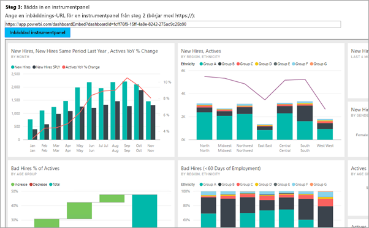

# <a name="embed-a-power-bi-dashboard-tile-or-report-into-your-application"></a>Bädda in en Power BI-instrumentpanel, panel eller rapport i ditt program
Lär dig att integrera eller bädda in en instrumentpanel, panel eller rapport i en webbapp med Power BI:s .NET SDK tillsammans med Power BI:s JavaScript API vid inbäddning för dina kunder. Detta är vanligtvis ISV-scenariot.



För att komma igång med den här genomgången behöver du ett **Power BI Pro**-konto. Om du inte har ett konto, kan du [registrera dig för ett kostnadsfritt Power BI-konto](../service-self-service-signup-for-power-bi.md) och därefter registrera dig för en [Power BI Pro-utvärdering](../service-self-service-signup-for-power-bi.md#in-service-power-bi-pro-60-day-trial), eller så kan du skapa din egen [Azure Active Directory-klientorganisation ](create-an-azure-active-directory-tenant.md) i testsyfte.

> [!NOTE]
> Vill du bädda in en instrumentpanel för din organisation istället? Se [Integrera en instrumentpanel i en app för din organisation](integrate-dashboard.md).
> 
> 

Om du vill integrera en instrumentpanel i en webbapp, använder du **Power BI**-API:t och en Azure Active Directory (AD)-**åtkomsttoken** för auktorisering för att hämta en instrumentpanel. Därefter läser du instrumentpanelen med hjälp av en inbäddningstoken. **Power BI**-API ger programmeringsåtkomst till vissa **Power BI**-resurser. Mer information finns i [Översikt för Power BI REST API](https://msdn.microsoft.com/library/dn877544.aspx), [Power BI .NET SDK](https://github.com/Microsoft/PowerBI-CSharp) och [Power BI JavaScript API](https://github.com/Microsoft/PowerBI-JavaScript).

## <a name="download-the-sample"></a>Ladda ned exemplet
Den här artikeln visar den kod som används i [Bädda in för din organisation-exemplet](https://github.com/Microsoft/PowerBI-Developer-Samples/tree/master/App%20Owns%20Data) på GitHub. Om du vill följa den här genomgången kan du ladda ned exemplet.

## <a name="step-1---register-an-app-in-azure-ad"></a>Steg 1 – Registrera en app i Azure AD
Du måste registrera ditt program med Azure AD för att kunna göra REST API-anrop. Mer information finns i [Registrera en Azure AD-app för att bädda in Power BI-innehåll](register-app.md).

Om du har hämtat [Bädda in för din organisation-exemplet](https://github.com/Microsoft/PowerBI-Developer-Samples/tree/master/App%20Owns%20Data), använder du det **Klient-ID** som du får efter registreringen så att exemplet kan autentisera till Azure AD. Om du vill konfigurera exemplet, ändrar du **clientId** i *web.config*-filen.

## <a name="step-2---get-an-access-token-from-azure-ad"></a>Steg 2 – hämta en åtkomsttoken från Azure AD
I ditt program måste du först hämta en **åtkomsttoken** från Azure AD innan du kan anropa Power BI REST API:t. Mer information finns i [Autentisera användare och hämta en Azure AD-åtkomsttoken för din Power BI-app](get-azuread-access-token.md).

Du ser exempel på detta i varje innehållsobjekts uppgift i **Controllers\HomeController.cs**.

## <a name="step-3---get-a-content-item"></a>Steg 3 – hämta ett innehållsobjekt
Om du vill bädda in ditt Power BI-innehåll, behöver du göra några saker för att se till att det bäddas in korrekt. Alla dessa steg kan göras direkt med REST API:et, men exempelprogrammet och exemplen här, görs med .NET SDK.

### <a name="create-the-power-bi-client-with-your-access-token"></a>Skapa Power BI-klienten med din åtkomsttoken
Med din åtkomsttoken vill du skapa dina Power BI-klientobjekt som gör att du kan interagera med Power BI-API:er. Detta görs genom att omsluta AccessToken med ett *Microsoft.Rest.TokenCredentials*-objekt.

```
using Microsoft.IdentityModel.Clients.ActiveDirectory;
using Microsoft.Rest;
using Microsoft.PowerBI.Api.V2;

var tokenCredentials = new TokenCredentials(authenticationResult.AccessToken, "Bearer");

// Create a Power BI Client object. It will be used to call Power BI APIs.
using (var client = new PowerBIClient(new Uri(ApiUrl), tokenCredentials))
{
    // Your code to embed items.
}
```

### <a name="get-the-content-item-you-want-to-embed"></a>Hämta innehållsobjektet som du vill bädda in
Använd Power BI-klientobjektet för att hämta en referens till det objekt du vill bädda in. Du kan bädda in instrumentpaneler, paneler eller rapporter. Här är ett exempel på hur du hämtar den första instrumentpanelen, panelen eller rapporten från en given arbetsyta.

Ett exempel på detta finns i **Controllers\HomeController.cs** av [Appen äger dataexemplet](https://github.com/Microsoft/PowerBI-Developer-Samples/tree/master/App%20Owns%20Data).

**Instrumentpaneler**

```
using Microsoft.PowerBI.Api.V2;
using Microsoft.PowerBI.Api.V2.Models;

// You will need to provide the GroupID where the dashboard resides.
ODataResponseListDashboard dashboards = client.Dashboards.GetDashboardsInGroup(GroupId);

// Get the first report in the group.
Dashboard dashboard = dashboards.Value.FirstOrDefault();
```

**Panel**

```
using Microsoft.PowerBI.Api.V2;
using Microsoft.PowerBI.Api.V2.Models;

// To retrieve the tile, you first need to retrieve the dashboard.

// You will need to provide the GroupID where the dashboard resides.
ODataResponseListDashboard dashboards = client.Dashboards.GetDashboardsInGroup(GroupId);

// Get the first report in the group.
Dashboard dashboard = dashboards.Value.FirstOrDefault();

// Get a list of tiles from a specific dashboard
ODataResponseListTile tiles = client.Dashboards.GetTilesInGroup(GroupId, dashboard.Id);

// Get the first tile in the group.
Tile tile = tiles.Value.FirstOrDefault();
```

**Rapport**

```
using Microsoft.PowerBI.Api.V2;
using Microsoft.PowerBI.Api.V2.Models;

// You will need to provide the GroupID where the dashboard resides.
ODataResponseListReport reports = client.Reports.GetReportsInGroupAsync(GroupId);

// Get the first report in the group.
Report report = reports.Value.FirstOrDefault();
```

### <a name="create-the-embed-token"></a>Skapa inbäddningstoken
En inbäddningstoken behöver skapas som kan användas från JavaScript-API:t. Inbäddningstoken gäller endast för det objekt du bäddar in. Det innebär att du när som helst när du bäddar in bit Power BI-innehåll måste skapa en ny inbäddningstoken för den. Mer information, inklusive vilken **accessLevel** som du ska använda, finns i [GenerateToken-API:t](https://msdn.microsoft.com/library/mt784614.aspx).

> [!IMPORTANT]
> Eftersom inbäddningstoken endast är avsedda för utvecklartestning är antalet inbäddningstoken ett Power BI-huvudkonto kan generera begränsat. En [kapacitet måste köpas](https://docs.microsoft.com/power-bi/developer/embedded-faq#technical) för inbäddningsscenarier för produktion. Det finns ingen gräns för generering av inbäddningstoken när en kapacitet köps. Gå till [Hämta tillgängliga funktioner](https://msdn.microsoft.com/en-us/library/mt846473.aspx) för att kontrollera hur många kostnadsfria inbäddningstokens som har använts.

Ett exempel på detta finns i **Controllers\HomeController.cs** av [Inbäddning för ditt organisationsexempel](https://github.com/Microsoft/PowerBI-Developer-Samples/tree/master/App%20Owns%20Data).

Detta förutsätter att en klass skapas för **EmbedConfig** och **TileEmbedConfig**. Ett exempel på dessa är tillgängliga i **Models\EmbedConfig.cs** och **Models\TileEmbedConfig.cs**.

**Instrumentpanel**

```
using Microsoft.PowerBI.Api.V2;
using Microsoft.PowerBI.Api.V2.Models;

// Generate Embed Token.
var generateTokenRequestParameters = new GenerateTokenRequest(accessLevel: "view");
EmbedToken tokenResponse = client.Dashboards.GenerateTokenInGroup(GroupId, dashboard.Id, generateTokenRequestParameters);

// Generate Embed Configuration.
var embedConfig = new EmbedConfig()
{
    EmbedToken = tokenResponse,
    EmbedUrl = dashboard.EmbedUrl,
    Id = dashboard.Id
};
```

**Panel**

```
using Microsoft.PowerBI.Api.V2;
using Microsoft.PowerBI.Api.V2.Models;

// Generate Embed Token for a tile.
var generateTokenRequestParameters = new GenerateTokenRequest(accessLevel: "view");
EmbedToken tokenResponse = client.Tiles.GenerateTokenInGroup(GroupId, dashboard.Id, tile.Id, generateTokenRequestParameters);

// Generate Embed Configuration.
var embedConfig = new TileEmbedConfig()
{
    EmbedToken = tokenResponse,
    EmbedUrl = tile.EmbedUrl,
    Id = tile.Id,
    dashboardId = dashboard.Id
};
```

**Rapport**

```
using Microsoft.PowerBI.Api.V2;
using Microsoft.PowerBI.Api.V2.Models;

// Generate Embed Token.
var generateTokenRequestParameters = new GenerateTokenRequest(accessLevel: "view");
EmbedToken tokenResponse = client.Reports.GenerateTokenInGroup(GroupId, report.Id, generateTokenRequestParameters);

// Generate Embed Configuration.
var embedConfig = new EmbedConfig()
{
    EmbedToken = tokenResponse,
    EmbedUrl = report.EmbedUrl,
    Id = report.Id
};
```


## <a name="step-4---load-an-item-using-javascript"></a>Steg 4 – läs in ett objekt med JavaScript
Du kan använda JavaScript för att läsa in en instrumentpanel till olika element på webbsidan. Exemplet använder en EmbedConfig/TileEmbedConfig-modell tillsammans med vyer för en instrumentpanel, panel eller rapport. Om du vill ha ett fullständigt exempel av att använda JavaScript API:t, kan du använda [Microsoft Power BI Embedded-exemplet](https://microsoft.github.io/PowerBI-JavaScript/demo).

Ett programexempel av det här finns i [Inbäddning för ditt organisationsexempel](https://github.com/Microsoft/PowerBI-Developer-Samples/tree/master/App%20Owns%20Data).

**Views\Home\EmbedDashboard.cshtml**

```
<script src="~/scripts/powerbi.js"></script>
<div id="dashboardContainer"></div>
<script>
    // Read embed application token from Model
    var accessToken = "@Model.EmbedToken.Token";

    // Read embed URL from Model
    var embedUrl = "@Html.Raw(Model.EmbedUrl)";

    // Read dashboard Id from Model
    var embedDashboardId = "@Model.Id";

    // Get models. models contains enums that can be used.
    var models = window['powerbi-client'].models;

    // Embed configuration used to describe the what and how to embed.
    // This object is used when calling powerbi.embed.
    // This also includes settings and options such as filters.
    // You can find more information at https://github.com/Microsoft/PowerBI-JavaScript/wiki/Embed-Configuration-Details.
    var config = {
        type: 'dashboard',
        tokenType: models.TokenType.Embed,
        accessToken: accessToken,
        embedUrl: embedUrl,
        id: embedDashboardId
    };

    // Get a reference to the embedded dashboard HTML element
    var dashboardContainer = $('#dashboardContainer')[0];

    // Embed the dashboard and display it within the div container.
    var dashboard = powerbi.embed(dashboardContainer, config);
</script>
```

**Views\Home\EmbedTile.cshtml**

```
<script src="~/scripts/powerbi.js"></script>
<div id="tileContainer"></div>
<script>
    // Read embed application token from Model
    var accessToken = "@Model.EmbedToken.Token";

    // Read embed URL from Model
    var embedUrl = "@Html.Raw(Model.EmbedUrl)";

    // Read tile Id from Model
    var embedTileId = "@Model.Id";

    // Read dashboard Id from Model
    var embedDashboardeId = "@Model.dashboardId";

    // Get models. models contains enums that can be used.
    var models = window['powerbi-client'].models;

    // Embed configuration used to describe the what and how to embed.
    // This object is used when calling powerbi.embed.
    // This also includes settings and options such as filters.
    // You can find more information at https://github.com/Microsoft/PowerBI-JavaScript/wiki/Embed-Configuration-Details.
    var config = {
        type: 'tile',
        tokenType: models.TokenType.Embed,
        accessToken: accessToken,
        embedUrl: embedUrl,
        id: embedTileId,
        dashboardId: embedDashboardeId
    };

    // Get a reference to the embedded tile HTML element
    var tileContainer = $('#tileContainer')[0];

    // Embed the tile and display it within the div container.
    var tile = powerbi.embed(tileContainer, config);
</script>
```

**Views\Home\EmbedReport.cshtml**

```
<script src="~/scripts/powerbi.js"></script>
<div id="reportContainer"></div>
<script>
    // Read embed application token from Model
    var accessToken = "@Model.EmbedToken.Token";

    // Read embed URL from Model
    var embedUrl = "@Html.Raw(Model.EmbedUrl)";

    // Read report Id from Model
    var embedReportId = "@Model.Id";

    // Get models. models contains enums that can be used.
    var models = window['powerbi-client'].models;

    // Embed configuration used to describe the what and how to embed.
    // This object is used when calling powerbi.embed.
    // This also includes settings and options such as filters.
    // You can find more information at https://github.com/Microsoft/PowerBI-JavaScript/wiki/Embed-Configuration-Details.
    var config = {
        type: 'report',
        tokenType: models.TokenType.Embed,
        accessToken: accessToken,
        embedUrl: embedUrl,
        id: embedReportId,
        permissions: models.Permissions.All,
        settings: {
            filterPaneEnabled: true,
            navContentPaneEnabled: true
        }
    };

    // Get a reference to the embedded report HTML element
    var reportContainer = $('#reportContainer')[0];

    // Embed the report and display it within the div container.
    var report = powerbi.embed(reportContainer, config);
</script>
```

## <a name="next-steps"></a>Nästa steg
Det finns ett exempelprogram på GitHub som du kan granska. Ovanstående exempel baseras på det exemplet. Mer information finns i [Inbäddning för din organisation-exemplet](https://github.com/Microsoft/PowerBI-Developer-Samples/tree/master/App%20Owns%20Data).

Mer information finns tillgänglig för JavaScript-API i [Power BI JavaScript-API](https://github.com/Microsoft/PowerBI-JavaScript).

Har du fler frågor? [Fråga Power BI Community](http://community.powerbi.com/)

