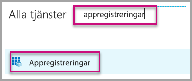
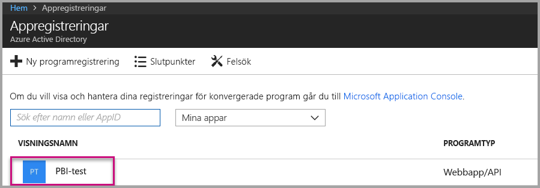
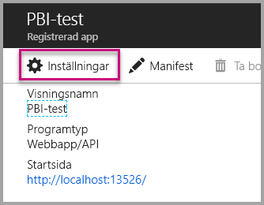
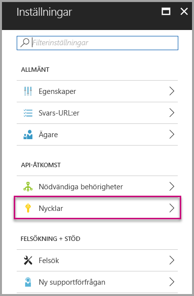
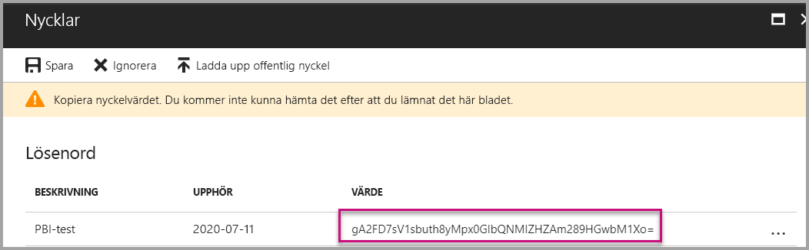

# <a name="tutorial-embed-power-bi-content-into-an-application-for-your-customers"></a>Självstudie: Bädda in Power BI-innehåll i ett program för dina kunder

Med **Power BI Embedded i Azure** kan du bädda in rapporter, instrumentpaneler eller paneler i ett program med app äger data. **App äger data** handlar om ett program som använder Power BI som en inbäddad analysplattform. Som **ISV-utvecklare** kan du skapa Power BI-innehåll som visar rapporter, instrumentpaneler eller paneler i ett program som är helt integrerat och interaktivt, utan att kräva att användarna har en Power BI-licens. Den här självstudien visar hur du integrerar en rapport i ett program som använder Power BI .NET SDK med Power BI JavaScript-API:et med **Power BI Embedded i Azure** för kunderna.

I de här självstudierna får du lära dig att
> [!div class="checklist"]
> * Registrera ett program i Azure.
> * Bädda in en Power BI-rapport i ett program.

## <a name="prerequisites"></a>Förutsättningar

Du måste ha följande för att komma igång:

* Ett [Power BI Pro-konto](../service-self-service-signup-for-power-bi.md) (ett huvudkonto som är ett användarnamn och lösenord för inloggning på ditt Power BI Pro-konto), eller [tjänstens huvudnamn (appspecifik token)](embed-service-principal.md).
* En [Microsoft Azure](https://azure.microsoft.com/)-prenumeration.
* Du måste ha en egen installation för [Azure Active Directory-klient](create-an-azure-active-directory-tenant.md).

Om du inte har registrerat dig för **Power BI Pro**, [registrerar du dig för en kostnadsfri utvärderingsversion](https://powerbi.microsoft.com/pricing/) innan du börjar.

Om du inte har någon Azure-prenumeration kan du [skapa ett kostnadsfritt konto](https://azure.microsoft.com/free/?WT.mc_id=A261C142F) innan du börjar.

## <a name="set-up-your-embedded-analytics-development-environment"></a>Konfigurera den inbäddade utvecklingsmiljön för analysverktyg

Innan du börjar bädda in rapporter, en instrumentpanel eller paneler i din app måste du se till att det går att bädda in Power BI i din miljö.

Med [konfigurationsverktyget för inbäddning](https://aka.ms/embedsetup/AppOwnsData) kommer du snabbt igång och kan ladda ned ett exempelprogram som steg för steg beskriver hur du skapar en miljö och bäddar in en rapport.

Om du i stället vill konfigurera miljön manuellt, fortsätter du bara nedan.

### <a name="register-an-application-in-azure-active-directory-azure-ad"></a>Registrera ett program i Azure Active Directory (Azure AD)

[Registrera appen](register-app.md) med Azure Active Directory så att ditt program får åtkomst till [Power BI REST-API:er](https://docs.microsoft.com/rest/api/power-bi/). Genom att registrera din app kan du upprätta en identitet för din app och ange behörigheter till Power BI REST-resurser. Bestämmer hur du kommer igång med registreringen av en app, beroende på om du vill använda ett huvudkonto eller [tjänstens huvudnamn](embed-service-principal.md).

Påverkar vilken typ app du registrerar i Azure, beroende på vilken metod du väljer.

Om du fortsätter att använda ett huvudkonto fortsätter du med registreringen av en **intern** app. Du använder en intern app eftersom du arbetar ned en icke-interaktiv inloggning.

Men om du fortsätter att använda tjänstens huvudnamn måste du fortsätta med att registrera en **webbapp på serversidan**. Du registrerar en webbapp på serversidan för att skapa en apphemlignet.

## <a name="set-up-your-power-bi-environment"></a>Konfigurera din Power BI-miljö

### <a name="create-an-app-workspace"></a>Skapa en apparbetsyta

Om du bäddar in rapporter, instrumentpaneler eller paneler för kunderna, måste du placera innehållet i en apparbetsyta. Det finns olika typer av arbetsytor du kan konfigurera: [traditionella arbetsytor](../service-create-workspaces.md) eller [nya arbetsytor](../service-create-the-new-workspaces.md). Om du använder ett *huvudkonto* spelar det ingen roll vilken typ av arbetsytor du använder. Men om du använder *[tjänstens huvudnamn](embed-service-principal.md)* för inloggning på appen måste du använda de nya arbetsytorna. I båda scenarierna måste både *huvudkontot* och *tjänstens huvudnamn* vara administratör för apparbetsytorna som är involverade i din app.

### <a name="create-and-publish-your-reports"></a>Skapa och publicera rapporter

Du kan skapa rapporter och datauppsättningar som använder Power BI Desktop och publicera dessa rapporter till en apparbetsyta. Det finns två sätt att åstadkomma detta: Som slutanvändare kan du publicera rapporter på en traditionell apparbetsyta med ett huvudkonto (Power BI Pro-licens). Om du använder tjänstens huvudnamn kan du publicera rapporter på nya arbetsytor med [Power BI REST-API:er](https://docs.microsoft.com/rest/api/power-bi/imports/postimportingroup).

I stegen nedan beskrivs hur du publicerar dina PBIX-rapporter på Power BI-arbetsytan.

1. Ladda ner exemplet [Bloggdemo](https://github.com/Microsoft/powerbi-desktop-samples) från GitHub.

    

2. Öppna PBIX-exempelrapporten i **Power BI Desktop**.

   

3. Publicera på **apparbetsytor**. Den här processen skiljer sig beroende på om du använder ett huvudkonto (Power Pro-licens) eller tjänstens huvudnamn. Om du använder ett huvudkonto kan du sedan publicera rapporten via Power BI Desktop.  Om du nu använder tjänstens huvudnamn måste du använda Power BI REST-API:er.

## <a name="embed-content-using-the-sample-application"></a>Bädda in innehåll med exempelprogrammet

Det här exemplet hålls medvetet enkelt i demonstrationssyfte. Det är upp till dig eller dina utvecklare att skydda apphemligheten eller autentiseringsuppgifterna för huvudkontot.

Följ de här stegen nedan om du vill börja bädda in innehåll med hjälp av exempelprogrammet.

1. Ladda ned [Visual Studio](https://www.visualstudio.com/) (version 2013 eller senare). Se till att ladda ned det senaste [NuGet-paketet](https://www.nuget.org/profiles/powerbi).

2. Ladda ner [exempel på app äger data](https://github.com/Microsoft/PowerBI-Developer-Samples) från GitHub för att komma igång.

    

3. Öppna filen **Web.config** i exempelprogrammet. Du måste fylla i fälten för att kunna köra programmet. Du kan välja **MasterUser** eller **ServicePrincipal** för **AuthenticationType**. Beroende på vilken typ av autentiseringsmetod du väljer finns det olika fält att fylla i.

    > [!Note]
    > Standardinställd **AuthenticationType** i det här exemplet är MasterUser.

    <center>

    | **MasterUser** <br> (Power BI Pro-licens) | **ServicePrincipal** <br> (appspecifik token)|
    |---------------|-------------------|
    | [applicationId](#application-id) | [applicationId](#application-id) |
    | [workspaceId](#workspace-id) | [workspaceId](#workspace-id) |
    | [reportId](#report-id) | [reportId](#report-id) |
    | [pbiUsername](#power-bi-username-and-password) |  |
    | [pbiPassword](#power-bi-username-and-password) |  |
    |  | [applicationsecret](#application-secret) |
    |  | [tenant](#tenant) |

   </center>

    

### <a name="application-id"></a>Program-ID

Det här attributet behövs för både AuthenticationTypes (huvudkonto och [tjänstens huvudnamn](embed-service-principal.md)).

Fyll i **applicationId** med **program-ID:t** från **Azure**. **applicationId** används av programmet för att identifiera sig för användare som du begär behörighet från.

Så här hämtar du **applicationId**:

1. Logga in på [Azure Portal](https://portal.azure.com).

2. I det vänstra navigeringsfönstret väljer du **Alla tjänster** och **Appregistreringar**.

    

3. Välj det program som behöver **applicationId**.

    

4. Det finns ett **program-ID** som listas som en GUID. Använd detta **program-ID** som **applicationId** för appen.

    

### <a name="workspace-id"></a>ID för arbetsyta

Det här attributet behövs för både AuthenticationTypes (huvudkonto och [tjänstens huvudnamn](embed-service-principal.md)).

Fyll i **workspaceId** med (grupp-)GUID för apparbetsytan från Power BI. Du kan få den här informationen från URL:en när du är inloggad i Power BI-tjänsten eller med hjälp av Powershell.

URL <br>


PowerShell <br>

```powershell
Get-PowerBIworkspace -name "App Owns Embed Test"
```

   

### <a name="report-id"></a>Rapport-ID

Det här attributet behövs för både AuthenticationTypes (huvudkonto och [tjänstens huvudnamn](embed-service-principal.md)).

Fyll i **reportId**-information med rapport-GUID från Power BI. Du kan få den här informationen från URL:en när du är inloggad i Power BI-tjänsten eller med hjälp av Powershell.

URL<br>


PowerShell <br>

```powershell
Get-PowerBIworkspace -name "App Owns Embed Test" | Get-PowerBIReport
```


### <a name="power-bi-username-and-password"></a>Användarnamn och lösenord för Power BI

Dessa attribut behövs bara för huvudkontots AuthenticationType.

Om du använder [tjänstens huvudnamn](embed-service-principal.md) för autentisering behöver du inte fylla i användarnamn- eller lösenordsattributen.

* Fyll i **pbiUsername** med huvudanvändarkontot för Power BI.
* Fyll i **pbiPassword** med lösenordet för huvudkontot för Power BI.

### <a name="application-secret"></a>Apphemlighet

Det här attributet behövs bara för AuthenticationType [tjänstens huvudnamn](embed-service-principal.md).

Fyll i **ApplicationSecret**-uppgifterna från avsnittet **Nycklar** från avsnittet **Appregistreringar** i **Azure**.  Det här attributet fungerar när du använder [tjänstens huvudnamn](embed-service-principal.md).

Hämta **ApplicationSecret** genom att utföra följande steg:

1. Logga in på [Azure-portalen](https://portal.azure.com).

2. I det vänstra navigeringsfönstret väljer du **Alla tjänster** och sedan **Appregistreringar**.

    

3. Välj det program som behöver använda **ApplicationSecret**.

    

4. Välj **inställningar**.

    

5. Välj **Nycklar**.

    

6. Ange ett namn i rutan **Beskrivning** och välj en varaktighet. Välj sedan **Spara** för att hämta **värdet** för ditt program. När du stänger fönstret **Nycklar** efter att ha sparat nyckelvärdet visas värdefältet bara som dolt. I det här läget kan du inte att hämta nyckelvärdet. Om du tappar bort nyckelvärdet måste du skapa ett nytt på Microsoft Azure-portalen.

    

### <a name="tenant"></a>Klientorganisation

Det här attributet behövs bara för AuthenticationType [tjänstens huvudnamn](embed-service-principal.md).

Fyll i informationen om **klientorganisationen** med ditt Azure-klientorganisations-ID. Du kan få den här informationen från [Azure AD-portalen](https://docs.microsoft.com/onedrive/find-your-office-365-tenant-id#use-the-azure-ad-portal) när du är inloggad i Power BI-tjänsten eller med hjälp av Powershell.

### <a name="run-the-application"></a>Kör programmet

1. Välj **Kör** i **Visual Studio**.

    

2. Välj sedan **Bädda in rapport**. Beroende på vilket innehåll du väljer att testa med – rapporter, instrumentpaneler eller paneler – väljer du det alternativet i programmet.

    

3. Nu kan du visa rapporten i exempelprogrammet.

    

## <a name="embed-content-within-your-application"></a>Bädda in innehåll i programmet

Innehåll kan bäddas in med hjälp av [Power BI REST API:er](https://docs.microsoft.com/rest/api/power-bi/), men exempelkoderna som beskrivs i den här artikeln görs med **.NET SDK**.

Om du vill bädda in för dina kunder i programmet måste du hämta en **åtkomsttoken** för huvudkontot eller [tjänstens huvudnamn](embed-service-principal.md) från **Azure AD**. Du måste hämta en [Azure AD-åtkomsttoken](get-azuread-access-token.md#access-token-for-non-power-bi-users-app-owns-data) för ditt Power BI-program innan du gör anrop till [Power BI REST API:erna](https://docs.microsoft.com/rest/api/power-bi/).

Skapa Power BI-klienten med din **åtkomsttoken** genom att skapa Power BI-klientobjektet som gör att du kan interagera med [Power BI REST API:er](https://docs.microsoft.com/rest/api/power-bi/). Du skapar Power BI-klientobjektet genom att omsluta **AccessToken** med ett ***Microsoft.Rest.TokenCredentials***-objekt.

```csharp
using Microsoft.IdentityModel.Clients.ActiveDirectory;
using Microsoft.Rest;
using Microsoft.PowerBI.Api.V2;

var tokenCredentials = new TokenCredentials(authenticationResult.AccessToken, "Bearer");

// Create a Power BI Client object. it's used to call Power BI APIs.
using (var client = new PowerBIClient(new Uri(ApiUrl), tokenCredentials))
{
    // Your code to embed items.
}
```

### <a name="get-the-content-item-you-want-to-embed"></a>Hämta innehållsobjektet som du vill bädda in

Använd Power BI-klientobjektet för att hämta en referens till det objekt du vill bädda in.

Här är ett kodexempel på hur du hämtar den första rapporten från en given arbetsyta.

*Ett exempel på hur du hämtar ett innehållsobjekt, vare sig du vill bädda in en rapport, instrumentpanel eller panel, finns i filen Services\EmbedService.cs i [exempelprogrammet](https://github.com/Microsoft/PowerBI-Developer-Samples).*

```csharp
using Microsoft.PowerBI.Api.V2;
using Microsoft.PowerBI.Api.V2.Models;

// You need to provide the workspaceId where the dashboard resides.
ODataResponseListReport reports = await client.Reports.GetReportsInGroupAsync(workspaceId);

// Get the first report in the group.
Report report = reports.Value.FirstOrDefault();
```

### <a name="create-the-embed-token"></a>Skapa inbäddningstoken

Skapade en inbäddningstoken som kan användas från JavaScript-API:t. En inbäddningstoken gäller endast för det objekt du bäddar in. Det innebär att när du bäddar in en bit Power BI-innehåll måste du skapa en ny inbäddningstoken för den. Mer information, inklusive vilken **accessLevel** som du ska använda, finns i [GenerateToken-API:t](https://msdn.microsoft.com/library/mt784614.aspx).

*Ett exempel på hur du skapar en inbäddningstoken för en rapport, instrumentpanel eller panel vill du bädda in är tillgängliga i filen Services\EmbedService.cs i [exempelprogrammet](https://github.com/Microsoft/PowerBI-Developer-Samples).*

```csharp
using Microsoft.PowerBI.Api.V2;
using Microsoft.PowerBI.Api.V2.Models;

// Generate Embed Token.
var generateTokenRequestParameters = new GenerateTokenRequest(accessLevel: "view");
EmbedToken tokenResponse = client.Reports.GenerateTokenInGroup(workspaceId, report.Id, generateTokenRequestParameters);

// Generate Embed Configuration.
var embedConfig = new EmbedConfig()
{
    EmbedToken = tokenResponse,
    EmbedUrl = report.EmbedUrl,
    Id = report.Id
};
```

En klass skapas för **EmbedConfig** och **TileEmbedConfig**. Ett exempel finns i filerna **Models\EmbedConfig.cs** och **Models\TileEmbedConfig.cs**.

### <a name="load-an-item-using-javascript"></a>Läsa in ett objekt med JavaScript

Du kan använda JavaScript för att läsa in en rapport till olika element på webbsidan.

Du kan använda ett fullständigt exempel i JavaScript API i [Playground-verktyget](https://microsoft.github.io/PowerBI-JavaScript/demo). Playground-verktyget är ett snabbt sätt att leka med olika typer av Power BI Embedded-exempel. Du kan även få mer information om API:et för JavaScript genom att besöka wiki-sidan för [PowerBI-JavaScript](https://github.com/Microsoft/powerbi-javascript/wiki).

I det här exemplet används en **EmbedConfig**-modell och en **TileEmbedConfig**-modell tillsammans med vyer för en rapport.

*Ett exempel på hur du lägger till en vy för en rapport, instrumentpanel eller panel finns i filerna Views\Home\EmbedReport.cshtml, Views\Home\EmbedDashboard.cshtml och Views\Home\Embedtile.cshtml i [exempelprogrammet](#embed-your-content-within-a-sample-application).*

```javascript
<script src="~/scripts/powerbi.js"></script>
<div id="reportContainer"></div>
<script>
    // Read embed application token from Model
    var accessToken = "@Model.EmbedToken.Token";

    // Read embed URL from Model
    var embedUrl = "@Html.Raw(Model.EmbedUrl)";

    // Read report Id from Model
    var embedReportId = "@Model.Id";

    // Get models. models contains enums that can be used.
    var models = window['powerbi-client'].models;

    // Embed configuration used to describe what and how to embed.
    // This object is used when calling powerbi.embed.
    // This also includes settings and options such as filters.
    // You can find more information at https://github.com/Microsoft/PowerBI-JavaScript/wiki/Embed-Configuration-Details.
    var config = {
        type: 'report',
        tokenType: models.TokenType.Embed,
        accessToken: accessToken,
        embedUrl: embedUrl,
        id: embedReportId,
        permissions: models.Permissions.All,
        settings: {
            filterPaneEnabled: true,
            navContentPaneEnabled: true
        }
    };

    // Get a reference to the embedded report HTML element
    var reportContainer = $('#reportContainer')[0];

    // Embed the report and display it within the div container.
    var report = powerbi.embed(reportContainer, config);
</script>
```

## <a name="move-to-production"></a>Flytta till produktion

Nu när du har utvecklat ditt program är det dags att skapa dedikerad kapacitet för apparbetsytan. 

> [!Important]
> Dedikerad kapacitet krävs för att flytta till produktion.

### <a name="create-a-dedicated-capacity"></a>Skapa en dedikerad kapacitet

Genom att skapa en dedikerad kapacitet kan du dra nytta av att ha en dedikerad resurs för dina kunder. Du kan köpa en dedikerad kapacitet inom [Microsoft Azure-portalen](https://portal.azure.com). Mer information om hur du skapar Power BI Embedded-kapacitet finns i [Skapa Power BI Embedded-kapacitet i Azure-portalen](azure-pbie-create-capacity.md).

Använd tabellen nedan för att avgöra vilken Power BI Embedded-kapacitet som bäst passar dina behov.

| Kapacitetsnod | Totalt antal kärnor<br/>*(Serverdel + klientdel)* | Serverdelskärnor | Klientdelskärnor | DirectQuery/begränsningar vid liveanslutning|
| --- | --- | --- | --- | --- | --- |
| A1 |1 v-kärna |0,5 kärnor, 3 GB RAM-minne |0,5 kärnor |0 5 per sekund |
| A2 |2 v-kärnor |1 kärna, 5 GB RAM-minne |1 kärna | 10 per sekund |
| A3 |4 v-kärnor |2 kärnor, 10 GB RAM-minne |2 kärnor | 15 per sekund |
| A4 |8 v-kärnor |4 kärnor, 25 GB RAM-minne |4 kärnor |30 per sekund |
| A5 |16 v-kärnor |8 kärnor, 50 GB RAM-minne |8 kärnor |60 per sekund |
| A6 |32 v-kärnor |16 kärnor, 100 GB RAM-minne |16 kärnor |120 per sekund |

**_Med A-SKU: er kan du inte komma åt Power BI-innehåll med en kostnadsfri Power BI-licens._**

Inbäddningstoken med PRO-licenser är avsedda för utvecklartestning, så antalet inbäddningstoken ett Power BI-huvudkonto eller tjänstens huvudnamn kan generera är begränsat. En dedikerad kapacitet krävs för inbäddning i en produktionsmiljö. Det finns ingen gräns för att hur många inbäddningstoken du kan generera med en dedikerad kapacitet. Gå till [Tillgängliga funktioner](https://docs.microsoft.com/rest/api/power-bi/availablefeatures/getavailablefeatures) för att kontrollera användningsvärdet som anger aktuell inbäddad användning i procent. Användningsmängden baseras per huvudkonto.

För mer information, se [White paper om kapacitetsplanering för inbäddad analys](https://aka.ms/pbiewhitepaper).

### <a name="assign-an-app-workspace-to-a-dedicated-capacity"></a>Tilldela en apparbetsyta till en dedikerad kapacitet

När du har skapat en dedikerad kapacitet kan du tilldela apparbetsytan till den dedikerade kapaciteten.

Tilldela en dedikerad kapacitet till en arbetsyta med hjälp av [service principal](embed-service-principal.md) genom att använda [Power BI REST-API:et](https://docs.microsoft.com/rest/api/power-bi/capacities/groups_assigntocapacity). När du använder Power BI REST-API:erna ser du till att använda [objekt-ID för tjänstens huvudnamn](embed-service-principal.md#how-to-get-the-service-principal-object-id).

Följ stegen nedan för att tilldela en dedikerad kapacitet till en arbetsyta med hjälp av ett **huvudkonto**.

1. I **Power BI-tjänsten** expanderar du arbetsytorna och väljer ellipsen för arbetsytan som du vill bädda in ditt innehåll med. Välj sedan **Redigera arbetsytor**.

    

2. Expandera **Avancerat**, aktivera **Dedikerad kapacitet** och välj den dedikerade kapacitet du skapade. Välj sedan **Spara**.

    

3. När du har valt **Spara** bör du se en **romb** bredvid namnet på apparbetsytan.

    

## <a name="next-steps"></a>Nästa steg

I den här självstudien har du lärt dig hur du bäddar in Power BI-innehåll i ett program för dina kunders räkning. Du kan även prova att bädda in Power BI-innehåll för din organisation.

> [!div class="nextstepaction"]
>[Bädda in för din organisation](embed-sample-for-your-organization.md)

Har du fler frågor? [Fråga Power BI Community](http://community.powerbi.com/)
