# Självstudier: Bädda in en Power BI-rapport, instrumentpanel eller panelen till ett program för dina kunder
Med **Power BI Embedded i Azure** kan du bädda in rapporter, instrumentpaneler eller paneler i ett program med **app äger data**. **App äger data** handlar om ett program som använder Power BI som en inbäddad analysplattform. Det här är vanligtvis ett **ISV-utvecklar**-scenario. Som **ISV-utvecklare** kan du skapa Power BI-innehåll som visar rapporter, instrumentpaneler eller paneler i ett program som är helt integrerat och interaktivt, utan att kräva att användarna har en Power BI-licens eller ens vet att det är Power BI-innehåll. Den här självstudien visar hur du integrerar en rapport i ett program som använder **Power BI** .NET SDK tillsammans med **Power BI** JavaScript API när du använder **Power BI Embedded i Azure**  för kunder med **app äger data**.

I de här självstudierna får du lära dig att
>[!div class="checklist"]
>* Registrera ett program i Azure.
>* Bädda in en Power BI-rapport i ett program.

## Förutsättningar
Om du vill komma igång behöver du ett **Power BI Pro**-konto som är ditt **huvudkonto** och en **Microsoft Azure**-prenumeration.

* Om du inte har registrerat dig för **Power BI Pro**, [registrerar du dig för en kostnadsfri utvärderingsversion](https://powerbi.microsoft.com/en-us/pricing/) innan du börjar.
* Om du inte har någon Azure-prenumeration kan du [skapa ett kostnadsfritt konto](https://azure.microsoft.com/free/?WT.mc_id=A261C142F) innan du börjar.
* Du måste ha en egen installation för [Azure Active Directory-klient](create-an-azure-active-directory-tenant.md).
* Du behöver [Visual Studio](https://www.visualstudio.com/) installerad (version 2013 eller senare).

## Konfigurera den inbäddade utvecklingsmiljön för analysverktyg

Innan du börjar bädda in rapporter, instrumentpaneler eller paneler i din app måste du se till att din miljö har ställts in så att inbäddning tillåts. Som en del av installationen behöver du göra följande.

Med [integrationsverktyget](https://aka.ms/embedsetup/AppOwnsData) kommer du snabbt igång och kan ladda ned ett exempelprogram som steg för steg beskriver hur du skapar en miljö och bäddar in en rapport.

Om du i stället vill konfigurera miljön manuellt, fortsätter du bara nedan.
### Registrera ett program i Azure Active Directory (Azure AD)

Du kan registrera din app med Azure Active Directory så att ditt program får åtkomst till Power BI REST-API:er. Därmed kan du upprätta en identitet för din app och ange behörigheter till Power BI REST-resurser.

1. Godkänn [villkoren för Microsoft Power BI-API](https://powerbi.microsoft.com/api-terms).

2. Logga in på [Azure Portal](https://portal.azure.com).
 
    

3. I det vänstra navigeringsfönstret väljer du **Alla tjänster**, **App-registreringar** och sedan **Ny appregistrering**.
   
    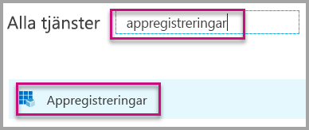 
    

4. Följ anvisningarna och skapa ett nytt program. För appar som äger data måste du använda **Inter** som programtyp. Du måste också ange ett **omdirigerings-URI** som **Azure AD** använder för att returnera tokensvar. Ange ett specifikt värde för din app, (till exempel: http://localhost:13526/redirect).

    

### Tillämpa behörigheter för ditt program i Azure Active Directory

Du måste aktivera ytterligare behörigheter för ditt program utöver vad som fanns på app-registreringssidan. Du måste du logga in med kontot *master* som används för att bädda in och som måste vara ett globalt administratörskonto.

### Använd Azure Active Directory-portalen

1. Bläddra till [App-registreringar](https://portal.azure.com/#blade/Microsoft_AAD_IAM/ApplicationsListBlade) i Azure Portal och välj den app som du använder för att bädda in.
   
    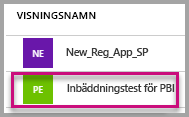

2. Välj **Inställningar**, sedan under **API-åtkomst** välj **Nödvändiga behörigheter**.
   
    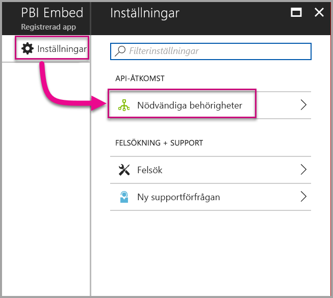

3. Välj **Windows Azure Active Directory** och kontrollera att **Åtkomst till katalogen som den inloggade användaren** är markerad. Välj **Spara**.
   
    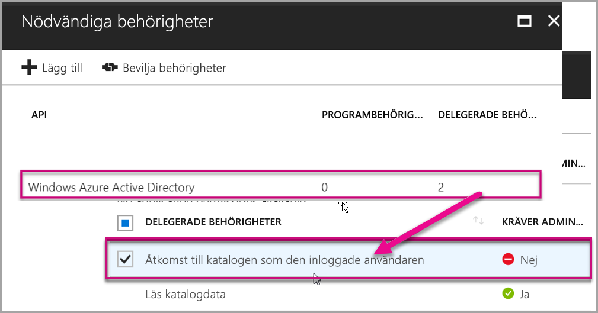

4. Välj **Lägg till**.

    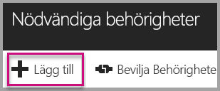

5. Välj **Välj en API**.

    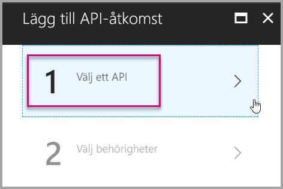

6. Välj **Power BI-tjänsten**och välj **Välj**.

    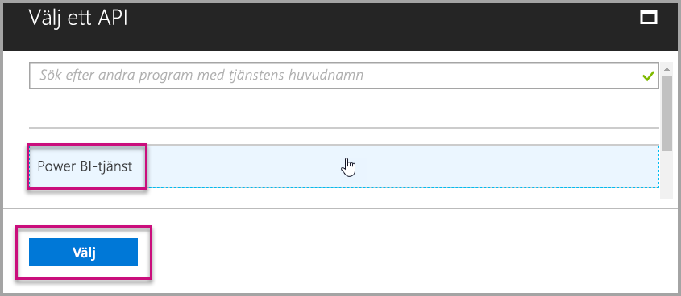

7. Välj alla behörigheter under **Delegerade behörigheter**. Du måste markera dem en och en för att kunna spara valen. Välj **Spara** när du är klar.
   
    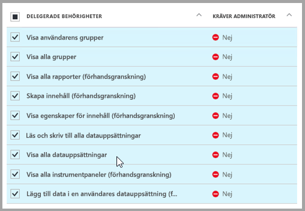

8. Inom **Nödvändiga behörigheter** väljer du **Bevilja behörigheter**.
   
    Åtgärden **Bevilja behörigheter** krävs för *masterkontot*. Annars kommer du att tillfrågas av Azure AD. Om kontot som utför den här åtgärden är en Global administratör kommer du att bevilja behörighet till alla användare inom din organisation för den här appen. Om det konto som utför den här åtgärden är *master-kontot* och inte en global administratör beviljar du endast behörigheter till *master-kontot* för den här appen.
   
    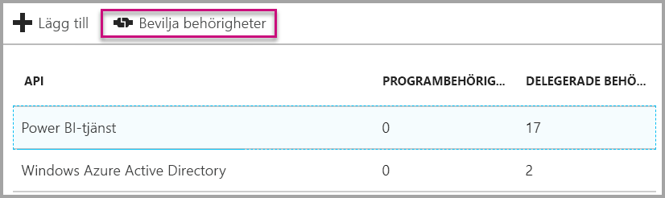

## Konfigurera din Power BI-miljö

### Skapa en app-arbetsyta

Om du bäddar in rapporter, instrumentpaneler eller paneler för kunderna, måste du placera innehållet i en app-arbetsyta. Kontot *master* måste vara administratör för app-arbetsytan.

1. Börja med att skapa arbetsytan. Välj **Arbetsytor** > **Skapa apparbetsyta**. Det är här du placerar innehåll som programmet behöver åtkomst till.

    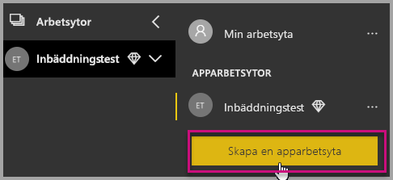

2. Ge arbetsytan ett namn. Om motsvarande **Arbetsyte-ID** inte är tillgängligt, kan du redigera det för att få fram ett unikt ID. Detta kommer också bli namnet på appen.

    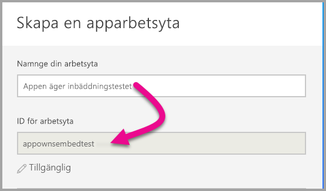

3. Det finns ett par alternativ som du måste ställa in. Om du väljer **Offentlig** kan alla i din organisation se vad som finns på arbetsytan. Om du väljer **Privat** kan endast medlemmar i arbetsytan se innehållet.

    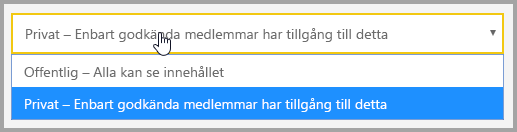

    Du kan inte ändra inställningen för Offentlig/Privat när du har skapat gruppen.

4. Du kan också välja om medlemmarna ska kunna **redigera** eller ha **skrivskyddad** åtkomst.

    

5. Lägg till e-postadresserna för de personer som du vill ska ha åtkomst till arbetsytan och välj **Lägg till**. Du kan inte lägga till gruppalias, bara enskilda användare.

6. Bestäm för varje person om den vara medlem eller administratör. Administratörer kan redigera arbetsytan samt lägga till andra medlemmar. Medlemmar kan redigera innehållet i arbetsytan, såvida de inte har skrivskyddad åtkomst. Både administratörer och medlemmar kan publicera appen.

Nu kan du visa det nya arbetsområdet. Power BI skapar arbetsytan och öppnar den. Den visas i listan med arbetsytor som du är medlem i. Eftersom du är administratör kan du välja ellipsen (...) för att gå tillbaka och göra ändringar, lägga till nya medlemmar eller ändra deras behörigheter.

   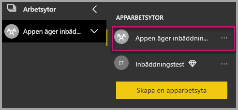

### Skapa och publicera rapporter

Du kan skapa rapporter och datauppsättningar som använder Power BI Desktop och publicera dessa rapporter till en apparbetsyta. Användaren som publicerar rapporterna behöver en Power BI Pro-licens för att publicera till en apparbetsyta.

1. Ladda ner exemplet [Bloggdemo](https://github.com/Microsoft/powerbi-desktop-samples) från GitHub.

    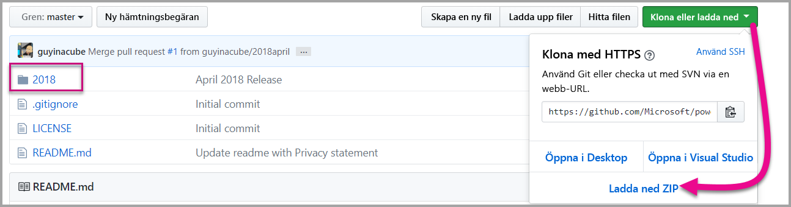

2. Öppna PBIX-exempelrapporten i **Power BI Desktop**

   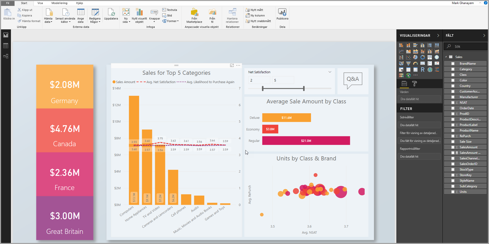

3. Publicera till **app-arbetsytan**

   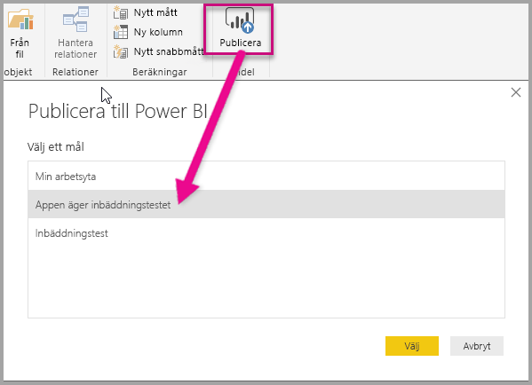

    Nu kan du visa rapporten i Power BI-tjänsten online

   

## Bädda in innehåll

Om du vill bädda in för dina kunder i programmet måste du hämta en **åtkomsttoken** för huvudkontot från **Azure AD**. Du måste [hämta en Azure AD-åtkomsttoken](get-azuread-access-token.md#access-token-for-non-power-bi-users-app-owns-data) för ditt Power BI-program med app äger data innan du gör anrop till Power BI-API:n.

Följ de här stegen om du vill börja bädda in innehåll med hjälp av ett exempelprogram.

1. Ladda ner [exempel på app äger data](https://github.com/Microsoft/PowerBI-Developer-Samples) från GitHub för att komma igång.

    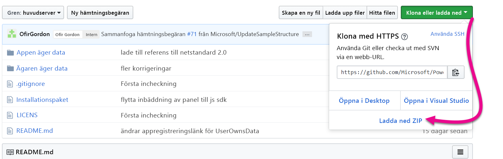

2. Öppna filen Web.config i exempelprogrammet. Det finns 5 fält du måste fylla i för att köra programmet. **clientID**, **groupId**, **reportId**, **pbiUsername** och **pbiPassword**.

      

    * Fyll i informationen **clientId** med **program-ID** från **Azure**. **clientId** används av programmet för att identifiera sig för användare som du begär behörighet från. För att hämta **clientId** gör du följande:

    1. Logga in på [Azure Portal](https://portal.azure.com).

        

    2. I det vänstra navigeringsfönstret väljer du **Alla tjänster** och **App-registreringar**.

        
    3. Välj det program som du vill hämta **clientId** för.

        

    4. Du bör se ett **program-ID** som har listats som en GUID. Använd detta **program-ID** som **clientId** för programmet.

        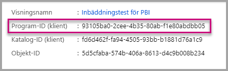     

    * Fyll i **groupId**-information med **app-arbetsytan GUID** från Power BI.

        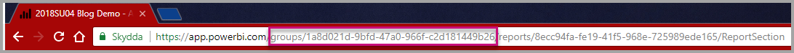

    * Fyll i **reportId**-information med **rapportera GUID** från Power BI.

        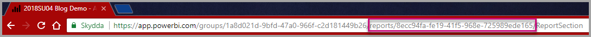    

    * Fyll i **pbiUsername** med masteranvändarkontot för Power BI.
    * Fyll i **pbiPassword** med lösenordet för masteranvändarkontot för Power BI.

3. Kör programmet!

    Välj först **Kör** i **Visual Studio**.

    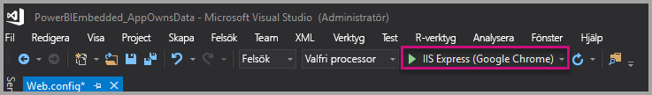

    Välj sedan **Bädda in rapport**. Beroende på vilket innehåll du väljer att testa med – rapporter, instrumentpaneler eller paneler – väljer du det alternativet i programmet.

    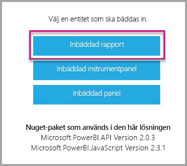
 
    Nu kan du visa rapporten i exempelprogrammet.

    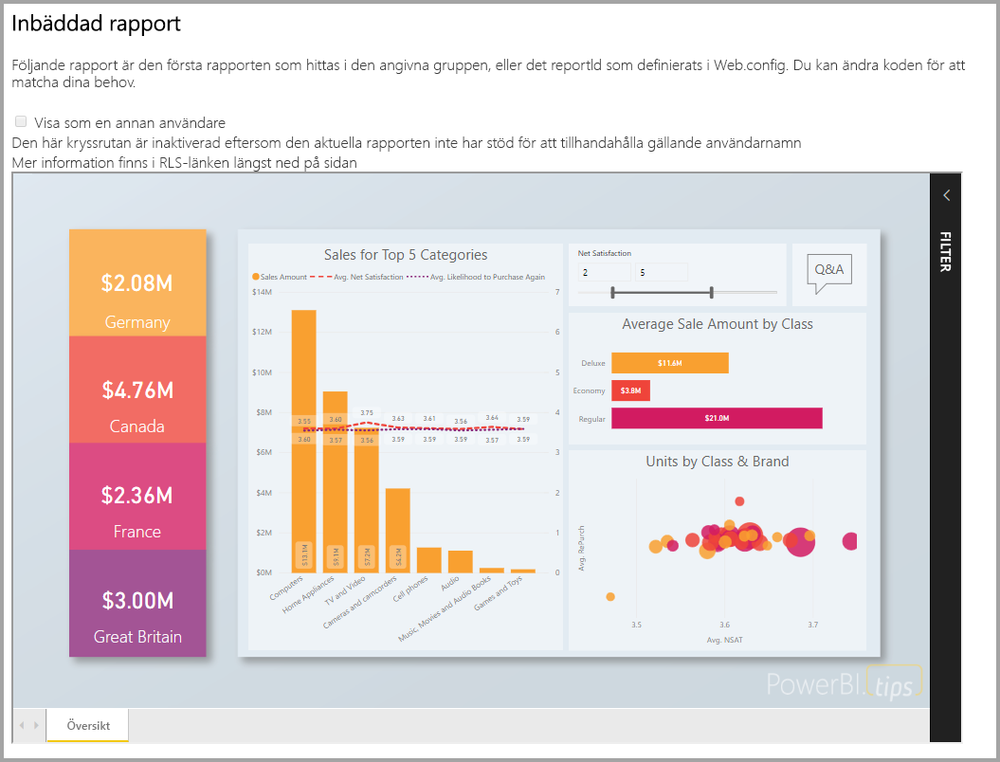

## Flytta till produktion

Nu när du är färdig med att utveckla ditt program är det dags att säkerhetskopiera din apparbetsyta med dedikerad kapacitet. Dedikerad kapacitet krävs för att flytta till produktion.

### Skapa en dedikerad kapacitet
Genom att skapa en dedikerad kapacitet kan du dra nytta av att ha en dedikerad resurs för dina kunder. Arbetsytor som inte tilldelas en dedikerad kapacitet kommer att finnas i en delad kapacitet. Du kan skapa en dedikerad kapacitet med hjälp av lösningen [Dedikerad kapacitet i Power BI Embedded](https://docs.microsoft.com/azure/power-bi-embedded/create-capacity) i Azure.

>[!Note]
>Inbäddningstoken med PRO-licenser är avsedda för utvecklartestning, så antalet inbäddningstoken ett Power BI-huvudkonto kan generera är begränsat. Du måste köpa en dedikerad kapacitet för inbäddning i en produktionsmiljö. Det finns ingen gräns för att hur många inbäddningstoken du kan generera med en dedikerad kapacitet. Gå till [Hämta tillgängliga funktioner](https://msdn.microsoft.com/library/mt846473.aspx) för att kontrollera det användningsvärde som indikerar aktuell inbäddad användning i procent.
>

### Tilldela en apparbetsyta till en dedikerad kapacitet

När du har skapat en dedikerad kapacitet tilldelar du apparbetsytan till den dedikerade kapaciteten. Gör så här för att slutföra detta:

1. I **Power BI-tjänsten** expanderar du arbetsytorna och väljer ellipsen för arbetsytan som du vill bädda in ditt innehåll med. Välj sedan **Redigera arbetsytor**.

    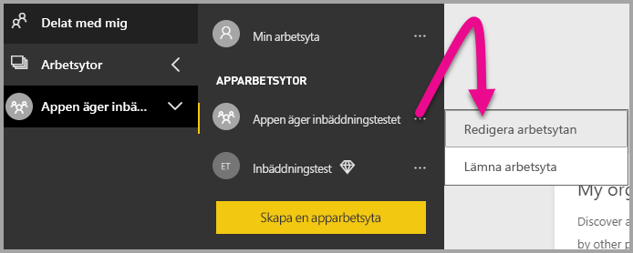

2. Expandera **Avancerat**, aktivera **Dedikerad kapacitet** och välj den dedikerade kapacitet du skapade. Välj sedan **Spara**.

    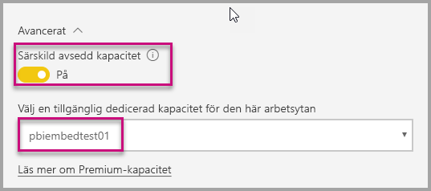

Du kan använda ett fullständigt exempel i JavaScript API i [Playground-verktyget](https://microsoft.github.io/PowerBI-JavaScript/demo). Detta är ett snabbt sätt att leka med olika typer av Power BI Embedded-exempel. Du kan också få mer information om API:et för JavaScript genom att besöka wiki-sidan för [PowerBI-JavaScript](https://github.com/Microsoft/powerbi-javascript/wiki).

Ytterligare frågor om Power BI Embedded finns på sidan [vanliga frågor och svar](embedded-faq.md).  Om du har problem med Power Bi Embedded i ditt program kan du besöka sidan [Felsökning](embedded-troubleshoot.md).

Har du fler frågor? [Fråga Power BI Community](http://community.powerbi.com/)