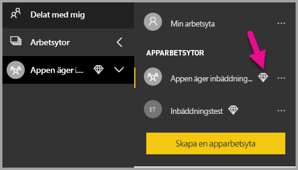

# <a name="tutorial-embed-a-power-bi-report-dashboard-or-tile-into-an-application-for-your-customers"></a>Självstudie: Bädda in en Power BI-rapport, instrumentpanel eller panel till ett program för dina kunder
Med **Power BI Embedded i Azure** kan du bädda in rapporter, instrumentpaneler eller paneler i ett program med **app äger data**. **App äger data** handlar om ett program som använder Power BI som en inbäddad analysplattform. Användning av **App äger data** är vanligtvis ett scenario för **ISV-utvecklare**. Som **ISV-utvecklare** kan du skapa **Power BI**-innehåll som visar rapporter, instrumentpaneler eller paneler i ett program som är helt integrerat och interaktivt, utan att kräva att användarna har en Power BI-licens. Den här självstudien visar hur du integrerar en rapport i ett program som använder **Power BI** .NET SDK tillsammans med **Power BI** JavaScript API när du använder **Power BI Embedded i Azure**  för kunder med **app äger data**.

I de här självstudierna får du lära dig att
>[!div class="checklist"]
>* Registrera ett program i Azure.
>* Bädda in en Power BI-rapport i ett program.

## <a name="prerequisites"></a>Förutsättningar
För att komma igång behöver du ett **Power BI Pro**-konto (det här kontot är ditt **huvudkonto**) och en **Microsoft Azure**-prenumeration.

* Om du inte har registrerat dig för **Power BI Pro**, [registrerar du dig för en kostnadsfri utvärderingsversion](https://powerbi.microsoft.com/en-us/pricing/) innan du börjar.
* Om du inte har någon Azure-prenumeration kan du [skapa ett kostnadsfritt konto](https://azure.microsoft.com/free/?WT.mc_id=A261C142F) innan du börjar.
* Du måste ha en egen installation för [Azure Active Directory-klient](create-an-azure-active-directory-tenant.md).
* Du behöver [Visual Studio](https://www.visualstudio.com/) installerad (version 2013 eller senare).

## <a name="set-up-your-embedded-analytics-development-environment"></a>Konfigurera den inbäddade utvecklingsmiljön för analysverktyg

Innan du börjar bädda in rapporter, instrumentpaneler eller paneler i din app måste du se till att din miljö har ställts in så att inbäddning tillåts. Som en del av installationen behöver du göra följande.

Med [integrationsverktyget](https://aka.ms/embedsetup/AppOwnsData) kommer du snabbt igång och kan ladda ned ett exempelprogram som steg för steg beskriver hur du skapar en miljö och bäddar in en rapport.

Om du i stället vill konfigurera miljön manuellt, fortsätter du bara nedan.
### <a name="register-an-application-in-azure-active-directory-azure-ad"></a>Registrera ett program i Azure Active Directory (Azure AD)

Du kan registrera din app med Azure Active Directory så att ditt program får åtkomst till Power BI REST-API:er. Därmed kan du upprätta en identitet för din app och ange behörigheter till Power BI REST-resurser.

1. Godkänn [villkoren för Microsoft Power BI-API](https://powerbi.microsoft.com/api-terms).

2. Logga in på [Azure Portal](https://portal.azure.com).
 
    

3. I det vänstra navigeringsfönstret väljer du **Alla tjänster**, **App-registreringar** och sedan **Ny appregistrering**.
   
    </br>
    

4. Följ anvisningarna och skapa ett nytt program. För appar som äger data måste du använda **Inter** som programtyp. Du måste också ange ett **omdirigerings-URI** som **Azure AD** använder för att returnera tokensvar. Ange ett specifikt värde för ditt program (till exempel: `http://localhost:13526/Redirect`).

    

### <a name="apply-permissions-to-your-application-within-azure-active-directory"></a>Tillämpa behörigheter för ditt program i Azure Active Directory

Du måste aktivera ytterligare behörigheter för ditt program utöver vad som fanns på app-registreringssidan. Du måste du logga in med kontot *master* som används för att bädda in och som måste vara ett globalt administratörskonto.

### <a name="use-the-azure-active-directory-portal"></a>Använd Azure Active Directory-portalen

1. Bläddra till [App-registreringar](https://portal.azure.com/#blade/Microsoft_AAD_IAM/ApplicationsListBlade) i Azure Portal och välj den app som du använder för att bädda in.
   
    

2. Välj **Inställningar**, sedan under **API-åtkomst** välj **Nödvändiga behörigheter**.
   
    

3. Välj **Windows Azure Active Directory** och kontrollera att **Åtkomst till katalogen som den inloggade användaren** är markerad. Välj **Spara**.
   
    

4. Välj **Lägg till**.

    

5. Välj **Välj en API**.

    

6. Välj **Power BI-tjänsten**och välj **Välj**.

    

7. Välj alla behörigheter under **Delegerade behörigheter**. Du måste välja dem separat för valen ska sparas. Välj **Spara** när du är klar.
   
    

8. Inom **Nödvändiga behörigheter** väljer du **Bevilja behörigheter**.
   
    Åtgärden **Bevilja behörigheter** krävs för *huvudkontot*. Annars kommer du att tillfrågas av Azure AD. Om kontot som utför den här åtgärden är en global administratör beviljar du behörighet till alla användare i din organisation för den här appen. Om kontot som utför den här åtgärden är *huvudkontot* och inte en global administratör beviljar du endast behörighet till *huvudkontot* för den här appen.
   
    

## <a name="set-up-your-power-bi-environment"></a>Konfigurera din Power BI-miljö

### <a name="create-an-app-workspace"></a>Skapa en app-arbetsyta

Om du bäddar in rapporter, instrumentpaneler eller paneler för kunderna, måste du placera innehållet i en app-arbetsyta. Kontot *master* måste vara administratör för app-arbetsytan.

1. Börja med att skapa arbetsytan. Välj **Arbetsytor** > **Skapa apparbetsyta**. Det är här du placerar innehåll som appen behöver åtkomst till.

    

2. Ge arbetsytan ett namn. Om motsvarande **Arbetsyte-ID** inte är tillgängligt, kan du redigera det för att få fram ett unikt ID. Detta ska också vara namnet på appen.

    

3. Det finns ett par alternativ som du måste ställa in. Om du väljer **Offentlig** kan alla i din organisation se vad som finns på arbetsytan. Om du väljer **Privat** kan endast medlemmar i arbetsytan se innehållet.

    

    Du kan inte ändra inställningen för Offentlig/Privat när du har skapat gruppen.

4. Du kan också välja om medlemmarna ska kunna **redigera** eller ha **skrivskyddad** åtkomst.

    

5. Lägg till e-postadresserna för de personer som du vill ska ha åtkomst till arbetsytan och välj **Lägg till**. Du kan inte lägga till gruppalias, bara enskilda användare.

6. Bestäm för varje person om den vara medlem eller administratör. Administratörer kan redigera arbetsytan samt lägga till andra medlemmar. Medlemmar kan redigera innehållet i arbetsytan, såvida de inte har skrivskyddad åtkomst. Både administratörer och medlemmar kan publicera appen.

    Nu kan du visa det nya arbetsområdet. Power BI skapar arbetsytan och öppnar den. Den visas i listan med arbetsytor där du är medlem. Eftersom du är administratör kan du välja ellipsen (...) för att gå tillbaka och göra ändringar, lägga till nya medlemmar eller ändra deras behörigheter.

    

### <a name="create-and-publish-your-reports"></a>Skapa och publicera rapporter

Du kan skapa rapporter och datauppsättningar som använder Power BI Desktop och publicera dessa rapporter till en apparbetsyta. Slutanvändaren som publicerar rapporterna måste ha en Power BI Pro-licens för att kunna publicera till en apparbetsyta.

1. Ladda ner exemplet [Bloggdemo](https://github.com/Microsoft/powerbi-desktop-samples) från GitHub.

    

2. Öppna PBIX-exempelrapporten i **Power BI Desktop**

   

3. Publicera till **app-arbetsytan**

   

    Nu kan du visa rapporten i Power BI-tjänsten online.

   

## <a name="embed-your-content-using-the-sample-application"></a>Bädda in innehåll med exempelprogrammet

Följ de här stegen om du vill börja bädda in innehåll med hjälp av ett exempelprogram.

1. Ladda ner [exempel på app äger data](https://github.com/Microsoft/PowerBI-Developer-Samples) från GitHub för att komma igång.

    

2. Öppna filen Web.config i exempelprogrammet. Du måste fylla i 5 fält för att kunna köra programmet. **clientId**, **groupId**, **reportId**, **pbiUsername** och **pbiPassword**.

    

    Fyll i informationen **clientId** med **program-ID** från **Azure**. **clientId** används av programmet för att identifiera sig för användare som du begär behörighet från. För att hämta **clientId** gör du följande:

    Logga in på [Azure Portal](https://portal.azure.com).

    

    I det vänstra navigeringsfönstret väljer du **Alla tjänster** och **App-registreringar**.

     Välj det program som du vill hämta **clientId** för.

    

    Du bör se ett **program-ID** som har listats som en GUID. Använd detta **program-ID** som **clientId** för programmet.

    

    Fyll i **groupId**-information med **app-arbetsytan GUID** från Power BI.

    

    Fyll i **reportId**-information med **rapportera GUID** från Power BI.

    

    * Fyll i **pbiUsername** med huvudanvändarkontot för Power BI.
    * Fyll i **pbiPassword** med lösenordet för huvudanvändarkontot för Power BI.

3. Kör programmet!

    Välj först **Kör** i **Visual Studio**.

    

    Välj sedan **Bädda in rapport**. Beroende på vilket innehåll du väljer att testa med – rapporter, instrumentpaneler eller paneler – väljer du det alternativet i programmet.

    

    Nu kan du visa rapporten i exempelprogrammet.

    

## <a name="embed-your-content-within-your-application"></a>Bädda in innehåll i programmet
Innehåll kan bäddas in med hjälp av [Power BI REST API:er](https://docs.microsoft.com/rest/api/power-bi/), men exempelkoderna som beskrivs i den här artikeln görs med **.NET SDK**.

Om du vill bädda in för dina kunder i programmet måste du hämta en **åtkomsttoken** för huvudkontot från **Azure AD**. Du måste hämta en [Azure AD-åtkomsttoken](get-azuread-access-token.md#access-token-for-non-power-bi-users-app-owns-data) för ditt Power BI-program med **app äger data** innan du gör anrop till [Power BI REST API:erna](https://docs.microsoft.com/rest/api/power-bi/).

Skapa Power BI-klienten med din **åtkomsttoken** genom att skapa Power BI-klientobjektet som gör att du kan interagera med [Power BI REST API:er](https://docs.microsoft.com/rest/api/power-bi/). Detta görs genom att omsluta **AccessToken** med ett ***Microsoft.Rest.TokenCredentials***-objekt.

```csharp
using Microsoft.IdentityModel.Clients.ActiveDirectory;
using Microsoft.Rest;
using Microsoft.PowerBI.Api.V2;

var tokenCredentials = new TokenCredentials(authenticationResult.AccessToken, "Bearer");

// Create a Power BI Client object. It is used to call Power BI APIs.
using (var client = new PowerBIClient(new Uri(ApiUrl), tokenCredentials))
{
    // Your code to embed items.
}
```

### <a name="get-the-content-item-you-want-to-embed"></a>Hämta innehållsobjektet som du vill bädda in
Använd Power BI-klientobjektet för att hämta en referens till det objekt du vill bädda in.

Här är ett kodexempel på hur du hämtar den första rapporten från en given arbetsyta.

*Ett exempel på hur du hämtar ett innehållsobjekt, vare sig du vill bädda in en rapport, instrumentpanel eller panel, finns i filen Controllers\HomeController.cs i [exempelprogrammet](#embed-your-content-within-a-sample-application).*

```csharp
using Microsoft.PowerBI.Api.V2;
using Microsoft.PowerBI.Api.V2.Models;

// You need to provide the GroupID where the dashboard resides.
ODataResponseListReport reports = client.Reports.GetReportsInGroupAsync(GroupId);

// Get the first report in the group.
Report report = reports.Value.FirstOrDefault();
```

### <a name="create-the-embed-token"></a>Skapa inbäddningstoken
En inbäddningstoken behöver skapas som kan användas från JavaScript-API:t. En inbäddningstoken gäller endast för det objekt du bäddar in. Det innebär att när du bäddar in en bit Power BI-innehåll måste du skapa en ny inbäddningstoken för den. Mer information, inklusive vilken **accessLevel** som du ska använda, finns i [GenerateToken-API:t](https://msdn.microsoft.com/library/mt784614.aspx).

Här är ett exempel på hur du lägger till en inbäddningstoken för en rapport till ditt program.

*Ett exempel på hur du skapar en inbäddningstoken för en rapport, instrumentpanel eller panel finns i filen Controllers\HomeController.cs i [exempelprogrammet](#embed-your-content-within-a-sample-application).*

```csharp
using Microsoft.PowerBI.Api.V2;
using Microsoft.PowerBI.Api.V2.Models;

// Generate Embed Token.
var generateTokenRequestParameters = new GenerateTokenRequest(accessLevel: "view");
EmbedToken tokenResponse = client.Reports.GenerateTokenInGroup(GroupId, report.Id, generateTokenRequestParameters);

// Generate Embed Configuration.
var embedConfig = new EmbedConfig()
{
    EmbedToken = tokenResponse,
    EmbedUrl = report.EmbedUrl,
    Id = report.Id
};
```

Detta förutsätter att en klass skapas för **EmbedConfig** och **TileEmbedConfig**. Ett exempel på dessa finns i filerna **Models\EmbedConfig.cs** och **Models\TileEmbedConfig.cs**.

### <a name="load-an-item-using-javascript"></a>Läsa in ett objekt med JavaScript
Du kan använda JavaScript för att läsa in en rapport till olika element på webbsidan.

Du kan använda ett fullständigt exempel i JavaScript API i [Playground-verktyget](https://microsoft.github.io/PowerBI-JavaScript/demo). Detta är ett snabbt sätt att leka med olika typer av Power BI Embedded-exempel. Du kan även få mer information om API:et för JavaScript genom att besöka wiki-sidan för [PowerBI-JavaScript](https://github.com/Microsoft/powerbi-javascript/wiki).

I det här exemplet används en **EmbedConfig**-modell och en **TileEmbedConfig**-modell tillsammans med vyer för en rapport.

*Ett exempel på hur du lägger till en vy för en rapport, instrumentpanel eller panel finns i filerna Views\Home\EmbedReport.cshtml, Views\Home\EmbedDashboard.cshtml och Views\Home\Embedtile.cshtml i [exempelprogrammet](#embed-your-content-within-a-sample-application).*

```javascript
<script src="~/scripts/powerbi.js"></script>
<div id="reportContainer"></div>
<script>
    // Read embed application token from Model
    var accessToken = "@Model.EmbedToken.Token";

    // Read embed URL from Model
    var embedUrl = "@Html.Raw(Model.EmbedUrl)";

    // Read report Id from Model
    var embedReportId = "@Model.Id";

    // Get models. models contains enums that can be used.
    var models = window['powerbi-client'].models;

    // Embed configuration used to describe the what and how to embed.
    // This object is used when calling powerbi.embed.
    // This also includes settings and options such as filters.
    // You can find more information at https://github.com/Microsoft/PowerBI-JavaScript/wiki/Embed-Configuration-Details.
    var config = {
        type: 'report',
        tokenType: models.TokenType.Embed,
        accessToken: accessToken,
        embedUrl: embedUrl,
        id: embedReportId,
        permissions: models.Permissions.All,
        settings: {
            filterPaneEnabled: true,
            navContentPaneEnabled: true
        }
    };

    // Get a reference to the embedded report HTML element
    var reportContainer = $('#reportContainer')[0];

    // Embed the report and display it within the div container.
    var report = powerbi.embed(reportContainer, config);
</script>
```

## <a name="move-to-production"></a>Flytta till produktion

Nu när du har utvecklat ditt program är det dags att skapa dedikerad kapacitet för apparbetsytan. Dedikerad kapacitet krävs för att flytta till produktion.

### <a name="create-a-dedicated-capacity"></a>Skapa en dedikerad kapacitet
Genom att skapa en dedikerad kapacitet kan du dra nytta av att ha en dedikerad resurs för dina kunder. Du kan köpa en dedikerad kapacitet inom [Microsoft Azure-portalen](https://portal.azure.com). Mer information om hur du skapar Power BI Embedded-kapacitet finns i [Skapa Power BI Embedded-kapacitet i Azure-portalen](azure-pbie-create-capacity.md).

Använd tabellen nedan för att avgöra vilken Power BI Embedded-kapacitet som bäst passar dina behov.

| Kapacitetsnod | Totalt antal kärnor<br/>*(Serverdel + klientdel)* | Serverdelskärnor | Klientdelskärnor | DirectQuery/begränsningar vid liveanslutning | Max sidåtergivningar vid högbelastning |
| --- | --- | --- | --- | --- | --- |
| A1 |1 v-kärna |0,5 kärnor, 3 GB RAM |0,5 kärnor | 5 per sekund |1-300 |
| A2 |2 v-kärnor |1 kärna, 5 GB RAM |1 kärna | 10 per sekund |301-600 |
| A3 |4 v-kärnor |2 kärnor, 10 GB RAM |2 kärnor | 15 per sekund |601–1200 |
| A4 |8 v-kärnor |4 kärnor, 25 GB RAM |4 kärnor |30 per sekund |1201–2400 |
| A5 |16 v-kärnor |8 kärnor, 50 GB RAM |8 kärnor |60 per sekund |2401–4800 |
| A6 |32 v-kärnor |16 kärnor, 100 GB RAM |16 kärnor |120 per sekund |4801–9600 |

**_Med A-SKU: er kan du inte komma åt Power BI-innehåll med en kostnadsfri Power BI-licens._**

Inbäddningstoken med PRO-licenser är avsedda för utvecklartestning, så antalet inbäddningstoken ett Power BI-huvudkonto kan generera är begränsat. Du måste köpa en dedikerad kapacitet för inbäddning i en produktionsmiljö. Det finns ingen gräns för att hur många inbäddningstoken du kan generera med en dedikerad kapacitet. Gå till [Tillgängliga funktioner](https://docs.microsoft.com/rest/api/power-bi/availablefeatures/getavailablefeatures) för att kontrollera användningsvärdet som anger aktuell inbäddad användning i procent. Användningsmängden baseras per huvudkonto.

För mer information, se [White paper om kapacitetsplanering för inbäddad analys](https://aka.ms/pbiewhitepaper).

### <a name="assign-an-app-workspace-to-a-dedicated-capacity"></a>Tilldela en apparbetsyta till en dedikerad kapacitet

När du har skapat en dedikerad kapacitet kan du tilldela apparbetsytan till den dedikerade kapaciteten. Gör så här för att slutföra detta:

1. I **Power BI-tjänsten** expanderar du arbetsytorna och väljer ellipsen för arbetsytan som du vill bädda in ditt innehåll med. Välj sedan **Redigera arbetsytor**.

    

2. Expandera **Avancerat**, aktivera **Dedikerad kapacitet** och välj den dedikerade kapacitet du skapade. Välj sedan **Spara**.

    

3. När du har valt **Spara** bör du se en **romb** bredvid namnet på apparbetsytan.

    

## <a name="next-steps"></a>Nästa steg
I den här självstudien har du lärt dig hur du bäddar in Power BI-innehåll i ett program för dina kunders räkning. Du kan även prova att bädda in Power BI-innehåll för din organisation.

> [!div class="nextstepaction"]
>[Bädda in för din organisation](embed-sample-for-your-organization.md)

Har du fler frågor? [Fråga Power BI Community](http://community.powerbi.com/)
