# <a name="tutorial-embed-a-power-bi-report-dashboard-or-tile-into-an-application-for-your-organization"></a>Självstudie: Bädda in en Power BI-rapport, instrumentpanel eller panel till ett program för din organisation

I **Power BI**, kan du bädda in rapporter och instrumentpaneler eller paneler i ett program med hjälp av användarägda data. **Användarägda data** gör att ditt program kan utöka Power BI-tjänsten. Den här självstudien visar hur du integrerar en rapport i ett program. Du kan använda Power BI .NET SDK med Power BI JavaScript API för att bädda in Power BI i ett program för din organisation.


I den här självstudien går du igenom följande aktiviteter:
> [!div class="checklist"]
> * Registrera ett program i Azure.
> * Bädda in en Power BI-rapport i ett program.

## <a name="prerequisites"></a>Förutsättningar

Om du vill komma igång behöver du ett Power BI Pro-konto och en Microsoft Azure-prenumeration:

* Om du inte har registrerat dig för Power BI Pro, [registrerar du dig för en kostnadsfri utvärderingsversion](https://powerbi.microsoft.com/en-us/pricing/) innan du börjar.
* Om du inte har någon Azure-prenumeration kan du [skapa ett kostnadsfritt konto](https://azure.microsoft.com/free/?WT.mc_id=A261C142F) innan du börjar.
* Konfigurera din egen [Azure Active Directory-klient (Azure AD)](create-an-azure-active-directory-tenant.md).
* Installera [Visual Studio](https://www.visualstudio.com/), version 2013 eller senare.

## <a name="set-up-your-embedded-analytics-development-environment"></a>Konfigurera den inbäddade utvecklingsmiljön för analysverktyg

Innan du börjar bädda in rapporter, instrumentpaneler eller paneler i din app måste du se till att din miljö har ställts in så att inbäddning tillåts. Gör något av följande som en del av konfigurationen:

* Med [konfigurationsverktyget för inbäddning](https://aka.ms/embedsetup/UserOwnsData) kommer du snabbt igång och kan ladda ned ett exempelprogram som steg för steg beskriver hur du skapar en miljö och bäddar in en rapport.

* Om du väljer att konfigurera miljön manuellt måste du vidta åtgärder i följande avsnitt.

### <a name="register-an-application-in-azure-active-directory"></a>Registrera ett program i Azure Active Directory

Du kan registrera din app med Azure Active Directory så att ditt program får åtkomst till Power BI REST-API:er. Därmed kan du upprätta en identitet för din app och ange behörigheter till Power BI REST-resurser.

1. Godkänn [villkoren för Microsoft Power BI-API](https://powerbi.microsoft.com/api-terms).

2. Logga in på [Azure-portalen](https://portal.azure.com).

    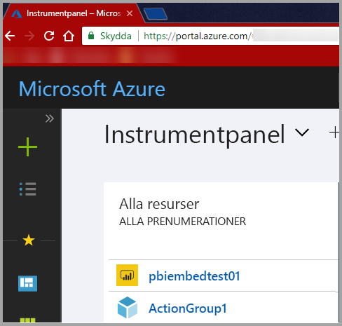

3. I det vänstra navigeringsfönstret väljer du **Alla tjänster** och **App-registreringar**. Välj **Ny programregistrering**.

    </br>

    

4. Följ anvisningarna och skapa ett nytt program. För **användare äger data** måste du använda **Webbapp/API** som **programtyp**. Ange en **inloggnings-URL** som Microsoft Azure Active Directory använder för att returnera tokensvar. Ange ett specifikt värde för ditt program. Ett exempel är `http://localhost:13526/`.

    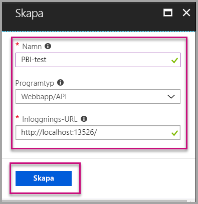

### <a name="apply-permissions-to-your-application-within-azure-active-directory"></a>Tillämpa behörigheter för ditt program i Azure Active Directory

Aktivera behörigheter för ditt program utöver vad du angav på appregistreringssidan. Logga in med ett konto för en global administratör för att aktivera behörigheter.

### <a name="use-the-azure-active-directory-portal"></a>Använd Azure Active Directory-portalen

1. Bläddra till [Appregistreringar](https://portal.azure.com/#blade/Microsoft_AAD_IAM/ApplicationsListBlade) i Azure-portalen och välj den app som du använder för att bädda in.

    

2. Välj **inställningar**. Välj **Nödvändiga behörigheter** under **API-åtkomst**.

    

3. Välj **Windows Azure Active Directory**. Kontrollera att **Åtkomst till katalogen som den inloggade användaren** är markerad. Välj **Spara**.

    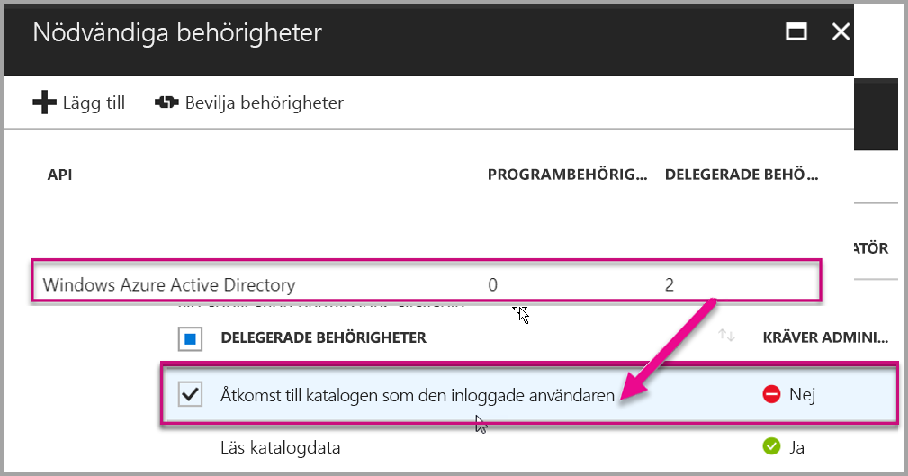

4. Välj **Lägg till**.

    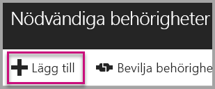

5. Välj **Välj en API**.

    

6. Välj **Power BI-tjänsten**. Välj sedan **Välj**.

    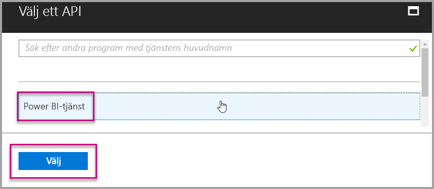

7. Välj alla behörigheter under **Delegerade behörigheter**. Du måste välja dem separat för valen ska sparas. Välj **Spara** när du är klar.

    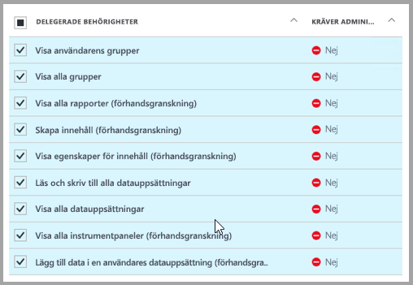

## <a name="set-up-your-power-bi-environment"></a>Konfigurera din Power BI-miljö

### <a name="create-an-app-workspace"></a>Skapa en apparbetsyta

Om du bäddar in rapporter, instrumentpaneler eller paneler för kunderna, måste du placera innehållet i en apparbetsyta:

1. Börja med att skapa arbetsytan. Välj **Arbetsytor** > **Skapa apparbetsyta**. Det är på den här arbetsytan som du placerar innehåll som appen behöver åtkomst till.

    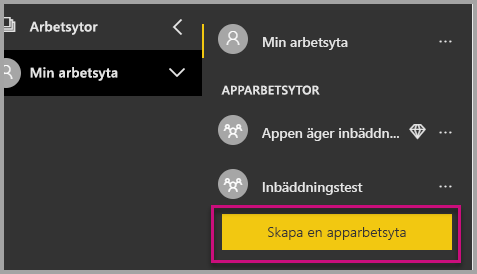

2. Ge arbetsytan ett namn. Om motsvarande **Arbetsyte-ID** inte är tillgängligt, kan du redigera det för att få fram ett unikt ID. Detta ska också vara namnet på appen.

    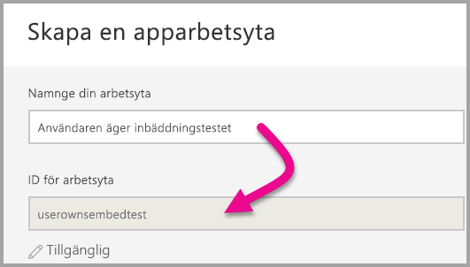

3. Det finns ett par alternativ som du måste ställa in. Om du väljer **Offentlig** kan alla i din organisation se vad som finns på arbetsytan. Om du väljer **Privat** kan endast medlemmar i arbetsytan se innehållet.

    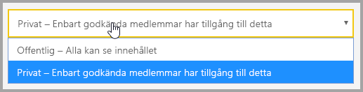

    Du kan inte ändra inställningen för Offentlig och Privat när du har skapat gruppen.

4. Du kan också välja om medlemmarna ska kunna redigera eller ha skrivskyddad åtkomst.

    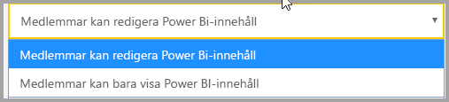

5. Lägg till e-postadresserna för de personer som du vill ska ha åtkomst till arbetsytan och välj **Lägg till**. Du kan inte lägga till gruppalias, bara enskilda användare.

6. Bestäm för varje person om den vara medlem eller administratör. Administratörer kan redigera arbetsytan samt lägga till andra medlemmar. Medlemmar kan redigera innehållet i arbetsytan, såvida de inte har skrivskyddad åtkomst. Både administratörer och medlemmar kan publicera appen.

    Nu kan du visa det nya arbetsområdet. Power BI skapar arbetsytan och öppnar den. Den visas i listan med arbetsytor där du är medlem. Eftersom du är administratör kan du välja ellipsen (...) för att gå tillbaka och göra ändringar, lägga till nya medlemmar eller ändra deras behörigheter.

    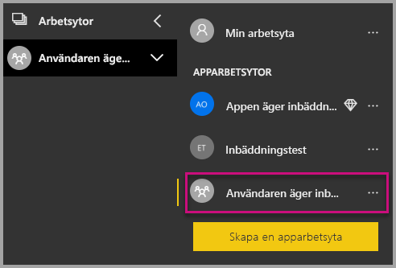

### <a name="create-and-publish-your-reports"></a>Skapa och publicera rapporter

Du kan skapa rapporter och datauppsättningar med hjälp av Power BI Desktop. Därefter kan du publicera dessa rapporter till en apparbetsyta. Slutanvändaren som publicerar rapporterna måste ha en Power BI Pro-licens för att kunna publicera till en apparbetsyta.

1. Ladda ner exemplet [Bloggdemo](https://github.com/Microsoft/powerbi-desktop-samples) från GitHub.

    

2. Öppna PBIX-exempelrapporten i Power BI Desktop.

   

3. Publicera till apparbetsytan.

   

    Nu kan du visa rapporten i Power BI-tjänsten online.

   

## <a name="embed-your-content-by-using-the-sample-application"></a>Bädda in innehåll med exempelprogrammet

Följ de här stegen om du vill börja bädda in innehåll med hjälp av ett exempelprogram:

1. Ladda ner [exempel på användare äger data](https://github.com/Microsoft/PowerBI-Developer-Samples) från GitHub för att komma igång. Det finns tre olika exempelprogram. Ett för [rapporter](https://github.com/Microsoft/PowerBI-Developer-Samples/tree/master/User%20Owns%20Data/integrate-report-web-app), ett för [instrumentpaneler](https://github.com/Microsoft/PowerBI-Developer-Samples/tree/master/User%20Owns%20Data/integrate-dashboard-web-app) och ett för [paneler](https://github.com/Microsoft/PowerBI-Developer-Samples/tree/master/User%20Owns%20Data/integrate-tile-web-app). Den här artikeln handlar om programmet för **rapporter**.

    

2. Öppna filen **Cloud.config** i exempelprogrammet. Du måste fylla i några fält för att kunna köra programmet: **ApplicationID** och **ApplicationSecret**.

    

    Fyll i **ApplicationID**-uppgifterna med **Program-ID** från Azure. **ApplicationID** används av programmet för att identifiera sig för de användare som du begär behörighet från.

    Hämta **ApplicationID** genom att utföra följande steg:

    1. Logga in på [Azure-portalen](https://portal.azure.com).

       

    2. I det vänstra navigeringsfönstret väljer du **Alla tjänster** och **App-registreringar**.

       

    3. Välj det program som behöver använda **ApplicationID**.

       

    4. Du bör se ett **program-ID** som har listats som en GUID. Använd detta **program-ID** som **ApplicationID** för appen.

        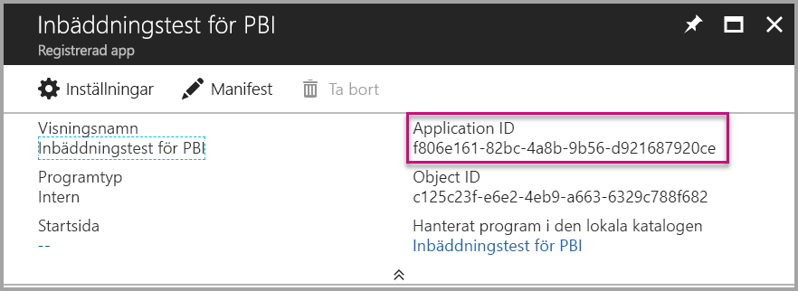

    Fyll i **ApplicationSecret**-uppgifterna från avsnittet **Nycklar** från avsnittet **Appregistreringar** i **Azure**.

    Hämta **ApplicationSecret** genom att utföra följande steg:

    1. Logga in på [Azure-portalen](https://portal.azure.com).

       

    2. I det vänstra navigeringsfönstret väljer du **Alla tjänster** och **App-registreringar**.

       

    3. Välj det program som behöver använda **ApplicationSecret**.

       

    4. Välj **inställningar**.

       

    5. Välj **Nycklar**.

       

    6. Ange ett namn i rutan **Beskrivning** och välj en varaktighet. Välj sedan **Spara** för att hämta **värdet** för ditt program. När du stänger fönstret **Nycklar** efter att ha sparat nyckelvärdet visas värdefältet bara som dolt. I det här läget kan du inte att hämta nyckelvärdet. Om du tappar bort nyckelvärdet måste du skapa ett nytt på Microsoft Azure-portalen.

          

    7. Fyll i **groupId** med apparbetsytan GUID från Power BI.

       

    8. Fyll i **reportId** med rapport-GUID från Power BI.

       

3. Kör programmet:

    Välj **Kör** i **Visual Studio**.

    

    Välj sedan **Hämta rapport**.

    

    Nu kan du visa rapporten i exempelprogrammet.

    

## <a name="embed-your-content-within-your-application"></a>Bädda in innehåll i programmet

Innehåll kan bäddas in med hjälp av [Power BI REST API:er](https://docs.microsoft.com/rest/api/power-bi/), men exempelkoderna som beskrivs i den här artikeln görs med .NET SDK.

Om du vill integrera en rapport i en webbapp använder du Power BI REST API eller Power BI C# SDK. Du kan också använda en åtkomsttoken för Azure Active Directory-auktorisering för att hämta en rapport. Sedan kan du läsa in rapporten med samma åtkomsttoken. Power BI REST API ger programmeringsåtkomst till vissa Power BI-resurser. Mer information finns i [Power BI REST API](https://docs.microsoft.com/rest/api/power-bi/) och [Power BI JavaScript API](https://github.com/Microsoft/PowerBI-JavaScript).

### <a name="get-an-access-token-from-azure-ad"></a>Hämta en åtkomsttoken från Azure AD

Du måste hämta en åtkomsttoken från Azure AD i ditt program innan du kan göra anrop mot Power BI REST-API:t. Mer information finns i [Autentisera användare och hämta en Azure AD-åtkomsttoken för din Power BI-app](get-azuread-access-token.md).

### <a name="get-a-report"></a>Hämta en rapport

Hämta en Power BI-rapport genom att använda åtgärden [Hämta rapporter](https://docs.microsoft.com/rest/api/power-bi/reports/getreports) som hämtar en lista med Power BI-rapporter. Du kan hämta ett rapport-ID från listan med rapporter.

### <a name="get-reports-by-using-an-access-token"></a>Hämta rapporter med hjälp av en åtkomsttoken

Åtgärden [Hämta rapporter](https://docs.microsoft.com/rest/api/power-bi/reports/getreports) returnerar en lista med rapporter. Du kan hämta en enda rapport från listan med rapporter.

Om du vill göra REST API-anrop måste du inkludera en *auktoriserings*rubrik i formatet *Ägare {åtkomsttoken}*.

#### <a name="get-reports-with-the-rest-api"></a>Hämta rapporter med REST API

Här är ett kodexempel på hur du hämtar rapporter med **REST API**:

> [!NOTE]  
> Ett exempel på hur du hämtar ett innehållsobjekt som du vill bädda in finns i filen **Default.aspx.cs** i [exempelprogrammet](#embed-your-content-using-the-sample-application). Exempel på detta är en rapport, en instrumentpanel eller en panel.

```csharp
using Newtonsoft.Json;

//Get a Report. In this sample, you get the first Report.
protected void GetReport(int index)
{
    //Configure Reports request
    System.Net.WebRequest request = System.Net.WebRequest.Create(
        String.Format("{0}/Reports",
        baseUri)) as System.Net.HttpWebRequest;

    request.Method = "GET";
    request.ContentLength = 0;
    request.Headers.Add("Authorization", String.Format("Bearer {0}", accessToken.Value));

    //Get Reports response from request.GetResponse()
    using (var response = request.GetResponse() as System.Net.HttpWebResponse)
    {
        //Get reader from response stream
        using (var reader = new System.IO.StreamReader(response.GetResponseStream()))
        {
            //Deserialize JSON string
            PBIReports Reports = JsonConvert.DeserializeObject<PBIReports>(reader.ReadToEnd());

            //Sample assumes at least one Report.
            //You could write an app that lists all Reports
            if (Reports.value.Length > 0)
            {
                var report = Reports.value[index];

                txtEmbedUrl.Text = report.embedUrl;
                txtReportId.Text = report.id;
                txtReportName.Text = report.name;
            }
        }
    }
}

//Power BI Reports used to deserialize the Get Reports response.
public class PBIReports
{
    public PBIReport[] value { get; set; }
}
public class PBIReport
{
    public string id { get; set; }
    public string name { get; set; }
    public string webUrl { get; set; }
    public string embedUrl { get; set; }
}
```

#### <a name="get-reports-by-using-the-net-sdk"></a>Hämta rapporter med .NET SDK

Du kan använda .NET SDK för att hämta en lista med rapporter i stället för att anropa REST API direkt. Följande kodexempel visar hur du listar rapporter:

```csharp
using Microsoft.IdentityModel.Clients.ActiveDirectory;
using Microsoft.PowerBI.Api.V2;
using Microsoft.PowerBI.Api.V2.Models;

var tokenCredentials = new TokenCredentials(<ACCESS TOKEN>, "Bearer");

// Create a Power BI Client object. It is used to call Power BI APIs.
using (var client = new PowerBIClient(new Uri(ApiUrl), tokenCredentials))
{
    // Get the first report all reports in that workspace
    ODataResponseListReport reports = client.Reports.GetReports();

    Report report = reports.Value.FirstOrDefault();

    var embedUrl = report.EmbedUrl;
}
```

### <a name="load-a-report-by-using-javascript"></a>Läs in en rapport med hjälp av JavaScript

Du kan använda JavaScript för att läsa in en rapport till olika element på webbsidan. Här är ett kodexempel på hur du hämtar en rapport från en given arbetsyta:

> [!NOTE]  
> Ett exempel på hur du läser in ett innehållsobjekt som du vill bädda in finns i filen **Default.aspx.cs** i [exempelprogrammet](#embed-your-content-using-the-sample-application). Exempel på detta är en rapport, en instrumentpanel eller en panel.

```javascript
<!-- Embed Report-->
<div> 
    <asp:Panel ID="PanelEmbed" runat="server" Visible="true">
        <div>
            <div><b class="step">Step 3</b>: Embed a report</div>

            <div>Enter an embed url for a report from Step 2 (starts with https://):</div>
            <input type="text" id="tb_EmbedURL" style="width: 1024px;" />
            <br />
            <input type="button" id="bEmbedReportAction" value="Embed Report" />
        </div>

        <div id="reportContainer"></div>
    </asp:Panel>
</div>
```

#### <a name="sitemaster"></a>Site.master

```javascript
window.onload = function () {
    // client side click to embed a selected report.
    var el = document.getElementById("bEmbedReportAction");
    if (el.addEventListener) {
        el.addEventListener("click", updateEmbedReporte, false);
    } else {
        el.attachEvent('onclick', updateEmbedReport);
    }

    // handle server side post backs, optimize for reload scenarios
    // show embedded report if all fields were filled in.
    var accessTokenElement = document.getElementById('MainContent_accessTokenTextbox');
    if (accessTokenElement !== null) {
        var accessToken = accessTokenElement.value;
        if (accessToken !== "")
            updateEmbedReport();
    }
};

// update embed report
function updateEmbedReport() {

    // check if the embed url was selected
    var embedUrl = document.getElementById('tb_EmbedURL').value;
    if (embedUrl === "")
        return;

    // get the access token.
    accessToken = document.getElementById('MainContent_accessTokenTextbox').value;

    // Embed configuration used to describe the what and how to embed.
    // This object is used when calling powerbi.embed.
    // You can find more information at https://github.com/Microsoft/PowerBI-JavaScript/wiki/Embed-Configuration-Details.
    var config = {
        type: 'report',
        accessToken: accessToken,
        embedUrl: embedUrl
    };

    // Grab the reference to the div HTML element that will host the report.
    var reportContainer = document.getElementById('reportContainer');

    // Embed the report and display it within the div container.
    var report = powerbi.embed(reportContainer, config);

    // report.on will add an event handler which prints to Log window.
    report.on("error", function (event) {
        var logView = document.getElementById('logView');
        logView.innerHTML = logView.innerHTML + "Error<br/>";
        logView.innerHTML = logView.innerHTML + JSON.stringify(event.detail, null, "  ") + "<br/>";
        logView.innerHTML = logView.innerHTML + "---------<br/>";
    }
  );
}
```

## <a name="using-a-power-bi-premium-dedicated-capacity"></a>Använda en dedikerad kapacitet med Power BI Premium

Nu när du har utvecklat ditt program är det dags att skapa dedikerad kapacitet för apparbetsytan.

### <a name="create-a-dedicated-capacity"></a>Skapa en dedikerad kapacitet

Genom att skapa en dedikerad kapacitet kan du dra nytta av att ha en dedikerad resurs för innehållet i din apps arbetsyta. Du kan skapa en dedikerad kapacitet med hjälp av [Power BI Premium ](../service-premium.md).

Följande tabell innehåller de tillgängliga Power BI Premium-SKU:erna i [Microsoft Office 365](../service-admin-premium-purchase.md):

| Kapacitetsnod | Totalt antal virtuella kärnor<br/>(serverdel + klientdel) | Serverdelens virtuella kärnor | Klientdelens virtuella kärnor | DirectQuery/begränsningar vid liveanslutning |
| --- | --- | --- | --- | --- | --- |
| EM1 |1 virtuell kärna |0,5 virtuell kärna, 10 GB RAM-minne |0,5 virtuell kärna |3,75 per sekund |
| EM2 |2 virtuella kärnor |1 virtuell kärna, 10 GB RAM-minne |1 virtuell kärna |7,5 per sekund |
| EM3 |4 virtuella kärnor |2 virtuella kärnor, 10 GB RAM-minne |2 virtuella kärnor |15 per sekund |
| P1 |8 virtuella kärnor |4 virtuella kärnor, 25 GB RAM-minne |4 virtuella kärnor |30 per sekund |
| P2 |16 virtuella kärnor |8 virtuella kärnor, 50 GB RAM-minne |8 virtuella kärnor |60 per sekund |
| P3 |32 virtuella kärnor |16 virtuella kärnor, 100 GB RAM-minne |16 virtuella kärnor |120 per sekund |
| P4 |64 virtuella kärnor |32 virtuella kärnor, 200 GB RAM-minne |32 virtuella kärnor |240 per sekund |
| P5 |128 virtuella kärnor |64 virtuella kärnor, 400 GB RAM-minne |64 virtuella kärnor |480 per sekund |
> [!NOTE]
> - När du försöker bädda in med Microsoft Office-appar använder du EM-SKU:er för att komma åt innehåll med en kostnadsfri licens för Power BI. Du kan dock inte komma åt innehåll med en kostnadsfri licens för Power BI när du använder Powerbi.com eller Power BI Mobile.
> - När du försöker bädda in med Microsoft Office-appar och använder Powerbi.com eller Power BI Mobile kan du komma åt innehåll med en kostnadsfri licens för Power BI.

### <a name="assign-an-app-workspace-to-a-dedicated-capacity"></a>Tilldela en apparbetsyta till en dedikerad kapacitet

När du har skapat en dedikerad kapacitet kan du tilldela apparbetsytan till den dedikerade kapaciteten. Gör så här för att slutföra processen:

1. I Power BI-tjänsten expanderar du arbetsytorna och väljer ellipsen för arbetsytan som du vill bädda in ditt innehåll med. Välj sedan **Redigera arbetsytor**.

    

2. Expandera **Avancerat** och aktivera **Särskild avsedd kapacitet**. Välj den dedikerade kapaciteten som du skapade. Välj sedan **Spara**.

    

3. När du har valt **Spara** bör du se en romb bredvid namnet på apparbetsytan.

    

## <a name="admin-settings"></a>Administratörsinställningar

Globala eller Power BI-tjänstadministratörer kan aktivera eller inaktivera REST API:er för en klient. Power BI-administratörer kan ange den här inställningen för hela organisationen eller för enskilda säkerhetsgrupper. Den har aktiverats för hela organisationen som standard. Du kan göra dessa ändringar i [Power BI-administratörsportalen](../service-admin-portal.md).

## <a name="next-steps"></a>Nästa steg

I den här självstudien har du lärt dig hur du bäddar in Power BI-innehåll i ett program med hjälp av ditt Power BI-organisationskonto. Du kan nu prova att bädda in Power BI-innehåll i ett program med hjälp av appar. Du kan även prova att bädda in Power BI-innehåll för dina kunder:

> [!div class="nextstepaction"]
> [Bädda in från appar](embed-from-apps.md)

> [!div class="nextstepaction"]
>[Bädda in för dina kunder](embed-sample-for-customers.md)

Om du har andra frågor kan du [fråga Power BI Community](http://community.powerbi.com/).
